# vue


**在vue中使用函数注意this'的指向**


## 1.基础语法和使用


**es6基础语法**

```js
let特点：
	1.块级作用域：let声明的变量只在所在块有效，避免变量污染
        function example(){
            let a=10;
            if (true){
                let a=20;
                console.log(a);//20
            }
        console.log(a);//10
        }
	2.不存在变量提升 let声明的变量不会在声明之间被访问或使用
        console.log(a);	//Uncaught ReferenceError: a is not defined
        let a=10;
        console.log(b);	//undefined
        var b=20;
    	
    3.不允许重复声明
		let a=10;
		let a=20;  //Uncaught SyntaxError: Identifier 'a' has already been declared
    	
    4 let声明的全局变量不从属于window对象，var声明的全局变量从属于window对象。
    	let a = 10;
        console.log(window.a);	//undefined
        var b =20
        console.log(window.b)	//20


关于第4个特点的简单说明：
	ES5声明变量只有两种方式：var和function。
	ES6有let、const、import、class再加上ES5的var、function共有六种声明变量的方式。
	还需要了解顶层对象：浏览器环境中顶层对象是window.
	ES5中，顶层对象的属性等价于全局变量。var a = 10; window.a 
	ES6中，有所改变：var、function声明的全局变量，依然是顶层对象的属性；let、const、class声明的全局变量不属于顶层对象的属性，也就是说ES6开始，全局变量和顶层对象的属性开始分离、脱钩，目的是以防声明的全局变量将window对象的属性造成污染，因为window对象是顶层对象，它里面的属性是各个js程序中都可以使用的，不利于模块化开发，并且window对象有很多的自有属性，也为了防止对window的自由属性的污染，所以在ES6中将顶层对象和全局变量进行隔离。

反引号 
	1.支持换行
	2.字符串格式化
        str1=`
    我
        爱
            我
                自
                    己
    `
    console.log(str1);
    console.log(`你是${str1}`);


    我						
        爱
            我
                自
                    己
你是
    我
        爱
            我
                自
                    己
```


**ES6和ES5函数对比**

```js
函数对比
    //ES5写法
    //匿名函数
    var add = function (x) {
        return x
    };
    add(5);
    //ES6的匿名函数
    let add = function (x) {
        return x
    };
    add(5);
    //ES6的箭头函数,就是上面方法的简写形式
    let add = x => {
        console.log(x);
        return x
    };
    console.log(add(20));
    //更简单的写法，但不是很易阅读
    let add = x => x;
    console.log(add(5));
    //多个参数的时候必须加括号，函数返回值还是只能有一个
    let add = (x,y) => x+y;
	//没有参数的，必须写一个()
	let add=()=>6
    add() //6
	


自定义对象中封装函数的写法
	//ES5写法
    var name = '彭于晏'
    var person={
        name:'刘栋',
        age: 18,
        //在自定义对象中绑定函数
        f1:function(){
            //this 表示对当前对象的引用
            console.log(this)
            //{name: '刘栋', age: 18, f1: ƒ}
            console.log(this.name)
            //刘栋
        }
    }
    person.f1()
	
	var name = '彭于晏'
	var person = {
        name: '刘栋',
        age: 18,
        //在自定义对象中绑定函数
        f1: function () {
            console.log(this.name)//刘栋
            let aa = {
                name: 'xx',
                //相当于af1:function(){},只是一种简写方式,称为对象的单体模式写法
                af1(){
                    console.log(this.name)
                },
                //箭头函数改变了this的指向，指向上层的对象
                af: () => {
                    console.log(this.name)
                }
            }
            aa.af()//刘栋
            aa.af1()//xx
        }
    }
    person.f1()


     //ES6的写法
       let person={
           name:'刘栋',
           age:18,
           f1(){
               //this指向当前对象
               console.log(this)	//{name: '刘栋', age: 18, f1: ƒ}
               console.log(this.name)	//刘栋
           }
       }
       person.f1()
   
 
   
    let name="彭于晏";
    let person={
        name:'刘栋',
        age:18,
        f1(){
            console.log(this.name)	//刘栋
        },
        f2:()=>{
            //let 声明的全局变量不属于window对象
            console.log(this)
            console.log(this.name)	//undefined
            
        }
    }

    
    
类的写法对比
//ES5
  function Person(name,age) {
       //封装属性
       this.name=name;
       this.age=age;
   }
   //封装方法
   Person.prototype.f1=function() {
       console.log('f1',this.name)
   }
   var p= new Person('刘栋',18)
    p.f1()	//刘栋

//ES6
  //ES6 写类方法
   class Person{
       //封装属性
       constructor(name,age){
           this.name=name;
           this.age=age
       }
       //封装方法
       show_name(){
           console.log('show_name',this.name)
       }
       show_age(){
           console.log('show_age',this.age)
       }
   }
   let p= new Person('彭于晏',18)
   p.show_name()	//show_name 彭于晏
   p.show_age()		//show_age 18
```


## **2.vue的简单使用**

**简单使用**

```js
在官网下载地址： <https://cn.vuejs.org/v2/guide/installation.html>


vue的简单使用
    //声明一个vue对象
    let vm = new Vue(
        {
            //设置当前vue对象控制的标签范围
            el: '#app',
            1.属性写法 方式一
             data : {
                 message:'Hello world!'
             }
            2.方式二
                 data : function(){
                  return {
                      message:'函数，Hello world!'
                  }
             }
            3.单体模式
            data() {
                return {
                    message: '单体模式，Hello world!'
            }
        }
    }
    )

总结
1. vue的使用要从创建Vue对象开始
   var vm = new Vue();
   
2. 创建vue对象的时候，需要传递参数，是自定义对象，自定义对象对象必须至少有两个属性成员
   var vm = new Vue({
     el:"#app",  # 圈地:要通过vue语法来控制id属性值为app的标签, 在这个标签内部,就可以使用vue的语法,这个标签外部不能使用vue语法

	#数据属性定义的: 方式1
	 data: {
         数据变量:"变量值",
         数据变量:"变量值",
         数据变量:"变量值",
     },
	#方式2 (常用)
	data(){
            return {
                msg:'hello world',
            }
        }
   });
   
   el:圈地，划地盘，设置vue可以操作的html内容范围，值就是css的id选择器,其他选择器也可以，但是多用id选择器。
   data: 保存vue.js中要显示到html页面的数据。
   
3. vue.js要控制器的内容外围，必须先通过id来设置。
  <div id="app">
      <h1>{{message}}</h1>
      <p>{{message}}</p>
  </div> 
```

****

**vue中的变量可以直接进行一些js操作**

```python
  <!--    //直接放一个字符串-->
        <h2>{{'hello beautiful girl!'}}</h2>
    <!--    //四则运算-->
        <h2>{{num+1}}</h2>
        <h2>{{2+1}}</h2>
    <!--    //自定义对象-->
        <h2>{{ {'name':'ld'} }}</h2>
    <!--    //获取对象的值-->
        <h2>{{Person.name}}</h2>
    <!--    //三元运算符-->
        <h2>{{1>2?'真的':'假的'}}</h2>
    <!--    //字符串反转-->
        <h2>{{'hello'.split('').reverse().join('')}}</h2>
    </div>


    <!--//开发中使用vue.js 产品上线换成vue.min.js-->
    <script src="vue.js"></script>
    <script>
         new Vue({
            el:'#app',
            data:{
                num:10,
                Person:{
                    name:'刘栋'
                }
            }
        })
```

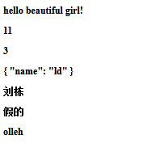


**vue.js的M-V-VM思想**

```js
MVVM 是Model-View-ViewModel 的缩写，它是一种基于前端开发的架构模式。
`Model` 指代的就是vue对象的data属性里面的数据。这里的数据要显示到页面中。
`View`  指代的就是vue中数据要显示的HTML页面，在vue中，也称之为“视图模板” 。
`ViewModel ` 指代的是vue.js中我们编写代码时的vm对象了，它是vue.js的核心，负责连接 View 和 Model，保证视图和数据的一致性，所以前面代码中，data里面的数据被显示中p标签中就是vm对象自动完成的。
```

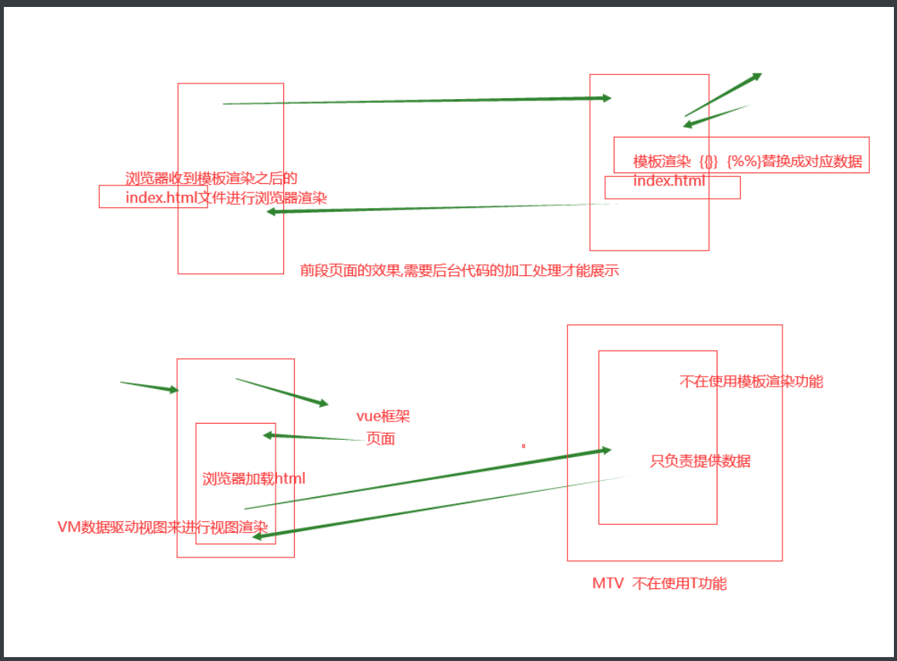


**浏览器获取vm对象可以直接访问el和data属性,甚至可以访问data里面的数据**

```python
vm.$el		vue对象控制标签的范围
vm.$data	vue对象要显示到页面的数据
vm.Person.name	vue对象.变量名，显示data声明的数据
```

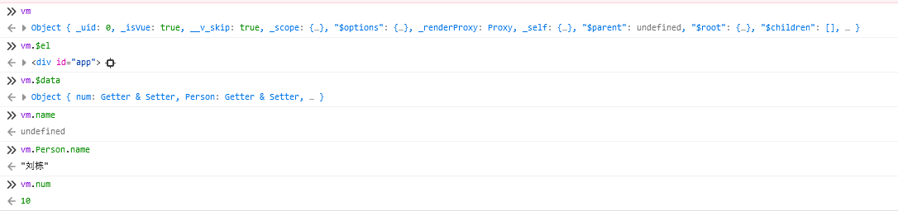


## 3.vue的指令系统


```python
Vue 的指令系统是 Vue.js 提供的一种特殊语法，用于在模板中进行 DOM 操作、数据绑定和事件处理等。指令以 v- 开头，后面跟着指令的名称，可以通过指令来操作元素的属性、样式、内容等。
```


**文本指令v-text和v-html**

```js
<div id="app">
    <p>{{msg1}}</p>
<!--   和 p>{{msg2}}</p>效果是一致的-->
    <p v-text="msg2"></p>
<!--  	将标签字符串识别为标签效果-->
    <p v-html="msg3"></p>
</div>

<script src="vue.js"></script>
<script>
    let vm = new Vue({
        el: '#app',
        data: {
            msg1: 'python学的好，女朋友年年在高考！',
            msg2: 'python学的强，丈母娘刚上幼儿园！',
            msg3:'<p>美团也是大厂</p>',
        }
    })

</script>
```

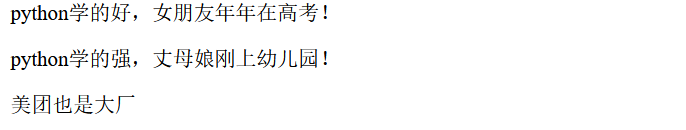


**条件渲染指令v-if 和 v-show**

```js
<div id="app">
<!--    动态增加删除标签，页面渲染开销大，结构发生改变，需要重新加载-->
    <a href="http://www.baidu.com" v-if="num>20">百度</a>
    <a href="http://www.sogou.com" v-else-if="num<20">搜狗</a>
    <a href="http://www.jd.com" v-else>京东</a>
<!--    动态隐藏或展示标签。渲染开销小-->
    <p v-show="true">天王盖地虎</p>
    <p v-show="false">宝塔镇河妖</p>
</div>
<script src="vue.js"></script>
<script>
    let vm = new Vue({
        el: '#app',
        data:function(){
            return {
                num:21,
                // 当num别重新赋值的时候，视图也会发生改变，这就是数据驱动视图 视图的效果都是数据控制的
                // num:18
            }
        }
    })
</script>

区别：
v-show隐藏元素时，使用的是display:none来隐藏的，而v-if是直接从HTML文档中移除元素[DOM操作中的remove]
```

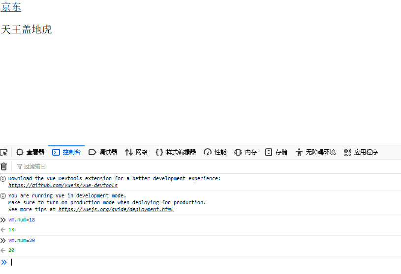

**v-bind属性控制**

```js
格式：
    <标签名 v-bind:标签属性="data属性"></标签名>
    简写	<标签名 :标签属性="data属性"></标签名>


<div id="app">
<!--    动态标签属性控制-->
    <p v-bind:name="msg1">hh</p>
    <p :name="msg2">xixi</p>

</div>
<script src="vue.js"></script>
<script>
    let vm = new Vue({
        el: '#app',
        data(){
            return {
                msg1: 'hh',
                msg2: 'xixi',
            }
        }
    })
</script>
```

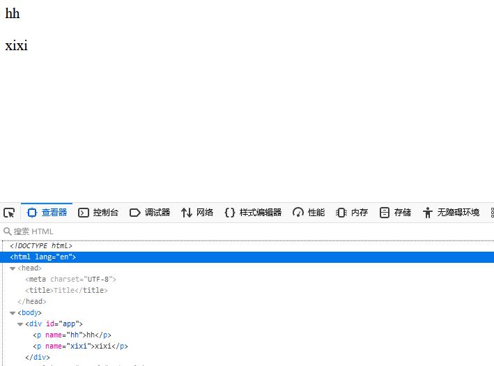

**类值控制**

```js
     <style>
        .c1{
            color:red;
        }
        .c2{
            color:green;
        }
    </style>
</head>
<body>
<div id="app">
    <p :class="{c1:num>10,c2:num<=10}">关掉，通通都关掉</p>
</div>
<script src="vue.js"></script>
<script>
    let vm = new Vue({
        el: '#app',
        data() {
            return {
                num:10,
            }
        },
    })
</script>
```

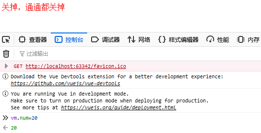


**v-on事件绑定**

```js
动态显示隐藏wife密码
<div id="app">
    <!--    动态显示隐藏wife密码-->
    <!--    <input v-bind:type="tt"><button v-on:click="show">{{msg}}</button>-->
    <!--    简写-->
    <input :type="tt"><button @click="show">{{msg}}</button>
</div>
<script src="vue.js"></script>
<script>
    let vm = new Vue({
        el: '#app',
        data(){
            return {
                tt:'password',
                msg:'显示密码',
            }},
        methods:{
            show(){
                //methods声明的方法中this 指向当前vue对象
                if (this.tt==='password'){
                    this.tt='text';
                    this.msg='隐藏密码'
                }else{
                    this.tt='password';
                    this.msg='显示密码'
                }
            }
    }
    })
</script>
```

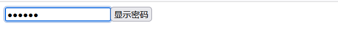
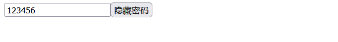

```js
直接操作计算属性
<div id="app">
    <!--    直接操作数据属性-->
    <button @click="num++">+1</button>
    <h1>{{num}}</h1>
</div>
<script src="vue.js"></script>
<script>
    let vm = new Vue({
        el: '#app',
        data() {
            return {
                num:1,
            }
        }
    })
```

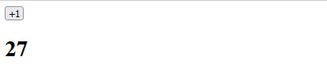

**商品加减案例**

```js
<div id="app">
    <!--    直接操作数据属性-->
    <button @click="num++">+1</button>
    <input type="text" :value="num"></input>
    <!--    复杂点的数据处理可以用方法-->
    <button @click="down">-1</button>
</div>
<script src="vue.js"></script>
<script>
    let vm = new Vue({
        el: '#app',
        data() {
            return {
                num:1,
            }
        },
        methods:{
            down(){
                if (this.num>0){
                    this.num--
                }
            }
        }
    })
</script>
```


**v-model 双向数据绑定**

```js
<div id="app">
    <!--    数据驱动视图，v-model后双向数据绑定，视图数据改变vue对象的数据也保持一致-->
    <input type="text" v-model="num">
    <h1>{{num}}</h1>
</div>
<script src="vue.js"></script>
<script>
    let vm = new Vue({
        el: '#app',
        data() {
            return {
                num:1,
            }
        },
    })
</script>
```

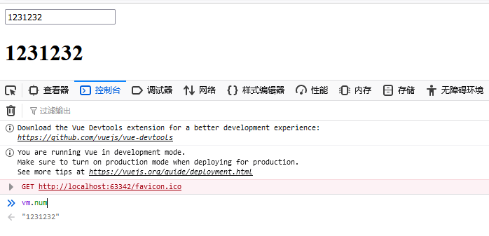

**v-for 循环**

```js
<head>  
<style>
        .c1{
            background-color: tan;
        }
    </style>
</head>
<body>
<div id="app">
    <ul>
        <!--        key 必须是唯一标识-->
        <li v-for="(value,index) in hobby_list" :key="index">{{value}}--{{index}}</li>
<!--        1. 在写v-for的时候，都需要给元素加上一个key属性-->
<!--        2. key的主要作用就是用来提高渲染性能的！-->
<!--        3.key属性可以避免数据混乱的情况出现 （如果元素中包含了有临时数据的元素，如果不用key就会产生数据混乱）-->
    </ul>
    <ul>
        <li v-for="(value,index) in info" :key="index">{{value}}--{{index}}</li>
    </ul>
    <table border="1">
        <thead>
        <tr>
            <th>商品</th>
            <th>价格</th>
        </tr>
        </thead>
        <tbody>
            <tr v-for="(value,index) in goods" :key="index" :class="{c1:value.price>60}">
                <td>{{value.name}}</td>
                <td>{{value.price}}</td>
            </tr>
        </tbody>
    </table>
</div>
</body>
<script src="vue.js"></script>
    <script>

        var card = new Vue({
            el:"#app",
            data(){
                return {
                    hobby_list:[
                        '抽烟','喝酒','烫头'
                    ],
                    info:{
                        name:'刘栋',
                        age:18,
                        sex:'男'
                    },
                    goods:[
                    {"name":"python入门","price":150},
                    {"name":"python进阶","price":100},
                    {"name":"python高级","price":75},
                    {"name":"python研究","price":60},
                    {"name":"python面向监狱编程","price":110},
                   ],
                }
            },
        });
    </script>
```

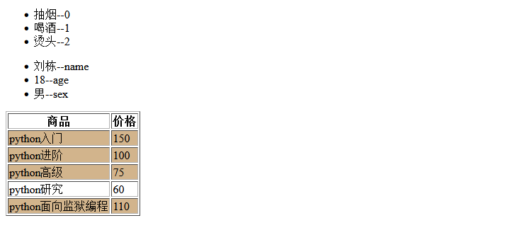


**过滤器**

```js
全局 Vue.filter('函数名',function(){})
局部 filters
对原本数据进行一些处理

<body>
<div id="app">
    <h1>{{price.toFixed(3)}}</h1>
    <!-- 传递多个参数  管道符左边的数据作为第一个参数-->
    <h1>{{price|keep_two_point(1)}}</h1>
    <h1>{{price|RMB}}</h1>
    <!-- 连续使用多个过滤器 -->
    <h1>{{price|keep_two_point(2)|RMB}}</h1>
</div>
</body>
<script src="vue.js"></script>
    <script>
        //全局过滤器
        Vue.filter('RMB',function(val){
            return val+'元'
        })

        var card = new Vue({
            el:"#app",
            data(){
                return {
                    price:100
                }
            },
            //局部过滤器 作用在vue对象控制的标签范围内
            filters:{
                keep_two_point(val,n){
                    //保留几位小数
                    return val.toFixed(n)
                }
            }
        });
    </script>
```

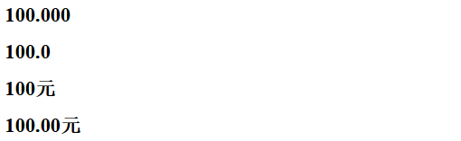


**计算属性**

```js
computed	计算属性
    
<body>
<div id="app">
    <h1>{{show}}</h1>
</div>
</body>
<script src="vue.js"></script>
    <script>
        var card = new Vue({
            el:"#app",
            data(){
                return {
                    name:'汪峰',
                    sex:'42',
                    status:'又要开演唱会了'
                }
            },
            computed:{
                show(){
                    return this.name+this.status
                }
            }
        });
    </script>
```

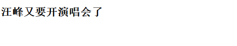


**监听属性**

```js
watch	监听属性，属性发生改变时触发

<body>
<div id="app">
    <button @click="price++">加钱！</button>
    <h1>{{price}}</h1>
    <button @click="info.num++">嵌套加钱！</button>
    <h1>{{info.num}}</h1>
</div>
</body>
<script src="vue.js"></script>
<script>
    var card = new Vue({
        el: "#app",
        data: {
            price: 100,
            info: {
                num: 200
            },
        },
        watch: {
            // price属性发生改变时触发
            price() {
                alert('price 发生改变')
            },
            // 嵌套属性的正确写法
            'info.num': function(newVal, oldVal) {
                alert('num 发生改变')
            }
        }
    });
</script>
```

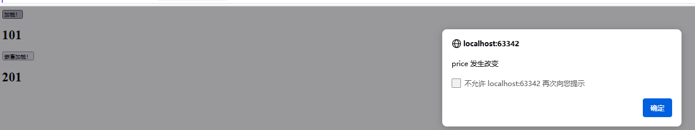
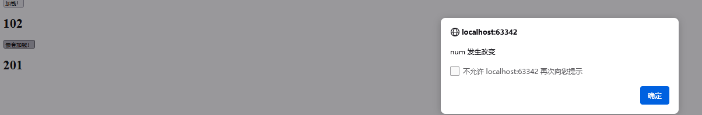


**用户名长度限制**

```js
<body>
<div id="app">
    <input type="text" v-model="username">
</div>
</body>
<script src="vue.js"></script>
<script>
    var card = new Vue({
        el: "#app",
        data: {
            username:''
        },
        watch:{
            username(){
                if (this.username.length>6){
                    alert('太长了，不能再加了哦！')
                    //切片，丢弃多余的数据
                    this.username=this.username.slice(0,6)
                }
            }
        }
    });
</script>
```

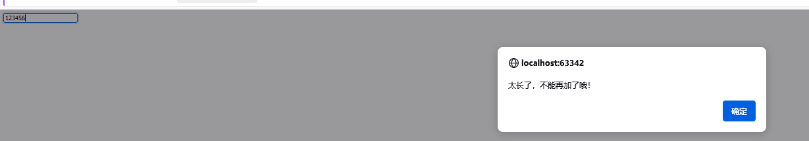


**生命周期钩子函数**

```js
钩子函数都在methods声明的方法中

new Vue({
    el:"#app",
    data:{
        username:'liu'
    },
    methods:{
    },

    // vue还未获取到视图和数据属性之前触发的
    beforeCreate(){
        console.log('beforeCreate>>>>>>')
        console.log(this.$el);
        console.log(this.$data);
    },
    // vue对象获取到了数据属性,但是还没有获得视图时触发的
    created(){
        console.log('created>>>>>>')
        console.log(this.$el);
        console.log(this.$data);
    },

    // 拿到了视图,但是数据属性挂载到视图之前触发的.
    beforeMount(){
        console.log('beforeMount>>>>>>')
        console.log(this.$el);
        console.log(this.$data);
    },

    // 数据属性挂载到视图之后触发的.
    mounted(){
        console.log('mounted>>>>>>')
        console.log(this.$el);
        console.log(this.$data);
    },
    // 重点记住created和mounted,将来我们在这两个方法中来发送获取数据的请求
});
```


**阻止事件冒泡和页面刷新**

```js
jquery 中阻止冒泡事件子标签方法返回false即可

 <style>
        .c1{
            background-color: tan;
            height: 200px;
        }
        .c2{
            background-color: red;
            height: 100px;
            width: 100px;
        }

    </style>
<body>
<div id="app">
   <div  class='c1' @click="f1">
    <!--       @click.stop 阻止冒泡事件，不能阻止默认事件-->
       <div class='c2' @click.stop="f2"></div>
   </div>
    <!--       @click.stop.prevent 阻止冒泡事件，且阻止默认事件-->
    <a href="http://www.baidu.com" @click.stop.prevent="">百度</a>
</div>
</body>
<script src="vue.js"></script>
<script>
    var card = new Vue({
        el: "#app",
        methods:{
            f1(){
                alert('Hello,father!')
            },
            f2(){
                alert('Hello,son!')
            }
        }
    });
</script>
```


**todolist案例**

**splice函数**

```javascript
splice(index, howmany, item1, ....., itemX)
index: 必需。一个整数，规定添加/删除项目的位置，使用负数可从数组结尾处规定位置。
howmany: 可选。要删除的项目数量。如果设置为 0，则不会删除项目。
item1, ..., itemX: 可选。向数组添加的新项目。

let fruits = ["Banana", "Orange", "Apple", "Mango"];  
fruits.splice(2, 0, "Lemon", "Kiwi"); // 在第2个位置插入 "Lemon" 和 "Kiwi"  
console.log(fruits); // ["Banana", "Orange", "Lemon", "Kiwi", "Apple", "Mango"]

```

**to do list**

```javascript
<!DOCTYPE html>
<html lang="en">
<head>
    <meta charset="UTF-8">
    <title>Title</title>
    <style type="text/css">
       #app {
            width: 600px;
            margin: 50px auto 0;
        }

        .inputtxt {
            width: 550px;
            height: 30px;
            border: 1px solid #ccc;
            padding: 0px;
            text-indent: 10px;
        }

        .inputbtn {
            width: 40px;
            height: 32px;
            padding: 0px;
            border: 1px solid #ccc;
        }

        .list {
            margin: 0;
            padding: 0;
            list-style: none;
            margin-top: 20px;
        }

        .list li {
            height: 40px;
            line-height: 40px;
            border-bottom: 1px solid #ccc;
        }

        .list li span {
            float: left;
        }

        .list li a {
            float: right;
            text-decoration: none;
            margin: 0 10px;
        }
    </style>
</head>
<body>
<div id="app">
		<h2>To do list</h2>
		<input type="text" name="" id="txt1" class="inputtxt" v-model="input_text">
		<input type="button" name="" value="增加" id="btn1" class="inputbtn" @click="add">

		<ul id="list" class="list">
			<!-- javascript:; # 阻止a标签跳转 点击执行js代码-->
			<li v-for="(value,index) in fruit_list" :key="index">
				<span>{{value}}</span>
            <!-- index 是当前数据的索引，将索引传到对应方法-->
				<a href="javascript:;" class="up" @click="up(index)"> ↑ </a>
				<a href="javascript:;" class="down" @click="down(index)"> ↓ </a>
				<a href="javascript:;" class="del" @click="del(index)">删除</a>
			</li>

		</ul>
	</div>
</body>
<script src="vue.js"></script>
<script>
    var card = new Vue({
        el: "#app",
        data:{
            fruit_list:['香蕉','茄子','黄瓜','西瓜'],
            input_text:''
        },
        //methods 中定义的方法 this都指向当前的vue对象
        methods:{
            add(){
                //v-model 双向数据绑定获取用户输入的内容
                this.fruit_list.push(this.input_text);
                //清空
                this.input_text=''
            },
            del(index){
                this.fruit_list.splice(index,1);
            },
            up(index){
                // 不是第一个就可以向上移一个位置
                if (index>0){
                    //取出对应数据
                    let up_ele=this.fruit_list.splice(index,1)[0];
                    //放在上面一个位置
                    this.fruit_list.splice(index-1,0,up_ele)
                }
            },
            down(index){
                // 不是最后一个就可以向下移一个位置
                if (index<this.fruit_list.length-1){
                    //取出对应数据
                    let down_ele=this.fruit_list.splice(index,1)[0];
                    //放在下面一个位置
                    this.fruit_list.splice(index+1,0,down_ele)
                }
            },
        }
    });
</script>
</html>
```

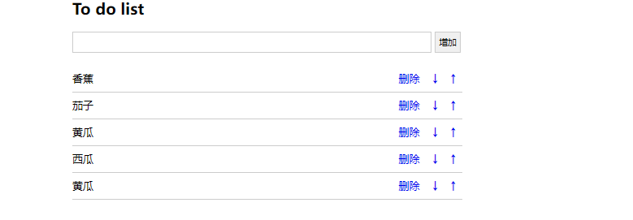


## 4.axios

****

**同源机制和跨域**

```js
同源：请求协议、域名、端口都相同
跨域请求：一个域名下的javascript代码访问另一个域名下的资源
同源机制：浏览器的安全机制，不允许不同源的网站之间相互访问，请求会被拦截。

```

**axios**

```js
与jquery中的ajax功能差不多

get请求
axios.get('/api/data')
  .then(function (response) {
    console.log(response.data);
  })
  .catch(function (error) {
    console.log(error);
  });
post请求
axios.post('/api/data', {
    name: 'John',
    age: 25
  })
  .then(function (response) {
    console.log(response.data);
  })
  .catch(function (error) {
    console.log(error);
  });
```

**django 操作**

```python
CORS（Cross-Origin Resource Sharing）：CORS 是一种在服务器端进行配置的解决跨域问题的方法。服务器在响应中添加一些头部信息，告诉浏览器该网站允许跨域访问。
['Access-Control-Allow-Origin'] = '允许的域名' #*表示允许所有地址请求都能拿到数据

html
let vm  = new Vue({
		el:'#app',
		data(){
			return {
				data:'',
			}
		},

		created(){
			axios.get('http://127.0.0.1:8000/index')
					// 箭头函数指向当前的vue对象
					.then((res)=>{
						this.data = res.data;
					}).catch(function (error){

			})
		},
	})

djang views.py下
	def index(request):
    data = {'name': '刘栋', 'age': 18}
    ret = JsonResponse(data)
    #
    ret["Access-Control-Allow-Origin"] = "http://localhost:63342"

    return ret
```

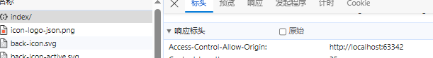


## 5.组件

```js
组件化开发 ：将页面的每块功能,单独封装为一个组件,哪个页面用哪些组件,就直接拿到这几个组件,拼到页面上展示

组件使用流程：
	1.声明组件
	2.挂载组件
	3.使用组件

全局组件声明后直接使用
每个组件的template 最外层必须有个标签包裹

<body>
	<div id="app">
	<!--3.使用组件-->
		<va></va>
		<vb></vb>
		<hh></hh>
	</div>
</body>
<script src="vue.js"></script>
<script src="axios.js"></script>
<script>
	//1.声明组件
	let va={
		data(){
			return {
				tmp:['python','java','c++']
			}
		},
		template:'<h1 style="Color:red;">{{tmp}}</h1>'
	}
	let vb={
		data(){
			return {
				book:['python入门到入狱','java圣经','稳如老狗']
			}
		},
		template:'<h1 style="Color:tan">{{book}}</h1>'
	}

	//全局组件，声明后直接使用
	Vue.component('hh',{
		data(){
			return {
				name:'我是全局组件'
			}
		},
		template:'<h1 style="color:green">{{name}}</h1>'
			}
	)


	let vm=new Vue({
		el:'#app',
		//局部组件
		components:{
			//2.挂载组件，键和值相同可以省略
			va:va,
			vb,//简写
		}
	})

</script>
```

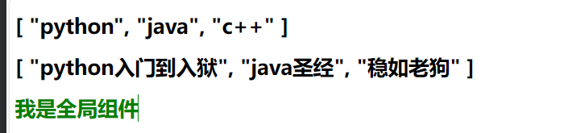


**实际开发vue对象挂载一个大的组件**

```html
<!DOCTYPE html>
<html lang="en">
<head>
    <meta charset="UTF-8">
    <title>todolist</title>
</head>
<body>
<div id="app">
    <!--使用组件-->
    <App></App>
</div>
<script src="vue.js"></script>
<script src="axios.js"></script>
<script>
    //1.声明组件
    let va = {
        data() {
            return {
                tmp: ['python', 'java', 'c++']
            }
        },
        template: '<h1 style="Color:red;">{{tmp}}</h1>'
    }
    let vb = {
        data() {
            return {
                book: ['python入门到入狱', 'java圣经', '稳如老狗']
            }
        },
        template: '<h1 style="Color:tan">{{book}}</h1>'
    }

    //全局组件，声明后直接使用
    Vue.component('hh', {
        name: 'hh',
        data() {
            return {
                name: '我是全局组件'
            }
        },
        template: '<h1 style="color:green">{{name}}</h1>'
    })

    let App = {
        template: `
        <div id="#app">
            <va></va>
            <vb></vb>
            <hh></hh>
        </div>
        `,
        components: {
            'va': va,
            'vb': vb,
        }
    }
    let vm = new Vue({
        el: '#app',
        components: {
            'App': App,
        }
    })
</script>
</html>
```


**组件传值**

**父往子传值**

```js
流程
	1.父组件在使用子组件是自定义属性
	2.子组件先props声明后使用
注意属性名和h5中的标签名不能重复，若重复就不会显示  
    
    let va = {
        data() {
            return {
                tmp: ['python', 'java', 'c++']
            }
        },
        //子组件中声明后就可以作为属性使用了
        props:['hh',],
        template: '<h1 style="Color:red;">{{tmp}}--{{hh}}</h1>',
    }
    let vb = {
        data() {
            return {
                book: ['python入门到入狱', 'java圣经', '稳如老狗']
            }
        },
        template: '<h1 style="Color:tan">{{book}}--{{ff}}</h1>',
		props:['ff',]
    }
        let App = {
        data() {
            return {
                num:100
            }
        },
        template: `
        <div id="#app">
            // hh 静态传值 :hh动态传值
            <va hh="父传子值"></va>
            //动态传值
            <vb :ff="num"> </vb>
            <hh></hh>
        </div>
        `,
        components: {
            'va': va,
            'vb': vb,
        }
    }  
```

**单向数据流**

```js
父组件修改了数据同步到子组件，子组件修改数据不影响父组件的数据

<!DOCTYPE html>
<html lang="en">
<head>
    <meta charset="UTF-8">
    <title>todolist</title>
</head>
<body>
<div id="app">
    <App></App>
</div>
<script src="vue.js"></script>
<script src="axios.js"></script>
<script>

    let cc = {
        data() {
            return {
            }
        },
        template: `<div>
            <h1 style="Color:red;">{{ff}}</h1>
            //修改子组件数据，父组件数据未改变
            <input type="text" v-model="ff">
        </div>`,
        props: ['ff']
    }
    let App = {
        data() {
            return {
                num: 100
            }
        },
        template: `
        <div id="#app">
            <cc :ff="num"></cc>
            <h1>{{num}}</h1>
        </div>
        `,
        components: {
            'cc': cc,
        }
    }
    let vm = new Vue({
        el: '#app',
        components: {
            'App': App,
        }
    })
</script>
</html>
```

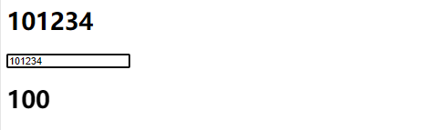


**子组件给父组件传值**

```js
步骤：
	1.使用组件的地方 自定义事件，值为父组件的方法 键在子组件传值的时候会用到 @son="recv_data"
	2.子组件中方法 this.$emit('键','子组件的值')  this.$emit('son','sondata') 

<!DOCTYPE html>
<html lang="en">
<head>
    <meta charset="UTF-8">
    <title>todolist</title>
</head>
<body>
<div id="app">
    <App></App>
</div>
<script src="vue.js"></script>
<script>
    let cc = {
        data() {
            return {

                sondata:'100'
            }
        },
        template: `<div>
            <h1 style="Color:red;">{{fdata}}</h1>
<!--            2.定义子组件方法-->
            <button @click="xh">子传父</button>
        </div>`,
        methods:{
            xh(){
                //3.通过唯一标识，把子组件的值传给父组件
                this.$emit('son',this.sondata)
            }
        }

    }
    let App = {
        data() {
            return {
                num: 100,
                //需要事先声明
                sondata:'',
            }
        },
        template: `
        <div id="#app">
<!--            1.自定义事件，值为父组件的方法-->
            <cc @son="recv_data"></cc>
            <h1>{{sondata}}</h1>
        </div>
        `,
        components: {
            'cc': cc,
        },
        methods:{
            //4.定义父组件方法
            recv_data(sondata){
                this.sondata = sondata
            }
        }
    }
    let vm = new Vue({
        el: '#app',
        components: {
            'App': App,
        }
    })
</script>
</html>
```

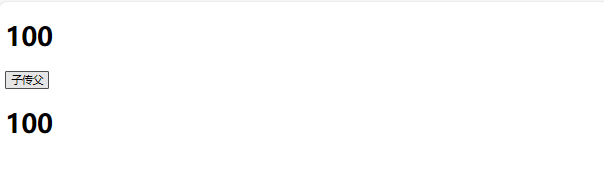


**兄弟组件传值**

```js
步骤
    1.定义个公交车对象 let bus={}
    2.放值 bus.$emit('键','值')
    3.取值 bus.$on('键',(val)=>{val'值'})


<!DOCTYPE html>
<html lang="en">
<head>
    <meta charset="UTF-8">
    <title>todolist</title>
</head>
<body>
<div id="app">
    <App></App>
</div>
<script src="vue.js"></script>
<script>
    let bro1 = {
        data() {
            return {
                bro1_data: 100
            }
        },
        template: `<div>
            <h1 style="Color:red;">{{bro1_data}}</h1>
            <button @click="xh">bro1 to bro2</button>
        </div>`,
        methods: {
            xh() {
                this.$emit('bro1', this.bro1_data)
            }
        },
    }
    let bro2 = {
        data() {
            return {
                bro2_data: ''
            }
        },
        //钩子函数，都在methods中，methods声明的方法this指向当前Vue对象
        methods: {
            created() {
                this.$on('bro1', (val) => {
                    this.bro2_data = val;
                })
            }
        },
        template: '<h1>{{bro2_data}}</h1>',
    }
    let App = {
        template: `
        <div>
            <bro1></bro1>
            <bro2></bro2>
        </div>
        `,
        components: {
            'bro1': bro1,
            'bro2': bro2,
        },
    }
    let vm = new Vue({
        el: '#app',
        components: {
            'App': App,
        }
    })
</script>
</html>
    
页面渲染完成，created钩子函数已经执行过了
```


