# JavaScript

## 1. js的四种引入方式

```javascript
//第一种
<script>alert('哈哈')</script>
//第二种
<script src='文件路径'></script>
//第三种
<div onclick='alert(11)'>点我</div>
//第四种
<a href="文件路径">点我</a>
```

## 2. 变量  var :划分当前变量的作用域

## 3.  数据类型

3.1 基本数据类型

```javascript
Boolean 布尔  true false
Number 	数字
String	字符串 
	- 单引号
	- 双引号
	- 反引号  英文状态下 1 左边的键
		1. 支持换行
        	var str = 
                `你
                好
        		`
		2. 解析变量
			var str1 = '中国';
			var str2 = `我是中国人，我爱你${str1}`;
			console.log(str2);
undefined  	未定义类型
null		可以理解为python中的None

```

3.2 引用数据类型

```javascript
object(Array function Date ...)
1.object对象
	var obj = object();
	var obj = {};
2.Arrary  数组
 	var arr = new Array();
	var arr = [];
3.function 
	function fun() {
        console.log('我是函数')
    };
	fun();
```

3.3 报错 NaN     Not a Number

```
1. NaN 与任何数字计算都是 NaN 
2. 与 NaN 比较除了NaN !=NaN 为ture ；其余都是false
```

## 4. 类型的强制转换

```javascript
parseInt 	强制转换为整形  100abc->100
parseFloat	强制转为浮点型  100->100
Number 		纯数字类型和布尔类型   '123'->123   false->0
String		在原来的基础上连边套上引号
Boolean		7种为false  
				0 0.0 false NaN null undefined ''
			{}、[]为ture

自动转化：
	1. Number + Boolean
		- 1+ture  //2
		- 1+false //1
	2. Number + String
		- '+'号是拼接 100+'100'->'100100' String
		- 其他符号是运算(必须是数值) 100-'99'->1 'Number'
	3. Number + String + Boolean
		- 100+true-'99' ->2
		- 100+ture+'99' ->'10199'
	
```

## 5. 运算符

```javascript
与python大致一样 ++ --
	++num; 先自增后赋值
	num++; 先复制后自增
    
	- === 和 !==  
        1. 比较数据类型
        2. 比较值的大小
       var res=1=='1'	//true
       var res=1==='1'	//false
       
      - and &&  or ||  not !
           
      - 三元(目)运算符
      	- python 真值 if 条件判断 else 错误
        - javascript 表达式？真值:假值
           
```

## 6. 流程控制

6.1 分支结构

```javascript
/*流程：代码执行的过程
    控制：对流程的把控*/
//单分支
if (1) {
    console.log("单分支")
}
//双分支
if (1) {

} else {
    console.log("双分支")
}
//多分支
if (0) {

} else if (1) {
    console.log("多分支")
} else {

}
//嵌套分支
if (1) {
    if (1) {
        console.log("嵌套分支")
    }
}
// switch case 结构    条件判断是强判断：值的比较、数据类型的比较
var week = new Date()
week.getDay()
switch (week) {
    case 1:
        console.log("星期一")
        break;
    case 2:
        console.log("星期二")
        break;
    case 3:
        console.log("星期三")
        break;
    case 4:
        console.log("星期四")
        break;
    case 5:
        console.log("星期五")
        break;
    case 6:
        console.log("星期六")
        break;
    default :
        console.log("星期日")
        //break;
}
```

6.2 循环结构

```javascript
/* for (初始值;条件判断;自增自减的值)*/
for (var i = 1; i <= 10; i++) {
    console.log(i)
}
/* 初始值
    while(条件判断)
    自增自减的值*/
var j = 1
while (j <= 10) {
    console.log(j);
    j++;
}
arr = [100, 99, 98, 97, 96]
//for var i in Iterable 获取的是索引
for (var i in arr) {
    console.log(i)
    console.log(arr[i])
}
//获取对象中的键
obj = {'name': 'liu_dong', 'age': 18}
for (var i in arr) {
    console.log(i)
}
//for var of Iterable 获取的是值
for (var i of arr) {
    console.log(i)
}
//不能遍历对象  报错 TypeError: obj is not iterable
for (var i of obj) {
    console.log(i)
}
```


## 7. 函数

7.1 函数创建方式

```javascript
//普通函数
function fun1() {
    console.log('普通函数');
}

fun1();

//匿名函数
(function () {
    console.log('匿名函数');
}
)
//Function 创建（不推荐）
var fun3 = new Function(console.log('函数'));	//函数体防灾括号里
fun3();

//闭包函数
function fun4() {
    var a = 5;

    function fun5() {
        console.log(a);
    }
    return fun5
}
fun4()();
/*
    闭包函数特点：
        1.内部函数引用了外部函数的局部变量
        2.外函数的返回值是对内函数的引用
    */
    //箭头函数
var mynum = (x, y) => {
    return x + y;
};
var res = mynum(5, 6)
console.log(res, '箭头函数')

```

7.2 参数

```javascript
//位置参数
function fun1(a, b) {
    console.log(a, b);
};
fun1(1, 2, 3);	//形参实参不匹配不会报错
//默认参数
function fun2(a, b ,c= 3) {
    console.log(a, b, c)
}

fun2(1, 2)

//可变参数   agruments 自动接受所以实参
function fun3() {
    console.log(arguments);
    for (i of arguments){   //value
        console.log(i);
    }
    ;
    for( i in arguments){	//index
        console.log(i);
    }
    ;
};
fun3(1, 2, 3, 4, 5, 6)   

// 没有关键字参数
function fun4(a, b, c) {
    console.log(a, b, c)
};
fun4(c = 1, b = 2, a = 3);

```

7.3 函数调用

```javascript
//正常调用
function fun1(){
    console.log("正常调用")
}
fun1();
//函数的立即执行
function fun2() {
    console.log("立即执行")
}
//匿名函数的立即执行
(function() {
    console.log("匿名函数立即执行")
})()
//其他方式的立即执行
~function() {
    console.log("其他方式立即执行")
}();
!function() {
    console.log("其他方式立即执行")
}();
//js 有预加载机制：提前把函数加载到内存中，然后代码整体运行   匿名函数没有预加载，先定义后加载
```

## 8. js 对象

```javascript
//第一种创建对象
var obj1 = new Object()
obj1.name = "刘栋"
obj1.age = 18
obj1.eat = function () {
    console.log(obj1.name, '第一种')
}
console.log(obj1.name)
console.log(obj1.age)
obj1.eat()
//第二种创建  双引号可加可不加
var obj2 = {
    "name": '刘栋',
    "age": 18,
    eat: function () {
        console.log(obj1.name, '第二种')
    }
}
console.log(obj2.name)
console.log(obj2.age)
obj2.eat()
//注意点
console.log(obj2["name"])
console.log(obj2["age"])
obj2["eat"]()

//第三种创建对象方式
function Person(name, age) {
    this.name = name;
    this.age = age;
    this.eat = function () {
        console.log(this.name, '第三种')
    }
}

var obj3 = new Person('刘栋', 18)
console.log(obj3.name)
console.log(obj3.age)
obj3.eat()

//获取键
for (i in obj1) {
    console.log(i)
}
//获取成员对象的值
with (obj1) {
    console.log(name)
    console.log(age)
    console.log(eat)
}
//遍历js对象
for (i in obj1) {
    console.log(i, typeof (i))
    with (obj1) {
        //将字符串当做代码来执行
        console.log(eval(i))
    }
}


//json 字符串  函数不能传递
var data = {
    "name": "刘栋",
    "age": 18,
    func: function () {
        console.log("函数")
    }
}

var res1 = JSON.stringify(data)
//JSON.stringify 将js对象转化为json格式的字符串
console.log(res1, typeof (res1))
//JOSN.parse 将json格式的字符串转换为js对象
var res2 = JSON.parse(res1)
console.log(res2, typeof (res2))

```

## 9. 字符串对象函数

```javascript
  var str = 'to be or not be'
    //字符串长度  length
    console.log(str.length)
    //清除俩边空白符  trim
    console.log(' hh '.trim())
    //获取首次出现的位置  indexOf  未找到返回-1
    console.log(str.indexOf('b'))
    //连接字符串 concat
    console.log('liu'.concat('dong'))
    //截取字符串  slice 顾头不顾尾
    console.log(str.slice(1, 7))
    console.log(str.slice(-5, -1))
    //截取字符串 substr(开始值，截取个数)
    console.log(str.substr(2, 5))
    //拆分字符串 splite
    console.log(str.split(' '))
    //大小写 toUppercase toLowercase
    //正则 /正则表达式/g 全局匹配 i 不区分大小写 m 多行匹配
    //search  返回匹配第一次出现的索引位置  未找到返回-1
    console.log(str.search(/n/))
    //match 匹配返回的数据
    var str2 = "123456 哈哈 123789"
    console.log(str2.match(/\d{6}/))
    console.log(str2.match(/\d{6}/g))
    //字符串替换 replace 默认替换一次
    console.log(str.replace("to", "two"))
    // 全部替换
    console.log("to be or not to be".replace(/to/g,"two"))
```

## 10. 数组对象相关方法

```javascript
//定义一个数组
var arr1 = new Array();
console.log(arr1, typeof (arr1), 'arr1');
var arr2 = []
console.log(arr2, typeof (arr2), "arr2");

//增
var arr3 = []
arr3[0] = 10
arr3[1] = 11
arr3[2] = 12
//js 特点允许在临时索引上插入数据  中间的索引位置为空
arr3[10] = 100
console.log(arr3, 'arr3')
//push 从数组的尾部添加数据
arr3.push(101)
console.log(arr3, 'push')
//unshift 从数组头部添加数据
arr3.unshift(102)
console.log(arr3, 'unshift')
//concat 迭代添加数据
arr3.concat(["你好", "我好", "她也好"])
console.log(arr3, 'concat')

//删
//delete 删除 删除的位置为空，不会向前补位
var arr4 = [1, 2, 3, 4, 5, 6, 7, 8, 9]
delete arr4[3]
console.log(arr4, 'delete')
//pop 从数组后面删除,弹出元素
var res1 = arr4.pop()
console.log(res1, 'pop')
//shift 从数组前面删除
var res2 = arr4.shift()
console.log(res2, 'shift')
//splice(从第几个位置开始,删除几个,[可选的是添加的元素])
arr4.splice(2, 2, ['刘栋', 'age'])
console.log(arr4, 'splice')

//改查
console.log(arr4[5])
arr4[5]='hh'
console.log(arr4,'改查')

//join 拼接字符串
var arr5=["you","can","you","up"];
console.log(arr5.join("-"),"join")

//数组元素反转
var arr6=["you","can"];
console.log(arr6.reverse(),'reverse')

//截取数组的一部分 slice
var arr7=['德','玛','西','亚']
console.log(arr7.slice(0,2),'slice')
console.log(arr7.slice(-2,-1),'slice')

```

## 11. 数学相关函数

```javascript
//四舍五入 round
console.log(2.31, 'round')
console.log(3.5, 'round')
console.log(4.2, 'round')
//最大值 max
console.log(Math.max(1, 2, 3, 4, 5), 'max')
//最小值 min
console.log(Math.min(1, 2, 3, 4, 5), 'min')
//绝对值 abs
console.log(Math.abs(-90), 'abs')
//向下取整 ceil
console.log(Math.ceil(3.001))
//向上取整 floor
console.log(Math.floor(3.999))
//幂运算 pow
console.log(Math.pow(3, 2))
//开方运算 sqrt
console.log(Math.sqrt(9))


// 获取0-1 的随机值
console.log(Math.ceil(Math.random()))
// 获取 1-10的随机值
console.log(Math.ceil(Math.random() * 10))
//获取 5 到 14 的随机值
console.log(Math.ceil(Math.random() * (14 - 5 + 1))) + 4

// 随机推导式
function randomint(n, m) {
    return Math.ceil(Math.random() * (m - n + 1))}
```

### 12. BO2M对象

12.1 window对象

```javascript
//BOM browser object model  浏览器对象模型
//js 最顶层的对象 window ：整个浏览器所有的内容和行为都是window的成员
1. 输出成员
console.log(window)
2. 弹出警告框
window.alert('我是警告框')
3. 确认弹窗
var res = window.confirm()
console.log(res)
4. 等待输入框
var res = window.prompt('请你输入密码')
console.log(res)
5. 关闭浏览器窗口
window.close()

//获取浏览器的长度和宽度
console.log(`浏览器窗口内部的宽度${window.innerWidth}`)
console.log(`浏览器窗口内部的高度${window.innerHeight}`)
// 页面跳转 _blank 打开新页面  _self 当前页面跳转
window.open('https://www.google.com','_blank')
window.open('https://www.google.com','_blank','width=500,height=500')
// ###定时器

#定时器种类(两种):基于单线程的异步并发程序-协程;
window.setInterval(函数名,间隔时间(毫秒))   // 定时执行多次任务
window.setTimeout(函数名,间隔时间(毫秒))    // 定时执行一次任务

window.clearInterval(id号)  // 清除定时器 setInterval
window.clearTimeout(id号)   // 清除定时器 setTimeout


var num = 1
function func(){
    console.log(`我执行了${num}`);
    num++;
}

var id1 = window.setInterval(func,1000);
var id2 = window.setTimeout(func,2000);
console.log(id1,"id1")
console.log(id2,"id2")
console.log("我执行完了....")
window.clearInterval(id1)
```

12.2  document 对象

```javascript
DOM 文档对象类型
<div id="box">
    <p class="p1">张三</p>
<p class="p2">李四</p>
<p class="p2">赵刘</p>
<p name="ceshi1"></p>
<p name="ceshi1"></p>
</div>
- 1.节点提取
    //document 获取网页html文档，可以获取网页的所有节点(元素、文档)
    console.log(document)
    1.通过id获取节点对象
    console.log(document.getElementById('box'))
    2.通过类名获取节点对象 返回的数组
    console.log(document.getElementsByClassName('p1'))
    console.log(document.getElementsByClassName('p2'))
    3.通过标签获取节点对象 返回的是数组
    console.log(document.getElementsByTagName('p'))
    4.通过标签的name属性获取节点对象 返回的是数组
    console.log(document.getElementsByName('ceshi1'))
    5.通过css选择器获取对应的元素节点
    //querySelector 获取找到的第一个
    console.log(document.querySelector('.p2'))
    //querySelectorAll 获取所有找到的元素节点
    console.log(document.querySelectorAll('p'))
- 2.节点层级关系
	1.获取html
    console.log(document.documentElement)
    2.子节点
    console.log(document.documentElement.children)
    var tag=document.querySelector('div[id="box"]');
    3.获取下一节点对象
    console.log(tag.nextSibling)
    4.获取下一元素节点对象
    console.log(tag.nextElementSibling)
    5.获取上一节点对象
    console.log(tag.previousSibling)
    6.获取上一元素节点对象
    console.log(tag.previousElementSibling)
    7.获取父节点元素对象
    console.log(tag.parentElement)
	
```

12.3  Navigator 对象

```javascript
1. navigator 提供浏览器及操作系统等信息
console.log(navigator);
2. 判断是pc端还是移动端
console.log(navigator.platform)
3. 爬虫程序：浏览器的身份标识
console.log(navigator.userAgent)
```

12.4 history历史对象

```javascript
function func1() {
    console.log(history);
}

function func2() {
    history.go(-1);
}

function func3() {
    //history.go(1);
    history.go(2);
}

function func4() {
    history.go(0);
}
- <body>
    <button onclick="func1()">查看历史记录</button>
	<button onclick="func2()">跳转到上一页</button>
	<button onclick="func3()">跳转到下一页</button>
	<button onclick="func4()">刷新当前页面</button>
     </body>
```

12.5 location 对象

```javascript
<button onclick="fun1()">查看浏览器当前URL信息</button>
<button onclick="fun2()">跳转其他页面</button>
<button onclick="fun3()">刷新页面</button>
<button onclick="fun4()">过一秒刷新页面</button>
1.获取浏览器的URL信息
console.log(location)
2.获取协议
console.log(location.protocol)
3.ip
console.log(location.host)
4.端口
console.log(location.port)
5.路径
console.log(location.pathname)
6.锚点  -描点：超链接的一种，也叫命名锚点通过name定位 # 后面
console.log(location.hash)
7.地址栏参数  ？后面
console.log(location.search)
8. 完整地址
console.log(location.href)

function fun1() {
    document.write(`${location}`)
}

function fun2() {
    location.href = 'https://www.baidu.com/'
    location.assign('https://www.jd.com')
}

function fun3() {
    location.reload()
}

function fun4() {
    setTimeout(fun3, 1000)
}
//每过一秒刷新页面
window.onload = function() {
    fun4()
}
```

12.6 案例 :浏览器页面获取实时时间    定时器+时间对象

```javascript
// 获取节点
var obj = document.getElementById('clock')

function func() {
    var date = new Date();
    console.log(date)
    //获取年份
    var year = date.getFullYear()
    console.log(date.getFullYear(), '年份')
    //获取月份
    var month = date.getMonth()
    console.log(date.getMonth(), '月份+1')
    //获取天
    var day = date.getDay()
    console.log(date.getDay(), '天')
    //获取小时
    var hour = date.getHours()
    console.log(date.getHours(), '小时')
    //分
    minute = date.getMinutes()
    console.log(date.getMinutes(), '分')
    //秒
    second = date.getSeconds()
    console.log(date.getSeconds(), '秒')
    var time = `${year}年-${month + 1}月-${day}日 ${hour}:${minute}:${second}`
    console.log(time)
    1. 将时间插入到html中
    obj.innerHTML = time
    2. 清除定时器
    if (minute == 51) {
        clearInterval(id);
    }
}

定时器 返回定时器的id 类似于pid、tid
var id = window.setInterval(func, 1000)
```

12.7 清除修改内容

```javascript
<button onclick="func1()">修改内容</button>
<button onclick="func2()">清空内容</button>
<p>我是最靓的崽<a href="#">点我查看</a>></p>
    var p =document.querySelector('p')
1. innerHTML 获取节点的所有内容(标签+文本)
2. innerText 获取节点的文本内容
function func1() {
    p.innerText = '我被修改了，<a href="#">点我查看</a>胖头'
    p.innerHTML = '我被修改了，<a href="#">点我查看</a>胖头'
}
function func2() {
    p.innerText = ''
}
```

12. 8 全选、不选、反选

```javascript
<style>  * {margin: 0px;padding: 0px;}
ul {list-style: none;}
#ul1 li {float: left;}
#ul1 li button {width: 80px;height: 30px;}
#ul1 li button:hover {background-color: tan;}
#ul2 {clear: both;}
</style>
<ul id="ul1">
    <li>
    	<button onclick="fun1()">全选</button>
	</li>
	<li>
    	<button onclick="fun2()">不选</button>
	</li>
	<li>
   	 	<button onclick="fun3()">反选</button>
	</li>
</ul>
<ul id="ul2">
	<li><input type="checkbox"/> 看电影</li>
	<li><input type="checkbox"/> 吃面</li>
    <li><input type="checkbox"/> 烫头</li>
    <li><input type="checkbox"/> 跑步</li>
    <li><input type="checkbox"/> 篮球</li>
</ul>

var bt1 = document.querySelector('ul li button:nth-child(1) ')
var bt2 = document.querySelector('ul li button:nth-child(2) ')
var li = document.querySelectorAll('ul li input')
function fun1 () {
    for (i of li) {
        i.checked = true
    }
}
function fun2() {
    for (i of li) {
        i.checked = false
    }
}
function fun3() {
    for (i of li) {
        if (i.checked === true) {
            i.checked = false
        } else if (i.checked === false) {
            i.checked = true
        }
    }
}
```

## 13. js 控制css相关属性

```javascript
<button id="box1" onclick="fun1()">点击我换颜色</button>
<button id="box2" onclick="fun2()">点击我隐藏</button>
<button id="box3" onclick="fun3()">点击我显示</button>
<div class="box" style="width:300px;height:200px;background-color: yellow;font-size:40px;">你好评</div>
var box = document.querySelector(".box")
js 获取css相关属性
第一种 只能获取行内style
console.log(box.style.width)
console.log(box.style['width'])

第二种
console.log(window.getComputedStyle(box))

function fun1() {
    box.style['background-color'] =  'red'
}
function fun2(){
    box.style.display='none'

}
function fun3(){
    box.style.display='block'
}
```

## 14. js 事件

```javascript
<style>
    * {
    margin: 0px;
    padding: 0px;
}

    .box {
        width: 100px;
        height: 100px;
        background: green;
        position: absolute;
        left: 0px;
    }
</style>
<button onclick="fun1()">按钮</button>
<div class="box"></div>

var box = document.querySelector('.box')
console.log(box)
var id;
1.事件的静态绑定
function fun1() {
    将获取到的字符串转化为数字
    var left = parseInt(window.getComputedStyle(box).left)
    全局变量 id
    id = setInterval(function () {
        left += 50;
        box.style.left = `${left}px`;
    }, 1000)

}
2.事件的动态绑定
	2.1 onmouseover 鼠标指针悬停在指定元素上时触发
	box.onmouseover = function(){
    	clearInterval(id);
	}
	2.2 onmouseout  鼠标指针离开指定元素时触发
    box.onmouseout = function(){
        fun1()
    }
```

## 15. 模态框

```javascript
<style>
    .box {
        position:fixed;
        width:100%;
        height:100%;
        top:0px;
        background-color: greenyellow;
        display: none;
    }

.content
{
    border:solid 1px red;
    width:500px;
    height:500px;
    background-color:tan;
    margin:auto;
    margin-top:14%;
}

</style>
<button id="login">登录</button>
<div class="box">
    <div class="content" >
        <span class="close">X</span>
<br />
            <span>账号: <input type="text"  /></span>
<br / >
                <span>密码: <input type="password"  /></span>
</div>
</div>

var box= document.querySelector('.box');
var btn = document.querySelector('#login')
var x = document.querySelector('.close')
btn.onclick = function() {
    box.style.display="block";
}
x.onclick = function() {
    box.style.display="none";
}
```

## 16. ajax异步加载

```javascript
ajax 异步加载（异步的 JavaScript 和 XML）  不刷新页面，也能请求到数据
api 程序调用的接口
1.创建ajax请求对象
var xhr=new XMLHttpRequest();
console.log(xhr);
2. 打开链接
true 异步  false 同步
xhr.open('GET','url',true)
3.发送请求
xhr.send();
readyState 存有 XMLHttpRequest 的状态
    0   请求初始化
    1   与服务器建立连接
    2   接受请求
    3   请求处理
    4   请求完成，响应就绪
    *
4 readyState 变化是就会触发 onreadystatechange事件
服务端状态码为4 客户端状态码为200 表示数据传输完成

xhr.responseText 获取json格式的字符串
xhr.responseHtml 获取xml
```

# jQuery

## label补充

```javascript
label为input输入框定义标注
1.方式一
	<label >用户名:<input type="text"></label>
2.方式二
    <label for = 'password'>密码:</label>
    <input type="password" id="password">
```

## 1.jquery的引用

```javascript
jquery 是原生js的封装
1.本地引入
<script src='jquery路径'></script>
2.外地引入
    bootcdn 中文网开源项目
    <script src='https://cdn.bootcdn.net/ajax/libs/jquery/3.7.1/jquery.js'></script>
```

## 2.jquery对象和dom对象的相互转化

```
jquery[索引] --> dom
$(dom对象)   -->jquery 

jquery对象和dom对象不能混用
```

## 3.jquery选择器

```javascript
1.语法：$() 得到的是 jquery对象
	$('.id') $('#class_name') $('tag_name')
2.组合选择器
	$('.class_name,#id')
3.层级选择器
	$('tag_name #class_name')
4.属性选择器
	- $()['attr']
	- $() ['attr'='attr_value']
5.表单对象属性选择器
	1.$(':checked') 找到input标签和select下拉选择标签中选择的标签
    2.$(':selected') 找到select下拉框中选中的标签
    3.$(':enable')	找到可操作的标签
    4.$(':disable') 找打不可操作的标签
6.表单选择器
	针对input标签
	1.$(':text')	找到所有type='text'的input标签
	2.$(':radio')	找到所有type='radio'的input标签
	...
7.筛选器方法
	1.父标签 parent()
	2.子标签 children()
	3.直系父辈 parents()
	4.下一个兄弟标签	next()
	5.下面所有兄弟标签	nextAll()
	6.找上一个兄弟标签	prev()
	7.找上面所有兄弟标签	prevAll()    [0]  表示的是上一个兄弟标签
    8.找到不包含自己兄弟标签	Sibling()
	9.找后代标签	find()
	10.取第一个元素	first()  是jquery对象
    11.去最后一个元素	last()	是jquery对象
    12.通过索引jquery对象	 eq(索引值)
	注意： jquery[0] 取的是dom对象，不是jquery对象				
```

## 4.文本内容

```javascript
1.dom对象
    innerText 文本字符串
    innerHTML 代标签的文本字符串
2.jquery对象
    text() 文本字符串
    html() 带标签的文本字符串
```

## 5.类值操作

```javascript
1.addClass()	添加类值
2.removeClass()	删除类值
3.toggleClass()	如果有值则删除,没值则删除
    -> 网站的闪烁操作
setInterval(function(){$('.c1').toggleClass('.c2');},1000)
css优先级
1.后来者居上，相同级别，后面的覆盖前面的
2.inline>id>class>tag>inherit
3.!import 最nb
```

## 6.值操作

```javascript
获取用户输入的内容
1.普通文本框	type='text'
	$('input ..').vai()
2.单选框	type='radio'
	$('input:checked').val() 获取已选中的内容
3.复选框	type='checkbox'
	- $('input:checkbox:checked').val()		不能直接获取所有被勾选上的标签属性value对应的值、，只能获取一个
	循环获取
    	var checkbox = $('input:checkbox:checked')
        - 方式一 
        	for (i of checkbox){
                return i.val()
            }
		- 方式二	each循环获取
        	checkbox.each(function(k,v){
                return k,v  //索引，值
    		})
设置值
1.普通文本框 $('input ..').vai('xxx')
2.单选框	$('input:checked').val(['1'])
3.多选框	$('input:checkbox:checked').val(['1','3'])
```

## 7.创建标签实例

```javascript
<button id="zouni">添加标签</button>
<div id="d1">
    <h1>插入标签</h1>
</div>

1.绑定事件
$('#zouni').click(function(){
   	2.创建标签
    var a =$('<a>',{
        text: '跳转百度',        注意：'一定要添加text属性，要不然会啥也看不见，会很尴尬'
        name:'这是一个a标签' ,
        href:'http://www.baidu.com/',
        id:'liu'})
    3.找到插入标签的位置
    var div = $('#d1')
    4.插入标签
    div.append(a);      //内部后面添加标签
    // div[0].appendChild(a)    原生js方法
})
```

## 8.文档操作

```javascript
<div id="d1">
    <h1>亚洲</h1>
</div>

var div=$('#d1')
1.标签外部的前面添加标签
div.before('<h1>欧美</a>')
2.标签外部后面添加标签
div.after('<h1 >偷拍</h1>')
3.标签内部前面添加标签
div.prepend('<h1>日韩</a>')
4.标签内部后面添加标签
div.append('<h1>素人</a>')

```

## 9.清空和删除

```javascript
1.删除
	$().remove()
2.清空
	$().empty()  相当于$().text=''
```

## 10.事件冒泡

```javascript
事件冒泡：有内到外触发
当父元素和子元素都绑定了点击事件，点击了子元素，子元素和父元素都会触发点击事件
    <style>
        .c1{
            height:200px;
            background-color: red;

        }
        .c2{
            height:100px;
            width:100px;
            background-color: green;
        }
    </style>

$('.c1').click(function(){
    alert('父元素');
})
$('.c2').click(function(){
    alert('子元素')
    return false; //阻止冒泡事件的发生
})

```

## 11.绑定事件

```javascript
1.$().click(function(){})
2.$().on('click',function(){})
```

## 12.克隆

```javascript
<button class="c1">弹弹弹</button>

$('.c1').click(function(){
    var btn = $(this).clone(true)   //clone 默认是不克隆事物的，true表示事件会被绑定上
    $(this).after(btn)
})
```

## 13.事件委托

```javascript
指的是把原本绑定在子元素的事件，委托给父元素，让父元素担当事件监听的职务

<button class="add">保存</button>

<label>姓名: <input type="text" id="username"></label>
<label>爱好: <input type="text" id="hobby"></label>
<label>年龄: <input type="text" id="age"></label>
<table border="1">
    <thead>
        <tr><th>姓名</th><th>爱好</th><th>年龄</th><th>操作</th></tr>
    </thead>
    <tbody>
        <tr><td>刘栋</td><td>美女</td><td>18</td><td><button class="del">删除</button></td></tr>
        <tr><td>王五</td><td>赵六</td><td>17</td><td><button class="del">删除</button></td> </tr> </tbody>
</table>


var btn= $('.add')
btn.click(function( ){
    var name= $('#usernam').val()
    var hobby= $('#hobby').val()
    var age= $('#age').val()
    var table=
            `<tr><td>${name}</td><td>${hobby}</td><td>${age}</td><td><button class="del">删除</button></td></tr>`
    $('tbody').append(table)
})
//删除  失败的写法 基于事件冒泡，事件委托必须依靠on进行绑定
$('.del').click(function( ){
    $(this).parent().parent().remove()
})
//事件委托的写法   上层标签对象.on('事件名称','委托人的选择器',function(){})
$('tbody').on('click','.del',function(){
    $(this).parent().parent().remove();
})
```

## 14.属性操作

```javascript
1.prop 针对的是 checked enable disable selected 属性
	- 查看 $().prop('checked')
	- 设置 $().prop('checked','bool')
2.attr
	- 查看 $().attr('checked')
	- 设置 $().attr(['xx':'00','hh':'gaga'])	
```

## 15.常用事件

```javascript
<style>
    .dd{background-color:red;height:200px;width:200px;}
.xdd{background-color:green;height:200px;width:200px;}
</style>

<input type="text" id="uname">
    <input type="text" id="xx">
    <select name="hobby" id="hobby">
        <option value="1">苍老师</option>
        <option value="2">小泽老师</option>
        <option value="3">柚子猫老师</option>
	</select>
<div class="dd"></div>
<input type="text" id="Inp">


1.focus 获取光标触发的事件
    $('#uname').focus(function( ){
    $(this).css({'background-color':'red'})
    })
2.blur 光标离开时触发的事件
    $('#uname').blur(function( ){
        $(this).css({'background-color':'yellow'})
    })
3.change 当域内的内容发生改变时触发的事件，input标签使用较少，一般用在select标签上
    $('#xx').change(function(){
        console.log($(this).val());
    })
    $('#hobby').change(function(){
        //获取所有option对象
        console.log(this.options);   
        //获取选中的option索引位置
        console.log(this.selectedIndex)  
        console.log(this.options[this.selectedIndex])
    })
4.鼠标悬浮事件
$('.dd').hover(
    //鼠标进入时触发的事件   添加类属性
    function(){
        $(this).addClass('xdd');		或toggleClass()
    },
    //鼠标离开时触发的事件   移除类属性
    function(){
        $(this).removeClass('xdd');		或toggleClass()
    }
)
```

## 16.页面加载

```javascript
<style>
    .c1{
        background-color:red;
        height:200px;
        width:200px;
    }


    .c2{
        background-color:blue;
        height:200px;
        width:200px;
    }
</style>
	
<div class="c1"></div>
<div class="c2"></div>


1.最后执行，等待页面资源(html/css/视频/图片)加载完成后，存在覆盖现象，最后一个生效
    /*window.onload=function(){
        $('.c1').css({'background-color':'green'})
    }
    window.onload=function(){
        $('.c2').css({'background-color':'green'})
    }*/
2.jquery ready()不存在覆盖现象
$(document).ready(function(){
    $('.c1').click(function(){
        $(this).css({'background-color':'green'})
    })
})
$(document).ready(function(){
    $('.c2').click(function(){
        $(this).css({'background-color':'green'})
    })
})
```

## 其他：

```
bootstrap   和 fontawesome (饿了么开源的项目)
```


# Django

## 1.web框架初识

请求响应流程
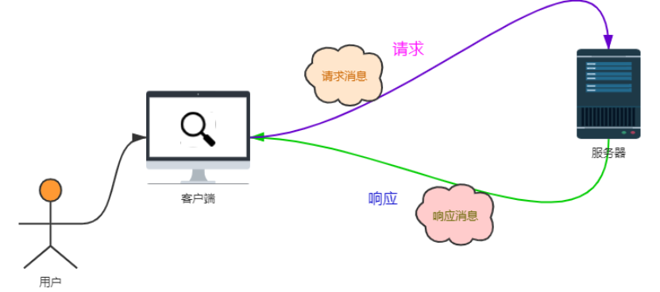

```javascript
djang flask tornado(异步) flaskApi....

浏览器先的到html框架，然后在向服务器请求js,css,picture等数据
请求的url是	协议+域名+路径   https://127.0.0.1:8000/hh.js
<script src='./hh.js'></script>

基于ip找到唯一的一台计算机(服务器)，基于port找到对应的应用程序。

```

```python
1.wsgi.py
	封装的socket模块，服务器网关接口
2.urls.py
	存储的是路由和视图函数的对应关系
3.views.py
	视图函数，处理业务逻辑
4.models.py
	和数据库建立联系
5.manage.py
	管理文件 
    sys.argv	执行py文件获取命令行的参数返回一个列表，第一个是py文件名,第二开始是参数。
6.templates文件夹
	存储的是html文件
7.static文件
	js、css、jpg...资源
```

**手撸web框架**

1. *阶段一*

```python
wigi.py文件下
import socket

socket_serve = socket.socket()
socket_serve.bind(('127.0.0.1', 8000))
socket_serve.listen()

while True:
    conn, address = socket_serve.accept()
    # 接受请求并打印
    request = conn.recv(1024)
    request = request.decode('utf-8')
    print(request)

    # 提取url路径
    path = request.split(' ')[1]
    print(path)
    # 返回给浏览器响应行
    conn.send(b'HTTP/1.1 200 ok\r\n\r\n')

    if path == '/home':
        with open('home.html', 'rb') as f:
            data = f.read()
        conn.send(data)
        # 断开连接
        conn.close()

    if path == '/index':
        with open('index.html', 'rb')as f:
            data = f.read()
        conn.send(data)
        conn.close()
    if path == '/login':
        with open('login.html', 'rb')as f:
            data = f.read()
        conn.send(data)
        conn.close()
```

```html
home.html文件下
<!DOCTYPE html>
<html lang="en">
<head>
    <meta charset="UTF-8">
    <title>home</title>
</head>
<body>
    <h1>home页面登录成功！</h1>
    
    
    
</body>
</html>


login.html文件下
<!DOCTYPE html>
<html lang="en">
<head>
  <meta charset="UTF-8">
  <title>login</title>
</head>
<body>
<h1>Login!登录成功</h1>

</body>
</html>


index.html
<!DOCTYPE html>
<html lang="en">
<head>
    <meta charset="UTF-8">
    <title>index</title>
</head>
<body>
<h1>index!</h1>


</body>
</html>
```

2. *阶段二 优化wsgi.py文件*  

```python
#减少if判断
import socket

socket_serve = socket.socket()
socket_serve.bind(('127.0.0.1', 8000))
socket_serve.listen()
#绑定路径和资源对应关系
urlpatterns = [('/home', 'home.html'), ('/login', 'login.html'), ('/index', 'index.html')]
while True:
    conn, address = socket_serve.accept()
    # 接受请求并打印
    request = conn.recv(1024)
    request = request.decode('utf-8')
    print(request)

    # 提取url路径
    path = request.split(' ')[1]
    print(path)
    # 返回给浏览器响应行
    conn.send(b'HTTP/1.1 200 ok\r\n\r\n')
    for item in urlpatterns:
        if path == item[0]:
            with open(item[1], 'rb') as f:
                data = f.read()
            # 返回给浏览器数据，退出循环
            conn.send(data)
            conn.close()
            break;
```

3. *阶段三封装函数*

```python
import socket
import threading


def home(conn):
    with open('home.html', 'rb') as f:
        data = f.read()
    conn.send(data)
    conn.close()


def login(conn):
    with open('login.html', 'rb') as f:
        data = f.read()
    conn.send(data)
    conn.close()


def index(conn):
    with open('index.html', 'rb') as f:
        data = f.read()
    conn.send(data)
    conn.close()


socket_serve = socket.socket()
socket_serve.bind(('127.0.0.1', 8000))
socket_serve.listen()
urlpatterns = [('/home', home), ('/login', login), ('/index', index)]

while True:
    conn, address = socket_serve.accept()
    # 接受请求并打印
    request = conn.recv(1024)
    request = request.decode('utf-8')
    print(request)

    # 提取url路径
    path = request.split(' ')[1]
    print(path)
    # 返回给浏览器响应行
    conn.send(b'HTTP/1.1 200 ok\r\n\r\n')
    for item in urlpatterns:
        if path == item[0]:
            # 开启多线程
            t = threading.Thread(target=item[1], args=(conn,))
            t.start()
            # item[1](conn)

```

4. 阶段四 *连接数据库*

```python
import pymysql


def con_mysql():
    # 创建连接对象
    conn = pymysql.Connect(
        host='127.0.0.1',
        port='3306',
        user='root',
        password='678846',
        database='liu',
        charset='utf8'
    )
    # 创建游标对象
    cursor = conn.cursor()
    sql = 'show tables;'
    # 执行sql语句
    res = cursor.execute(sql)
    #提交事物
    conn.commit()
    conn.close()
```

5. 阶段五综合设置manage.py文件启动*

```python
wsgi.py
import socket
import threading
from urls import urlpatterns


def run():
    socket_serve = socket.socket()
    socket_serve.bind(('127.0.0.1', 8000))
    socket_serve.listen()

    while True:
        conn, address = socket_serve.accept()
        # 接受请求并打印
        request = conn.recv(1024)
        request = request.decode('utf-8')
        print(request)

        # 提取url路径
        path = request.split(' ')[1]
        print(path)
        # 返回给浏览器响应行
        conn.send(b'HTTP/1.1 200 ok\r\n\r\n')
        for item in urlpatterns:
            if path == item[0]:
                # 开启多线程
                t = threading.Thread(target=item[1], args=(conn,))
                t.start()
                # item[1](conn)

```

```python
urls.py
import views
urlpatterns = [('/home', views.home),
               ('/login', views.login),
               ('/index', views.index)
            ]
```

```python
models.py
import pymysql

def create_models():
    conn=pymysql.Connect(
        host='localhost',
        port=3306,
        user='root',
        password='',
        database='learning',
        charset='utf8'
    )
    cursor=conn.cursor()
    sql='create table useinfo ( id int primary key auto_increment,name char(10) not null,age int unsigned );'
    cursor.execute(sql)
    conn.commit()
    conn.close()
```

```python
views.py

def home(conn):
    with open('templates/home.html', 'rb') as f:
        data = f.read()
    conn.send(data)
    conn.close()


def login(conn):
    with open('templates/login.html', 'rb') as f:
        data = f.read()
    conn.send(data)
    conn.close()


def index(conn):
    with open('templates/index.html', 'rb') as f:
        data = f.read()
    conn.send(data)
    conn.close()

```

```python
manage.py
import sys
from wsgi import run
from models import create_models

# 执行py文件时，可以通过sys.argv返回一个列表 [py文件名,*args]
command = sys.argv
line = command[1]
if line == 'runserver':
    run()
elif line == 'migrate':
    create_models()
```

template文件下存放的是html模版

```html
homr.html
login.html
index.html
```

static 文件夹下存放的是静态资源 css js picture等

**特别浏览器会请求一个小图标默认路径是 href='favicon.icon'**

设置 <link  rel='icon' href='xx.icon'>

**步骤**

```
1.运行项目
2.接受请求，wsgi~模块
	- 接受请求，将请求信息封装成一个字典传递给application函数，并调用application函数。
	- application函数会根据路径找到对应的视图函数，并获取视图函数的返回值
	- application函数的返回值是一个列表，列表中封装的都是视图函数的返回值
	- wsgi~模块会将application的返回值通过socket传递给浏览器
```


## 2.Http协议和Django初始

```html
http : 超文本传输协议  超文本（带有链接的文本数据）
url 统一资源定位符		协议+域名+路径+？请求参数
请求和响应的步骤
	在浏览器输入url，按下回车后的步骤
	- 1.浏览器会向DNS服务器请求解析url中域名对应的ip地址
	- 2.浏览器根据IP地址和默认端口号80 找到服务器并建立连接
	- 3.浏览器发出读取文件的请求
	- 4.服务端做出响应，返回对应的html文件
	- 5.断开连接
	- 6.浏览器加载渲染html并显示内容

http 三次握手和四次挥手
```

 请求消息格式

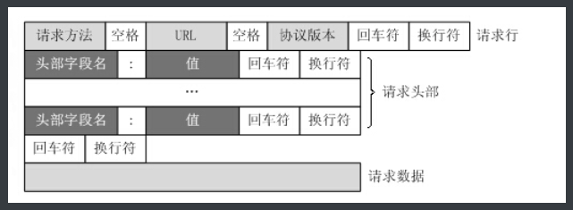

```python
	- 首行	method+url(路径)+https版本号
    - 请求头   多组参数(key-value)组成
    - 空行	/r/n/r/n  标志请求头结束
    - 请求体	  url请求参数 get为空  post参数全在body中
    
    get和post请求的区别
    	1.浏览器网址输入的都是get请求，form表单输入的内容是post请求
        2.get的参数在url中参数有长度限制，post的参数在请求体参数无长度限制
        3.post相对安全一点
```

响应消息格式

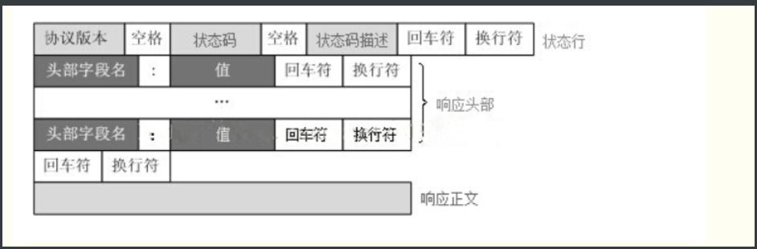

network内容
```python
General部分

Request URL: http://127.0.0.1:8080/   请求地址
Request Method: GET   请求方法
Status Code: 200 OK   响应状态码和描述
Remote Address: 127.0.0.1:8080    客户端的地址(ip+port)
        
request headers 请求头部键值对信息
response headers  响应头部键值对信息
```

状态码
```python
1xx 	服务器收到请求
2xx 	请求成功
3xx 	重定向
4xx		客户端发生错误
5xx 	服务端发生错
```

MVC就是把Web应用分为模型(M)，控制器(C)和视图(V)三层
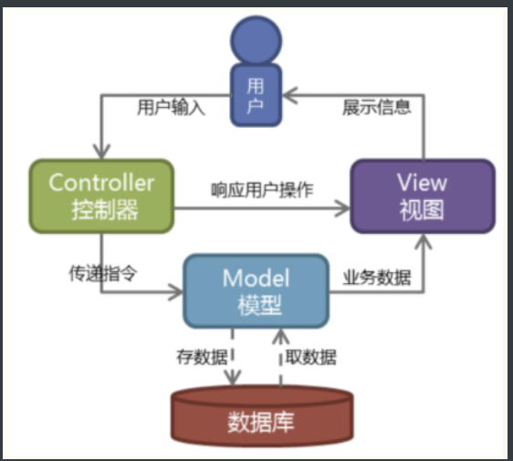

django是MTV模式,其实就是从MVC模式加工过来的.
```python
M 代表模型（Model）： 负责业务对象和数据库的关系映射(ORM)。
T 代表模板 (Template)：负责如何把页面展示给用户(html)。  模板渲染功能
V 代表视图（View）：   负责业务逻辑，并在适当时候调用Model和Template。

+ url控制器   urls.py文件:  路径和视图函数的映射关系
```

django下setting.py
```python
#注册app
INSTALLED_APPS = [
    'django.contrib.admin',
    'django.contrib.auth',
    'django.contrib.contenttypes',
    'django.contrib.sessions',
    'django.contrib.messages',
    'django.contrib.staticfiles',
    'app01.apps.App01Config'
    # 'app01'
]

TEMPLATES = [
    {
        'BACKEND': 'django.template.backends.django.DjangoTemplates',
        # 'DIRS': os.path.join(BASE_DIR , 'templates'),
        'DIRS': [BASE_DIR , 'templates'],  #注意这个配置
        'APP_DIRS': True,
        'OPTIONS': {
            'context_processors': [
                'django.template.context_processors.debug',
                'django.template.context_processors.request',
                'django.contrib.auth.context_processors.auth',
                'django.contrib.messages.context_processors.messages',
            ],
        },
    },
]
BASE_DIR = Path(__file__).resolve().parent.parent #BASE_DIR就是当前目录下
__file__:当前文件的绝对路径
os.path.dirname():找父级目录
```

案例用户登录：
```python
# 1 get请求回复登录页面
# 2 用户输入用户名和密码提交post请求到后台
# 3 后台将用户提交过来的数据取出,并判断用户名和密码是否正确,  username='root'  password='123'
# 4 用户名密码都是对的,回复一个新的html页面,  失败了,回复一个含有404字符串的页面

urls.py
    from django.urls import path
    from app01 import views
    urlpatterns = [
        path('home/', views.home),
    ]
    
views.py
	from django.http import HttpResponse
from django.shortcuts import render


def home(request):
    if request.method == 'GET':
        return render(request, 'home.html')
    elif request.method == 'POST':
        data = request.POST
        name = data.get('name')
        password = data.get('password')
        if name == 'root' and password == '123':
            return render(request, 'login.html')
        else:
            return HttpResponse('404')
templates文件下
	login.html	home.html
```


## 3.django的url

```python
虚拟环境：相互独立，相互隔离，同一个系统解释器，运行不同版本的包
#创建虚拟环境
virtualenv xx(路径)  --python python=3.8
#激活虚拟环境
cd ./xx/Scripts
activate
#退出虚拟环境
deactivate
```

```python
url注意的点	
    1.re_path(r'index/', views.index),     路径的前置导航斜杠(对应根路径那个),不需要写,django自动加上
    2.http://127.0.0.1:8000/index 当我们访问django的url路径时,如果请求路径最后没有写/,那么django会发一个重定向的响应,告	  诉浏览器,加上/再来访问我
    settigns.py配置文件中修改:
        默认为True, 当值为True时,django需要请求路径后面加上斜杠,如果请求没有加,那么响应301重定向,让浏览器街上斜杠重新请			求
        APPEND_SLASH = True  
        值为False,就关闭了django的这个功能
        APPEND_SLASH = False        
    re_path(r'index/', views.index),  127.0.0.1:8000/index/123会被捕获
    path('index/<int:year>') 会被捕获，一旦捕获就不会循环urlpatterns
    re_path(r'index/xx/xx/', views.index2),  
    re_path(r'', views.home),  #匹配根路径的写法  
```

```python
url的分组
	1.无名分组 (位置传参)
    	re_path(r'books/(\d+)/(\d+)/', views.books) 
        视图函数写法:
        def books(request, y, m):
        print(y, m)  
        return HttpResponse('%s-%s所有书籍都在这儿,你随意看' % (y, m))    
    2.有名分组(函数参数必须和有名分组名称相同)
    path('books/<int:year>/<int:month>',views.books2)
	re_path(r'books/(?P<year>\d+)/(?P<month>\d+)/', views.books2)
    def books2(request,  month, year):
        print(year, month) 
        return HttpResponse('%s--%s所有书籍都在这儿,你随意看' % (year,month ))
```

```python
url的别名反向解析
urls.py
	path('home/<int:year>/', views.home,name='home'),
    re_path(r'login/(\d+)', views.login1,name='login1'),
    re_path(r'login/(\d+)/(?P<year>\d+)', views.login2,name='login2')
app01/urls.py
	def home(request, year):
        print(reverse('home', kwargs={'year': year}))
        return HttpResponse('首页登录！')
    def login1(request, number):
        print(reverse('login1', args=(number,)))
        return HttpResponse('ok')
    def login2(request, number, year):
        print(reverse('login2', args=(number,), kwargs={'year': year}))
        return HttpResponse('ok')
html
	def home(request, year):
    	print(reverse('home', kwargs={'year': year}))
        #将动态参数传给html
    	return render(request,'home.html',{'year': year})
	<a href="" >首页</a>
重定向  
    redirect('')里面内置了reverse() 可以直接传别名name
    redirect('name')
    
    
路由分发
总路由
	urlpatterns = [
    path(r'admin/', admin.site.urls),
    path(r'app01/', include('app01.urls')),  #app01/urls.py
   	path(r'app02/', include('app02.urls')),  #app01/urls.py
    path(r'app03/', include('app03.urls')),  #app01/urls.py
	]
app01/urls.py
    urlpatterns = [
	path('index/',views.index, name='index'),
	]
app02/urls.py
    urlpatterns = [
	path('index/',views.index, name='index'),
	]
app02/urls.py
    urlpatterns = [
	path('index/',views.index, name='index'),
	]
反向解析是总是返回的是最后一个路径


命名空间：防止命名冲突
总路由:
urlpatterns = [
    path('admin/', admin.site.urls),
    path('app01/', include('app01.urls',namespace='app01')),  #app01/urls.py
    path('app02/', include('app02.urls',namespace='app02')),  #app01/urls.py
    path('app03/', include('app03.urls',namespace='app03')),  #app01/urls.py
]
视图函数下解析
	reverse('app01:index')   127.0.0.1:8000/app01/index
    
模版反向解析
		命名名称：别名
```

```python
request对象
http://127.0.0.1:8000/home/12/123?a=1&b=2
request	<WSGIRequest: GET '/home/12/123?a=1&b=2'>
	1.method	GET
    2.POST
    3.GET	<QueryDict: {'a': ['1'], 'b': ['2']}>
    4.path 	/home/12/123
    5.get_full_path()	/home/12/123?a=1&b=2
    6.META	请求的所有信息
postman 发送post请求
	post 	<QueryDict: {}>
```

```python
响应方法
1.HttpResponse 	返回字符串
2.render	返回响应页面
3.redirect	重定向
4.JsonResponse	返回json格式字符串
```

```python
设置响应头和状态码
response=HttpResponse('hh')
设置响应头
response['name']='liudong'
设置状态码
response.status_code=404
```

```python
CBV和FBV
FBV:函数形式编写的视图
CBV:类形式编写的视图

urls.py
	urlpatterns = [
    path('home/', views.HomeView.as_view()),
]
    
views.py
	class HomeView(View):
    # 通过反射机制获取类中定义的请求方法
    def get(self, request, *args, **kwargs):
        print(request.GET)
        return HttpResponse('ok')

 base.py(源码部分)
	http_method_names = ['get', 'post', 'put', 'patch', 'delete', 'head', 'options', 'trace']
	 def as_view(cls, **initkwargs):
        def view(request, *args, **kwargs):
            self = cls(**initkwargs)
            self.setup(request, *args, **kwargs)
            if not hasattr(self, 'request'):
                raise AttributeError(
                    "%s instance has no 'request' attribute. Did you override "
                    "setup() and forget to call super()?" % cls.__name__
                )
            return self.dispatch(request, *args, **kwargs)
        return view
    是一个闭包函数，返回了view函数，view函数又调用了dispatch()
    def dispatch(self, request, *args, **kwargs):
        if request.method.lower() in self.http_method_names:
            handler = getattr(self, request.method.lower(), self.http_method_not_allowed)
        else:
            handler = self.http_method_not_allowed
            return handler(request, *args, **kwargs)
	通过反射机制在定义类中找到对应的请求方法，没有就报错
反射机制：通过字符找到对应的属性和方法
```

```python
dispatch 用法和装饰器  在执行请求方法之前做一些操作

1.重写父类dispatch()
    def dispatch(self, request, *args, **kwargs):
        print('执行方法之前')
        ret = super().dispatch(request, *args, **kwargs)
        print('执行方法之后')
        return ret
2.写装饰器
	from django.utils.decorators import method_decorator
	def outer(func):
        def inner(*args, **kwargs):
            print('我是装饰器')
            ret = func(*args, **kwargs)
            print('我是装饰器')
            return ret
        return inner

	方式一：请求方法前加装饰器
		@method_decorator(outer)
        def get(self, request, *args, **kwargs):
            print(request.GET)
            return HttpResponse('ok')
	方式二：dispatch()方法前加装饰器
    	@method_decorator(outer)
        def dispatch(self, request, *args, **kwargs):
            ret = super().dispatch(request, *args, **kwargs)
            return ret
	方式三：类前面加装饰器
    	@method_decorator(outer,naem='get')
		class HomeView(View):
```

## 4.模版渲染

```python
views.py
    from django.shortcuts import render
	import datetime.datetime
    def home(request):
        1.字符串
        string = 'i love python'
        2.数字
        number = 123
        3.列表
        li = [1, 2, 3, 4]
        4.字典
        dic = {'a': 1, 'b': 2, 'c': 3, 'd': 4}
	   5.函数   调用函数不用(),所以不能用有参数的函数
        def function():
            return '我是函数'
		
        class Class_name(object):
            def __init__(self):
                self.name = '类'
                self.data = '2023'
		6.类对象
        c = Class_name()
        #封装成字典
        date = datetime.now()
    	tag= '<a href="http://www.baidu.com">百度<a/>'
        data={
            'string':string,
            'number':number,
            'li':li,
            'dic':dic,
            'function':function,
            'c':c,
        }
        #模板渲染完之后，才返回给浏览器
        return render(request,'home.html',data)

    
home.html
	字符串{{ string }}
    数字{{ number }}
    <ul>
    列表
        <li>{{ i }}</li>
        
    </ul>
    <ul>
    字典
        <li>{{ k }}--{{ v }}</li>
        
    </ul>
    <p>{{ function }}</p>
    <p>{{ c.name }}:{{ c.data }}</p>   
```

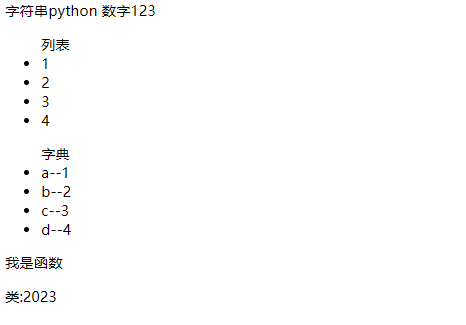


```python
过滤器：对数据进行加工
语法：
	- 无参数过滤器 {{变量名|过滤器名称}}
    - 有参数过滤器 {{变量名|过滤器名称:'参数'}}	
    
    
django 自带过滤器
	1.length	返回长度
    2.default	为空或False设置默认值
    3.slice		切片
    4.date		格式化{{time|data:'Y-m-d H:i:s'}}
   	5.safe		xss攻击：跨站脚本攻击 标记为标签
    			a_tag = '<a href="http://www.baidu.com">百度<a/>'
				<h2>{{ a_tag|safe }}</h2>
   6.cut 		移除指定字符串
   7.join		拼接字符串
```

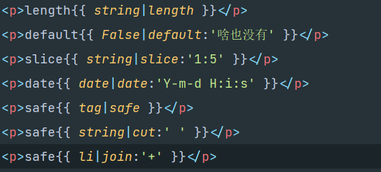
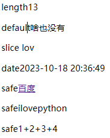

```python
1.forloop		对象：记录循环次数

        <li>{{ forloop.counter }}---{{ i }}</li> 从1开始计数
        <li>{{ forloop.counter0 }}---{{ i }}</li> 从0开始计数
        <li>{{ forloop.revcounter }}---{{ i }}</li> 倒序,从1开始计数
        <li>{{ forloop.revcounter0 }}---{{ i }}</li> 倒序,从0开始计数
        <li>{{ forloop.first }}---{{ i }}</li> 如果是第一次循环,就得到True
        <li>{{ forloop.last }}---{{ i }} </li>  如果是最后一次循环,就得到True,其他为False


2.reversed	倒序循环

<ul>
    
        <li>{{ i }} </li>
    
</ul>

3.if 标签

    <h1>太老了</h1>

    <h1>还行</h1>

    <h1>挺嫩</h1>


 <!-- 符号两边必须有空格 -->
    <h1>太老了</h1>

    <h1>还行</h1>

    <h1>挺嫩</h1>


 <!-- 可以配合过滤器来使用 -->
    <h1>爱好还挺多</h1>

    <h1>爱好不够多</h1>


4.with	起别名

        <li>{{ s}}</li>
    
   

5.csrf_token验证
<form action="" method="post">
      <!-- 加上这个标签之后,post请求就能通过django的csrf认证机制,就不需要注释settings的配置了 -->
    <input type="text" name="uname">

    <input type="submit">
</form>

```

**Django模板中属性的优先级大于方法**

```python
d2 = {'items': [11,22,33]}
优先使用items属性,不使用items方法,容易导致错误

<ul>

    
        <li>{{ key }} -- {{ v }}</li>
    
</ul>
```

```python
模板继承
	1.先创建一个母版
    2.在母板中预留block块(钩子)
    	
       	 <h1>母板</h1>
    	
    3.继承母板
    	
    4.重写母板并继承中block块
    	
        {{block.super}}
            <...>
        
     
   其他位置的block块
	
    
    
    
```

 

```python
组件：一个完整功能的模块，其他页面要使用，以组件形式引入

```


```python
静态文件配置流程：
	1.setting.py
		#别名，映射到静态文件的路径，引入时使用别名
		STATIC_URL = '/static/'
        #静态文件的路径，修改不会影响别名的使用
		STATICFILES_DIRS = [
    	os.path.join(BASE_DIR, 'statics'),
				]
	2.在项目目录下创建一个文件夹statics
    3.在html引入
    	引入方式一：
        	<link rel="stylesheet" href="/static/css/xx.css">  使用别名路径引入
         引入方式二：
        	
            <link rel="stylesheet" href=""> 
```


```python
自定义过滤器
1.在应用文件夹下创建一个templatetags文件夹
2.templatetags文件下创建py文件
3.在py文件下编写
my_tag.py文件下
	from django import template
    # 定义一个注册器
    register = template.Library()
    # 自定义过滤器最多有俩个参数，第一个参数是管道前的数
    @register.filter
    def together(x, y):
        return x + y
home.html文件下
	{{ string|together:' liud' }}
    
    
自定义标签
my_tag.py
	# 自定标签，没有参数限制
    @register.simple_tag
    def tag(x1, y1, x2, y2):
        return x1 + y1 + x2 + y2
home.html
	<p></p>
    
    
自定义动态组件
数据的流向：视图函数-->html模版-->inclusion_tag函数-->小段html-->html模版
my_tag.py
	# 动态组件 需要传入一个参数,这个参数就是一个html文件(你想做成动态组件的html文件)
    @register.inclusion_tag('zujian.html')
    def zujian(xx):  # 参数没有个数限制
        data = xx
        return {'data': data}
    # zujian.html会收到定义的inclusion_tag函数的返回值,然后进行zujian2.html这个动态组件的模板渲染
home.html
	
zujian.html
	<ul>
        
        <li>{{ item }}</li>
        
    </ul>
```

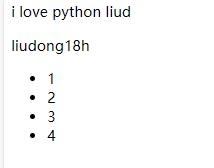


## 5.orm

```python
orm:关系对象模型 
orm->sql->pymysql->mysqld->磁盘
类-表 对象-数据
创建模型类
    # 属性对应的字段,默认都是不能为空的,也就是加了not null约束
    class Book(models.Model):

        # 如果没有指定主键字段,默认orm会给这个表添加一个名称为id的主键自增字段
        # 如果制定了,以指定的为准,那么orm不在创建那个id字段了
        # nid = models.AutoField(primary_key=True)  #int primary_key auto_increment,
        title = models.CharField(max_length=32)  #varchar 书籍名称
        # price = models.FloatField()  #
        price = models.DecimalField(max_digits=5, decimal_places=2)  # 999.99 价格
        pub_date = models.DateField()  # date  出版日期
        publish = models.CharField(max_length=32)  #出版社名称
        # xx = models.CharField(max_length=18, null=True, blank=True)  # null=True,blank=True允许该字段数据为空
        # xx = models.CharField(max_length=18, default='xxx')  # null=True,blank=True允许该字段数据为空

    Book生成的表名称为 应用名称_模型类名小写

choices参数
    sex_choice = (
    (0, '女性'),
    (1, '男性'),
)

class Author(models.Model):
	name = models.CharField( max_length=32)
	age = models.IntegerField()

	sex_choice = (
		(0, '女性'),
		(1, '男性'),
	)

	sex = models.IntegerField(choices=sex_choice,default=1) #choices关键字固定的
    
获取get_字段名称_display        sex  models.Author.objects.get(id=1).get_sex_display()


数据库同步指令
	python manage.py makemigrations
	python manage.py migrate
生成的有个django_migrations表记录的是migrations文件夹下那些文件被执行了，执行migrate会先检测这张表那些文件执行了，如果执行了就不在执行了。
```


```python
django配置连接mysql
1.创建数据库
	create database orm1 charset utf8;
2.setting.py配置
	DATABASES = {
    'default': {
        'ENGINE': 'django.db.backends.mysql',
        'NAME': 'learning',
        'HOST':'127.0.0.1',
        'PORT':3306,
        'USER':'root',
        'PASSWORD':'',  #有密码的填密码
        
        }
    }
3.安装pymysql
	pip install pymysql -i http://mirrors.aliyun.com/pypi/simple/ --trusted-host mirrors.aliyun.com
4.在项目主目录下
	import pymysql
    pymysql.install_as_MySQLdb()
5.执行数据库同步指令
	只要换了数据库就会在执行一遍(默认db.sqlite3)
```

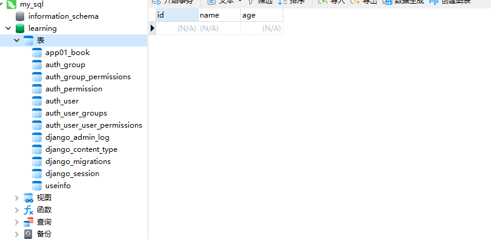


```python
单表记录的增删改查

增加
	1.实例化模型类
    	from app01 import models
        from django.shortcuts import HttpResponse
        def home(request):
            new_book = models.Book(
                title='python入门到放弃',
                price=20,
                # datetime.datetime.now().strftime("%Y-%m-%d_%H:%M:%S")
                pub_date='2023-10-10',
                publish='夕阳红出版社'
            )
            new_book.save()

            return HttpResponse('ok')
        主键，有默认值或者可以为空的，可以不用传值
    2.create()方法，返回的是新添加的模型类对象
    	models.Book.objects.create(
        title='Python面向监狱编程',
        price=20,
        pub_date='2023-10-10',
        publish='洛杉矶出版社'
    	)
    3.批量添加 bulk_create()
        obj_list=[]
        for i in range(1,10):
            book_obj=models.Book(
                title=f'白鹿原{i}',
                price=20,
                pub_date=f'2023-10-{i}',
                publish='家里蹲出版社'
            )
            obj_list.append(book_obj)
        models.Book.objects.bulk_create(obj_list)

```

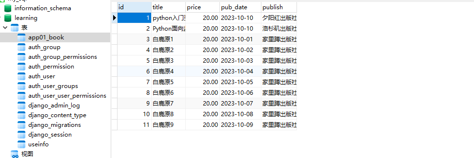


```python
查询
book_objs = models.Book.objects.all()  # queryset 类似于列表
print(book_objs)
book_objs = models.Book.objects.filter(id=3)  # 条件查询 结果为queryset类型数据
print(book_objs)
book_objs=models.Book.objects.filter()  # filter没有加条件,和all一样的效果
print(book_objs)
book_objs=models.Book.objects.filter(id=100)  # 查不到数据,不会保存,返回空干的queryset类型数据
print(book_objs)
book_objs = models.Book.objects.get(id=3)  # 条件查找 结果为: 模型类对象
print(book_objs)
# models.Book.objects.get()  # 也是查所有但是get方法的查询结果有要求, 有且只能有一条
# models.Book.objects.get(id=100)  # 查询不到，查询多条都会报错
```

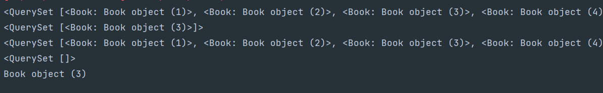


```python
删除
# queryset类型数据可以调用delete方法删除查询结果数据
models.Book.objects.filter(id=3).delete()
# 模型类对象也可以调用delete方法删除数据
models.Book.objects.get(id=4).delete()
```

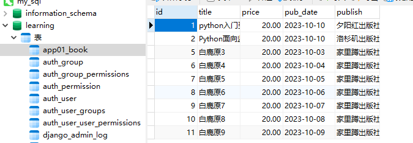


```python
修改
	# 修改方式1  通过queryset类型数据修改
    models.Book.objects.filter(id=6).update(
        price=20,
        title='红浪漫',
    )
    # 报错:模型类对象不能调用update方法
    # models.Book.objects.get(id=5).update(
    #     price=30,
    # )
    # 修改方式2  通过模型类对象来修改
    ret = models.Book.objects.get(id=5)
    ret.price = 30
    ret.title = '少年阿宾00'
    ret.save()
```

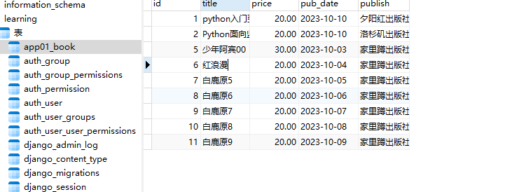


```python
DatetimeField、DateField、TimeField这个三个时间字段，都可以设置如下属性
auto_now_add
    配置auto_now_add=True，创建数据记录的时候会把当前时间添加到数据库。

auto_now
    配置上auto_now=True，每次更新数据记录的时候会更新该字段，标识这条记录最后一次的修改时间。
    
django默认时间是utc英国时间修改为本地时间
setting.py
	# USE_TZ = True
	USE_TZ = False
```


```python
基于双下划线的模糊查询
	# 以什么开头
    obj_list = models.Book.objects.filter(title__startswith='python')
    print(obj_list)
    # 以什么结尾
    obj_list = models.Book.objects.filter(title__endswith='编程')
    print(obj_list)
    # 包含
    obj_list = models.Book.objects.filter(title__contains='python')
    print(obj_list)
    # 不区分大小写的包含
    obj_list = models.Book.objects.filter(title__icontains='python')
    print(obj_list)
    # 大于
    obj_list = models.Book.objects.filter(price__gt=10)
    print(obj_list)
    # 大于等于
    obj_list = models.Book.objects.filter(price__gte=10)
    print(obj_list)
    # 小于
    obj_list = models.Book.objects.filter(price__lt=10)
    print(obj_list)
    # 小于等于
    obj_list = models.Book.objects.filter(price__lte=10)
    print(obj_list)
    # 价格大于等于15并且小于等于20
    obj_list = models.Book.objects.filter(price__in=[15, 18, 30])
    print(obj_list)
    # between and
    obj_list = models.Book.objects.filter(price__range=[15, 20])
    print(obj_list)
    # and 查询
    obj_list=models.Book.objects.filter(id=12,price=10)
    print(obj_list)
    # 年份
    obj_list=models.Book.objects.filter(pub_date__year='2023')
    print(obj_list)
    obj_list=models.Book.objects.filter(pub_date__month='10')
    print(obj_list)
    obj_list=models.Book.objects.filter(pub_date__day='9')
    print(obj_list)
```

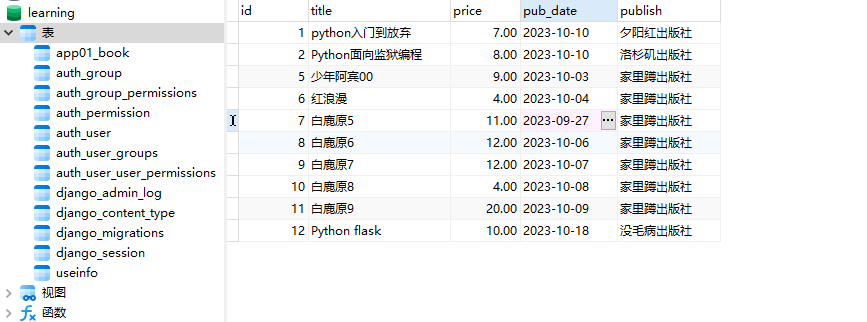
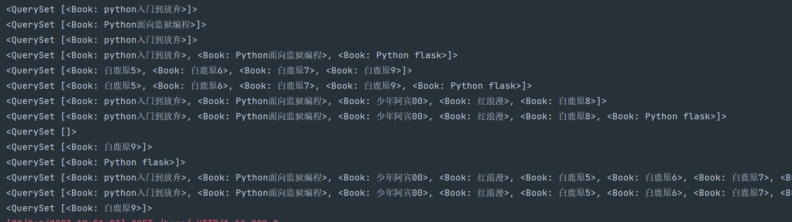


```python
13个查询api接口
	1.filter() 	queryset对象
    2.all()		queryset对象
    3.get()		模型类对象
    4.exclude()	排除 queryset对象
    5.order_by() 排序 queryset对象
    6.reveser()	 反转 queryset对象
    7.count()	计数 queryset对象
    8.first()	queryset对象的第一个 类模型对象
    9.last()	queryset对象的最后一个 类模型对象
    10.distinct()	去重 一般配合values和values_list来使用
    11.exists()	判断查询结构是否有数据
    12.values()	查询指定字段，返回为queryset对象内容为字典数据
    13.values_list()	查询指定字段，返回为queryset对象内容为元祖数据
只要返回数据还是query_set对象，就可以调用这些方法
```


```python
表关系设计
from django.db import models
一对一 拆表：可以加快查询速度
    # 作者表
    class Author(models.Model):
        name = models.CharField(max_length=32)
        age = models.IntegerField()
        # au = models.OneToOneField(to="AuthorDetail", to_field="id", on_delete=models.CASCADE)
        # au = models.OneToOneField("AuthorDetail")
        # au = models.IntegerField()
        au = models.OneToOneField("AuthorDetail", db_constraint=False)
        # db_constraint=False取消foreign key的强制约束效果,还可以继续使用orm的提供的属性或者方法来操作关系记录
        # foreign key + unique
        au = models.ForeignKey("AuthorDetail", unique=True)
    # 属性是OneToOneField或者ForeignKey,那么生成的对应字段是  属性名称_id	au_id

    #作者详细信息表
    class AuthorDetail(models.Model):
        birthday=models.DateField()
        telephone=models.BigIntegerField()
        addr=models.CharField(max_length=64)
多对一
    # 出版社表
    class Publish(models.Model):
        name=models.CharField( max_length=32)
        city=models.CharField( max_length=32)


    #书籍表
    class Book(models.Model):

        title = models.CharField( max_length=32)
        publishDate=models.DateField()
        price=models.DecimalField(max_digits=5,decimal_places=2)

        # publishs=models.ForeignKey(to="Publish",to_field="id",on_delete=models.CASCADE)
        publishs=models.ForeignKey("Publish")
        #多对多
        authors = models.ManyToManyField('Author')

多对多
    # class authortobook(models.Model):
    # book_id = models.ForeignKey('Book')
    # author_id = models.ForeignKey('Author')
在被关联表中，如果删除一个记录，那么外键关联到此记录的都会被删除
```

**注意：数据表生成失败要到django_migrations表中删除app记录才能重新生成**
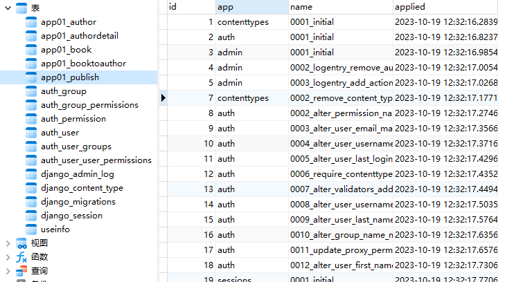

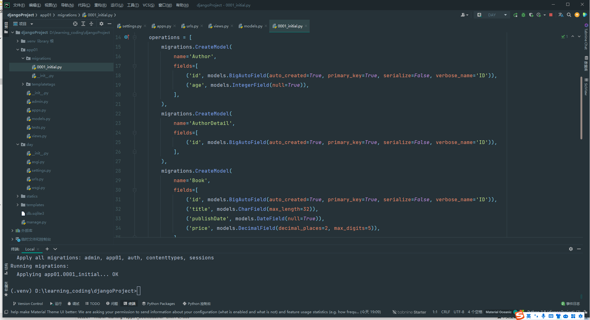

**models.py 不能加，号，会识别不出来，但是不会报错没有相应的字段，作者表中没有name**

**生成成功！**
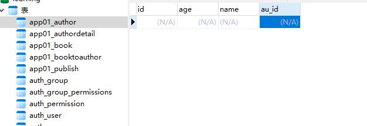

**多张表记录的增删改查**

*多张表记录的增操作*

***一对一***

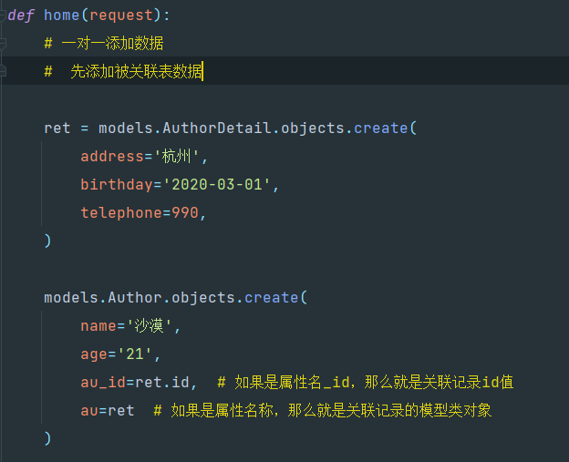
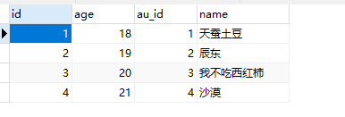

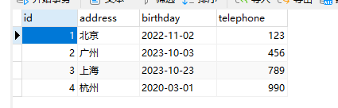
**多对一**

```python
    # 一对多添加数据
    obj_pub = models.Publish.objects.get(id=1)
    models.Book.objects.create(
        title='斗破苍芎',
        price=123,
        publishDate='2015-02-13',
        # pulish_id=obj_pub.id,     #如果属性名称_id添加数据,那么值为关联记录的id值
        publish=obj_pub  # 如果是属性名称添加数据，那么值为关联记录的类模型对象
    )
```

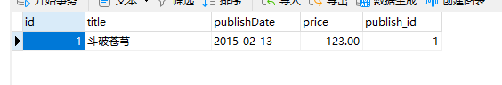
**多对多**

```python
 # 多对多添加数据
    book_obj = models.Book.objects.get(title='吞噬星空')
    author1 = models.Author.objects.get(name='辰东')
    author2 = models.Author.objects.get(name='我不吃西红柿')
    book_obj.authors.add(*[author1,author2])
```

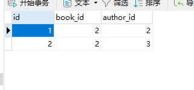


```python
多张表的删除和修改
	# 一对一删除
    # models.Author.objects.get(name='天蚕土豆').delete()
    # 外键关联到此条记录的都会被删除
    models.AuthorDetail.objects.get(address='广州').delete()
    
    #一对多 
    # models.Book.objects.get(id=1).delete()
	# models.Publish.objects.get(id=2).delete()
   
	#多对多
	book_obj = models.Book.objects.get(id=6)
	# book_obj = models.Book.objects.filter(id=5)[0]
	# book_obj.authors.remove(1)  # 4   1  删除第三张表中id为6 并且作者id为1的记录
	# book_obj.authors.clear()  # 清空 第三张表中的书籍id为5的所有记录
	# book_obj.authors.remove(1, 4)  #删除多条
	# book_obj.authors.remove(*[1, 4]) #删除多条
    
    # 修改
	# 一对一
	# models.Author.objects.filter(id=3).update(
	# 	age=38,
	# 	# au_id=5,
	# 	# au=models.AuthorDetail.objects.get(id=5),
	# )

	# 一对多
	# models.Book.objects.filter(id=4).update(
		# title='白洁1',
		# publishs=models.Publish.objects.get(id=2),
		# publishs_id=2
	# )

	# 多对多

	obj = models.Book.objects.get(id=5)
	obj.authors.set(['1','3'])  #clear + add  跟新,先清空book_id为5的第三张表里的记录,再添加5 1和5 3记录
```

**基于对象的跨表查询**（模型类对象）

```python
正向查询：关联属性在那张表，通过该表的数据区查询另外一张表的数据，这种叫做正向查询
正向查询靠属性，反向查询靠表名小写
一对一
	# 查询天蚕土豆的手机号(正向查询)
    res=models.Author.objects.get(name='天蚕土豆')
    res=res.au.telephone
    print(res)		#123
    # 查询手机号为123的作者姓名(反向查询)
    res = models.AuthorDetail.objects.get(telephone=123)
    res = res.author.name
    print(res)		#天蚕土豆
一对多
    # 查询吞噬星空是哪个出版社出版的(正向查询)
    res = models.Book.objects.get(title='吞噬星空')
    res = res.publish.name
    print(res)  # 蓝天出版社
    # 查询夕阳红出版社出了那些书(反向查询) 一对多关系时，使用小写名_set返回的是queryset对象
    res = models.Publish.objects.get(name='夕阳红出版社')
    res = res.book_set.all() #类似与object控制器
    print(res)
    # <QuerySet [<Book: 斗破苍芎>, <Book: 王炸3>, <Book: 王炸4>, <Book: 王炸6>, <Book: 王炸8>]>
多对多
    # 查询吞噬星空的作者是谁(正向查询)
    res = models.Book.objects.get(title='吞噬星空')
    res = res.authors.all()  # 类似与object控制器
    print(res)  # <QuerySet [<Author: 辰东>, <Author: 我不吃西红柿>]>
    # 辰东写了那几本书(反向查询)
    res = models.Author.objects.get(name='辰东')
    res = res.book_set.all()  # 类似与object控制器
    print(res)  # <QuerySet [<Book: 吞噬星空>, <Book: 王炸1>, <Book: 王炸3>]>
```


**基于双下划线的跨表查询**

```python
基于双下划线的跨表查询	--mysql连表查询
正向查询靠属性，反向查询靠表名小写
一对一
    # 查询沙漠的手机号(正向)
    res = models.Author.objects.filter(name='沙漠').values('au__telephone')
    print(res)  # <QuerySet [{'au__telephone': 990}]>
    # 查询手机号为990的作者姓名(反向)
    res = models.AuthorDetail.objects.filter(telephone=990).values('author__name')
    print(res)  # <QuerySet [{'author__name': '沙漠'}]>
一对多
    # 查询斗破苍芎是哪个出版社出版的(正向查询)
    res = models.Book.objects.filter(title='斗破苍芎').values('publish__name')
    print(res)  # <QuerySet [{'publish__name': '夕阳红出版社'}]>
    # 查询夕阳红出版社出版了那些书(反向查询)
    res = models.Publish.objects.filter(name='夕阳红出版社').values('book__title')
    print(res)  
    # <QuerySet [{'book__title': '斗破苍芎'}, {'book__title': '王炸3'}, {'book__title': '王炸4'}, {'book__title': 		'王炸6'}, {'book__title': '王炸8'}]>
多对多
    # 查询吞噬星空的作者是谁(正向查询)
    res = models.Book.objects.filter(title='吞噬星空').values('authors__name')
    print(res)  # <QuerySet [{'authors__name': '辰东'}, {'authors__name': '我不吃西红柿'}]>
    # 辰东写了那几本书(反向查询)
    res = models.Author.objects.filter(name='辰东').values('book__title')
    print(res)  # <QuerySet [{'book__title': '吞噬星空'}, {'book__title': '王炸1'}, {'book__title': '王炸3'}]>    
```


**聚合查询**

```python

查询所有书的平均价格，最大值，最小值，和，计数
	from django.db.models import Avg, Max, Min, Sum,Count
    res = models.Book.objects.all().aggregate(Avg('price'), Max('price'), Min('price'), Sum('price'))
    print(res)
    # {'price__avg': Decimal('34.363636'), 'price__max': Decimal('123.00'), 'price__min': Decimal('11.00'), 'price__sum': Decimal('378.00')}
```


**分组**

```python
annotate 默认以id分组
  	# 查询每个出版社出书的平均价格  正向属性，反向表名小写
    res = models.Book.objects.values('publish_id').annotate(Avg('price'))
    print(res)
    # <QuerySet [{'publish_id': 1, 'price__avg': Decimal('36.800000')}, {'publish_id': 2, 'price__avg': 		 	Decimal('32.333333')}]>
    res = models.Publish.objects.annotate(price=Avg('book__price')).values('price')
    print(res)
    # <QuerySet [{'price': Decimal('36.800000')}, {'price': Decimal('32.333333')}]>
```


**F查询**

```python
本表查询
# 将所有书的价格上调10元
book_obj=models.Book.objects.all()
for book in book_obj:
    book.price+=10
    book.save()

# F查询
models.Book.objects.all().update(price=F('price') + 10)  # 支持四则运算

# 查询点赞数大于评论数的书籍
book_obj = models.Book.objects.all()
for book in book_obj:
    if book.dianzan > book.comment:
        print(book)

# F 查询
# <QuerySet [<Book: 吞噬星空>, <Book: 王炸6>, <Book: 王炸8>]>
res = models.Book.objects.filter(dianzan__gt=F('comment'))
print(res)
```


**Q查询**

```python
Q查询，多条件查询
and &   or |  not ~
# 查询一下点赞数大于10或者评论数大于10的所有书籍
    res = models.Book.objects.filter(Q(dianzan__gt=10) | Q(comment__gt=10)).values('title')
    print(res)
    # <QuerySet [{'title': '斗破苍芎'}, {'title': '吞噬星空'}, {'title': '王炸1'}, {'title': '王炸3'}, {'title': '王	   炸6'}, {'title': '王炸7'}, {'title': '王炸8'}, {'title': '王炸9'}]>
# 查询一下点赞数大于10且评论数大于10的所有书籍
    res=models.Book.objects.filter(Q(dianzan__gt=10)&Q(comment__gt=10)).values('title')
    print(res)
    #<QuerySet [{'title': '王炸3'}, {'title': '王炸6'}, {'title': '王炸7'}, {'title': '王炸8'}]>
    res=models.Book.objects.filter(dianzan__gt=10,comment__gt=10).values('title')
    print(res)
    #<QuerySet [{'title': '王炸3'}, {'title': '王炸6'}, {'title': '王炸7'}, {'title': '王炸8'}]>
# 点赞数大于10或者评论数大于10的并且价格大于30的书籍
    res = models.Book.objects.filter(Q(dianzan__gt=10) | Q(comment__gt=10) & Q(price__gt=30)).values('title')
    print(res)
    res=models.Book.objects.filter(Q(dianzan__gt=10) | Q(comment__gt=10) ,price__gt=30).values('title')
    print(res)
    res = models.Book.objects.filter(Q(dianzan__gt=10) | Q(comment__gt=10) & ~Q(price__lt=30)).values('title')
    print(res)
    #<QuerySet [{'title': '斗破苍芎'}, {'title': '吞噬星空'}, {'title': '王炸1'}, {'title': '王炸3'}, {'title': '王炸	   6'}, {'title': '王炸7'}, {'title': '王炸8'}, {'title': '王炸9'}]>
```


**锁和事务**

pass 不太熟后面补


## 6.ajax请求和原生sql


**执行原生sql语句**

```python
方式1
	raw() #只能操作本表数据，返回的是RawQuerySet，里面放的是模型类对象
	res=models.Book.objects.raw("select * from 	    app01_book where price>=100;  ")
    print(res)
    #<RawQuerySet: select * from app01_book where price>=100;  >
    for book in res:
        print(book.title)
	    #斗破苍芎
        #吞噬星空

        
方式二
	connection模块
    # 找到以王开头的书籍
    from django.db import connection
    cursor = connection.cursor()
    sql='select * from app01_book where title like "王%";'
    cursor.execute(sql)
    ret=cursor.fetchall()
    for row in ret:
        print (row)
#(3, '王炸1', datetime.date(2020, 1, 1), Decimal('31.00'), 2, 13, 4)
#(4, '王炸2', datetime.date(2020, 1, 2), Decimal('32.00'), 2, 2, 1)
#(5, '王炸3', datetime.date(2020, 1, 3), Decimal('33.00'), 1, 37, 26)
#(6, '王炸4', datetime.date(2020, 1, 4), Decimal('34.00'), 1, 4, 2)
#(7, '王炸5', datetime.date(2020, 1, 5), Decimal('35.00'), 2, 4, 2)
#(8, '王炸6', datetime.date(2020, 1, 6), Decimal('36.00'), 1, 15, 24)
#(9, '王炸7', datetime.date(2020, 1, 7), Decimal('37.00'), 2, 18, 12)
#(10, '王炸8', datetime.date(2020, 1, 8), Decimal('38.00'), 1, 11, 88)
#(11, '王炸9', datetime.date(2020, 1, 9), Decimal('39.00'), 2, 13, 2)

```


**简单认证示例**

```python
登录失败，页面刷新	 form表单提交数据时会刷新
	views.py
    def login(request):
        if request.method == 'POST':
            username = request.POST.get('username')
            password = request.POST.get('password')
            # 数据经历编码解码操作后接收到的数据是字符串
            if username == 'root' and password == '123':
                return HttpResponse('login!')

        else:
            return render(request, 'login.html')
        return render(request, 'login.html', {'error': '用户名或密码有误'})
    
    login.html
    <h1>登录页面</h1>
	<form action="" method="post">
        <div>{{ error }}</div>
        用户名: <input type="text" name="username" >
        密码: <input type="password" name="password">
        <input type="submit">
	</form>	
    
    
    登录失败，页面刷新，保存之前数据
    views.py
    return render(request, 'login.html', {'error': '用户名或密码有误','username':username,'password':password})

	login.html
    <h1>登录页面</h1>
	<form action="" method="post">
        <div>{{ error }}</div>
        用户名: <input type="text" name="username" value="{{username}}">
        密码: <input type="password" name="password" value="{{password}}">
        <input type="submit">
	</form>	
```


**ajax请求**

```python
特点：异步提交，局部刷新
views.py
def login(request):
    if request.method == 'POST':
        print(request.POST)
        username = request.POST.get('username')
        password = request.POST.get('password')
        # 数据经历编码解码操作后接收到的数据是字符串
        if username == 'root' and password == '123':
            return HttpResponse('login!')
        else:
            ## 修改登录失败的状态码
            ret=HttpResponse('not ok!')
            ret.status_code=400
            return ret
    if request.method == 'GET':
        return render(request, 'login.html')
    
    


login.html
用户：<input type="text" id="username">
密码：<input type="password" id="password">
<button type="submit" id="btn">ajax请求</button>
<h1 id="error" style="color: red"  ></h1>
<script src="https://cdn.bootcdn.net/ajax/libs/jquery/3.7.1/jquery.js"></script>
<script>
    $('#btn').click(function () {
        //获取用户输入的数据
        var username = $('#username').val()
        var password = $('#password').val()

        $.ajax({
            type: 'POST',
            url: '/login/', //前面加/的是绝对路径
            data:{username:username,password:password},
            success: function (res) {
                // res 接受的是请求成功后响应的结果，后台返回的状态码是2xx/3xx ajax会自动调用回调函数并将接受到的响应传递给函数
                console.log(res)
                //登录成功
                $('#error').text('login！')
            },
            error: function (res) {
                // res 接受的是请求失败后响应的结果，后台返回的状态码是4xx/5xx ajax会自动调用回调函数并将接受到的响应传递给函数
                console.log(res)
                $("#error").text(res.responseText)
            }
        })

    })
</script>
```

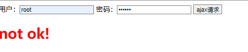
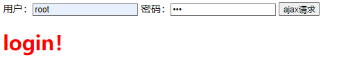


**ajax获取数据案例**

```python
views.py
def login(request):
    return render(request, 'login.html')

def home(request):
    import json
    data = {'name': '刘栋', 'age': 18}
    data = json.dumps(data, ensure_ascii=False)
    return HttpResponse(data)

def index(request):
    import json
    data = ['黄瓜', '冬瓜', '茄子', '胡萝卜', '香蕉', '冬瓜']
    data = json.dumps(data, ensure_ascii=False)
    return HttpResponse(data)


login.html
<h1>home 页面</h1>
<p id="success"></p>
<ul id="food_list">
</ul>
<script src="https://cdn.bootcdn.net/ajax/libs/jquery/3.7.1/jquery.js"></script>
<script>
    $.ajax({
        type: "get",
        url: '/home/',

        success: function (res) {
            console.log(res, typeof (res))
            //{"name": "刘栋", "age": 18} string
            res = JSON.parse(res)
            console.log(res, typeof (res))
            //{name: '刘栋', age: 18} 'object'
            $('#success').text(`${res.name}--${res.age}`)
        },
        error: function (res) {
            pass
        }
    })

    $.ajax({
        type: "get",
        url:  '/index/',

        success: function (res) {
            res = JSON.parse(res)
            //创建标签
            $.each(res, function (k,v) {
            var li=document.createElement('li');
            li.innerText=v;
            $('#food_list').append(li)
            })
        },
        error: function (res) {
            pass
        },
    })

</script>
```

**JsonResponse**

```python
views.py
def login(request):
    return render(request, 'login.html')

def home(request):
    import json
    data = {'name': '刘栋', 'age': 18}
    data = json.dumps(data, ensure_ascii=False)
    ret= HttpResponse(data)
    ret['content-type'] = 'application/json'
    return ret

def index(request):
    # JsonResponse 序列化，并在响应头中添加content-type:application/json 键值对
    data = ['黄瓜', '冬瓜', '茄子', '胡萝卜', '香蕉', '冬瓜']
    # 非字典数据
    return JsonResponse(data,safe=False)


login.html
//当后台响应头键值对中 包含 content-type:application/json ,ajax 就知道响应的数据是json数据，直接反序列化
 $.ajax({
        type: "get",
        url: '/home/',

        success: function (res) {
            console.log(res, typeof (res))
            $('#success').text(`${res.name}--${res.age}`)
        },
        error: function (res) {
            pass
        }
    })

    $.ajax({
        type: "get",
        url:  '/index/',
        success: function (res) {
            //创建标签
            $.each(res, function (k,v) {
            var li=document.createElement('li');
            li.innerText=v;
            $('#food_list').append(li)
            })
        },
        error: function (res) {
            pass
        },
    })
```

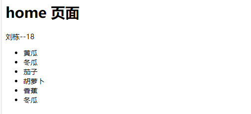


## 7.cookie和session


**http协议**

```python
是一种无状态的短连接(无连接)
无状态：不会记录任何客户端和服务端的信息
短连接：一次请求，一次响应就断开连接

connect:keep-alive
connect:closed
```


**cookie**

```python
服务器产生，保存在浏览器的键值对，请求同一个网站时，浏览器会自动携带cookie发送给服务器
特点：
	1.保存在浏览器上
	2.cookie的大小和数量都是有限制的
	3.明文形式不太安全


浏览器清除cookie快捷键 ctrl+shift+delete
```

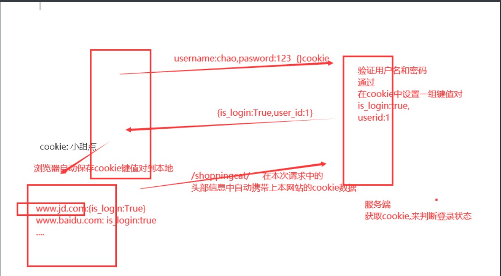


**用户的登录认证    django cookie操作**

```python
views.py
def login(request):
    if request.method == 'POST':
        username=request.POST.get('username')
        password=request.POST.get('password')
        if username=='root' and password=='123':
            # 登录成功设置cookie
            ret=redirect('home')
            ret.set_cookie('is_login', True)
            return ret
        else:
            return redirect('login')
    else:

        return render(request, 'login.html')


def home(request):
    print(request.COOKIES)
    is_login=request.COOKIES.get('is_login')
    # 编码解码后会变成字符串
    print(is_login,type(is_login))
    if is_login=="True":
        return render(request, 'home.html')
    else:
        return redirect('login')


def cart(request):
    data = ['python入门到入狱', 'python Django实战', 'java之父余胜军', '前端']
    is_login = request.COOKIES.get('is_login')
    if is_login == "True":
        return render(request, 'cart.html',{'data':data})
    else:
        return redirect('login')
    
    
login.html
<form method="post" action="/login/">
    用户：<input type="text" name="username" >
    密码：<input type="password" name="password" >
    <input type="submit">
</form>
home.html
<h1>欢迎来到 特莱联盟</h1>
<br>
<a href="/cart/" >购物车</a>
cart.html
<ul>
    
        <li>{{ i }}</li>
    
</ul>
    
```

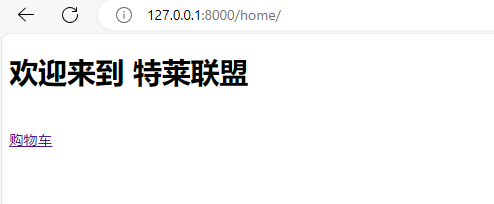
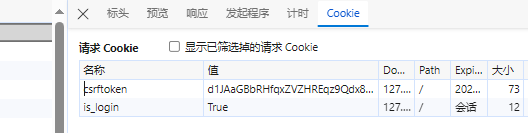


**删除和设置cookie的参数**

```python
删除cookie  delete_cookie('is_login')
def logout(request):
    ret=redirect('login')
    ret.delete_cookie('is_login')
    return ret
cart.html
<ul>
    
        <li>{{ i }}</li>
    
</ul>
<a href="/logout/">退出登录</a>	


set_cookie的一些参数
	key, 键
    value='', 值
    max_age=None, 超时时间  单位秒数 None 表示关闭浏览器时失效
    expires=None, 超时时间(IE requires expires, so set it if hasn't been already.).值为时间日期类型数据
	path='/', Cookie生效的路径，/ 表示根路径，特殊的：根路径的cookie可以被任何url的页面访问
	domain=None, Cookie生效的域名
	secure=False, https传输
	httponly=False 只能http协议传输，无法被JavaScript获取（不是绝对，底层抓包可以获取到也可以被覆盖）
```

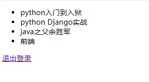


**session**

```python
会话数据的唯一标识保存在客户端cookie中，而实际数据保存在服务器上
特点：
	1.保存在服务器上
	2.没有大小限制
	3.相对安全，不是明文存储
```


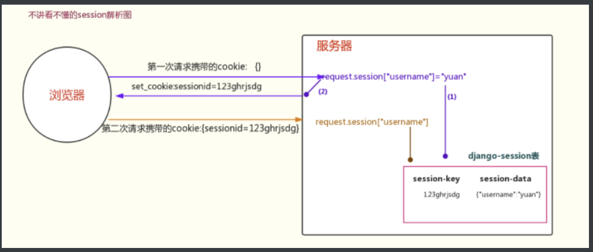

**django session操作**

```python
views.py
def login(request):
    if request.method == 'POST':
        username = request.POST.get('username')
        password = request.POST.get('password')
        if username == 'root' and password == '123':
            # 登录成功设置session
            request.session['is_login'] = True
            '''
            1.生成随机字符串
            2.加入到cookie中，{sessionid:'asdasdasdasdas'}
            3.将设置的session数据，序列化后加密保存到数据库中
            django_seeeion表中
            '''
            return redirect('home')

        else:
            return redirect('login')
    else:

        return render(request, 'login.html')


def home(request):
    status = request.session.get('is_login')
    '''
    1.取出cookie中sessionid对应随机字符串
    2.将随机字符串去django_session表中找到对应的记录
    3.将表中的session_data数据解密反序列化后，取出键对应的值
    '''
    if status == True:
        return render(request, 'home.html')
    else:
        return redirect('login')


def cart(request):
    data = ['python入门到入狱', 'python Django实战', 'java之父余胜军', '前端']
    status = request.session.get('is_login')
    if status == True:
        return render(request, 'cart.html', {'data': data})
    else:
        return redirect('login')


def logout(request):
    # 清除session
    '''
    1.删除cookie中sessionid对应的值    
    2.删除数据库中对应的记录
    如果客户端删除了cookie，服务器的记录是有时效的，到期自动删除
    '''
    request.session.flush()
    return redirect('login')


```


设置session返回sessionid到cookie中

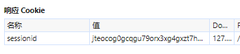


再次请求的会携带cookie
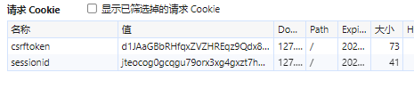


sessionid对应的值和django_session表中的key是一致的

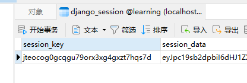


**session配置**

```python
session配置
同一个浏览器一个session
# 设置会话Session和Cookie的超时时间
request.session.set_expiry(value)
    * 如果value是个整数，session会在些秒数后失效。
    * 如果value是个datatime或timedelta，session就会在这个时间后失效。
    * 如果value是0,用户关闭浏览器session就会失效。
    * 如果value是None,session会依赖全局session失效策略。

    
全局配置

1. 数据库Session
SESSION_ENGINE = 'django.contrib.sessions.backends.db'   # 引擎（默认）

2. 缓存Session
SESSION_ENGINE = 'django.contrib.sessions.backends.cache'  # 引擎
SESSION_CACHE_ALIAS = 'default'                            # 使用的缓存别名（默认内存缓存，也可以是memcache），此处别名依赖缓存的设置


3. 文件Session
SESSION_ENGINE = 'django.contrib.sessions.backends.file'    # 引擎
SESSION_FILE_PATH = None                                    # 缓存文件路径(写文件夹路径)，如果为None，则使用tempfile模块获取一个临时地址tempfile.gettempdir() 

4. 缓存+数据库
SESSION_ENGINE = 'django.contrib.sessions.backends.cached_db'        # 引擎

5. 加密Cookie Session
SESSION_ENGINE = 'django.contrib.sessions.backends.signed_cookies'   # 引擎

其他公用设置项：
SESSION_COOKIE_NAME ＝ "sessionid"                       # Session的cookie保存在浏览器上时的key，即：sessionid＝随机字符串（默认）
SESSION_COOKIE_PATH ＝ "/"                               # Session的cookie保存的路径（默认）
SESSION_COOKIE_DOMAIN = None                             # Session的cookie保存的域名（默认）
SESSION_COOKIE_SECURE = False                            # 是否Https传输cookie（默认）
SESSION_COOKIE_HTTPONLY = True                           # 是否Session的cookie只支持http传输（默认）
SESSION_COOKIE_AGE = 1209600                             # Session的cookie失效日期（2周）（默认）
SESSION_EXPIRE_AT_BROWSER_CLOSE = False                  # 是否关闭浏览器使得Session过期（默认）
SESSION_SAVE_EVERY_REQUEST = False                       # 是否每次请求都保存Session，默认修改之后才保存（默认）
```


**session装饰器**

```python
自定义装饰器
def session_check(func):
    def inner(request, *args, **kwargs):
        status = request.session.get('is_login')
        if status == True:
            ret = func(request, *args, **kwargs)
            return ret
        else:
            return redirect('/login/')

    return inner


def login(request):
    if request.method == 'POST':
        username = request.POST.get('username')
        password = request.POST.get('password')
        if username == 'root' and password == '123':
            return redirect('home')
        else:
            return redirect('login')
    else:

        return render(request, 'login.html')


@session_check
def home(request):
    return render(request, 'home.html')


@session_check
def cart(request):
    data = ['python入门到入狱', 'python Django实战', 'java之父余胜军', '前端']
    return render(request, 'cart.html', {'data': data})


@session_check
def logout(request):
	#清除session
    request.session.flush()
    return redirect('login')

```


## 8.csrf_token

```python
csrf：跨站请求伪造
详述CSRF（Cross-site request forgery），中文名称：跨站请求伪造，也被称为：one click attack/session riding，缩写为：CSRF/XSRF。攻击者通过HTTP请求江数据传送到服务器，从而盗取回话的cookie。盗取回话cookie之后，攻击者不仅可以获取用户的信息，还可以修改该cookie关联的账户信息。

token：就是一个随机字符串
在Django中，post的请求不加csrf_token会报错Forbidden(403)，get的请求一般都是给数据，不会影响后台数据
浏览器会自动携带cookie的数据，但是携带不了标签中的数据
```

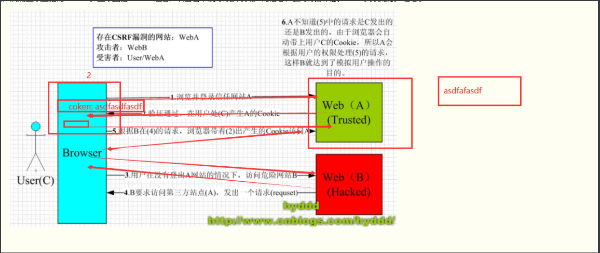

Django token 认证失败

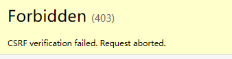


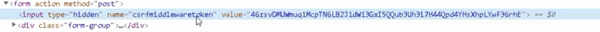

```python
token验证
标签中的token和cookie中的token进行解密，如果解密结果相同，请求就合法
每次刷新，cookie中token不会发生改变，标签中的token发生改变(后台渲染的)
```

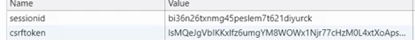


**django中csrf_token处理流程**

```python
1 在响应的页面中加入标签,那么在进行模板渲染是会生成如下标签
	<input type="hidden" name="csrfmiddlewaretoken" value="ppwN8yg1wVEyXDxtMpVIrc4zV3gHiDKKb9rwGPLaSGRc0HKhXAwpNrKjGDUHIxjj">

2 并且在响应还有这个	标签的页面时,会添加cookie键值对,如下
	csrftoken:lsMQeJgVbIKKxlfz6umgYM8WOWx1Njr77cHzM0L4xtXoApsnhFXXk1OGzwb1dd0G	

3 当用户从该页面提交数据时,会携带csrfmiddlewaretoken:ppwN8yg1wVEyXDxtMpVIrc4zV3gHiDKKb9rwGPLaSGRc0HKhXAwpNrKjGDUHIxjj和cookie键值对

4 取出cookie中的csrftoken值和请求数据部分的csrfmiddlewaretoken的值,两者进行比较,这个随机字符串叫做token字符串. django如果在请求数据部分找不到tokne值,会去请求数据中的请求行部分,找一个叫做X-CSRFToken的键值对,如果这个键对应的值和cookie中csrftoken对应的值相同,也能通过认证.
	过程:
    	token字符串的前32位是salt， 后面是加密后的token， 通过salt能解密出唯一的secret字符串。
        secret:是settings配置文件中的serect_key:
              SECRET_KEY = 's!xbzez1zxrevmq7k_89%%-z&#)e7686pyq8pg@_bp_k_2s^ho'
		django会验证表单中的token和cookie中token是否能解出同样的secret，secret一样则本次请求合法。
		如果不同就403 forbidden


```


**ajax请求通过csrftoken认证的方式**


```html
form表单提交自动提交token
<form method="post" action="/login/">
    
    用户：<input type="text" name="username" >
    密码：<input type="password" name="password" >
    <input type="submit">
</form>
生成的是一个标签
<input type="hidden" name="csrfmiddlewaretoken" value="sxVqlPTwgyNyhc4qWzebdPD5RG76HYPxxClRsVfvHc4eGkZAJKZafve713LDr0U0">


views.py
def login(request):
    if request.method == 'POST':
        print(request.POST)
        username = request.POST.get('username')
        password = request.POST.get('password')
        # 数据经历编码解码操作后接收到的数据是字符串
        if username == 'root' and password == '123':
            return HttpResponse('login!')
        else:
            ## 修改登录失败的状态码
            ret = HttpResponse('not ok!')
            ret.status_code = 400
            return ret
    if request.method == 'GET':
        return render(request, 'login.html')


方式一：请求数据中携带token
    
    用户：<input type="text" id="username">
    密码：<input type="password" id="password">
    <button type="submit" id="btn">ajax请求</button>
    <h1 id="error" style="color: red"  ></h1>
    <script src="https://cdn.bootcdn.net/ajax/libs/jquery/3.7.1/jquery.js"></script>
    <script>
        $('#btn').click(function () {
            //获取用户输入的数据
            var username = $('#username').val()
            var password = $('#password').val()
            var token = $("[name='csrfmiddlewaretoken']").val()

            $.ajax({
                type: 'POST',
                url: '/login/', //前面加/的是绝对路径
                data:{username:username,password:password,csrfmiddlewaretoken:token},
                success: function (res) {
                    // res 接受的是请求成功后响应的结果，后台返回的状态码是2xx/3xx ajax会自动调用回调函数并将接受到的响应传递给函数
                    console.log(res)
                    //登录成功
                    $('#error').text('login！')
                },
                error: function (res) {
                    // res 接受的是请求失败后响应的结果，后台返回的状态码是4xx/5xx ajax会自动调用回调函数并将接受到的响应传递给函数
                    console.log(res)
                    $("#error").text(res.responseText)
                }
            })

        })
    </script>

	
    
方式二	
    <script>
        /*  表示生成一个input的标签
         {{ csrf_token }} 生成的input标签 value对应的值
         */
        $('#btn').click(function () {
            //获取用户输入的数据
            var username = $('#username').val()
            var password = $('#password').val()
            $.ajax({
                type: 'POST',
                url: '/login/', //前面加'/'的是绝对路径
                / {{ csrf_token }} 前面要加引号，要不当做变量了
                data: {username: username, password: password, csrfmiddlewaretoken: '{{csrf_token}}'},
                success: function (res) {
                    // res 接受的是请求成功后响应的结果，后台返回的状态码是2xx/3xx ajax会自动调用回调函数并将接受到的响应传递给函数
                    console.log(res)
                    //登录成功
                    $('#error').text('login！')
                },
                error: function (res) {
                    // res 接受的是请求失败后响应的结果，后台返回的状态码是4xx/5xx ajax会自动调用回调函数并将接受到的响应传递给函数
                    console.log(res)
                    $("#error").text(res.responseText)
                }
            })

        })
    </script>


方式三：请求头中添加键值对，键必须是'X-CSRFToken',值对应的是cookie中token的值

	
    用户：<input type="text" id="username">
    密码：<input type="password" id="password">
    <button type="submit" id="btn">ajax请求</button>
    <h1 id="error" style="color: red"></h1>
    <script src="https://cdn.bootcdn.net/ajax/libs/jquery/3.7.1/jquery.js"></script>
    {#jquery-cookie $.cookie('csrftoken')失效提取不了cookie中的csrftoken#}
    <srcipt src="https://cdn.bootcdn.net/ajax/libs/jquery-cookie/1.4.1/jquery.cookie.min.js"></srcipt>
    <script>
        $('#btn').click(function () {
            var username = $('#username').val()
            var password = $('#password').val()
            $.ajax({
                type: 'POST',
                url: '/login/', 
                data: {username: username, password: password},
                headers: {
                    //使用dom对象提取cookie中的token值
                    'X-CSRFToken': document.cookie.split('=')[1],
                },
                success: function (res) {
                    console.log(res)
                    //登录成功
                    $('#error').text('login！')
                },
                error: function (res) {
                    console.log(res)
                    $("#error").text(res.responseText)
                }
            })
        })
    </script>
```

没携带token


携带token后

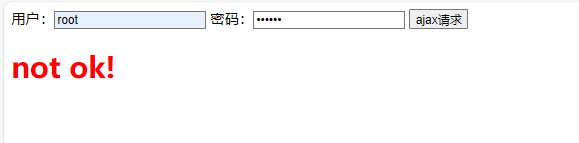
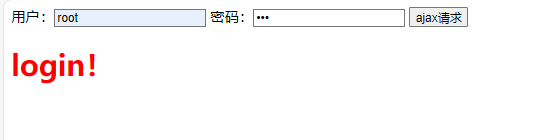


**content-type 介绍**

```python
http协议默认的请求数据为application/x-www-form-urlencoded
django可以解析的数据格式multipart/form-data  、application/x-www-form-urlencoded


但是当我们指定了请求数据格式为application/json时,发送的数据格式为:
	{a:1, b:2}  json数据

django解析不了
```

**django 解析数据大致代码**

```python
解析器:
a = requset.META['content-type']
if a == 'application/x-www-form-urlencoded':
	data = request.body  -- a=1&b=2
	l1 = data.split(&)
	for i in l1:
		k,v = i.split(=)
		request.POST[k] = v

elif a == 'multipart/form-data':  #文件片段数据格式
	request.FIELS[]
	
文件格式数据
```


**ajax 发送一个application/json格式的数据**

```python
views.py
    # request.POST 拿不到数据
    print(request.POST.dict())
    # <QueryDict: {}>
    # 需要我们自己去request.body中获取原始的bytes类型数据,然后进行解析
    data = request.body
    print(request.body)
    # b'{"username":"root","password":"12345"}'
    import json
    data = json.loads(data.decode('utf8'))
    print(data, type(data))
    # {'username': 'root', 'password': '12345'} <class 'dict'>
    
   
html
 $('#btn').click(function () {
        var username = $('#username').val()
        var password = $('#password').val()
        $.ajax({
            type: 'POST',
            url: '/login/', 
            //将data转化为json字符串
            data:JSON.stringify({username: username, password: password}),
            //修改请求数据格式
            contentType: 'application/json',
            headers: {
                //使用dom对象提取cookie中的token值
                'X-CSRFToken': document.cookie.split('=')[1],
            },
            success: function (res) {
            },
            error: function (res) {
            }
        })

    })
```


**上传文件**

```python
form 表单上传文件 
表单上传文件自动携带token

upload.html
<form method="post" action="/upload/" enctype="multipart/form-data">
    
    用户：<input type="text" name="username" >
    密码：<input type="password" name="password" >
    图像：<input type="file" name="avatar">   //添加多文件 multiple
    <input type="submit" id="btn">
</form>

views.py
def upload(request):
    if request.method == 'GET':
        return render(request, 'upload.html')
    elif request.method == 'POST':
        # 如果没有修改请求格式content-type:multipart/form-data  post能获取到文件，但仅仅只是文件名
        print(request.POST)
        # <QueryDict: {'csrfmiddlewaretoken': ['fPSbOWSzVPFPiYyFQKSbZCPApTvXCAcUkUiCV2eymtWvH6tPDVDa1iqCzg9umChn'], 'username': ['1231'], 'password': ['123123123']}>
        # 里面是文件数据(文件对象)  也可以是多文件
        print(request.FILES)
        # <MultiValueDict: {'avatar': [<InMemoryUploadedFile: girl.jpg (image/jpeg)>]}>
        # 获取到文件对象
        file_obj = request.FILES.get('avatar')
        print(file_obj.name)  # girl.jpg
        with open(file_obj.name, 'wb') as f:
            for i in file_obj:
                f.write(i)

    return HttpResponse('ok')

```

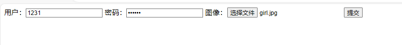

**文件在项目目录下   gril.jpg**


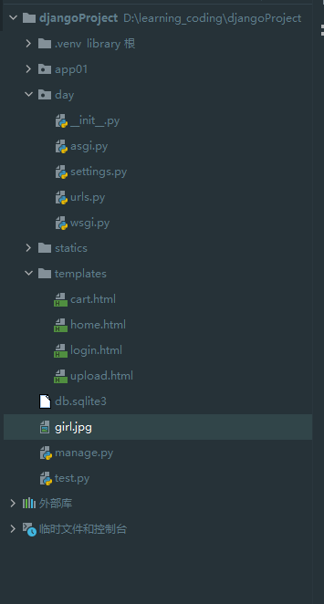


**ajax上传文件**

```python
ajax 请求不会提交token，要手动添加


<script>
    $("#sub").click(function (){
        var uname = $('[name="username"]').val();
        var pwd = $('[name="password"]').val();
        var file_obj = $('[type="file"]')[0].files[0];
        // ajax上文件,必须将文件数据放到一个叫做formdata的对象中才能发送
        var formdata = new FormData();
        formdata.append('username',uname)
        formdata.append('password',pwd)
        formdata.append('csrfmiddlewaretoken', '{{ csrf_token }}')
        formdata.append('avatar',file_obj)  // requser.FILES.get('avatar')
        $.ajax({
            url:'/upload/',
            type:'post',
            // ajax会将本次请求的数据格式改为 content-type: multipart/form-data
            data:formdata,
            // 告诉ajax不要对数据进行预处理和加工,向上传文件必须加上这两个参数
            contentType:false,
            processData: false,
            success:function (res){
                console.log(res)
            }
        })
    });

</script>
```


## 9.中间件


**django的请求周期**

```python
封装socket的wsgi接受请求，根据http协议将数据解包封装成request对象，传给中间件依次处理，然后交给路由，路由根据路径找到对应的视图，视图做业务逻辑的处理（orm数据交互，html模版渲染）返回一个响应对象，交给中间件倒序处理，wsgi将处理的数据返回给浏览器
```

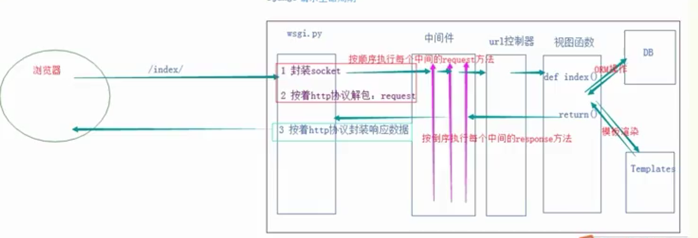

**中间件处理session校验**

```python
views.py
def login(request):
    if request.method == 'POST':
        print(request.POST)
        username = request.POST.get('username')
        password = request.POST.get('password')
        if username == 'root' and password == '123':
            request.session['is_login'] = True
            return redirect('/home/')
        else:
            return render(request, 'login.html')
    if request.method == 'GET':
        return render(request, 'login.html')

def home(request):
    return render(request, 'home.html')

def cart(request):
    data = ['python入门到入狱', 'python Django实战', 'java之父余胜军', '前端']
    return render(request, 'cart.html', {'data': data})

def logout(request):
    request.session.flush()
    return redirect('login')


在应用文件下穿件py文件
my_middleware.py
from django.shortcuts import render, redirect
from django.utils.deprecation import MiddlewareMixin

class My_middleware(MiddlewareMixin):
    # 设置白名单
    white_list = ['/login/', '/register']
    def process_request(self, request):
        path=request.path
        # 不在白名单的需要session认证
        if path not in self.white_list:
            status = request.session.get('is_login')
            # 如果不为True就不给通过
            if not status:
                return redirect('/login/')

settings.py
MIDDLEWARE=[
    'app01.my_middleware.My_middleware',
]

```


**自定义中间件**

```python

中间件：作用：对所有的请求和响应进行统一处理
自定义中间件流程：
	1.在应用文件下创建一个py文件
	2.在py文件下定义中间件
	3.在settings.py文件下加上自定义类的路径

    
中间件的几个方法
	1.process_request(self, request) 路由匹配之前
	2.process_view(self, request, view_func, view_args, view_kwargs)	  路由匹配之后，视图执行之前
	3.process_exception(self, request, exception)		捕获视图抛出的异常
	4.process_response(self,request,response)		视图函数返回响应之后调用
	5.process_template_response(self, request, response): 在渲染模板响应之前调用  用的很少

```

**process_request**
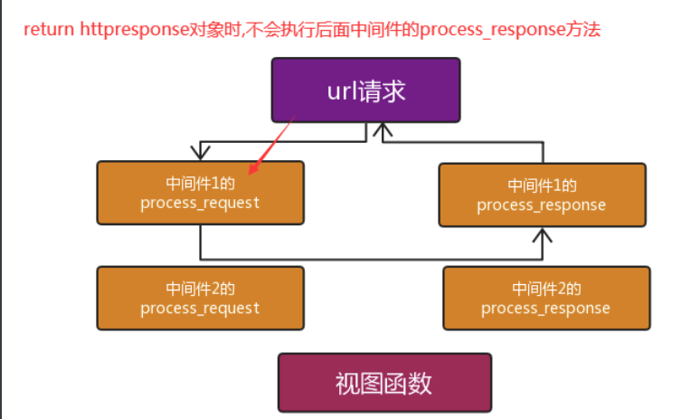

**process_response**

```python
class Md1(MiddlewareMixin):

	def process_request(self,request):

		print('Md1-process_request')
		# return HttpResponse('ok')  #如果return 的是一个HttpResponse对象,那么中间件执行到这里,直接返回
	def process_response(self,request,response):
		print('Md1-process_response')
        # return HttpResponse('ojbk')  # 如果return是httpresponse对象,那么会替换视图函数中的返回值
         #注意: 一定要return response
		return response 

class Md2(MiddlewareMixin):

	def process_request(self, request):
		print('Md2-process_request')

	def process_response(self,request,response):
		print('Md2-process_response')
		return response
```

**process_view**
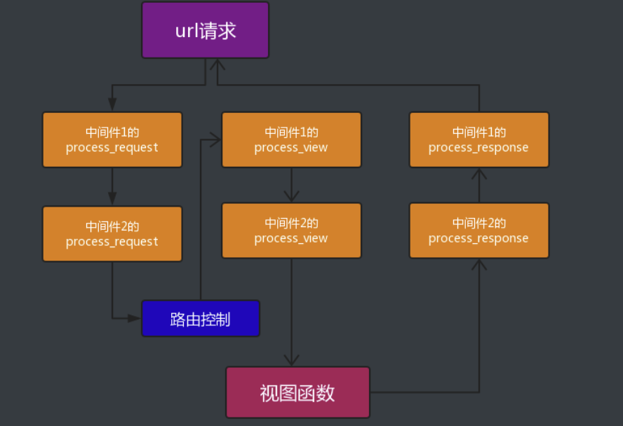

**process_exception**

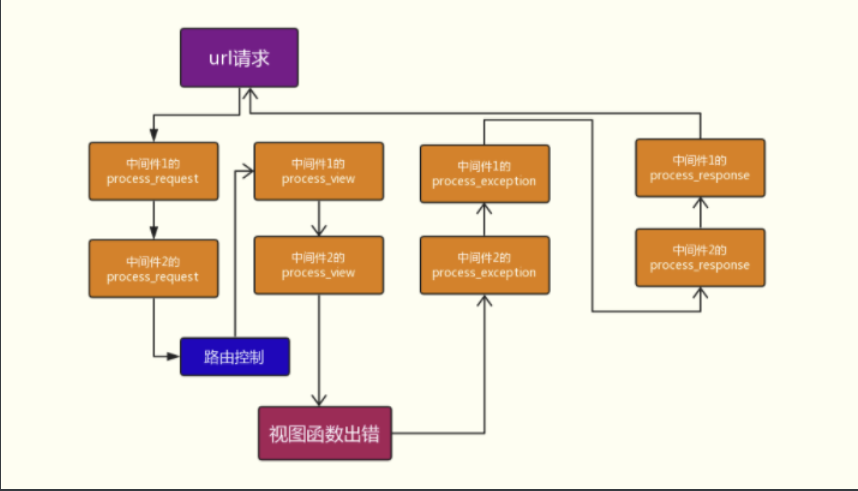


**中间件的应用场景**

```python
1、做IP访问频率限制
	某些IP访问服务器的频率过高，进行拦截，比如限制每分钟不能超过20次。
2、URL访问过滤
	设置白名单和黑名单
	如果用户访问的是login视图（放过）
	如果访问其他视图，需要检测是不是有session认证，已经有了放行，没有返回login，这样就省得在多个视图函数上写装饰器了！
```


**相关设置**

```python
获取到请求的ip地址
request.META['REMOTE_ADDR']

settings.py
#允许请求的域名  *表示所有域名
ALLOWED_HOSTS=['']

Django程序启动
python manage.py runserver 0.0.0.0:8001
```


