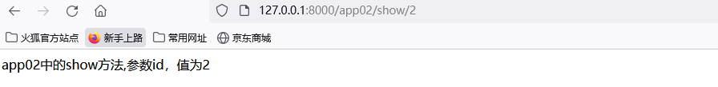

## 1. 走进Django

### 1.1  MVC模式和MTV模式

MVC模式

- 模型(Model):负责各个功能的实现，包含模型实体类和业务处理类
- 视图(View): 负责页面的显示和用户的交互
- 控制器(Controller): 用于将用户请求转发给相应的模型进行处理并返回

图示


MTV模式

- 模型(Model): 负责业务对象和数据库的关系映射(orm)
- 模板(Template): 负责页面的显示和用户的交互
- 视图(View): 负责业务逻辑的处理，并在适当的时候调用Model和Template

图示


俩者的对比


### 1.2 开发第一个Django项目

创建项目
```sql
django-admin startproject myshop
```


创建app01的应用

```shell
切换到和manage.py文件同级目录
python manage.py startapp app01
```


创建应用后再配置文件注册app应用

```python
settings.py

INSTALLED_APPS = [
    'django.contrib.admin',
    'django.contrib.auth',
    'django.contrib.contenttypes',
    'django.contrib.sessions',
    'django.contrib.messages',
    'django.contrib.staticfiles',
    
    # 注册创建的app应用
    'app01',
]
```

处理视图 app01/views.py
```sql
from django.shortcuts import render

# Create your views here.
# 定义视图函数
def index(request):
    return render(request, '1/index.html')
```

处理url myshop/url.py
```python
from django.contrib import admin
from django.urls import path
from app01 import views

urlpatterns = [
    path('admin/', admin.site.urls),

    path('index/', views.index),#访问路由，指定视图函数
]
```

创建目录和模板文件，在manage.py文件的同级目录创建一个templates目录，并在该目录下创建一个'1'目录，在创建一个index.html

```html
<!DOCTYPE html>
<html lang="en">
<head>
    <meta charset="UTF-8">
    <title>Title</title>
</head>
<body>
    <div style="color:red;font-size:24px;">你好！ django</div>
</body>
</html>
```


在全局文件中对模板目录进行注册
```python
import os
TEMPLATES = [
    {
        'DIRS': [os.path.join(BASE_DIR,'templates')],
    }
]
```

运行程序
```python
python manage.py runserver
```


## 2. 网站的入口-Django的路由和视图

#### 2.1 路由

- 路由系统的基本配置
  myshop/url.py

  ```python
  from django.contrib import admin
  from django.urls import path
  from app01 import views
  
  #该urlpatterns列表定义的路由为整个项目的根路由
  urlpatterns = [
      path('admin/', admin.site.urls),#默认路由
  
      path('index/', views.index),#访问路由，指定视图函数
  ]
  
  #path(路由,视图,别名)
  ```

- 路由包含，简化项目复杂度
  随着业务增多，路由规则越来越复杂，可以为每个应用创建一个urls.py文件，把相关的路由配置放在每个应用的url.py文件中

  1. 路由匹配规则
     项目的urls.py文件中，urlpatterns列表会从上到下进行匹配

     - 匹配成功，调用path()函数的第2个参数指定的视图，且不会继续向下匹配
     - 匹配失败，返回404
     - 如果应用中定义了子路由，根路由使用include('应用名.urls')来加载子路由，如果url第一部分被匹配，其余部分在子路由中进行匹配。

  2. 示例
     myshop/urls.py

     ```PYTHON
     from django.contrib import admin
     from django.urls import path, include
     from app01 import views
     
     urlpatterns = [
         path('admin/', admin.site.urls),
     
         path('index/', views.index),#访问路由，指定视图函数
         path('',include('app01.urls')),
         path('',include('app02.urls'))
     ]
     ```

     app02/urls.py
     ```python
     from django.urls import path
     from app02 import views
     
     urlpatterns = [
         path('app02/index/', views.index)
     ]
     ```

     app02/views.py
     ```python
     from django.http import HttpResponse
     from django.shortcuts import render
     
     
     # Create your views here.
     def index(request):
         return HttpResponse('app02中的index方法')
     ```

     运行结果
     

- 解析路由参数

  1. 编写url带参数的路由
     app02/urls.py

     ```python
     urlpatterns = [
         path('app02/show/<int:id>', views.show)
     ]
     ```

     app02/views.py

     ```
     def show(request, id):
         return HttpResponse('app02中的show方法,参数id，值为' + str(id))
     ```

     运行结果
     

  2. url参数
     语法格式

     ```python
     <参数数据类型 : 参数名称>
     ```

     数据类型
     

  3. 示例
     app02/views.py

     ```python
     urlpatterns = [
         path('app02/article/<uuid:u>', views.show_uuid),
         path('app02/article/<slug:s>', views.show_slug),
     ]
     ```

     app02/views.py

     ```python
     def show_uuid(request, u):
         return HttpResponse('app02中的show方法,参数u，值为' + str(u))
     
     
     def show_slug(request, s):
         return HttpResponse('app02中的show方法,参数s，值为' + str(s))
     ```

     运行过程
     

     
     

  4. re_path()方法正则匹配复杂路由
     
