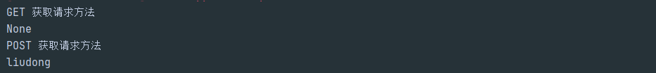
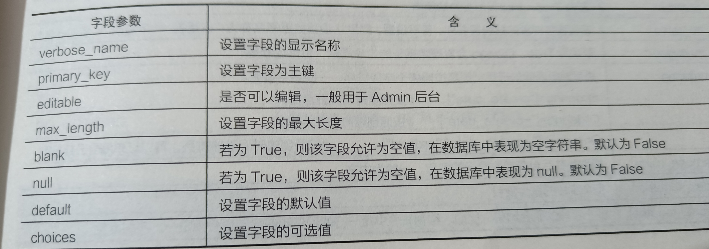
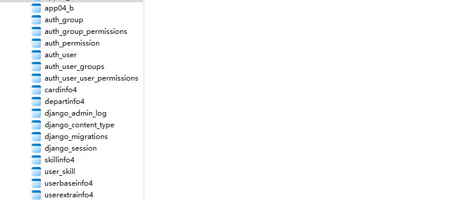

[TOC]

## 1. 走进Django

### 1.1  MVC模式和MTV模式

MVC模式

- 模型(Model):负责各个功能的实现，包含模型实体类和业务处理类
- 视图(View): 负责页面的显示和用户的交互
- 控制器(Controller): 用于将用户请求转发给相应的模型进行处理并返回

图示


MTV模式

- 模型(Model): 负责业务对象和数据库的关系映射(orm)
- 模板(Template): 负责页面的显示和用户的交互
- 视图(View): 负责业务逻辑的处理，并在适当的时候调用Model和Template

图示


俩者的对比


### 1.2 开发第一个Django项目

创建项目
```sql
django-admin startproject myshop
```


创建app01的应用

```shell
切换到和manage.py文件同级目录
python manage.py startapp app01
```


创建应用后再配置文件注册app应用

```python
settings.py

INSTALLED_APPS = [
    'django.contrib.admin',
    'django.contrib.auth',
    'django.contrib.contenttypes',
    'django.contrib.sessions',
    'django.contrib.messages',
    'django.contrib.staticfiles',
    
    # 注册创建的app应用
    'app01',
]
```

处理视图 app01/views.py
```sql
from django.shortcuts import render

# Create your views here.
# 定义视图函数
def index(request):
    return render(request, '1/index.html')
```

处理url myshop/url.py
```python
from django.contrib import admin
from django.urls import path
from app01 import views

urlpatterns = [
    path('admin/', admin.site.urls),

    path('index/', views.index),#访问路由，指定视图函数
]
```

创建目录和模板文件，在manage.py文件的同级目录创建一个templates目录，并在该目录下创建一个'1'目录，在创建一个index.html

```html
<!DOCTYPE html>
<html lang="en">
<head>
    <meta charset="UTF-8">
    <title>Title</title>
</head>
<body>
    <div style="color:red;font-size:24px;">你好！ django</div>
</body>
</html>
```


在全局文件中对模板目录进行注册
```python
import os
TEMPLATES = [
    {
        'DIRS': [os.path.join(BASE_DIR,'templates')],
    }
]
```

运行程序
```python
python manage.py runserver
```


## 2. 网站的入口-Django的路由和视图

### 2.1 路由

- 路由系统的基本配置
  
  myshop/url.py
  
  ```python
  from django.contrib import admin
  from django.urls import path
  from app01 import views
  
  #该urlpatterns列表定义的路由为整个项目的根路由
  urlpatterns = [
      path('admin/', admin.site.urls),#默认路由
  
      path('index/', views.index),#访问路由，指定视图函数
  ]
  
  #path(路由,视图,别名)
  ```
  
  
  
- 路由包含，简化项目复杂度
  
  随着业务增多，路由规则越来越复杂，可以为每个应用创建一个urls.py文件，把相关的路由配置放在每个应用的url.py文件中
  
  1. 路由匹配规则
     项目的urls.py文件中，urlpatterns列表会从上到下进行匹配
  
     - 匹配成功，调用path()函数的第2个参数指定的视图，且不会继续向下匹配
     - 匹配失败，返回404
     - 如果应用中定义了子路由，根路由使用include('应用名.urls')来加载子路由，如果url第一部分被匹配，其余部分在子路由中进行匹配。
  
  2. 示例
     myshop/urls.py
  
     ```PYTHON
     from django.contrib import admin
     from django.urls import path, include
     from app01 import views
     
     urlpatterns = [
         path('admin/', admin.site.urls),
     
         path('index/', views.index),#访问路由，指定视图函数
         path('',include('app01.urls')),
         path('',include('app02.urls'))
     ]
     ```
  
     app02/urls.py
     ```python
     from django.urls import path
     from app02 import views
     
     urlpatterns = [
         path('app02/index/', views.index)
     ]
     ```
  
     app02/views.py
     ```python
     from django.http import HttpResponse
     from django.shortcuts import render
     
     
     # Create your views here.
     def index(request):
         return HttpResponse('app02中的index方法')
     ```
  
     运行结果
     
     
     
  
- re_path()方法正则匹配复杂路由
  语法格式
  
  ```python
  (?P<name>pattern)
  
  name是匹配的字符串名称
  pattern是要匹配的模式
  ```
  
  示例
  app02/urls.py

  ```python
  from django.urls import path, re_path
  from app02 import views
  
  urlpatterns = [
      re_path(r'app02/list/(?P<year>\d{4})', views.article_list),
      re_path(r'app02/page/(?P<page>\d+)&key=(?P<key>\w+)', views.article_list),
  ]
  ```
  
  app02/views.py
  
  ```python
  def article_list(request, year):
      return HttpResponse('app02中的article_list方法,参数year，值为' + str(year))
  
  
  def article_page(request, page, key):
      return HttpResponse('app02中的article_page方法,参数page,key，值为' + str(page) + ':' + str(key))
  ```

  运行结果
  
  
  
  
- 解析路由参数

  1. 编写url带参数的路由
     app02/urls.py

     ```python
     urlpatterns = [
         path('app02/show/<int:id>', views.show)
     ]
     ```

     app02/views.py

     ```
     def show(request, id):
         return HttpResponse('app02中的show方法,参数id，值为' + str(id))
     ```

     运行结果
     

  2. url参数
     语法格式

     ```python
     <参数数据类型 : 参数名称>
     ```

     数据类型
     

  3. 示例
     app02/views.py

     ```python
     urlpatterns = [
         path('app02/article/<uuid:u>', views.show_uuid),
         path('app02/article/<slug:s>', views.show_slug),
     ]
     ```

     app02/views.py

     ```python
     def show_uuid(request, u):
         return HttpResponse('app02中的show方法,参数u，值为' + str(u))
     
     
     def show_slug(request, s):
         return HttpResponse('app02中的show方法,参数s，值为' + str(s))
     ```

     运行过程
     

     
     

- 反向解析路由
  在路由配置中，给路由命名，然后在视图和模板中反向解析出url，只要name不变，url可以任意改变
  app02/urls.py

  ```python
  urlpatterns = [
      path('app02/url_reverse/',views.url_reverse,name='app02_url_reverse'),
  ]
  ```

  app02/views.py
  ```python
  from django.http import HttpResponse
  from django.shortcuts import render
  from django.urls import reverse
  
  def url_reverse(request):
      # 使用reverse()方法反向解析
      print(reverse('app02_url_reverse'))
      return render(request,'2/url_reverse.html')
  ```

  运行结果

  
  


### 2.2 视图

1. 请求对象
   主要的方法和属性
   

   app02/urls.py
   ```python
   from django.urls import path, re_path
   from app02 import views
   
   urlpatterns = [
       re_path(r'app02/test_get', views.test_get)
   ]
   ```

   app02/views.py
   ```python
   def test_get(request):
       print(request.get_host(),'域名+端口')
       print(request.get_raw_uri(),'全部路径，包含参数')
       print(request.path,'访问路径，不包含参数')
       print(request.get_full_path(),'访问路径，包含参数')
       print(request.method,'获取请求方式')
       print(request.GET,'获取get请求参数')
       print(request.META['REMOTE_ADDR'],'客户端ip地址')
       print(request.GET.get('key'), '获取key参数')
       return HttpResponse('ok')
   ```

   浏览器输入http://127.0.0.1:8000/app02/test_get?key=2

   
   

   app02/urls.py
   ```python
   urlpatterns = [
       re_path(r'app02/test_post', views.test_post)
   ]
   ```

   app02/views.py
   ```python
   def test_post(request):
       print(request.method,'获取请求方法')
       print(request.POST.get('username'))
       return render(request, '2/test_post.html')
   ```

   
   
2. 响应对象
   每个视图都会返回一个响应对象，该对象包含客户端的所有数据

   | 属性         | 含义                                |
   | ------------ | ----------------------------------- |
   | content      | 返回的内容                          |
   | status_code  | 返回的http响应状态码                |
   | content-type | 返回数据的mime类型，默认为text/html |

   app02/urls.py
   ```python
   urlpatterns = [
       path('app02/test_response', views.test_response)
   ]
   ```

   app02/views.py
   ```python
   def test_response(request):
       response = HttpResponse('hello Django!')
       response.write('<br>')
       response.write(response.content)  # 写入返回的内容
       response.write('<br>')
       response.write(response['Content-Type'])
       response.write('<br>')
       response.write(response.charset)
       response.write('<br>')
       return response
   ```

   运行结果
   

3. 视图处理函数的使用

   - render( )函数实现的页面渲染

     ```python
     根据模版文件和传递的上下文字典对象，生成一个HttpResponse对象并返回
     
     from django.shortcuts import render
     render( request,template_name,context)
     
     request :请求对象
     template_name: 渲染的模版文件
     context ： 上下文字典对象，传递个模板的数据
     ```

     

   - redirect() 函数实现页面重定向

     1. 路由反解析重定向
        app02/views.py

        ```python
        def test_redirect(request):
            return redirect('app02_url_reverse')
        ```

        app02/urls.py

        ```python
        urlpatterns = [
            path('app02/test_redirect', views.test_redirect),
        ]
        ```

        

     2. 传入一个绝对的url
        ```python
        def test_redirect(request):
            return redirect('https://www.baidu.com')
        ```

        

4. 视图类
   视图类将每个方法的处理逻辑变成视图类中的单个方法，使得程序的逻辑变得更加简单清晰

   1. 视图类的使用-View

      app02/views.py

      ```python
      from django.views import View
      
      
      class IndexPageView(View):
          def get(self, request):
              return HttpResponse('get请求')
      
          def post(self, request):
              return HttpResponse('post请求')
      ```

      app02/urls.py

      ```python
      from app02.views import IndexPageView
      urlpatterns = [
          path('app02/index', views.IndexPageView.as_view())
      ]
      ```

   2. 通用视图类 --TemplateView 
      app02/views_class.py

      ```python
      from django.views.generic import TemplateView
      
      
      class TestTemplateView(TemplateView):
          # 设置模版文件
          template_name = '2/test_template.html'
      
          # 重写父类方法
          def get_context_data(self, **kwargs):
              context = super().get_context_data()
              context['info']='该变量可以传递到模板'
              return context
      ```

      app02/urls.py

      ```python
      from app02.views_class import TestTemplateView
      
      urlpatterns = [
          path('app02/test_template', TestTemplateView.as_view())
      ]
      ```

      运行结果
      

   3. 列表视图类-ListView
      将数据表的数据以列表的形式展现
   
   4. 详细视图类-DetailView
      将数据表的数据以详细视图展示


## 3. 页面展现-基于Django模版

Django模版技术可以分为俩部分

- 静态部分，html、css、javascript
- 动态部分，DJango模版语言包括模板变量、模板标签、模板过滤器

### 3.1 模板语言

1. 模板变量


   可以看作html文件中的占位符，当Django模板执行时，会使用模板变量实际值对其进行替换

   模板变量表示
   ```python
   {{变量名}}
   模板变量可以是字典、列表、类对象
   ```

   示例
   ```python
   app03/urls.py
   from django.urls import path, include
   from app03 import views
   
   urlpatterns = [
       path('app03/var', views.var),
   ]
   
   
   app03/views.py
   from django.shortcuts import render
   
   # Create your views here.
   def var(request):
       lists = ['Java', 'Python', 'C', 'C#', 'Javascript']  # 列表对象
       dicts = {'name': 'liudong', 'age': '18', 'sex': 'male'}  # 字典对象
       context = {'lists': lists, 'dicts': dicts}
       return render(request, '3/var.html', context=context)
   ```

   3/var.html

   ```html
   <!DOCTYPE html>
   <html lang="en">
   <head>
       <meta charset="UTF-8">
       <title>Title</title>
   </head>
   <body>
   {{ lists }}
   <table border="1">
       <tr>
           <td>{{ lists.0 }}</td>
           <td>{{ lists.1 }}</td>
           <td>{{ lists.2 }}</td>
           <td>{{ lists.3 }}</td>
           <td>{{ lists.4 }}</td>
       </tr>
   </table>
   {{ dicts }}
   <table border="1">
       <tr>
           <td>{{dicts.name }}</td>
           <td>{{dicts.age }}</td>
           <td>{{dicts.sex }}</td>
       </tr>
   </table>
   </body>
   </html>
   ```

   


2. 模版标签
   用

   常见模版标签
   

   循环模板标签
   

   示例
   app03/views.py

   ```python
   def for_label(request):
       lists = ['Java', 'Python', 'C', 'C#', 'Javascript']
       return render(request, '3/for_label.html', {'lists': lists})
   ```

   app03/urls.py
   ```python
   urlpatterns = [
       path('app03/for_label', views.for_label),
   ]
   ```

   3/for_label.html

   ```html
   <!DOCTYPE html>
   <html lang="en">
   <head>
       <meta charset="UTF-8">
       <title>Title</title>
   </head>
   <body>
   {{ lists }}
   <hr>
   
       {{ li }}
   
       {{ 当可迭代对象为空 }}
   
   
   <hr>
   
       {{ li }} 当前索引{{ forloop.counter }}
       <br>
   
       {{ 当可迭代对象为空 }}
   
   
   </body>
   </html>
   ```

   运行结果
   

3. 模板过滤器
   语法格式

   ```shell
   {{变量名|过滤器:参数}}
   ```

   常用过滤器
   

   示例
   app03/views.py

   ```python
   from datetime import datetime
   def filter(request):
       str1 = 'abcdefg'
       str2 = 'ABCDEFG'
       slice_str = '1234567890'
       time_str = datetime.now()
       return render(request, '3/filter.html', {'str1': str1, 'str2': str2, 'time_str': time_str})
   ```

   app03/urls.py

   ```python
   urlpatterns = [
       path('app03/filter', views.filter),
   ]
   ```

   filter.html

   ```html
   <!DOCTYPE html>
   <html lang="en">
   <head>
       <meta charset="UTF-8">
       <title>Title</title>
   </head>
   <body>
   小写转大写 {{ str1|upper }}<hr>
   大写转小写 {{ str2|lower }}<hr>
   切片操作 {{ slice_str|slice:'2:4' }}<hr>
   时间格式化 {{ time_str|date:'Y-m-d G:i:s' }}
   </body>
   </html>
   ```

   运行结果
   

### 3.2 模板高级用法

1. 模板转义
   Django模板会对 *html* 标签和 *javascript* 标签进行转义，为了代码安全，避免用户提交了攻击性代码
   app03/views.py

   ```python
   def html_filter(request):
       html_ddr = '<h1>大大大<h2>小小</h2></h1>'
       html_javascript = '<script>document.write("js脚本写入")</script>'
       return render(request, '3/html_filter.html', {'html_ddr': html_ddr, 'html_javascript': html_javascript})
   
   ```

   app03/url.py
   ```python
   urlpatterns = [
       path('app03/html_filter', views.html_filter),
   ]
   ```

   htnl_filter.html
   ```html
   <!DOCTYPE html>
   <html lang="en">
   <head>
       <meta charset="UTF-8">
       <title>Title</title>
   </head>
   <body>
   关闭模版转义 {{ html_ddr }}
   开启模版转义 {{ html_ddr|safe }}
   <hr>
   关闭模版转义 {{ html_javascript }}
   <br>
   开启模版转义 {{ html_javascript|safe }}
   </body>
   </html>
   ```

   运行结果

   
   
2. 自定义过滤器

   - 准备工作 在app03应用下创建templatetags包
     

   - 编写自定义过滤器
     myfilter.py

     ```python
     from django import template
     
     register = template.Library()
     
     
     # 自定义过滤器
     @register.filter
     def show_title(val):
         if len(val) > 0:
             return f'{val}，哈哈被自定义过滤器修改了'
         else:
             return val
     ```

     app03/views.py
     ```python
     def div_filter(request):
         str1 = '你好，Django！'
         return render(request, '3/div_filter.html', {'str1': str1})
     ```

     div_filter.html

     ```html
      #装载对应文件
     <!DOCTYPE html>
     <html lang="en">
     <head>
         <meta charset="UTF-8">
         <title>Title</title>
     </head>
     <body>
     {{ str1| show_title }}
     </body>
     </html>
     ```

     
     

3. 实现自定义标签

   - 简单标签

     myfilter.py

     ```python
     @register.simple_tag
     def add_num(val, n):
         return val + n
     ```

     app03/views.py

     ```python
     def add_num(request):
         lists=[1,2,3,4,5,6,7,8]
         return render(request, '3/add_num.html',{'lists': lists})
     ```

     add_num.html

     ```html
     
     <!DOCTYPE html>
     <html lang="en">
     <head>
         <meta charset="UTF-8">
         <title>Title</title>
     </head>
     <body>
     
     </body>
     </html>
     ```

     运行结果
     

   - 包含标签
     myfilter.py

     ```python
     @register.inclusion_tag('3/show_info_tags.html') # 指定渲染的模板
     def show_info_tags():
         dict1={'title':'小鸟伏特加'}
         return {'dict1':dict1}
     ```

     app03/views.py
     ```python
     def show_info(request):
         return render(request, '3/show_info.html')
     ```

     html

     ```html
     show_info_tags.html
     
     <!DOCTYPE html>
     <html lang="en">
     <head>
         <meta charset="UTF-8">
         <title>Title</title>
     </head>
     <body>
     {{ dict1 }}
     {{ dict1.title }}
     </body>
     </html>
     
     
     
     show_info.html
     
      
     <!DOCTYPE html>
     <html lang="en">
     <head>
         <meta charset="UTF-8">
         <title>Title</title>
     </head>
     <body>
     <p>当前文件时show_info</p>
     <p>下面是另一个模板文件加载的</p>
     
     </body>
     </html>
     ```

     运行结果
     

     

4. 模板继承

   - 母版页
     ```html
     <html>
         <head></head>
         
         <title>这是母版页</title>
         
         <body>
             <table border="1" style="width: 700px;">
                 <tr><td colspan="2" style="height:30px;text-align: center;">这是TOP区域，一般用于导航</td></tr>
                 <tr style="vertical-align:middle;height:300px;">
                     <td style="width:200px;">这是左边的菜单</td>
                     <td style="width: 500px;">
                         
                         这个区域随着不同的内容页的变化而变化
                         
                     </td>
                 </tr>
                 <tr><td colspan="2" style="height:30px;text-align: center;">这是版权区域</td></tr>
             </table>
         </body>
     </html>
     ```

     
     
   - 内容页
     ```hrml
       #继承base,html ,并替换相关内容
     
     <title>这是欢迎页</title>
     
     
     
     <div style="text-align: center;">欢迎来到我的特色小店</div>
     
     ```
   
     
     
   
5. 模板组件
   base_include.html

   ```html
   <html>
       <head></head>
       
       <title>这是母版页</title>
       
   
       <body>
           <table border="1" style="width: 700px;">
               <tr><td colspan="2" ></td></tr>
               <tr style="vertical-align:middle;height:300px;">
                   <td style="width:200px;">这是左边的菜单</td>
                   <td style="width: 500px;">
                       
                       这个区域随着不同的内容页的变化而变化
                       
                   </td>
               </tr>
               <tr><td colspan="2" style="height:30px;text-align: center;"></td></tr>
           </table>
       </body>
   </html>
   ```

   top.html
   ```html
   <table border="1" style="width:100%;">
       <tr><td style="height:30px;text-align: center;">这是TOP区域，使用include方式引用</td></tr>
   </table>
   ```

   footer.html

   ```html
   <table border="1" style="width: 100%;">
       <tr><td style="height:30px;text-align: center;">这是版权区域，使用include引用</td></tr>
   </table>
   ```

   
   
6. 配置静态文件

   - static：css、javascript、html、images
   - media：媒体文件，用户上传的文件

   setting.py
   ```python
   STATICFILES_DIRS=[os.path.join(BASE_DIR, 'statics')]
   STATIC_URL = '/static/'
   ```

   

## 4. 数据库-基于Django模型

一个模型对应一个数据库表，模型字段对应数据库表中的字段

### 1. Django模型

- 定义模型
  app04/models.py

  ```python
  from django.db import models
  from django.utils import timezone
  
  
  class UserBaseInfo(models.Model):
      id = models.AutoField(verbose_name='编号', primary_key=True)
      username = models.CharField(verbose_name='用户名称', max_length=30)
      password = models.CharField(verbose_name='密码', max_length=20)
      status = models.CharField(verbose_name='状态', max_length=1)
      createdate = models.DateTimeField(verbose_name='创建日期', db_column='createDate')
  
      def __str__(self):
          return self.username
  
      class Meta:
          managed = True #数据库迁移的操作
          verbose_name = '人员基本信息' #后台管理系统显示的名称
          db_table = 'UserBaseInfo4' #设置的数据表
  ```

- 常见模型字段
  

  事件日期字段
  ```python
  auto_now_add 创建时间
  auto_now 修改时间
  
  一旦设置为true，则无法在程序中手动为字段进行赋值
  ```

- 常见字段参数
  

  

- Meta类
  

  

### 2. 模型的关系

- 一对一
  人员和人员扩展表

  ```python
  OneToOneField()
  
  to 要关联的模型名称
  to_field 要关联的表中字段名称
  on_delete 删除关联表时配置选项
  ```

  on_delete 配置项
  

  ```python
  from django.db import models
  from django.utils import timezone
  
  
  class UserBaseInfo(models.Model):
      id = models.AutoField(verbose_name='编号', primary_key=True)
      username = models.CharField(verbose_name='用户名称', max_length=30)
      password = models.CharField(verbose_name='密码', max_length=20)
      status = models.CharField(verbose_name='状态', max_length=1)
      createdate = models.DateTimeField(verbose_name='创建日期', db_column='createDate')
  
      def __str__(self):
          return self.username
  
      class Meta:
          managed = True #数据库迁移的操作
          verbose_name = '人员基本信息' #后台管理系统显示的名称
          db_table = 'UserBaseInfo4' #设置的数据表
  
  
  class UserExtraInfo(models.Model):
      id = models.AutoField(verbose_name='编号', primary_key=True)
      username = models.CharField(verbose_name='用户名称', max_length=30)
      truename = models.CharField(verbose_name='真实姓名', max_length=30)
      sex = models.IntegerField(verbose_name='性别')
      salary = models.DecimalField(verbose_name='薪水', max_digits=8, decimal_places=2)
      age = models.IntegerField(verbose_name='年龄', )
      department = models.CharField(verbose_name='部门', max_length=20)
      status = models.CharField(verbose_name='状态', max_length=1)
      createdate = models.DateTimeField(verbose_name='创建日期', db_column='createDate')
      memo = models.TextField(verbose_name='备注', blank=True, null=True)
      # 一对一关联
      user = models.OneToOneField(UserBaseInfo, on_delete=models.CASCADE)
  
      def __str__(self):
          return str(self.id)
  
      class Meta:
          managed = True
          verbose_name = '人员扩展信息'
          db_table = 'UserExtraInfo4'
  ```

- 一对多
  人员和所属部门

  ```python
  使用foreign key 构建一对多的关系
  ```

  参数
  

  app04/models.py
  ```python
  class DepartInfo(models.Model):
      id=models.AutoField(verbose_name='编号',primary_key=True)
      departname = models.CharField(verbose_name='部门名称',max_length=30)
      createdate = models.DateTimeField(verbose_name='创建日期',db_column='createDate', default=timezone.now)
  
      def __str__(self):
          return str(self.id)
  
      class Meta:
          managed=True
          verbose_name='部门信息'
          db_table = 'DepartInfo4'
          
  class UserExtraInfo(models.Model):
      id = models.AutoField(verbose_name='编号', primary_key=True)
      username = models.CharField(verbose_name='用户名称', max_length=30)
      truename = models.CharField(verbose_name='真实姓名', max_length=30)
      sex = models.IntegerField(verbose_name='性别')
      salary = models.DecimalField(verbose_name='薪水', max_digits=8, decimal_places=2)
      age = models.IntegerField(verbose_name='年龄', )
      department = models.CharField(verbose_name='部门', max_length=20)
      status = models.CharField(verbose_name='状态', max_length=1)
      createdate = models.DateTimeField(verbose_name='创建日期', db_column='createDate')
      memo = models.TextField(verbose_name='备注', blank=True, null=True)
      user = models.OneToOneField(UserBaseInfo, on_delete=models.CASCADE)
  
      # 返回俩张关联表的外键
      depart = models.ForeignKey(DepartInfo, on_delete=models.DO_NOTHING())
  
      def __str__(self):
          return str(self.id)
  
      class Meta:
          managed = True
          verbose_name = '人员扩展信息'
          db_table = 'UserExtraInfo4'
  ```

- 多对多
  技能和人员

  ```python
  ManyToManyField()
  to 要关联的模型名称
  db_constraint  是否在数据库中创建外键约束
  db_table   创建多对多关系表的表名
  ```

  app04/models.py
  ```python
  class SkillInfo(models.Model):
      id = models.AutoField(verbose_name='编号', primary_key=True)
      skillname = models.CharField(verbose_name='特长', max_length=30)
      createdate = models.DateTimeField(verbose_name='创建日期', db_column='createDate')
      # 创建多对多关系
      user = models.ManyToManyField(UserBaseInfo, db_table="user_skill")
  
      def __str__(self):
          return str(self.id)
  
      class Meta:
          managed = True
          verbose_name = '特长信息'
          db_table = 'SkillInfo4'
  ```


### 3. 配置和迁移数据

- 配置项目文件
  数据库信息

  ```python
  DATABASES = {
      'default': {
          'ENGINE': 'django.db.backends.mysql',
          'NAME': 'my_shop',
          'USER': 'root',
          'PASSWORD': '678846',
          'HOST': 'localhost',
          'PORT': '3306',
          # 取消外键约束，否则多对多模型迁移报django.db.utils.IntegrityError: (1215, 'Cannot add foreign key constraint')
          'OPTIONS': {
              "init_command": "SET foreign_key_checks = 0;",
              'charset': 'utf8'
          },
      }
  }
  ```

  配置日志

  ```python
  输出orm转化输出的sql语句
  
  LOGGING = {
      'version': 1,
      'disable_existing_loggers': False,
      'handlers': {
          'console': {
              'level': 'DEBUG',
              'class': 'logging.StreamHandler',
          },
      },
      'loggers': {
          'django.db.backends': {
              'handlers': ['console'],
              'propagate': True,
              'level': 'DEBUG',
          },
      }
  }
  ```

  myshop/__init__.py
  ```python
  import pymysql
  pymysql.install_as_MySQLdb()
  ```

- 迁移数据
  生成迁移文件

  ```python
  python manage.py makemigrations
  ```

  
  执行迁移

  ```python
  python manage.py migrate
  ```

  
  

### 4. orm操作数据库

模型类和数据表进行了映射
	类：数据库中的数据表

​	属性：数据表中的字段

​	实例：数据表中的数据行

- Queryset对象
  查询集：表示的是从数据库中获取的数据对象的集合。特点是惰性执行
  惰性执行：创建查询集后不会访问数据库，而是调用相关的方法才会访问数据库

  ```python
  queryset=Userbaseinfo.object.all() #没有对数据库进行访问
  for user in queryset:
      print(user.username) #开始操作数据库
  ```

  1. all( )方法 获取所有数据，返回queryset对象
  2. filter( )方法 实现数据过滤功能
  3. get( )方法 以模型对象返回一条符合要求的数据
  4. exclude( ) 排除符合条件的数据，返回queryset对象
  5. values( ) 提取需要的字段，返回queryset对象包含字段和值形成的字段
  6. distinct( ) 取出重复数据，返回queryset对象

  **filter、exclude可以使用大于、小于、模糊匹配等操作符**

  


- 操作数据

  1. 查询数据
     all、filter、get
  2. 新增数据
     模型实例对象save()方法、模型类对象的create()方法
  3. 更新数据
     模型实例对象save()方法、模型类对象的update()方法
  4. 删除数据
     delete()

- 关联表操作

  正向查询用属性，反向查询用表名小写。关联字段在那张表，通过该表查询另外的表就是正向查询

- F和Q查询
  F查询：表单字段的各种运算操作
  Q查询：多条件查询

- 执行原生sql语句

  1. 管理器的raw方法
     ```python
     django.db.models.Manager.raw('sql')
     ```

  2. 创建游标对象
     ```python
     from django.db import connection
     cursor=connection.cursor()
     cursor.excute('sql')
     cursor.close()
     ```

     


## 5. 自动生成界面-基于Django的表单

### 1. HTML表单

表单是一个包含表单元素的区域，主要的功能就是收集用户提交的信息

- *常见表单标签*

  | 标签                    | 说明             |
  | ----------------------- | ---------------- |
  | <form>                  | 表单标签         |
  | <input type='text'>     | 文本标签框       |
  | <input type='password'> | 密码输入框       |
  | <input type='radio'>    | 单选框标签       |
  | <input type='checkbox'> | 复选框标签       |
  | <input type='button'>   | 按钮标签         |
  | <input type='submit'>   | 提交按钮标签     |
  | <input type='reset'>    | 重置按钮标签     |
  | <input type='file'>     | 文件上传标签     |
  | <textarea>              | 多行文本框标签   |
  | <label>                 | 显示文本标签     |
  | <select>                | 下拉列表标签     |
  | <option>                | 下拉列表中的选项 |

  示例:

  ```html
  <form name='f1' action='' method='get'>
      用户名:<input type='text' name='username'>
      <br>
      用户名:<input type='text' name='username'>
  </form>
  
  name:表单名称
  method:表单的提交方式
  action:指定表单提交的地址
  ```

- 令牌 *csrf* 保证表单的安全
  csrf 令牌 是Django为了防止网站跨站请求伪造而默认开启的保护机制
  settings.py

  ```python
  MIDDLEWARE = [
      'django.middleware.csrf.CsrfViewMiddleware',
  ]
  ```

- 用HTML表单上传文件
  5/upload.html

  ```html
  <form enctype="multipart/form-data" action="" method="post">
      
      <input type="file" name="myfile" />
      <br/>
      <input type="submit" value="upload"/>
   </form>
  ```

  app05/views.py

  ```
  import os
  from django.http import HttpResponse
  from django.shortcuts import render
  
  
  # Create your views here.
  def upload_file(request):
      if request.method == 'GET':
          return render(request, '5/upload.html')
      if request.method == 'POST':
          # 获取上传的文件,没有文件就返回None
          myfile = request.FILES.get('myfile', None)
          if myfile:
              # 二进制文件的写入
              path = 'media/upload/'
              if not os.path.exists(path):
                  os.makedirs(path)
              with open(path + myfile.name, 'wb+') as f:
                  # 分块写入文件
                  for i in myfile.chunks():
                      f.write(i)
              return HttpResponse('文件上传完成！')
          # 没有上传文件
          else:
              return HttpResponse('文件没有上传！')
  ```

  运行结果
  

  

  

### 2.  Django的Form表单

表单类被定义在每个应用目录下的forms.py文件下
app05/form.py

```python
from django import forms


class UserInfoForm(forms.Form):
    '''用户状态'''
    STATUS = ((None, '请选择'), (0, '正常'), (1, '无效'),)
    username = forms.CharField(label="用户名", min_length=6,
                               widget=forms.widgets.TextInput(
                                   attrs={'class': 'form-control', 'placeholder': "请输入用户名"}))
    password = forms.CharField(label="密码", min_length=6, max_length=10,
                               widget=forms.widgets.PasswordInput(attrs={"class": "password"}, render_value=True))
    age = forms.IntegerField(label="年龄", initial=1)
    mobile = forms.CharField(label="手机号码")
    status = forms.ChoiceField(label="用户状态", choices=STATUS)
    # createdate=forms.DateTimeField(label="创建时间",required=False)
```

- 表单常用字段

  | 表单字段         | 说明                               |
  | ---------------- | ---------------------------------- |
  | CharField        | 字符类型字段，页面上显示文本输入框 |
  | InterField       | 数字类字段，页面上显示数字输入框   |
  | ChoiceField      | 选中属性字段，页面上显示下拉框标签 |
  | FileField        | 文件属性字段，页面上显示文件域标签 |
  | DateField        | 日期属性字段，自动检验日期格式     |
  | ModelChoiceField | 直接从数据库获取数据生成下拉框组件 |
  | DateTimeField    | 日期时间属性字段，自动检验日期格式 |

- 常用字段参数

  | 字段参数       | 说明                         |
  | -------------- | ---------------------------- |
  | label          | 生成label标签                |
  | initial        | 字段初始值                   |
  | help_text      | 字段描述信息                 |
  | error_messages | 指定错误信息                 |
  | validators     | 指定字段验证规则             |
  | required       | 字段是否可以为空，默认为True |
  | disabled       | 字段是否可以编辑             |
  | widget         | 指定字段的html标签样式       |

- widget参数选项
  作用：同一个表单字段可以根据不同的widget被渲染为不同的展示效果

  

- 表单实例
  app05/forms.py

  ```python
  from django import forms
  
  
  class UserInfoForm(forms.Form):
      '''用户状态'''
      STATUS = ((None, '请选择'), (0, '正常'), (1, '无效'),)
      username = forms.CharField(label="用户名", min_length=6,
                                 widget=forms.widgets.TextInput(
                                     attrs={'class': 'form-control', 'placeholder': "请输入用户名"}))
      password = forms.CharField(label="密码", min_length=6, max_length=10,
                                 widget=forms.widgets.PasswordInput(attrs={"class": "password"}, render_value=True))
      age = forms.IntegerField(label="年龄", initial=1)
      mobile = forms.CharField(label="手机号码")
      status = forms.ChoiceField(label="用户状态", choices=STATUS)
      # createdate=forms.DateTimeField(label="创建时间",required=False)
  ```

  app05/views.py
  ```python
  from .forms import *
  
  def userinfo_form(request):
      if request.method == 'GET':
          myform=UserInfoForm()
          return render(request, '5/userinfo.html',{'form':myform})
  ```

  5/userinfo.html

  ```html
  <!DOCTYPE html>
  <html lang="en">
  <head>
      <meta charset="UTF-8">
      <title>Title</title>
  </head>
  <body>
  
  {{ form }}
  
  <hr>
  {{ form.as_p }}
  </body>
  </html>
  
  
  as_p属性：为每个表单字段提供<p>标签
  as_table属性：为每个表单字段提供table标签
  as_ui属性：为每个表单字段提供<ui>标签
  ```

  运行效果
  

- 表单数据的检验

  | 表单的属性或方法 | 说明                     |
  | ---------------- | ------------------------ |
  | is_valid()       | 验证表单中的数据是否合法 |
  | cleaned_data     | 获取表单中已验证的数据   |
  | errors           | 表单验证错误的信息       |

  校验数据
  app05/forms.py
  
  ```python
  class UserInfo_Msg_Form(forms.Form):
      '''用户状态'''
      STATUS = ((None, '请选择'), (0, '正常'), (1, '无效'),)
      username = forms.CharField(label="用户名", min_length=6,
                                 widget=forms.widgets.TextInput(
                                     attrs={'class': 'form-control', 'placeholder': "请输入用户名"}),
                                 error_messages={
                                     'required': '用户姓名不能为空',
                                     'min_length': '长度最少6位',
                                     'invalid': '输入正确的用户姓名'
                                 })
      password = forms.CharField(label="密码", min_length=6, max_length=10,
                                 widget=forms.widgets.PasswordInput(
                                     attrs={"class": "password"}, render_value=True),
                                 error_messages={
                                     'max_length': '密码最长10位',
                                     'required': '密码不能为空',
                                     'min_length': '密码最少6位'
                                 })
      age = forms.IntegerField(label="年龄", initial=1,
                               error_messages={
                                   'required': '年龄不能为空',
                               })
      mobile = forms.CharField(label="手机号码",
                               error_messages={
                                   'required': '手机号码不能为空',
                               })
      status = forms.ChoiceField(label="用户状态", choices=STATUS,
                                 error_messages={
                                     'required': '用户状态不能为空',
                                 })
      createdate = forms.DateTimeField(label="创建时间", required=False)
  ```
  
  app05/views.py
  
  ```python
  def userinfo_msg_form(request):
      if request.method == 'GET':
          f = UserInfo_Msg_Form()
          return render(request, '5/userinfoform.html', {'form_obj': f})
      if request.method == 'POST':
          # 获取post提交的数据实例化表单类
          f = UserInfo_Msg_Form(request.POST)
          # 验证表单数据是否合法
          if f.is_valid():
              # 获取全部数据，以字典方式返回
              print(f.clean())
              # 获取全部数据，以字典方式返回
              print(f.cleaned_data)
              # 获取全部数据，以queryset字典方式返回
              print(f.data)
          else:
              # 获取表单验证错误信息
              errors = f.errors
              print(errors)
              return render(request, '5/userinfoform.html', {'form_obj': f, 'errors': errors})
          return render(request, '5/userinfoform.html', {'form_obj': f})
  ```
  
  5/Userinfoform.html
  
  ```html
  <html>
  <head>
  </head>
  <body>
  <form action="" method="POST" novalidate>
      
      <p>{{ form_obj.username.label }}:{{ form_obj.username }}
          {{ errors.username.0 }}
      </p>
      <p>{{ form_obj.password.label }}:{{ form_obj.password }}
          {{ form_obj.errors.password.0 }}
      </p>
      <p>{{ form_obj.status.label }}:{{ form_obj.status }}
          {{ errors.status.0 }}
      </p>
      <p>{{ form_obj.age.label }}:{{ form_obj.age }}
          {{ errors.age.0 }}
      </p>
      <p>{{ form_obj.mobile.label }}:{{ form_obj.mobile }}
          {{ errors.mobile.0 }}
      </p>
      错误信息汇总在一起显示：
      {{ errors }}
      <input type="submit" value="提交">
  </form>
  </body>
  </html>
  
  novalidates属性，不会对提交的表单进行验证，使自定义错误信息生效
  ```
  
  运行效果
  
  
  
  自定义验证规则
  app05/forms.py
  
  ```
  mobile = forms.CharField(label="手机号码", validators=[mobile_validate],
                           error_messages={
      'required': '手机号码不能为空',
  })
  ```
  
  自定义验证规则的函数
  ```python
  def mobile_validate(self):
      mobile_re = re.compile(r'^(13[0-9]|15[012356789]|17[678]|18[0-9]|14[57])[0-9]{8}$')
      if not mobile_re.match(mobile):
          raise ValidationError('手机号码格式错误')
  ```
  
  表单数据的获取
  在表单验证成功后，可以通过forms.clean()或者forms.cleaned_data属性获取表单提交的数据。也可以通过forms.data属性获取表单原始数据
  
  ```python
  def userinfo_msg_form(request):
      if request.method == 'GET':
          f = UserInfo_Msg_Form()
          return render(request, '5/userinfoform.html', {'form_obj': f})
      if request.method == 'POST':
          # 获取post提交的数据实例化表单类
          f = UserInfo_Msg_Form(request.POST)
          # 验证表单数据是否合法
          if f.is_valid():
              # 获取全部数据，以字典方式返回
              print(f.clean())
              # 获取全部数据，以字典方式返回
              print(f.cleaned_data)
              # 获取全部数据，以queryset字典方式返回
              print(f.data)
          else:
              # 获取表单验证错误信息
              errors = f.errors
              print(errors)
              return render(request, '5/userinfoform.html', {'form_obj': f, 'errors': errors})
          return render(request, '5/userinfoform.html', {'form_obj': f})
  ```
  
  
  
  
  示例：使用form表单上传文件
  
  upload_forms.html
  ```html
  <form enctype="multipart/form-data" action="" method="post">
      
      {{ form_obj.as_p }}
      <br/>
      <input type="submit" value="文件上传"/>
      
   </form>
  ```
  
  app05/models.py
  
  ```python
  from django.db import models
  
  
  # Create your models here.
  class ImgFile(models.Model):
      name = models.CharField(verbose_name='名称', default='', max_length=30)
      # uploads_to 指定文件的上传路径，默认在media/uploads
      headimg = models.FileField(verbose_name='文件名', upload_to="uploads/")
  
      def __str__(self):
          return str(self.name)
  
      class Meta:
          verbose_name = '用户头像信息'
          db_table = 'user_img'
  ```
  
  app05/forms.py
  ```python
  class ImgFileForm(forms.Form):
      name = forms.CharField()
      headimg = forms.FileField()
  ```
  
  app05/views.py
  ```python
  def immgefileform(request):
      if request.method == 'GET':
          f = ImgFileForm()
          return render(request, '5/upload_form.html', {'form_obj': f})
      else:
          f = ImgFileForm(request.POST, request.FILES)
          if f.is_valid():
              name = f.cleaned_data['name']
              headimg = f.cleaned_data['headimg']
              # 保存到数据库
              usering = ImgFile()
              usering.name = name
              usering.headimg = headimg
              usering.save()
              return render(request, '5/upload_form.html', {'form_obj': f, 'user': usering})
  ```
  
  app05/urls.py
  ```python
  from django.views.static import serve
  from app05 import views
  from myshop import settings
  
  
  urlpatterns = [
      path('app05/usering', views.immgefileform),
      re_path(r'media/(?P<path>.*)',serve,{'document_root':settings.MEDIA_ROOT})
  ]
  ```
  
  setting.py
  ```python
  MEDIA_URL='/media/'
  MEDIA_ROOT=os.path.join(BASE_DIR, 'media')
  ```
  
  运行结果
  


### 3. Django的模型表单

Django 提供了模型表单(ModelForm) ,可以和模型直接关联，省略了Form表单中定义表单字段的过程

- 认识模型表单

  ```python
  from django import forms
  from app05.models import *
  
  
  class UserBaseInfoModelForm(forms.ModelForm):
      class Meta:
          # 定义关联模型
          model = UserBaseInfo
          # 定义需要再表单中展示的字段
          fields = ['username', 'password', 'age']
          # 展示全部字段
          #fields = '__all__'
  ```

  


## 7. 后台项目实战

