# Django

## 1.路由系统


### 1.1路由转化器

**内置路由转化器**

```python
str :匹配任何非空字符串 不包括'/'
int	:匹配0和正整数
slug：数字，字母，下划线，连字符
uuid：唯一识别码
path：匹配任意非空字符 包括'/'


uuid生成方式：
    1.时间戳+随机数：这种方法基于当前时间戳和随机数生成UUID，以确保唯一性。
    2.MAC地址+时间戳：这种方法使用计算机的MAC地址和当前时间戳生成UUID，通常用于网络通信中。
    3.命名空间+名称：这种方法将一个命名空间和名称组合在一起生成UUID，以确保在同一命名空间中的唯一性。
```

**自定义路由转化器**

```python
app01/my_converter.py
from django.urls import register_converter

class MyConverter:
    regex = '1[3-9]\d{9}'

    # 将匹配到的字符串转化为传递视图的类型
    def to_python(self, value):
        return value

    # 将python数据类型转化为URL使用的字符串
    def to_url(self, value):
        return value

# 第一个参数接受自定义路由转化器类，URL中使用的路由转化器名称
register_converter(MyConverter, 'mobile')


mysite/urls.py
from django.contrib import admin
from django.urls import path,include
from app01 import views,my_converter
urlpatterns = [
    path('phone/<mobile:phone_num>', views.phone)
]

app01/views.py
def phone(request, phone_num):
    return HttpResponse(f'接受到的电话号 {phone_num}')
```

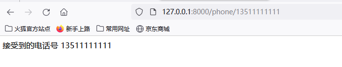


### 1.2正则表达式匹配url

**命名正则表达式**

```python
urlpatterns = [
    re_path('phone/(?P<phone_num>1[3-9]\d{9})', views.phone)
]
```

**未命名正则表达式**

```python
urlpatterns = [
    re_path('phone/(1[3-9]\d{9})', views.phone)
]
```


### 1.3路由分发

```python
include(module,namespace,pattern_list)
module:指定url模块
namespace：实例的命名空间
pattern_list：可迭代的path和re_path

方式一：
mysite/urls.py
urlpatterns = [
    path('app01/', include('app01.urls')),
]

app01/urls.py
urlpatterns=[
    path('home/',views.home)
]
app01/views.py
def home(request):
    return HttpResponse('Home!')


方式二：
mysite/urls.py
app01_urlpatterns = [
    path('home/', views.home)
]
urlpatterns = [
    path('app01/', include(app01_urlpatterns)),
]
```

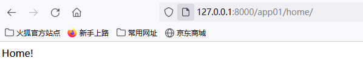

### 1.4向视图传递额外参数

```python
urls.py
urlpatterns = [
    path('home/',views.home,{'id':3})
]
views.py
def home(request,id):
    return HttpResponse(f'Home!接到的参数{id}')
```

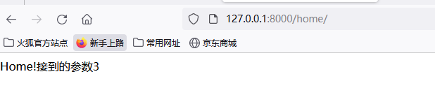


### 1.5 url命名与命名空间

**反向解析**

```python
reverser(viewname,..)	url模式名称或可调用的视图函数

urls.py
urlpatterns = [
    path('home/',views.home,name='home'),
]
views.py
def home(request):
    return HttpResponse(f'Home!反向解析的url   {reverse(home)}')

```

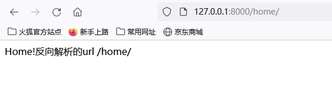


**命名空间**

多个应用可能包含同名url，反向解析时会出现混乱

```python
mysite/url.py
urlpatterns = [
    path('app01/',include('app01.urls')),
    path('app02/',include('app02.urls')),
]

app01/urls.py
urlpatterns=[
    path('home/',views.home,name='home'),
]

app01/veiws.py
def home(request):
    return HttpResponse(f'app01/Home! {reverse("home")}')

app02/urls.py
urlpatterns=[
    path('home/',views.home,name='home'),
]

app02/veiws.py
def home(request):
    return HttpResponse(f'app02/Home! {reverse("home")}')
```

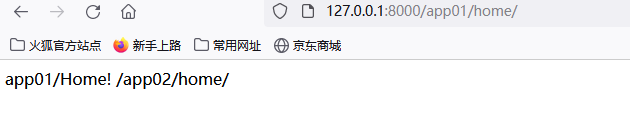


避免反向解析产生混乱，使用命名空间区分不同应用

```python
在app01/urls.py 和 app02/urls.py下加入
app_name="app01"
app_name="app02"
```

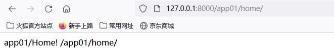


**路由命名**

多个url实例同时对应一个应用页会出现解析混乱

```python
mysite/urls.py
urlpatterns = [
    path('app01-one/',include('app01.urls')),
    path('app01-two/',include('app01.urls')),
]

app01/urls.py
app_name="app01"
urlpatterns=[
    path('index/',views.index,name='index'),
]

app01/views.py
def index(request):
    return HttpResponse(f'当前url {reverse("app01:index")}')
```

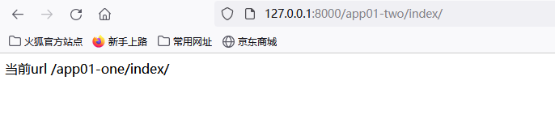
使用路由命名解决问题

```python
mysite/urls.py
urlpatterns = [
    path('app01-one/',include('app01.urls',namespace='one')),
    path('app01-two/',include('app01.urls',namespace='two')),
]
```

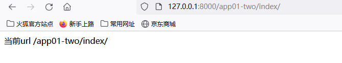


## 2.模型

### 2.1 定义与使用模型

```python
模型类对应一张数据表，模型类的每个属性对应数据表的一个字段

生成迁移文件 python manage.py makemigrations  生成成功后 应用文件下的migrations下会创建一个文件，包含生成数据表的代码
执行迁移文件 python manage.py migrate


class BookInfo(models.Model):
    name = models.CharField(max_length=20, verbose_name='名称')
    pub_date = models.DateField(verbose_name='发布日期')
    read_count = models.IntegerField(default=0, verbose_name='阅读量')
    comment_count = models.IntegerField(default=0, verbose_name='评论量')
    is_delete = models.BooleanField(default=False, verbose_name='逻辑删除')

    def __str__(self):
        return self.name
    
生成的表名是 app01_bookinfo  应用名称+模型类名称
```

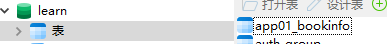


**mysql配置**

```python
settings.py
DATABASES = {
    'default': {
        'ENGINE': 'django.db.backends.mysql',
        'NAME': 'learn',
        'USER': 'root',
        'PASSWORD': '',
        'HOST': '127.0.0.1',
        'PORT': '3306',
    }
}

mysite.py/_init_.py
import pymysql
pymysql.install_as_MySQLdb()
```


### 2.2 模型的字段

**字段类型**

```python
1.AutoField 	自增字段
2.BooleanField	布尔类型字段
3.CharField		字符串类型字段，必选参数max_length
4.DateField		日期字段
5.IntegerField	整型字段
6.DatetimeField 日期时间字段
7.TextField		文本字段
8.EmailField	邮箱字段，会检查邮箱的合法性

时间日期俩个特别的参数
auto_now:最后一次修改的时间
auto_now_add:第一次创建的时间
```

 **关系字段**

```python
一对一
OneToOneField()	国家和总统

一对多
ForeignKey()	国家和人民

多对多
ManyToManyField()	老师和学生

```

**字段的通用参数**

```python
null		表示字段是否为空
default		设置字段的默认值
blank		字段是否为空字符串
choices		字段的选项，二维列表或二维元祖
primary_key	主键字段
unique		字段必须唯一
db_column	字段在表中的列名，未指定，则字段名作为列名
db_index	为字段创建索引
```


### 2.3 模型的元属性

**模型类中添加内部类Meta定义模型的元属性**

```python
class BookInfo(models.Model):
    ...
    class Meta:
        db_table='tb_bookinfo'
 

1.tb_table		设置表名
2.abstract		表示该类是抽象类，定义多个模型类的共有信息，不能被实例化，只能作为其他模型的基类
3.app_label		未注册的话，指明当前模型所属应用
4.ordering		
	排序	ordering=[id]  倒序 ordering=[-id]
    	ordering=['字段1','字段2']
5.verbose_name	显示在后台管理系统页面上，直观可读的表名
6.verbose_name_plural  后台显示表名的复数形式
```


### 2.4 Manager 管理器

**管理器名称**

```python
class BookInfo(models.Model):
	...
    #重命名管理器名称
    rename_object = models.Manager()
```

**自定义管理器**

```python
1.添加格外的管理器方法
class BookManger(models.Manager):
    # 添加方法
    def name_date(self):
        all_obj = self.all()
        all_obj = [i.name + ':' + '是本好书' for i in all_obj]
        return all_obj


class BookInfo(models.Model):
    name = models.CharField(max_length=20, verbose_name='名称')
    pub_date = models.DateField(verbose_name='发布日期')
    read_count = models.IntegerField(default=0, verbose_name='阅读量')
    comment_count = models.IntegerField(default=0, verbose_name='评论量')
    is_delete = models.BooleanField(default=False, verbose_name='逻辑删除')
    # 使用指定管理器
    objects = BookManger()

    def __str__(self):
        return self.name

    
2.修改原始查询集
class BookManger(models.Manager):
    # 修改get  可以修改all()方法获取的查询集
    def get_queryset(self):
        return super(BookManger, self).get_queryset().filter(id=1)
all()方法只返回包含一个信息queryset对象
```

### 2.5 数据的增删改查

**添加数据**

```python
1.模型类的管理器create()方法
BookInfo.objects.create(name='斗破苍芎',read_count=100,pub_date='2015-1-1',is_delete=0,comment_count=200)

2.模型类对象的save()方法
book_obj=BookInfo.objects.create(name='斗破苍芎',read_count=100,pub_date='2015-1-1',is_delete=0,comment_count=200)
book_obj.save()
```

**查询数据**

```python
模型类的管理器提供的四个方法
1.all()
返回所有记录，返回值是一个QuerySet对象，列表结构里面是模型类对象
2.filter()
返回满足条件的记录，返回值是一个QuerySet对象
比较运算符 属性名__比较运算符=值
3.exclud()
返回不满足条件的记录，返回值是一个QuerySet对象
4.get()
返回符合条件的记录，返回值是一个模型类对象
```

| 运算符            | 说明                              |
| :---------------- | :-------------------------------- |
| gt   gte  lt  lte | >  >=  <  <=                      |
| in                | 字段值是否存在于一个列表中        |
| range             | 字段值是否在指定区间 （包含俩端） |
| exact             | 字段值是否精确相等                |
| iexact            | 忽略大小写 加i                    |
| contains          | 字段值的模糊查询                  |
| startswith        | 字段值以···开头                   |
| endswith          | 字段值以···结尾                   |

**删除数据**

```
delete()
```

**更新数据**

```python
update()是管理器的方法
BookInfo.objects.filter(id=1).update(name='武动乾坤')
```


### 2.6 QuerySet对象

***QuerySet对象是Django的数据查询集，表示的是从数据库中获取的对象集合***

**多表查询**

```python
正向和方向查询：与关联字段所在位置有关
	若关联字段在当前表中，从当前表中查询关联表称为正向查询
	若关联字段不在当前表中，从当前表中查询关联表称为反向查询

正向查询靠属性，反向查询靠表名小写
```

**F对象和Q对象**

|                           | **语法**             | 示例                                            |
| ------------------------- | :------------------- | ----------------------------------------------- |
| **F对象  比较表中的字段** | F(字段名)            | read_count__gt=F('comment_count')               |
| **Q对象  多条件查询**     | Q(属性名__运算符=值) | Q(read_count__gt=120),Q(comment_count)    取反~ |

**QuerySet的特性**

1. 惰性执行：执行创建查血集操作时不会立即访问数据库，而是需要使用查询集数据时才会对数据库进行访问
2. 缓存：首先从缓存中读取数据，若缓存没有，再从数据库中查询数据

### 2.7 执行原生sql语句

1. Manager.raw()执行sql查询语句
   ```python
   raw(raw_query,params,translations)
   raw_query:原始sql语句
   params:查询条件参数，接受列表或字典
   translations：字段映射表，字典类型数据
   
   BookInfo.objects.raw('select * from bookinfo where id=1')
   params = {'id': 1}
   BookInfo.objects.raw('select * from bookinfo where id=%(id)s', params)
   params = ['id']
   BookInfo.objects.raw('select * from bookinfo where %s=1', params)
   translations = {'pk': 'id', 'read_count': 'r_count', 'comment_count': 'c_count'}
   BookInfo.objects.raw('select * from bookinfo ', translation=translations)
   # 和这个意思一致
   BookInfo.objects.raw('select pk as id,read_book as r_count,comment_count as c_count from bookinfo ')
   ```

   

2. 利用游标对象执行sql语句
   ```python
   from django.db import connection
   cursor=connection.cursor()
   cursor.execute('sql')
   ```

   

## 3. 模版


### 3.1  模版查找顺序

1. 当前应用的templates文件夹下查找
2. 当前项目的templates文件夹下查找
3. Django内置模版中查找

### 3.2模版语言

**变量**:模版不明确模版变量类型，模版引擎会按照以下顺序尝试

1. 将变量视为字典，根据键值访问变量的值
2. 将变量视为对象，尝试访问变量的属性或方法（不带括号）
3. 尝试访问变量的数字索引

**过滤器**	对数据进行加工

	- 语法格式
		{{variables|filters:'arg'}}  也可以使用管道符连接多个过滤器{{variabls|filters1|filters2}}
	注意：不能有空格

| 常用内置过滤器 | 说明                     |
| -------------- | ------------------------ |
| add            | 将参数添加到变量         |
| cut            | 移除参数指定的字符串     |
| date           | 给定格式格式化日期       |
| join           | 给定字符串连接列表的元素 |
| length         | 返回变量长度             |
| lower/upper    | 小写/大写                |
| random         | 返回列表一个随机元素     |

**标签**
*Djngo模版中属性大于方法*

1. for
   ```python
   
   <li>book.name</li>
   
   //反向遍历列表
   
   
   //遍历字典
   
       {{ key }}:{{ value }}
   
   ```

2. for ...empty
   给定数组为空或无法找到时，则显示

   ```python
   
   <li>{{ book.title }}</li>
   
       <li>抱歉，图书列表为空</li>
   
   ```

3. if/elif/else
   ```python
   
       大于10
   
       小于10
   
       等于10
   
   ```

4. include
   *用于加载其他模版*

   ```js
   
   用with关键字给模版传递变量
   
   ```

5. load 
   加载自定义模版标签和过滤器
   

6. now 
   *显示当前日期*
   it is 

7. url 
   *返回与给定视图和可选参数匹配的绝对路径（不带域名的url）*

   ```js
   可选参数
   
   
   ```

8. block
   *定义由子模版覆盖的块*

   ```js
   
   模块内容
   
   ```

9. comment 
   *添加注释*`

   ```js
   
   注释内容
   
   ```

10. extends
    *标记当前模板继承的模板*

11. with 为复杂变量名设置别名

12. forloop 循环变量

    | 变量               | 说明                         |
    | ------------------ | ---------------------------- |
    | forloop.counter    | 从1开始循环                  |
    | forloop.counter0   | 从0开始循环                  |
    | forloop.reverse    | 反向循环0开始                |
    | forloop.first      | 若为第一次循环，返回True     |
    | forloop.last       | 若为最后一次次循环，返回True |
    | forloop.parentloop | 外层循环次数                 |

    

### 3.3 自定义过滤器和标签

*自定义过滤器和模板通常位于应用目录下的templatetags目录之下的文件，文件内自定义过滤器和标签，使用 load标签加载到模板中*

```python
from django import template

# 注册器
register = template.Library()


# 自定义过滤器 接受1,2个参数的python函数
@register.filter
def example(val, arg):
    # val 管道符前的数据作为第一个参数
    return val + arg


# 自定义标签 接受任意参数的函数
@register.simple_tag
def tag(*args, **kwargs):
    return args, kwargs


# 包含标签 当前模板渲染另一个模板来显示数据,接受任意参数
@register.inclusion_tag('aa.html')
def show_tag(*args, **kwargs):
    dic = {'data1': args, 'data2': kwargs}
    # 将数据封装成字典传给html，渲染后返回
    return dic

```

### 3.4 模版继承

*web 网站多个页面往往会包含一些相同的元素，为了避免编写重复代码，django提供模板继承机制，用标签的block和extends实现*

```html
base.html
<!DOCTYPE html>
<html lang="en">
<head>
    <meta charset="UTF-8">
    <title>页面标题 </title>
</head>
<body>

    <h1>标题</h1>


    <h2>页面内容</h2>

<br><br><br>

    <div class="footer no-map">
        <div class="foot_link">
            <a href="#">关于我们</a>
            <span>|</span>
            <a href="#">联系我们</a>
            <span>|</span>
            <a href="#">招聘人才</a>
            <span>|</span>
            <a href="#">友情链接</a>
            <span>|</span>
        </div>
    </div>


</body>
<script>

</script>
</html>
```

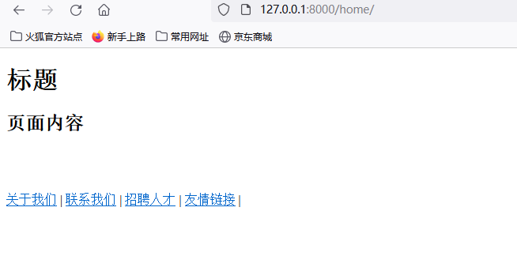


```python
{#继承base.html模板#}


    列表页面


<h1>书单</h1>


    <a href="#">1. 《鲁迅作品集全集》</a><br>
    <a href="#">2. 《秋雨散文集》</a><br>
    <a href="#">3. 《黑暗森林》</a><br>
    <a href="#">4. 《月亮与六便士》</a><br>

```

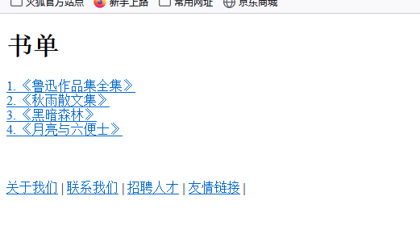


## 4. 视图

*载入模版->填充上下文->生成响应消息->返回响应对象*

### 4.1  请求对象

1. request常用属性

   | **request.body**    | **请求体信息，该属性为bytes类型**                            |
   | ------------------- | ------------------------------------------------------------ |
   | **request.path**    | **请求页面的完整路径**                                       |
   | **request.method**  | **本次请求的请求方法**                                       |
   | **request.GET**     | **包含GET请求的所以参数，是QueryDict对象，有get()方法提取**  |
   | **request.POST**    | **包含POST请求的所以参数，是QueryDict对象，有get()方法提取** |
   | **request.COOKIES** | **包含所有cookie信息，是一个字典数据**                       |
   | **request.session** | **包含当前会话信息，该属性是QueryDict对象**                  |
   | **request.META**    | **请求头部信息，该属性dict类型**                             |
   | **request.user**    | **获取登录用户的当前信息登录返回一个User对象，如果未登录返回一个匿名用户** |

2. 常用方法

   | **request.get_host**      | **获取ip**                                           |
   | ------------------------- | ---------------------------------------------------- |
   | **request.get_port**      | **获取端口**                                         |
   | **request.get_full_path** | **包含完整参数列表的path    [/music/bands?index=1]** |

   

### 4.2 响应对象

1. 常用属性

   | **response.content**     | **设置响应消息内容**       |
   | ------------------------ | -------------------------- |
   | **response.charset**     | **设置响应消息的编码方式** |
   | **response.status_code** | **设置响应状态码**         |

2. 常用方法

   | **response.set_cookie(key,value)**                         | **设置cookie**                             |
   | ---------------------------------------------------------- | ------------------------------------------ |
   | **response.del_cookie(key)**                               | **删除cookie**                             |
   | **response.set_signed_cookie、response.get_signed_cookie** | **对cookie数据进行加密，设置一个salt密盐** |
   
   

### 4.3 快速生成响应的对象

|              | 说明                                                   |
| ------------ | ------------------------------------------------------ |
| HttpResponse | 传入一个字符串作为页面响应内容                         |
| JsonResponse | 返回json类型字符串，非dict数据，将参数safe设置为False  |
| render()     | 结合指定的模板和上下文字典，返回一个渲染的HttpResponse |
| redirect()   | 出入url和url模式名称                                   |

### 4.4 类视图

*一个类中定义不同的方法，处理以不同请求方式发送的请求*
*视图类中的as_view()方法，接受请求，获取请求方法，根据请求方法找到对应的视图方法*

```python
1.函数形式定义的视图
def my_view(request):
    if request.method='GET':
        return HttpResponse('GET result')
    if request.method='POST':
        return HttpResponse('POST result')
    
2.以类形式定义的视图
	class MyView(View):
        def get(request):
            return HttpResponse('GET result')
        def post(request):
            return HttpResponse('POST result')
```


### 4.5 案例 基于视图类的商品管理

goods.html
```html
<!DOCTYPE html>
<html lang="en">
<head>
    <meta charset="UTF-8">
    <title>商品列表</title>
</head>
<body>
<div>
    <table id="my_table" cellpadding="1" cellspacing="0" border="1"
           style="width: 100%;max-width: 100%;margin-bottom:20px;">
        <caption align="top" style="font-size:26px">商品列表</caption>
        <thead>
        <tr>
            <td>编号</td>
            <td>名字</td>
            <td>价格</td>
            <td>库存</td>
            <td>销量</td>
            <td>管理</td>
        </tr>
        </thead>
        <tfoot align="right">
        </tfoot>
        <tbody>
        
            <tr>
                <td>{{ forloop.counter }}</td>
                <td>{{ row.name }}</td>
                <td>{{ row.price }}</td>
                <td>{{ row.stock }}</td>
                <td>{{ row.sales }}</td>
                <td><a href="/del_good/{{ row.id }}">删除</a></td>
            </tr>
        
        </tbody>
    </table>
</div>
<form method="post" action="" cellpadding="1" cellspacing="0" border="1">

    <input type="submit" value="添加">
    商品：<input type="text" name="name">
    价格：<input type="text" name="price">
    库存：<input type="text" name="stock">
    销量：<input type="text" name="sales">
</form>
<form method="post" action="/del_good/" cellpadding="1" cellspacing="0" border="1">

    <input type="submit" value="修改">
    序号：<input type="text" name="num">
    商品：<input type="text" name="name">
    价格：<input type="text" name="price">
    库存：<input type="text" name="stock">
    销量：<input type="text" name="sales">
</form>
</body>
</html>
```

urls.py
```python
from django.urls import path, re_path
from app01 import views

urlpatterns = [
    # 展示和添加
    path('get_goods/', views.GoodsView.as_view(), name='goods'),
    #  删除和修改
    re_path(r'del_good/(?P<gid>\d*)', views.UpdateView.as_view()),
]
```

views.py
```python
from django.shortcuts import render, redirect
from django.views import View
from app01 import models
# Create your views here.


# 展示,添加商品类
class GoodsView(View):
    # 展示商品
    def get(self, request, *args, **kwargs):
        goods = models.Goods.objects.all()
        return render(request, 'goods.html', {'goods': goods})

    # 添加商品
    def post(self, request, *args, **kwargs):
        data = request.POST.dict()
        # **data打散机制
        models.Goods.objects.create(**data)
        return redirect('goods')


# 删除，修改商品类
class UpdateView(View):
    # 删除商品
    def get(self, request, gid):
        models.Goods.objects.get(id=gid).delete()
        return redirect('goods')

    # 修改商品
    def post(self, request, *args, **kwargs):
        data = request.POST.dict()
        # 商品序号和数据库的id值不一致
        goods = models.Goods.objects.all()
        count = goods.count()
        # 找到序号对应的位置,用商品个数对应的位置
        gid=data['num']
        for i in range(1, count + 1):
            if int(gid) == i:
                # 数据库中对应的记录
                good=goods[i-1]
                good.name=data['name']
                good.price=data['price']
                good.stock=data['stock']
                good.sales=data['sales']
                good.save()
                break
        return redirect('goods')
```

models.py
```python
from django.db import models

# Create your models here.
class Goods(models.Model):
    create_time = models.DateTimeField(auto_now_add=True, verbose_name='创建时间')
    update_time = models.DateTimeField(auto_now=True, verbose_name='更新事件')
    name = models.CharField(max_length=64, verbose_name='名字')
    price = models.DecimalField(max_digits=10, decimal_places=2, verbose_name='价格')
    stock = models.IntegerField(default=0, verbose_name='库存')
    sales = models.IntegerField(default=0, verbose_name='销量')

    class Meta:
        db_table = 'tb_goods'
        verbose_name = '商品'
        verbose_name_plural=verbose_name
    def __str__(self):
        return self.name
```

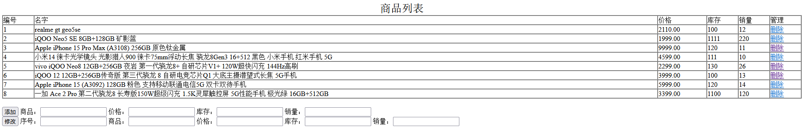


## 5. 后台管理系统Admin

*Django提供了一个可插拔的后台管理系统，该系统可以从模型中读取元数据，并提供以模型为中心的界面*

### 5.1 认识Admin

1. 进入Admin   http://127.0.0.1:8000/admin/
   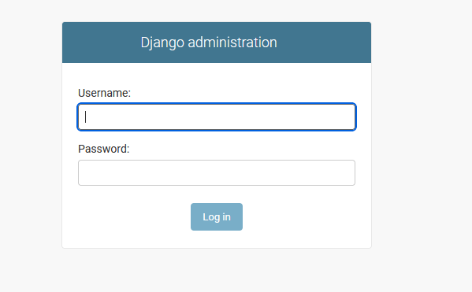

2. 创建管理员用户  python manage.py createsuperuser
   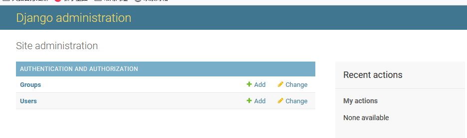

3. 设置为中文
   
   -   settings.py 文件下language_code的值设置为zh-Hans
   - 添加中间件 'django.middleware.locale.LocaleMiddleware',
   
   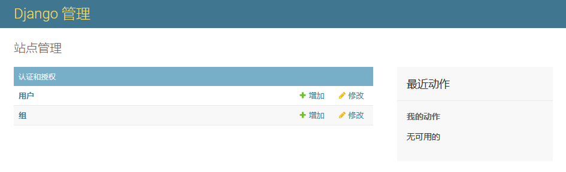
   


### 5.2 使用Admin

1. 将模型注册到后台管理系统
   ```python
   在admin.py下注册Goods模型
   1.装饰器 语法格式为 @admin.register(模型名)
   from django.contrib import admin
   from .models import Goods
   @admin.register(Goods)
   class GoodsAdmin(admin.ModelAdmin):
       pass
   2.使用admin.site.register(模型名)
   ```

   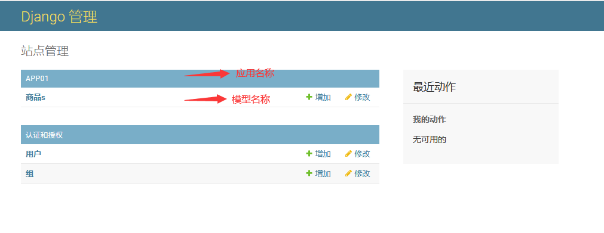
   
2. 设置应用名称中文显示
   ```python
   app01/__init__.py 
   default_app_config = 'app01.apps.GoodsConfig'
   
   
   app01/apps.py
   from django.apps import AppConfig
   class GoodsConfig(AppConfig):
       ...
       verbose_name = '商品信息'
   ```

   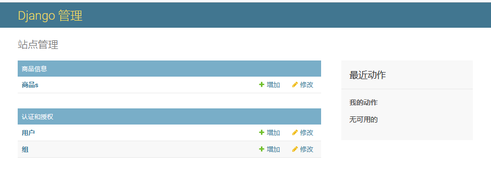
   
   
   
3. 管理数据库数据
   GoodsAdmin类下添加 list_display = ('id', 'create_time', 'update_time', 'name', 'price', 'stock', 'sales')
   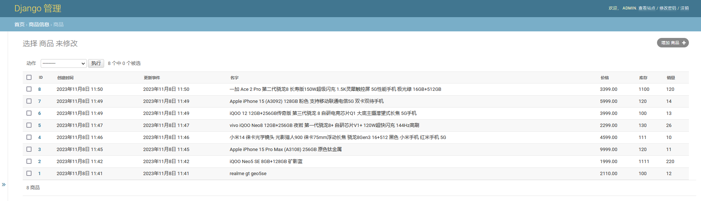

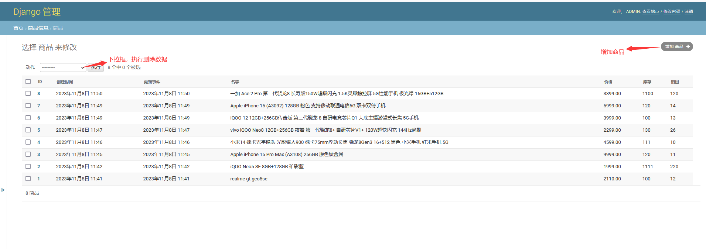
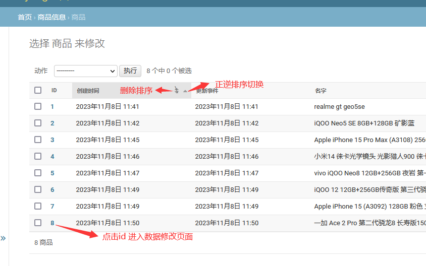
**数据修改页面**
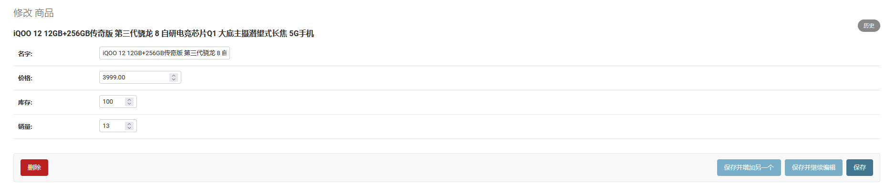

### 5.3 ModelAdmin 选项

*ModelAdmin类主要用于控制模型信息在后台管理系统页面中的展示，包含列表页选项，编辑页选项。*

#### 5.3.1 列表页选项

​	*列表页的显示字段、过滤器、搜索字段，这些选项在应用的admin.py的模型管理类中使用*

1. list_display 选项 
   控制页面展示的字段，该项的值为元祖或列表类型，可以有模型字段和自定义字段

   ```python
   1.模型字段
   list_display=['id','name']
   list_display=('id','name')
   
   2.自定义字段
   指与模型相关，单并不包含在模型的字段，定义在admin.py文件下的函数，该函数会将模型实例作为参数
   from django.contrib import admin
   from .models import Goods
   
   @admin.register(Goods)
   class GoodsAdmin(admin.ModelAdmin):
       # list_display = ('id', 'create_time', 'update_time', 'name', 'price', 'stock', 'sales')
       # 添加自定义字段
       list_display = ('sales_volume',)
       g = Goods()
   
       def sales_volume(self,g):
           sale_sum = g.price * g.sales
           return f'{g.name}销售额为：{sale_sum}元'
   
       # 设置该字段的功能说明
       sales_volume.short_description = '商品销售额'
   ```
   
   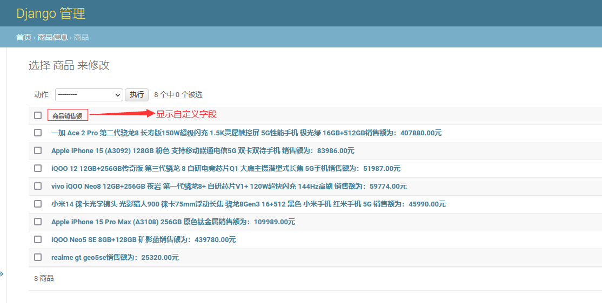
   
2. list_display_links  设置以链接形式展示的字段

   ```python
   list_display_links=('id','name')
   ```

   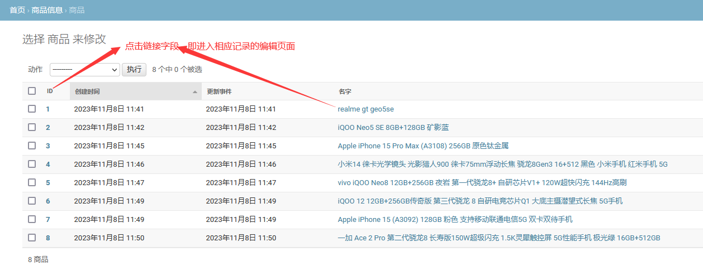

3. list_filters    
   开启列表页过滤器，模型字段作为过滤条件，也可以自定义过滤器

   *模型字段进行过滤*

   ```python
   list_filter=('name',)
   ```

   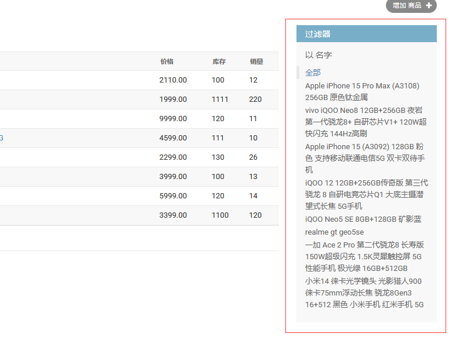

​	*自定义过滤器*
```python
from django.contrib import admin
from .models import Goods

# 自定义过滤器
class DeFilter(admin.SimpleListFilter):
    # 列表页过滤器的名称
    title = '商品名称'
    # 访问路由所携带的参数名称
    parameter_name = 'filter_name'

    # 设置分类，返回一个二维元组，第一个数查询编号，第二个是过滤器别名元组
    def lookups(self, request, model_admin):
        return (
            ('0', ('高端手机')),
            ('1', ('中端手机')),
        )

    # 查询分类数据
    def queryset(self, request, queryset):
        if self.value() == '0':
            return queryset.filter(price__gt=5000)
        else:
            return queryset.filter(price__lte=5000)

@admin.register(Goods)
class GoodsAdmin(admin.ModelAdmin):
    list_display = ('id', 'create_time', 'update_time', 'name', 'price', 'stock', 'sales')
    # 将自定义过滤器添加到list_filter
    list_filter = (DeFilter,)
```

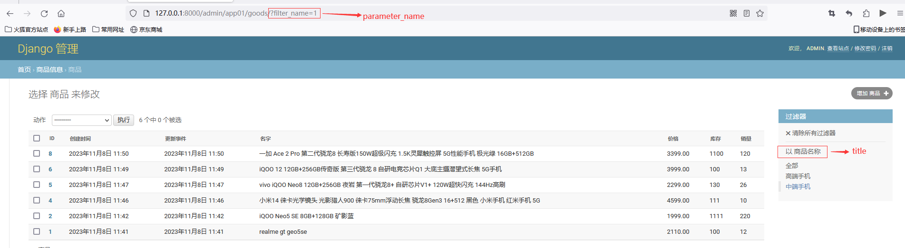

4.  list_per_page 
   *设置每页显示的记录* list_per_page=3
   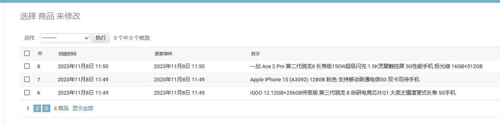

5. list_editable
   *设置可编辑的字段*
   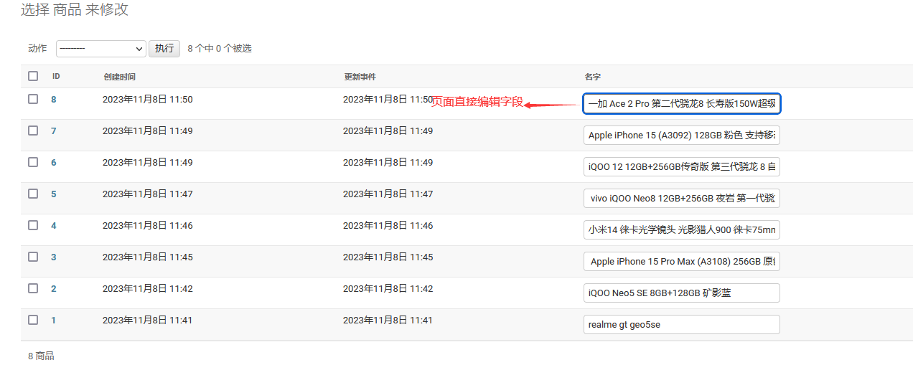

6. search_fields 
   *设置搜索字段*
   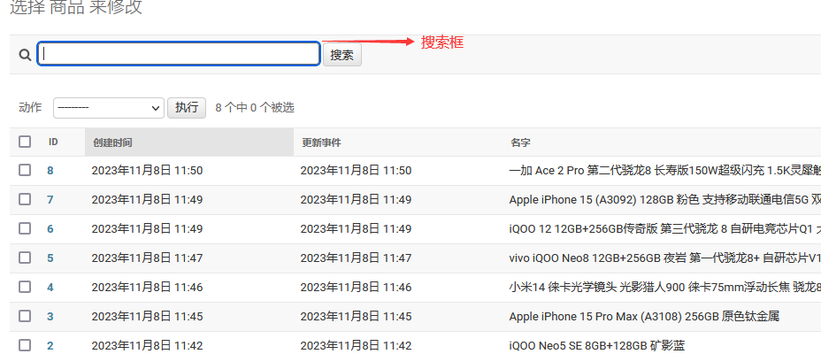

7. 动作下拉框

   |                   | 说明                              |
   | ----------------- | --------------------------------- |
   | actions_on_top    | 在顶部显示动作下拉框，默认为True  |
   | actions_on_button | 在底部显示动作下拉框，默认为False |

8. actions 
   *设置管理员动作*

   ```python
   from django.contrib import admin
   from .models import Goods
   
   @admin.register(Goods)
   class GoodsAdmin(admin.ModelAdmin):
       list_display = ('id', 'create_time', 'update_time', 'name', 'price', 'stock', 'sales')
       # 将自定义过滤器添加到list_filter
       search_fields = ('name',)
   
       # 定义管理员动作
       def down(self, request, queryset):
           pass
   
       down.short_description = '下载'
       # 添加到actions选项
       actions = ('down',)
   ```

   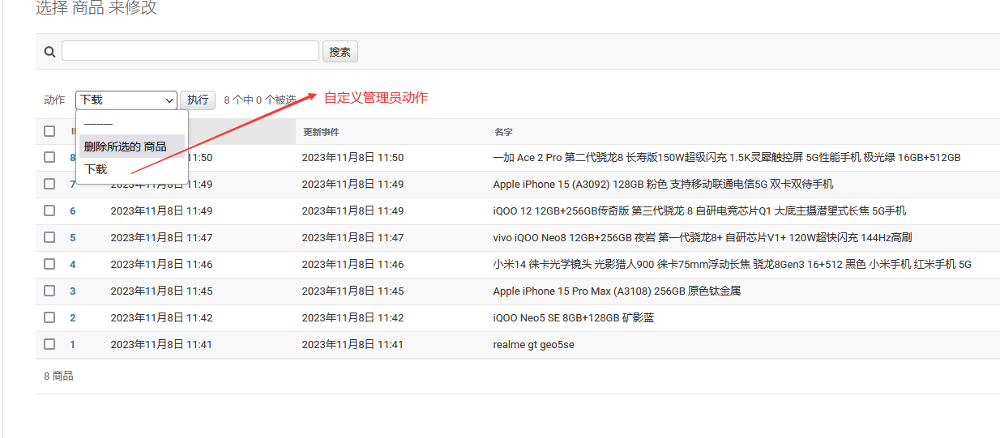

#### 5.3.2 编辑页选项

1. fields 控制编辑页显示的字段，元组类型
   fields=('name', 'price')
   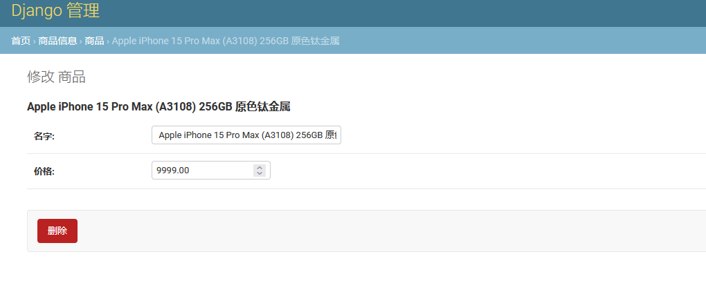
   二维元组形式设置字段分栏显示

   ```python
   fields = (('name', 'price'), ('stock', 'sales'))
   ```

   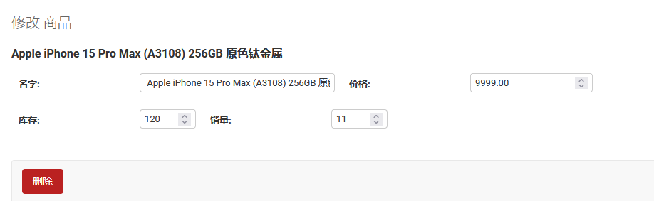

 2. fieldsets  对可编辑字段进行分组

    ```python
    fieldsets = (
        ('商品信息', {'fields': ['name', 'sales', 'stock']}),
        ('商品价格信息', {'fields': ['price']})
    )
    ```

    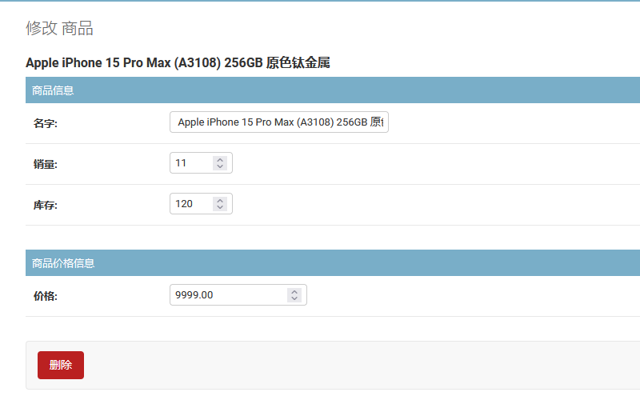
    
3. readonly_fields

   ```python
   # 设置字段为只读字段
   readonly_fields = ('price',)
   ```


   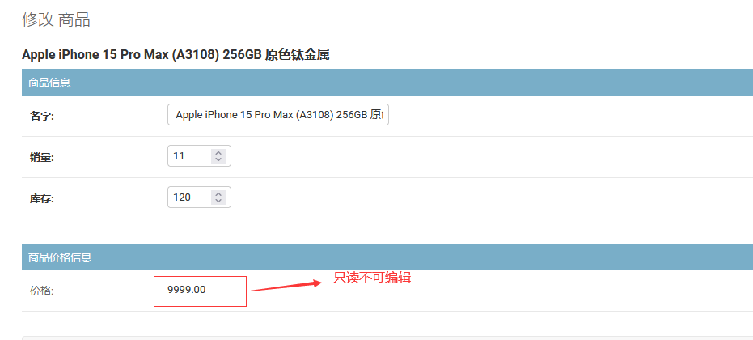


### 5.4 认证和授权

1. 用户管理
   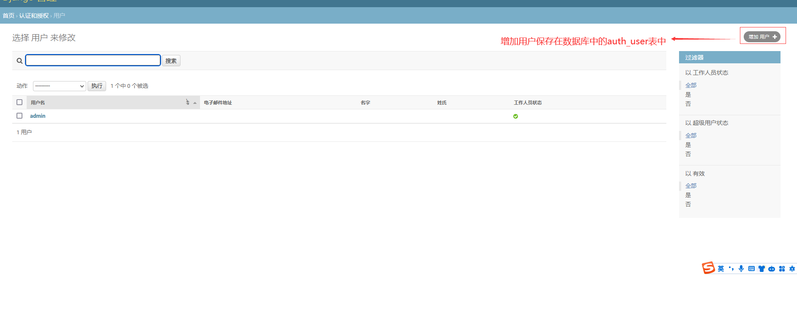

2. 组管理
   *对用户的权限进行分配和管理，将一个用户加到一个组中，该用户就有了该组所拥有的所以权限*
   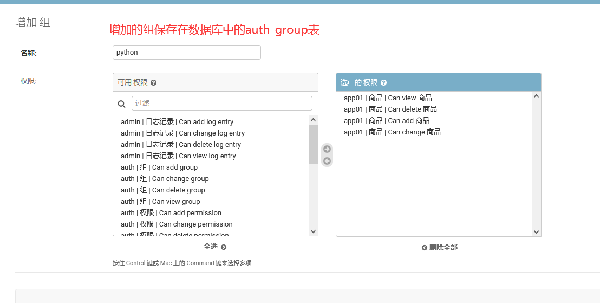

3. 权限管理

   **用户权限管理**
   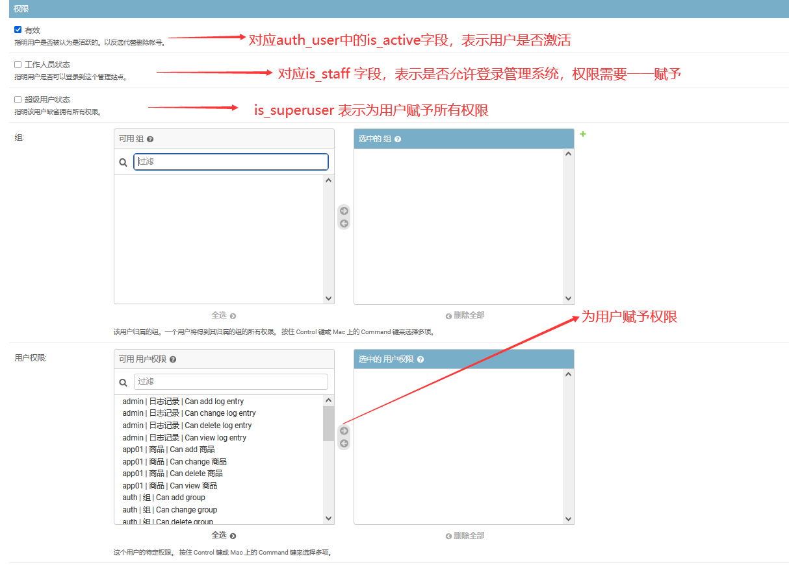

   **组权限管理**
   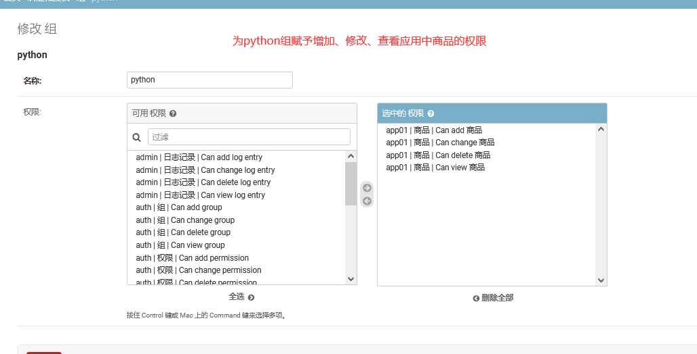


## 6. 表单

### 6.1 表单的概述

#### 6.1 .1 在Django中表单定义的方式

1. 在模板中定义表单
   *form标签可以在html模板文件中定义表单域，表单域可以包含文本域、密码框、隐藏域、多行文本框、单选按钮、复选框、下拉框选择框和文本上传等元素*

   ```html
   <form action="/your_name/" method="post">
   	//定义input标签的标注
       <label for="your_name">Your name</label>
       <input id="your_name" name="name" type="text" value="{{name}}" >
       <input type="submit" value="提交">
   </form>
   ```

2. 在python文件中定义表单

   ```python
   from django import forms
   
   class NameForm(forms.Form):
       name = forms.CharField(label='You_name', max_length=100)
   ```


#### 6.1.2 Form类的常用字段

*表单类的不同字段会映射为html表单域中的不同控件*


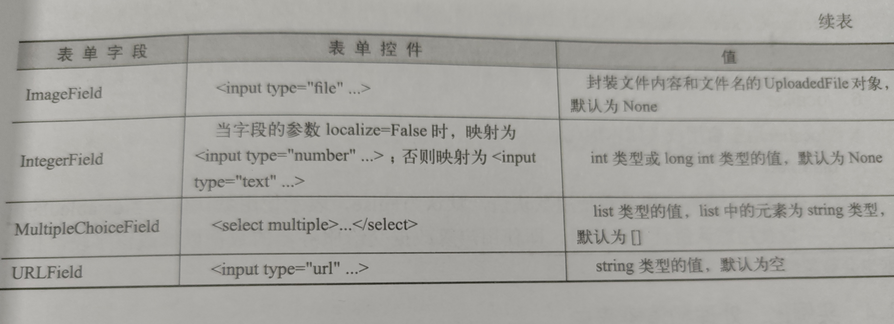

#### 6.1.3 字段的通用参数

1. required 设置当前字段是否为必须字段，默认情况，表单的每个字段都是必须字段。

2. label 为字段指定标签
   ```python
   name=forms.CharField(label='名字')
   渲染后的html
   <label for='your_name'>Your_name:</label>
   ```

3. initial 为字段设置初始值
   ```python
   name=forms.CharField(initial='张三')
   生成的html
   <input type='text' name='name' value='张三' required>
   ```

4.  help_text 指定字段的描述性文本
5. error_messages 重写字段的错误信息，参数是一个字典
   

#### 6.1.4 实例化、处理和渲染表单

Django表单从定义到呈现经历的流程：

1. 在应用目录下py文件定义表单类
2. 在视图中实例化表单，对表单进行处理
3. 将表单实例传递给模板上下文
4. 在模板中渲染表单

一般，处理模型时，从数据库中获取实例，处理表单时，需要在视图中实例化表单
*表单的数据来源*

1. 数据库中的数据
2. html表单提交的数据
3. 其他形式的数据：代码中定义的数据

forms.py

```python
from django import forms


class NameForm(forms.Form):
    name = forms.CharField(label='You_name', max_length=100)
```

views.py

```python
from django.http import HttpResponse
from django.shortcuts import render
from .forms import NameForm

# Create your views here.
def get_name(request):
    # 若是一个get请求，实例化一个空表单
    if request.method == 'GET':
        form = NameForm()
        return render(request, 'name.html', {'form': form})
    else:
        # 若是POST请求，创建表单，并将提交的数据实例化NameForm
        form = NameForm(request.POST)
        # 验证表单
        if form.is_valid():
            # 逻辑处理
            return HttpResponse('ok')
```

name.html

```html
//利用表单生成的不包含form标签
</form>
<form method="post" action="/get_name/">
    {{ form }}
    <input type="submit" value="提交">
</form>
```

渲染后的页面
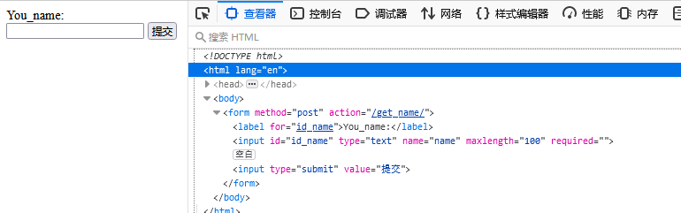


#### 6.1.5 表单实例形式

1. 绑定形式
2. 未绑定形式

*表单实例的 **is_bound** 属性可以判断表单实例是否绑定了数据，表单实例中的数据无法被更改，若想更改创建一个新的表单实例覆盖*

#### 6.1.6 表单验证

表单验证即对表单中的数据进行校验，检验表单各个字段的数据是否符合该字段的约束条件，若表单验证成功，验证后的数据会被存储到表单实例的**cleaned_data**属性（dict类型）,若失败抛出异常，在程序中使用验证后的数据有利于提高程序健壮性，需要注意表单验证后，**request.POST**仍然可以访问到用户提交的**未验证**的数据

验证方法：

1. 表单实例的clean()
2. 表单实例的is_valid()
3. 访问表单实例的errors属性，第一次被访问时可以触发表单验证


### 6.2 在模版中渲染表单

将视图上下文变量中传递的表单实例以模板变量的形式放在模板中即可使用 {{form}}

#### 6.2.1  利用表单渲染选项  渲染表单

1. as_table 用法{{form.as_table}}，渲染时表单的每个字段都会被放在<tr>标签中
2. as_p 用法{{form.as_table}}，渲染时表单的每个字段都会被放在<p>标签中
3. as_ul 用法{{form.as_table}}，渲染时表单的每个字段都会被放在<li>标签中

#### 6.2.2 手动处理表单字段

*手动处理表单字段可以将每个表单字段视为表单属性*

```html
<div >
    {#  表单验证#}
    {{ form.name.errors }}
    <label for="{{ form.name.id_for_label }}">You_name</label>
    {{ form.name }}
</div>
```

#### 6.2.3 *渲染表单错误信息*

| 标签                            | 说明                 |
| ------------------------------- | -------------------- |
| {{ form.non_field_errors }}     | 显示表单错误信息     |
| {{ form.name_of_field.errors }} | 显示表单字段错误信息 |

#### 6.2.4 遍历表单字段

当表单字段的每个字段都是用相同的html，可以借助标签遍历每个字段

```python

<div class="fieldwrapper">
    {# 用于显示字段的错误信息。如果字段有错误信息，它会将错误信息渲染为HTML#}
    {{ field.errors }}
    {#用于显示字段的标签#}
    {{ field.label_tag }}
    {#用于显示字段本身#}
    {{ field }}
    {#判断是否有帮助性文本#}
    
    <p class="'help">{{ field.help_text|safe }}</p>
    
</div>

```

#### 6.2.5 复用表单



### 6.3 表单集

表单集是一个多表的集合，利用表单集，用户可以同时提交一组表单，在数据库中添加多条记录

#### 6.3.1 创建表单集

formset_factory()传入一个已定义的表单，可以快速创建一个表单集
forms.py

```python
from django import forms

class GoodForm(forms.Form):
    good_name = forms.CharField(label='商品')
    good_price=forms.DecimalField(label='价格')
    good_stock=forms.IntegerField(label='库存')
    good_sales=forms.IntegerField(label='销量')
```

views.py

```python
from django.shortcuts import render
from .forms import GoodForm
from django.forms import formset_factory

def get_name(request):
    # 创建表单集
    good_formset = formset_factory(GoodForm)
    formset = good_formset()

    return render(request, 'test.html', {"formset": formset})
```

test.html

```html
<table>
    
        {{ form }}
    
</table>
```

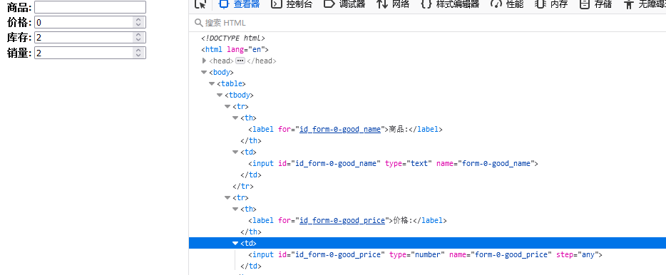


#### 6.3.2  管理表单集

*表单集默认值包含一个空表单，为formset_factory()传递参数，可对表单进行管理*

1. 控制空表单的数量
   extra 控制空表单数量 good_formset = formset_factory(GoodForm,extra=2)

2. 设置表单的初始数据
   formset = good_formset(initial=[{'good_name': 'iphone', 'good_price': 5999, 'good_stock': '5', 'good_sales': '3'}])

   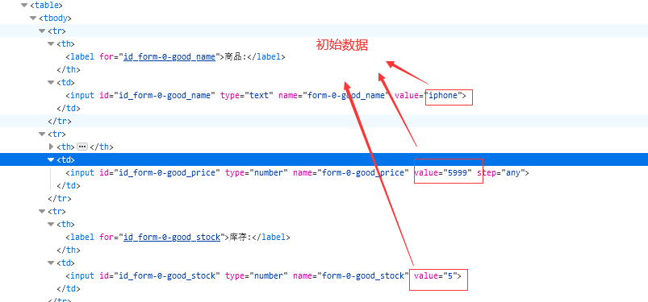
   
3.  显示表单最大数量 max_num

   *表单的最大数量与**initial**、**extra**、**max_num**取值都有关系*

   - 若max_num 设置为None，那么表单集中最多包含1000张表单
   - 若初始数据大于max_num,那么max_num的作用就会被忽略
   - max_num 大于初始数据表示，由三个值共同决定

#### 6.3.3 使用表单集

手动处理

```html
{#手动处理必须添加#}
{{ formset.management_form }}
<table>
    
        {{ form }}
    
</table>
```

自动处理

```html
<table>
    {{ formset }}
</table>
```


### 6.4 根据模型创建表单

*如果要构建一个数据库驱动的应用程序，那么很可能用到模型相关的表单*

#### 6.4.1 自定义模型表单类

```python
from django.forms import ModelForm
from app01.models import Goods

class GoodForm(ModelForm):
    class Meta:
        # 指定了表单所基于的模型类是Goods模型。
        model = Goods
        fields = ['name', 'price', 'stock', 'sales']
        # 1.使用模型类中所有的字段
        fields = '_all_'
        # 2.排除不需要出现在表单的模型字段
        exclude=['stock']
```

#### 6.4.2 使用模型表单类

forms.py

```python
from django.forms import ModelForm
from app01.models import Goods


class GoodForm(ModelForm):
    class Meta:
        # 指定了表单所基于的模型类是Goods模型。
        model = Goods
        fields = '__all__'
```

views.py

```python
from django.shortcuts import render
from .forms import GoodForm
from app01.models import Goods


def get_name(request):
    # 创建空表单
    form=GoodForm()
    # 获取一条记录
    good=Goods.objects.get(id=1)
    # 使用good对象填充表单
    form=GoodForm(instance=good)

    return render(request, 'test.html', {'form': form})
```

test.html
```html
{{ form }}
```

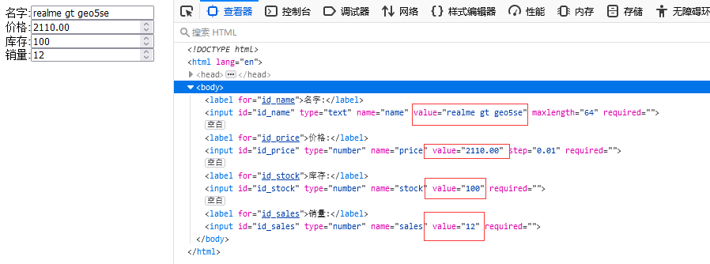

#### 6.4.3 ModelForm 的save()

forms.py
```python
from django.forms import ModelForm
from app01.models import Goods


class GoodForm(ModelForm):
    class Meta:
        # 指定了表单所基于的模型类是Goods模型。
        model = Goods
        fields = '__all__'
```

views.py

```python
from .forms import GoodForm
from app01.models import Goods

def get_name(request):
    f = GoodForm({'name': 'iphone 15 plus', 'price': '6888', 'stock': '8', 'sales': '4'})
    # 将绑定到表单的数据创建并保存到数据库对象
    f.save()
    good = Goods.objects.get(id=1)
    # instance 接受到一个现有模型实例，更新相关数据
    f2 = GoodForm({'name': 'realme gt geo5se', 'price': '2000','stock': '1000','sales': '100'},instance=good)
    f2.save()
    return HttpResponse('ok')
```

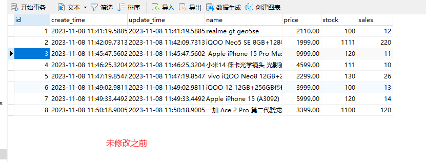
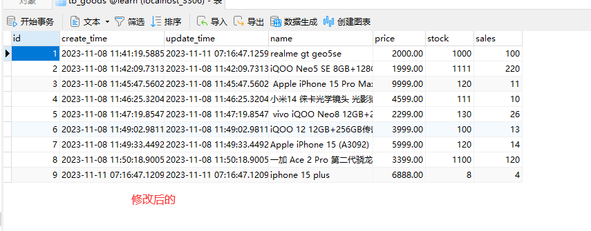

#### 6.4.4 利用工厂函数定义模型表单类

```python
from django.shortcuts import render
from app01.models import Goods
from django.forms import modelform_factory


def get_name(request):
    # 接受一个模型类和参数，生成给定模型的ModelForm类
    all_fields = ('name', 'price', 'stock', 'sales')
    good_form = modelform_factory(Goods, fields=all_fields)
    return render(request, 'test.html', {'form': good_form})
```


#### 6.4.5 利用工厂函数定义表单集

```python
all_fields = ('name', 'price', 'stock', 'sales')
good_formset = modelformset_factory(Goods, fields=all_fields)
```

1. 字段选择
   参数**fields**和**exclude**选择表单使用的字段
2. 更改查询集
   formset=good_formset(queryset=Goods.object.filter(name__startswith='iphone'))
3. 在表单集中保存对象
   类似ModelForm，表单集中的数据也可以用save()


### 6.5 基于表单类的商品管理

urls.py

```python
from django.urls import path, re_path
from app02 import views as views
urlpatterns = [
    # 展示和添加
    path('get_goods/', views.GoodView.as_view(), name='goods'),
    #  删除和修改
    re_path(r'del_good/(\d*)', views.UpdateDestoryGood.as_view()),
]
```

app01/forms.py

```python
from django.forms import ModelForm
from app01.models import Goods

class GoodForm(ModelForm):
    class Meta:
        # 指定了表单所基于的模型类是Goods模型。
        model = Goods
        fields = '__all__'
```

views.py

```python
from django.views import View
from .forms import GoodForm
from django.http import HttpResponse
from django.shortcuts import render, redirect
from app01.models import Goods

class GoodView(View):
    # 商品视图类
    def get(self, request):
        # 展示商品
        goods = Goods.objects.all()
        form = GoodForm()
        return render(request, 'goods.html', {'goods': goods, 'form': form})

    def post(self, request):
        # 添加商品
        good = Goods()
        # 使用post提交的数据实例化GoodForm
        form = GoodForm(request.POST)
        # 判断表单是否已验证，获取已验证的数据
        if form.is_valid():
            # 验证后的数据都放在实例对象的cleaned_data属性里
            good_data = form.cleaned_data
            good.name = good_data["name"]
            good.price = good_data["price"]
            good.stock = good_data['stock']
            good.sales = good_data['sales']
            try:
                # 模型实例的save方法
                good.save()
            except:
                return HttpResponse('数据错误')
        return redirect('goods')


class UpdateDestoryGood(View):
    # 编辑删除商品数据
    def get(self, request, gid):
        # 删除数据
        try:
            good = Goods.objects.get(id=gid)
            good.delete()
        except:
            return HttpResponse('删除失败')
        return redirect('goods')

    def post(self, request, *args):
        # 编辑数据
        goods = Goods.objects.all()
        count = goods.count()
        form = GoodForm(request.POST)
        # 获取序号
        num = request.POST.get('num')
        if form.is_valid():
            good_data = form.cleaned_data
            for i in range(1, count + 1):
                # 找到序号对应的位置
                if i == int(num):
                    # 根据索引获取模型实例对象
                    good = goods[i - 1]
                    good.name = good_data["name"]
                    good.price = good_data["price"]
                    good.stock = good_data['stock']
                    good.sales = good_data['sales']
                    try:
                        # 模型实例的save方法
                        good.save()
                    except:
                        return HttpResponse('编辑失败')
        return redirect('goods')
```

goods.html

```html
<!DOCTYPE html>
<html lang="en">
<head>
    <meta charset="UTF-8">
    <title>商品列表</title>
</head>
<body>
<div>
    <table id="my_table" cellpadding="1" cellspacing="0" border="1"
           style="width: 100%;max-width: 100%;margin-bottom:20px;">
        <caption align="top" style="font-size:26px">商品列表</caption>
        <thead>
        <tr>
            <td>编号</td>
            <td>名字</td>
            <td>价格</td>
            <td>库存</td>
            <td>销量</td>
            <td>管理</td>
        </tr>
        </thead>
        <tfoot align="right">
        </tfoot>
        <tbody>
        
            <tr>
                <td>{{ forloop.counter }}</td>
                <td>{{ row.name }}</td>
                <td>{{ row.price }}</td>
                <td>{{ row.stock }}</td>
                <td>{{ row.sales }}</td>
                <td><a href="/del_good/{{ row.id }}">删除</a></td>
            </tr>
        
        </tbody>
    </table>
</div>
<form method="post" action="" cellpadding="1" cellspacing="0" border="1">

    <input type="submit" value="添加">
    {{ form }}
</form>
<form method="post" action="/del_good/" cellpadding="1" cellspacing="0" border="1">

    <input type="submit" value="修改">
    序号：<input type="text" name="num">
    {{ form }}
</form>
</body>
</html>
```

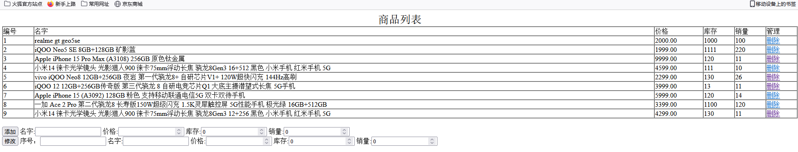


## 7.身份验证系统

### 7.1 User对象

*User对象是身份验证系统的核心，它代表了与网站交互的人员*

1. 用户信息相关的常用字段

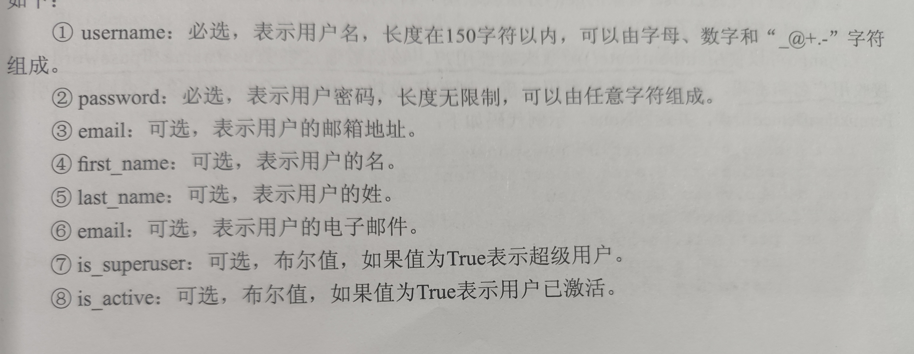

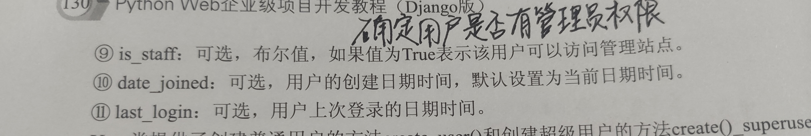

2. 创建用户

```python
from django.http import HttpResponse
from django.contrib.auth.models import User

def create_user(self):
    # 创建普通用户 create_user()
    ordinary_user = User.objects.create_user(username='baron', password='baron123')
    ordinary_user.save()

    # 创建超级用户 create_superuser()
    super_user = User.objects.create_superuser(username='Tom', password='tom123')
    super_user.save()
    return HttpResponse('ok')
```

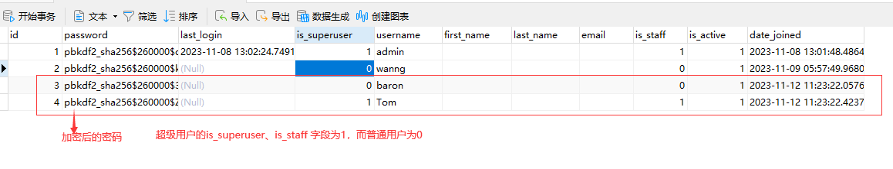

3. User对象的set_password()方法修改用户密码

   ```python
   user=User.objects.get(username='Tom')
   # 修改密码
   user.set_password('Tom123')
   # 保存
   user.save()
   ```

4 验证用户 authenticate()
urls.py

```python
from django.urls import path, re_path
from User_hh import views as views

urlpatterns = [
    path('create_user/', views.LoginView.as_view()),
]
```

User_hh/views.py

```python
from django.contrib.auth import authenticate
from django.shortcuts import render
from django.views import View
from django.http import HttpResponse
# Create your views here.
from django.contrib.auth.models import User
from .forms import UserTest

class LoginView(View):
    def get(self, request):
        form = UserTest()
        return render(request, 'login.html', {'form': form})

    def post(self, request):
        username = request.POST.get('username')
        password = request.POST.get('password')
        # 接受用户名和密码，验证成功返回User对象,否则匿名用户
        status = authenticate(username=username, password=password)
        if status is not None:
            return HttpResponse('登录成功')
        else:
            return HttpResponse('登录失败')
```

User_hh/forms.py

```python
from django import forms


class UserTest(forms.Form):
    username = forms.CharField(max_length=100,label="Your name")
    # forms.PasswordInput 控件来隐藏密码
    password = forms.CharField(widget=forms.PasswordInput,label="Password")
```

login.html

```html
<form action="" method="post">
    {{ form }}
    <input type="submit" value="提交">
</form>
```

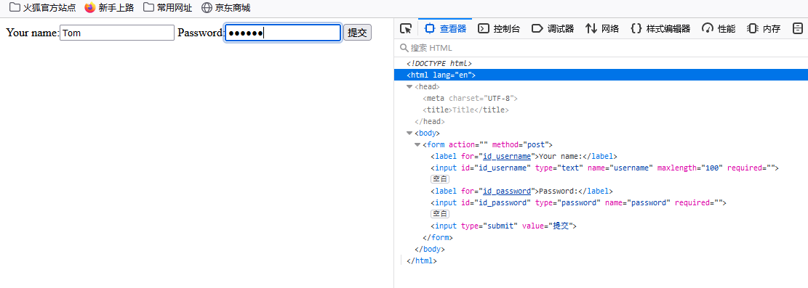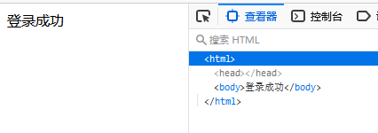


### 7.2 权限和权限管理

#### 7.2.1  默认权限

*Django内置了一个简单的权限系统，该系统为每个Django模型创建增、删、改、查四种权限*
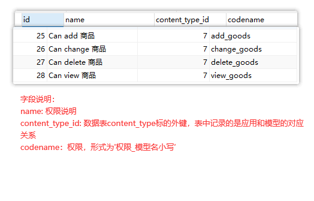

1. has_perm()
   *检查用户是否具有模种权限   has_perm('应用名.权限名_模型名')*

2. get_all_permissions()
   *查看用户的所有权限，返回值是当前权限的集合*

#### 7.2.2 权限管理

1. 用户权限管理

   *Django内指的权限类模型是Permission，User类与Permission类存在多对多关系，通关系字段属性user_permission对用户权限进行管理*

   | 方法                                          | 说明         |
   | --------------------------------------------- | ------------ |
   | user.user_permissions.set([permission_list])  | 添加权限列表 |
   | user.user_permissions.add(permission1,...)    | 添加权限     |
   | user.user_permissions.remove(permission1,...) | 移除权限     |
   | user.user_permissions.clear()                 | 清空权限     |

   ```python
   from django.contrib.auth.models import User, Permission
   
   # 获取添加用户的权限
   del_perm = Permission.objects.get(codename='delete_user')
   # 获取删除用户的权限
   add_perm = Permission.objects.get(codename='add_user')
   
   # 对当前管理员Tom操作
   user = User.objects.get(username='Tom')
   # 添加权限
   user.user_permissions.add(add_perm)
   # 移除权限
   user.user_permissions.remove(del_perm)
   # 清空权限
   user.user_permissions.clear()
   ```

2. 组权限管理

   | 方法                                      | 说明           |
   | ----------------------------------------- | -------------- |
   | group.permissions.set([permission_list])  | 添加组权限列表 |
   | group.permissions.add(permission1,...)    | 添加组权限     |
   | group.permissions.remove(permission1,...) | 移除组权限     |
   | group.permissions.clear()                 | 清空组权限     |

   ```python
   from django.contrib.auth.models import Permission, Group
   
   # 创建组
   group = Group.objects.create(name="Python")
   group.save()
   # 给Python组分配权限
   # 获取添加用户的权限
   del_perm = Permission.objects.get(codename='delete_user')
   # 获取删除用户的权限
   add_perm = Permission.objects.get(codename='add_user')
   # 添加
   group.permissions.add(del_perm)
   # 删除
   group.permissions.remove(add_perm)
   group.clear()
   ```

3. 用户加入组

   | 方法                           | 说明                       |
   | ------------------------------ | -------------------------- |
   | user.groups.set([group_list])  | 将用户添加到列表的所以组中 |
   | user.groups.add(group1,...)    | 将用户添加到多个组         |
   | user.groups.remove(group1,...) | 将用户从指定的组删除       |
   | user.groups.clear()            | 用户退出所有的组           |

   ```python
   from django.contrib.auth.models import Permission, Group,User
   
   user=User.objects.get(username='Tom')
   group=Group.objects.get(name='Python')
   # 添加用户到组
   user.groups.add(group)
   # 从Python组中移除用户
   user.groups.remove(group)
   # 用户退出所有组
   user.groups.clear()
   ```

#### 7.2.3 自定义权限

1. 使用模型中的Meta类的permissions属性自定义权限

   ```python
   from django.db import models
   class Author(models.Model):
       ...
       class Meta:
           # codename 表示权限名 name 表示的是对权限的描述
           permissions = (
               (codename1,name1),
               ('publish_article', 'can Publish Article'),
           )
   ```

2. 使用ContentType类自定义权限

   ```python
   from django.contrib.auth.models import Permission
   from django.contrib.contenttypes.models import ContentType
   
   # 通过ContentType类提供的get_for_model 获取到模型类实例
   content_type=ContentType.objects.get_for_model(Author)
   # 通过Permission类提供的create()为模型添加方法
   permission=Permission.objects.create(
       codename='publish_article',
       name='can publish Article',
       content_type=content_type
   )
   ```

### 7.3 Web请求认证

#### 7.3.1 用户的登录和请求

```python
from django.contrib.auth import authenticate, login,logout
from django.shortcuts import render
from django.views import View

# Create your views here.
class UserView(View):
    # 用户登录 本质是将一个已验证的用户附加到当前会话
    def post(self,request):
        username= request.POST.get('username')
        password= request.POST.get('password')
        user= authenticate(request,username=username,password=password)
        if user:
            # 将用户信息存入到Session会话中，第一个接受请求对象request，第二个是User对象
            login(request,user)
            return render(request,'index.html',{'username':username})
        else:
            return render(request,'login.html',{'account_error':'用户名密码错误'})
        
    # 退出登录
    def get(self,request):
        # 当前会话session中存储的登录数据会被清除，接受请求对象
        logout(request)
        return render(request,'login.html')
```

#### 7.3.2 限制用户访问

1. request.user.is_authenticated属性来判断用户是否登录

2. 装饰器@login_required()

   ```python
   @login_required(login_url='/login/')
   # login_url 重定向地址  
   
   
   settings.py 设置重定向地址
   	LOGIN_URL='/login/'
   ```

   login_url会优先在装饰器设置的重定向地址，没有的话在settings.py 中查找 LOGIN_URL

3. LoginView类 必须在最左侧 

   ```python
   class LoginView(LoginRequiredMixin, View):
       # 重定向地址
       login_url = '/login/'
   
       def get(self):
           return render('/login')
   ```

### 7.4 模版和身份验证

*当前**用户实例和其权限会被保存在模板变量的user和perm**中，在模板中可使用这俩个变量验证用户和用户权限*

1. 验证用户


   ```html
   
   欢迎你 {{ user.username }}
   
   <a href="/login/">注册</a>
   
   ```

2. 验证权限

   ```html
   检测当前登录用户是否有管理应用的area的所有权限
   
   
   检测是否有具体的权限
   
   
   ```

### 7.5 自定义用户模型

*自定义用户模型需要继承抽象类AbstractUser，在模型类自定义额外的字段*

```python
from django.db import models
from django.contrib.auth.models import AbstractUser

class User(AbstractUser):
    # 自定义用户模型类
    name = models.CharField(max_length=20, verbose_name='名字')
    phone = models.CharField(max_length=11, verbose_name='手机号码')

    class Meta:
        db_table = 'tb_user'
        verbose_name = '用户'
        verbose_name_plural = verbose_name
    
setting.py
	指向自定义用户模型类
	AUTH_USER_MODEL="应用名.模型名"
```

### 7.6 状态保持

#### 7.6.1 Cookie

*状态保持，服务器产生，保存在浏览器的键值对*

1. 设置cookie
   set_cookie()

   ```python
    def set_cookie(self, key, value='', max_age=None, expires=None, path='/',
                      domain=None, secure=False, httponly=False, samesite=None):
           
   key:表示Cookie的名称        
   value:表示Cookie的值
   max_age:表示Cookie的过期时间，以s为单位
   expires：表示Cookie的过期时间
   domain:表示Cookies生效的域名
   ```

   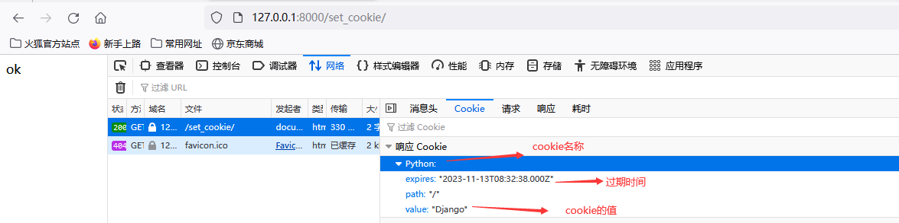
   
2. 读取Cookie 

   ```python
   def show_cookie(request):
       cookie = request.COOKIES.get('Python')
       return HttpResponse(f'Cookie的值为{cookie}')
   ```

   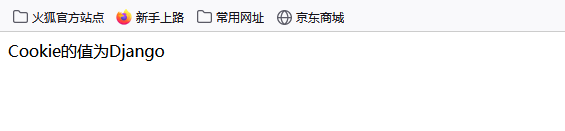
   
3. 删除cookie

   ```python
   def delete_cookie(request):
       response = HttpResponse('删除成功')
       response.delete_cookie('Python')
       return response
   ```

   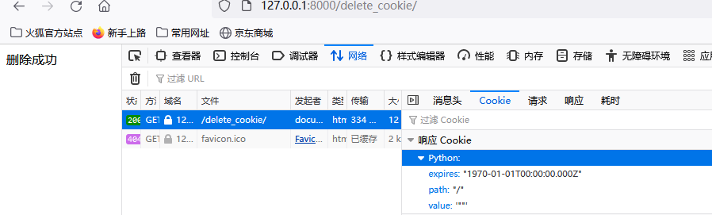
   

#### 7.6.2 Session

*Session数据存储在服务端，但是使用依赖于Cookie，服务器启用Session时会在浏览器Cookie中存储一个键为sessionid的Cookie数据，浏览器每次发起请求时都会把这个数据发送给服务器，服务器接受到请求后，会根据sessionid找到请求者对应的Session数据*

1. Session 操作
   django通过request对象的session属性管理会话信息

   | 操作                               | 说明                                              |
   | ---------------------------------- | ------------------------------------------------- |
   | request.session['键']='值'         | 以键值对的形式写入session                         |
   | request.session.get('键','默认值') | 读取session                                       |
   | request.session.set_expiry(value)  | 设置session过期时间                               |
   | session.flush()                    | 将session的缓存中的数据与数据库同步               |
   | session.clear()                    | 清除session中的缓存数据（不管缓存与数据库的同步） |

   set_expiry()单位s，value=0时，表示会话在用户关闭浏览器时过期，value=None，当前会话使用全局会话过期策略
   
2. 写入session
   settings.py

   ```python
   # 存储在本机内存
   CACHES = {
       'default': {
           'BACKEND': 'django_redis.cache.RedisCache',
           'LOCATION': 'redis://localhost:6379/0',  # Redis 服务器的连接信息
           'OPTIONS': {
               'CLIENT_CLASS': 'django_redis.client.DefaultClient',
           }
       }
   }
   
   SESSION_ENGINE = 'django.contrib.sessions.backends.cache'
   SESSION_CACHE_ALIAS = 'default'
   ```

   views.py
   
   ```python
   from django.http import HttpResponse
   # Create your views here.
   def set_session(request):
       request.session['Python'] = 'Django'
   
       return HttpResponse('session写入成功！')
   ```
   
   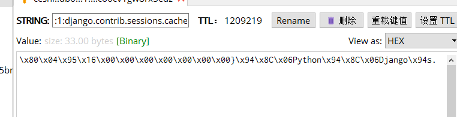
   
   
   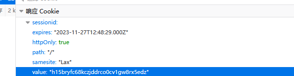
   
3. 读取session数据

   ```python
   def get_session(request):
       session=request.session.get('Python')
       return HttpResponse(f'python对应的值为{session}')
   ```

   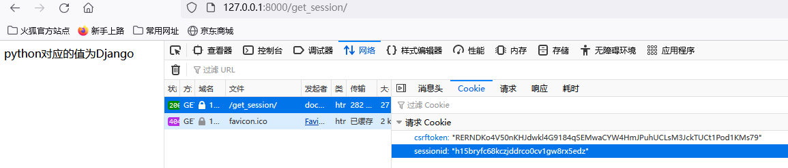

4. 删除session

   ```python
   def delete_session(request):
       request.session.flush()
       return HttpResponse('删除成功！')
   ```


   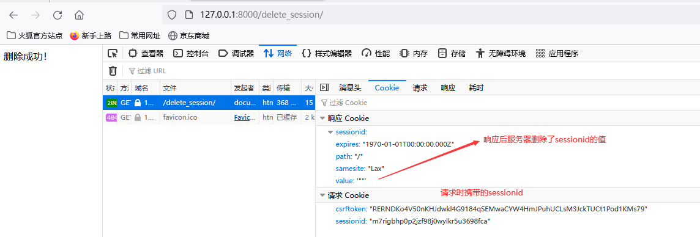

​	


## 8. 小鱼商城项目

**基于DJango+vue开发，采用前后端不分离的开发模式，后端模板引擎使用Jinja2。若整体刷新使用Jinja2进行渲染并返回页面，局部刷新则使用Ajax请求**


### 8.1 项目前期创建和准备

#### 8.1.1 创建项目

- 虚拟环境 
- 创建项目


#### 8.1.2 配置开发环境

- 项目环境分为开发环境和生产环境
  1. 开发环境：编写和调试项目代码的环境
  2. 生产环境：部署上线运行的环境

- 新建配置文件
  准备开发和生产配置文件
  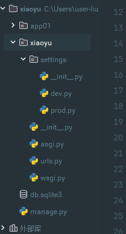

- 指定开发环境配置文件
  manage.py

  ```python
  # 指定开发环境的配置文件
  	os.environ.setdefault('DJANGO_SETTINGS_MODULE', 'xiaoyu.settings.dev')
  ```

  

#### 8.1.3 配置Jinja2模板

- 安装Jinja2 	pip install Jinja2

- 配置Jinja2模板引擎
  utils/jinja2_env.py

  ```python
  from django.contrib.staticfiles.storage import staticfiles_storage
  from django.urls import reverse
  from jinja2 import Environment
  
  
  def jinja2_environment(**options):
      env = Environment(**options)
      env.globals.update({
          'static': staticfiles_storage.url,
          'url': reverse,
      })
      return env
  ```

  dev.py

  ```python
  # 修改BASE_DIR
  BASE_DIR = Path(__file__).resolve().parent.parent.parent
  
  TEMPLATES = [
      {
          'BACKEND': 'django.template.backends.django.DjangoTemplates',
          'DIRS': [],
          'APP_DIRS': True,
          'OPTIONS': {
              'context_processors': [
                  'django.template.context_processors.debug',
                  'django.template.context_processors.request',
                  'django.contrib.auth.context_processors.auth',
                  'django.contrib.messages.context_processors.messages',
              ],
          },
      },
      {
          'BACKEND': 'django.template.backends.jinja2.Jinja2',
          'DIRS': [os.path.join(BASE_DIR, 'templates')],
          'APP_DIRS': True,
          'OPTIONS': {
              'context_processors': [
                  'django.template.context_processors.debug',
                  'django.template.context_processors.request',
                  'django.contrib.auth.context_processors.auth',
                  'django.contrib.messages.context_processors.messages',
              ],
              'environment': 'xiaoyu.utils.jinja2_env.jinja2_environment',
          },
      },
  ]
  ```

  

#### 8.1.4 配置数据库

- 配置mysql数据库

  ```python
  1. 安装pymysql 	pip install pymysql
  
  2. xiaoyu/__init__.py
  	import pymysql
  	pymysql.install_as_MySQLdb()
  
  3. dev.py
      DATABASES = {
          'default': {
              'ENGINE': 'django.db.backends.mysql',
              'NAME': 'xiaoyu',
              'USER': 'root',
              'PASSWORD': '678846',
              'HOST': 'localhost',
              'PORT': 3306
          }
      }
  ```

- 配置redis数据库

  ```python
  1. 安装django-redis
  
  2. dev.py
      CACHES = {
          'default': {
              'BACKEND': 'django_redis.cache.RedisCache',
              'LOCATION': 'redis://127.0.0.1:6379/0',
              'OPTIONS': {
                  'client_class': 'django_redis.client.DefaultClient'
              }
          },
          'session': {
              'BACKEND': 'django_redis.cache.RedisCache',
              'LOCATION': 'redis://127.0.0.1:6379/1',
              'OPTIONS': {
                  'client_class': 'django_redis.client.DefaultClient'
              }
          },
      }
      # 指定redis存储Session数据
      SESSION_ENGINE = 'django.contrib.sessions.backends.cache'
  
      # 指定使用名为session的redis配置项存储session数据
      SESSION_CACHE_ALIAS = 'session'
  ```


#### 8.1.5 配置项目日志

- 创建log目录/xiaoyu.log

- 配置工程日志
  dev.py

  ```python
  LOGGING = {
      'version': 1,
      'disable_existing_loggers': False,  # 是否禁用已存在的日志器
      'formatters': {  # 日志信息的显示方式
          'verbose': {
              'format': '%(levelname)s %(asctime)s %(module)s %(lineno)d %(message)s',
          },
          'simple': {
              'format': '%(levelname)s %(asctime)s %(module)s %(lineno)d %(message)s',
          },
      },
      'filters': {  # 对日志进行过滤
          'require_debug_true': {  # django在debug模式下才输出日志
              '()': 'django.utils.log.RequireDebugTrue',
          },
      },
      'handlers': {  # 日志处理方法
          'console': {  # 向终端输出日志
              'level': 'INFO',
              'filters': ['require_debug_true'],
              'class': 'logging.StreamHandler',
              'formatter': 'simple',
          },
          'file': {  # 向文件输出日志
              'level': 'INFO',
              'class': 'logging.handlers.RotatingFileHandler',
              'filename': os.path.join(os.path.dirname('./BASE_DIRS'), 'logs/xiaoyu.log'),  # 日志文件的位置
              'maxBytes': 300 * 1024 * 1024,
              'backupCount': 10,
              'formatter': 'verbose',
          },
      },
      'loggers': {  # 日志器
          'django': {  # 定义名为django的日志器
              'handlers': ['console', 'file'],  # 可以同时向终端和文件中输出日志
              'propagate': True,  # 是否继续传输日志信息
              'level': 'INFO',  # 日志器接受的最低日志级别
          },
      },
  }
  ```

  

#### 8.1.6  配置前端静态文件

- 准备静态文件 

- 指定静态文件路径
  dev.py

  ```python
  # 设置静态文件的路由地址
  STATIC_URL = '/static/'
  # 设值静态文件路径
  STATICFILES_DIRS = [os.path.join(BASE_DIR, 'static')]
  ```

- 浏览器访问静态资源
  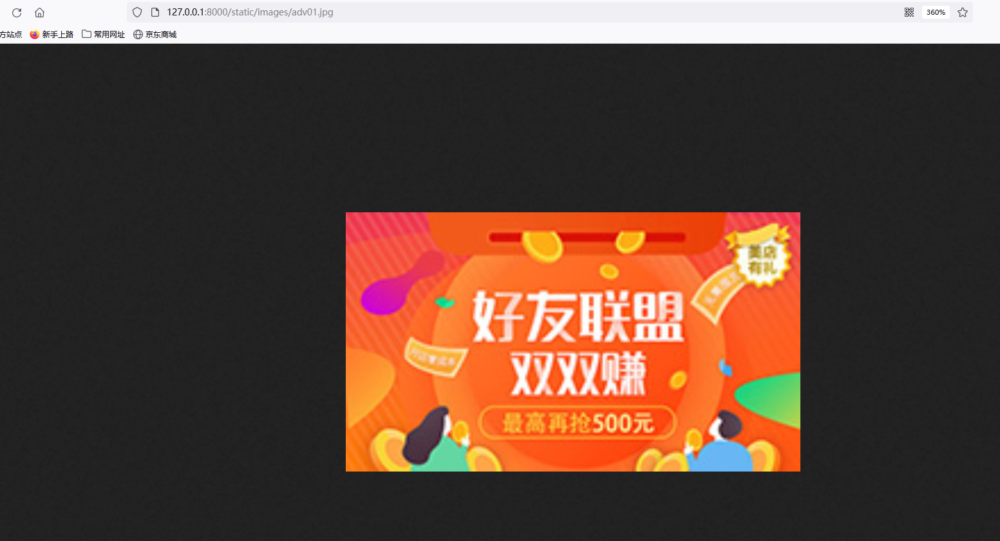


#### 8.1.7 配置应用目录

1. 用户模块 users
2. 验证模块 verifications
3. 首页广告 contents
4. 商品模块 goods
5. 购物车模块 carts
6. 订单模块 orders
7. 支付模块 payment


### 8.2 用户管理和验证

#### 8.2.1 自定义用户模型

```python
users/models.py
	# 继承Django内置的模型类User
    
	from django.contrib.auth.models import AbstractUser
    from django.db import models


    class User(AbstractUser):
        """自定义用户模型类"""
        # 手机号 ，因为 继承于 AbstractUser 的里面有了用户名 密码等等 但是对于xiaoyu_mall  需要手机号（得自己写一个）
        mobile = models.CharField(max_length=11, unique=True, verbose_name="手机号")

        # 修改模型名字
        class Meta:
            # 指定admin  新建的数据保存到什么表里面，  有默认的表名 ： 应用名+模型名 即 goods_goods
            db_table = 'tb_users'  # 自己 设 一个数据表名，做好这些后进行数据库的迁移
            verbose_name = '用户'  # 详细名称
            verbose_name_plural = verbose_name

        def __str__(self):  # 魔法方法  当我打印这个对象时 呈现出 return 的值
            return self.username


dev.py
	# 指定项目的用户模型类
	AUTH_USER_MODEL = 'users.User'
```


#### 8.2.2 用户注册

- 用户注册
  users/views.py

  ```python
  from django.contrib.auth import login
  from django.db import DatabaseError
  from django.http import HttpResponseForbidden
  from django.shortcuts import render, redirect
  from django.urls import reverse
  from django.views import View
  
  from users.models import User
  
  
  # Create your views here.
  
  class RegisterView(View):
  
      def get(self, request):
          # 提供用户注册页面
          return render(request, 'register.html')
  
      def post(self, request):
          # 1.接收请求参数
          username = request.POST.get('username')
          password = request.POST.get('password')
          password2 = request.POST.get('password2')
          mobile = request.POST.get('mobile')
          allow = request.POST.get("allow")  # 是否同意协议
          # 判断用户是否勾选协议
          if allow != 'on':
              return HttpResponseForbidden("请勾选用户协议")
  
          # 保存注册数据：是注册业务的核心
          # 异常，在数据库中  desc db_user  可以看到用户名、密码、手机号都是唯一的（UNI），如果出现相同的 则抛出异常
          try:
              # 注册成功的用户对象
              user = User.objects.create_user(username=username, mobile=mobile, password=password, )
          except DatabaseError:
              return render(request, 'register.html', {'register_errmsg': '注册失败'})
  
          # 注册成功后，将用户的登陆信息实现状态保持， 会保存注册用户的session信息   （下面还有一个登陆的  也要保存用户的session信息）
          login(request, user)
  
          # 响应登录结果:重定向到首页
          temp_url = reverse('contents:index')  # (广告 ： index)
          print(temp_url)
          response = redirect(temp_url)
          # redirect理解过来是这样用  redirect("https://www.baidu.com/")
  
          # 为了实现在首页右上角展示用户信息，我们需要将用户名缓存到cookie中
          response.set_cookie('username', user.username, max_age=3600 * 24 * 14)
          return response
      
  user/urls.py
  	from django.urls import path
  
      from users import views
  
      app_name = 'users'
  
      urlpatterns = [
          # 用户注册
          path('register/', views.RegisterView.as_view(), name='register')
  
      ]
  ```


- 用户名和手机号唯一校验

  通过Ajax向后端发起get请求，判断

  ```python
  users/views.py
  
  	class UsernameCountView(View):
      """判断用户名是否重复注册"""
  
          def get(self, request, username):
              # 如果为1 这说明用户已存在
              count = User.objects.filter(username=username).count()
              return JsonResponse({'code': RETCODE.OK, 'errmsg': 'OK', 'count': count})
  
  
      class MoblieCountView(View):
          def get(self, request, mobile):  # 参数名 mobile 不能随意修改，取决于路由中正则表达式中的名字
              count = User.objects.filter(mobile=mobile).count()  # 过滤查询
              return JsonResponse({'code': RETCODE.OK, 'errmsg': 'OK', "count": count})  # 返回Json为字典形式
          
          
  users/urls.py
  	re_path('usernames/(?P<username>[a-zA-Z0-9_-]{5,20})/count/', views.UsernameCountView.as_view()),
      re_path(r'mobiles/(?P<mobile>1[3-9]\d{9})/count/', views.MoblieCountView.as_view()),
  ```

  

- 验证码

  图形验证码
  ```python
  将验证码存储到redis里，将uuid作为唯一标识
  
  redis配置 dev.py
  
  	    "verify_code": {  # 保存验证码
          "BACKEND": "django_redis.cache.RedisCache",
          "LOCATION": "redis://127.0.0.1:6379/2",  # 选择redis2号库
          "OPTIONS": {
              "CLIENT_CLASS": "django_redis.client.DefaultClient",
          }
      }
      
      
  配置文件 verifications/contants.py
  	# 图形验证码有效期，单位：秒
      IMAGE_CODE_REDIS_EXPIRES = 300
      # 短信验证码有效期，单位：秒
      SMS_CODE_REDIS_EXPIRES = 300
      # 短信模板
      SEND_SMS_TEMPLATE_ID = 1
      # 60s内是否重复发送的标记
      SEND_SMS_CODE_INTERVAL = 60
  
      
  verifications/views.py
      import logging
  
      from django.http import HttpResponse
      from django.views import View
      from django_redis import get_redis_connection
  
      from verifications import constants
      from verifications.libs.captcha import captcha
  
      # Create your views here.
  
      # 日志记录器
      logger = logging.getLogger('django')
  
  
      class ImageCodeView(View):
          def get(self, request, uuid):
              """
              :param uuid:通用唯一识别码，用于唯一标识该图形验证码属于哪一个用户的
              :return:image/jpg
              """
              # 生成图形验证码
              text, image = captcha.captcha.generate_captcha()
              # 保存图形验证码
              redis_conn = get_redis_connection('verify_code')
              # setex 保存到redis中 并设置生存时间
              redis_conn.setex('img_%s' % uuid, constants.IMAGE_CODE_REDIS_EXPIRES, text)
              # 响应图形验证码
              return HttpResponse(image, content_type='image/jpg')
  
          
          
  verifications/urls.py 设置u路由
  	urlpatterns = [
      	# 图形验证码
      	path('image_codes/<uuid:uuid>/', views.ImageCodeView.as_view()),
  	]
  ```
  
  手机验证码
  
  1. aAjax 请求短信验证码
  2. 先从redis提取图形验证码，然后删除redis中验证码
  3. 比较用户输入的图形验证码和内存中的验证码
  4. 相同生成短信验证码并存储到redis 将uuid作为key
  
  
  
  
