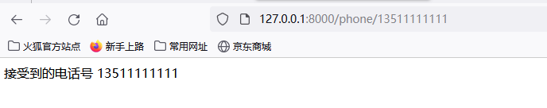
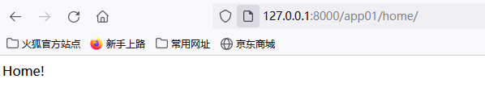
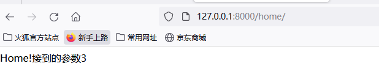
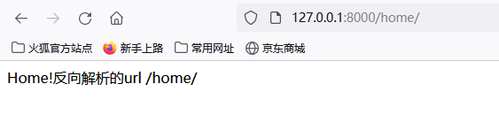
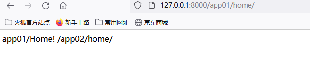
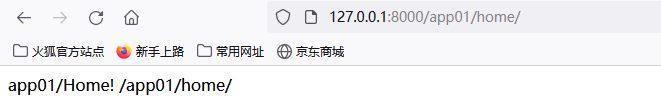
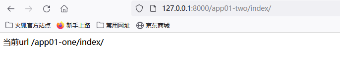
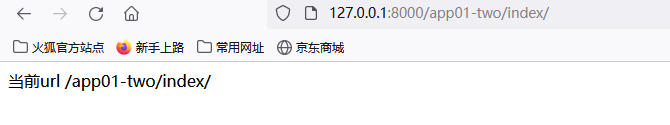
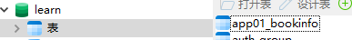

# Django

## 1.路由系统


### 1.1路由转化器

**内置路由转化器**

```python
str :匹配任何非空字符串 不包括'/'
int	:匹配0和正整数
slug：数字，字母，下划线，连字符
uuid：唯一识别码
path：匹配任意非空字符 包括'/'


uuid生成方式：
    1.时间戳+随机数：这种方法基于当前时间戳和随机数生成UUID，以确保唯一性。
    2.MAC地址+时间戳：这种方法使用计算机的MAC地址和当前时间戳生成UUID，通常用于网络通信中。
    3.命名空间+名称：这种方法将一个命名空间和名称组合在一起生成UUID，以确保在同一命名空间中的唯一性。
```

**自定义路由转化器**

```python
app01/my_converter.py
from django.urls import register_converter

class MyConverter:
    regex = '1[3-9]\d{9}'

    # 将匹配到的字符串转化为传递视图的类型
    def to_python(self, value):
        return value

    # 将python数据类型转化为URL使用的字符串
    def to_url(self, value):
        return value

# 第一个参数接受自定义路由转化器类，URL中使用的路由转化器名称
register_converter(MyConverter, 'mobile')


mysite/urls.py
from django.contrib import admin
from django.urls import path,include
from app01 import views,my_converter
urlpatterns = [
    path('phone/<mobile:phone_num>', views.phone)
]

app01/views.py
def phone(request, phone_num):
    return HttpResponse(f'接受到的电话号 {phone_num}')
```




### 1.2正则表达式匹配url

**命名正则表达式**

```python
urlpatterns = [
    re_path('phone/(?P<phone_num>1[3-9]\d{9})', views.phone)
]
```

**未命名正则表达式**

```python
urlpatterns = [
    re_path('phone/(1[3-9]\d{9})', views.phone)
]
```


### 1.3路由分发

```python
include(module,namespace,pattern_list)
module:指定url模块
namespace：实例的命名空间
pattern_list：可迭代的path和re_path

方式一：
mysite/urls.py
urlpatterns = [
    path('app01/', include('app01.urls')),
]

app01/urls.py
urlpatterns=[
    path('home/',views.home)
]
app01/views.py
def home(request):
    return HttpResponse('Home!')


方式二：
mysite/urls.py
app01_urlpatterns = [
    path('home/', views.home)
]
urlpatterns = [
    path('app01/', include(app01_urlpatterns)),
]
```



### 1.4向视图传递额外参数

```python
urls.py
urlpatterns = [
    path('home/',views.home,{'id':3})
]
views.py
def home(request,id):
    return HttpResponse(f'Home!接到的参数{id}')
```




### 1.5 url命名与命名空间

**反向解析**

```python
reverser(viewname,..)	url模式名称或可调用的视图函数

urls.py
urlpatterns = [
    path('home/',views.home,name='home'),
]
views.py
def home(request):
    return HttpResponse(f'Home!反向解析的url   {reverse(home)}')

```




**应用命名空间**

多个应用可能包含同名url，反向解析时会出现混乱

```python
mysite/url.py
urlpatterns = [
    path('app01/',include('app01.urls')),
    path('app02/',include('app02.urls')),
]

app01/urls.py
urlpatterns=[
    path('home/',views.home,name='home'),
]

app01/veiws.py
def home(request):
    return HttpResponse(f'app01/Home! {reverse("home")}')

app02/urls.py
urlpatterns=[
    path('home/',views.home,name='home'),
]

app02/veiws.py
def home(request):
    return HttpResponse(f'app02/Home! {reverse("home")}')
```




避免反向解析产生混乱，使用命名空间区分不同应用

```python
在app01/urls.py 和 app02/urls.py下加入
app_name="app01"
app_name="app02"
```




**实例命名空间**

多个url实例同时对应一个应用页会出现解析混乱

```python
mysite/urls.py
urlpatterns = [
    path('app01-one/',include('app01.urls')),
    path('app01-two/',include('app01.urls')),
]

app01/urls.py
app_name="app01"
urlpatterns=[
    path('index/',views.index,name='index'),
]

app01/views.py
def index(request):
    return HttpResponse(f'当前url {reverse("app01:index")}')
```


使用实例命名空间解决问题

```python
mysite/urls.py
urlpatterns = [
    path('app01-one/',include('app01.urls',namespace='one')),
    path('app01-two/',include('app01.urls',namespace='two')),
]
```




## 2.模型

### 2.1 定义与使用模型

```python
模型类对应一张数据表，模型类的每个属性对应数据表的一个字段

生成迁移文件 python manage.py makemigrations  生成成功后 应用文件下的migrations下会创建一个文件，包含生成数据表的代码
执行迁移文件 python manage.py migrate


class BookInfo(models.Model):
    name = models.CharField(max_length=20, verbose_name='名称')
    pub_date = models.DateField(verbose_name='发布日期')
    read_count = models.IntegerField(default=0, verbose_name='阅读量')
    comment_count = models.IntegerField(default=0, verbose_name='评论量')
    is_delete = models.BooleanField(default=False, verbose_name='逻辑删除')

    def __str__(self):
        return self.name
生成的表名是 app01_bookinfo
```




**mysql配置**

```python
settings.py
DATABASES = {
    'default': {
        'ENGINE': 'django.db.backends.mysql',
        'NAME': 'learn',
        'USER': 'root',
        'PASSWORD': '',
        'HOST': '127.0.0.1',
        'PORT': '3306',
    }
}

mysite.py/_init_.py
import pymysql
pymysql.install_as_MySQLdb()
```


### 2.2 模型的字段

**字段类型**

```python
1.AutoField 	自增字段
2.BooleanField	布尔类型字段
3.CharField		字符串类型字段，必选参数max_length
4.DateField		日期字段
5.IntegerField	整型字段
6.DatetimeField 日期时间字段
7.TextField		文本字段
8.EmailField	邮箱字段，会检查邮箱的合法性

时间日期俩个特别的参数
auto_now:最后一次修改的时间
auto_now_add:第一次创建的时间
```

 **关系字段**

```python
一对一
OneToOneField()	国家和总统

一对多
ForeignKey()	国家和人民

多对多
ManyToManyField()	老师和学生

```

**字段的通用参数**

```python
null		表示字段是否为空
default		设置字段的默认值
blank		字段是否为空白
choices		字段的选项，二维列表或二维元祖
primary_key	主键字段
unique		字段必须唯一
db_column	字段在表中的列名，未指定，则字段名作为列名
db_index	为字段创建索引
```


### 2.3 模型的元属性

**模型类中添加内部类Meta定义模型的元属性**

```python
class BookInfo(models.Model):
    ...
    class Meta:
        db_table='tb_bookinfo'
 

1.tb_table		设置表名
2.abstract		表示该类是抽象类，定义多个模型类的共有信息，不能被实例化，只能作为其他模型的基类
3.app_label		未注册的话，指明当前模型所属应用
4.ordering		
	排序	ordering=[id]  倒序 ordering=[-id]
    	ordering=['字段1','字段2']
5.verbose_name	显示在后台管理系统页面上，直观可读的表名
```


### 2.4 Manager 管理器

**管理器名称**

```python
class BookInfo(models.Model):
	...
    #重命名管理器名称
    rename_object = models.Manager()
```

**自定义管理器**

```python
1.添加格外的管理器方法
class BookManger(models.Manager):
    # 添加方法
    def name_date(self):
        all_obj = self.all()
        all_obj = [i.name + ':' + '是本好书' for i in all_obj]
        return all_obj


class BookInfo(models.Model):
    name = models.CharField(max_length=20, verbose_name='名称')
    pub_date = models.DateField(verbose_name='发布日期')
    read_count = models.IntegerField(default=0, verbose_name='阅读量')
    comment_count = models.IntegerField(default=0, verbose_name='评论量')
    is_delete = models.BooleanField(default=False, verbose_name='逻辑删除')
    # 使用指定管理器
    objects = BookManger()

    def __str__(self):
        return self.name

    
2.修改原始查询集
class BookManger(models.Manager):
    # 修改get  可以修改all()方法获取的查询集
    def get_queryset(self):
        return super(BookManger, self).get_queryset().filter(id=1)
all()方法只返回包含一个信息queryset对象
```

### 2.5 数据的增删改查

**添加数据**

```python
1.模型类的管理器create()方法
BookInfo.objects.create(name='斗破苍芎',read_count=100,pub_date='2015-1-1',is_delete=0,comment_count=200)

2.模型类对象的save()方法
book_obj=BookInfo.objects.create(name='斗破苍芎',read_count=100,pub_date='2015-1-1',is_delete=0,comment_count=200)
book_obj.save()
```

**查询数据**

```python
模型类的管理器提供的四个方法
1.all()
返回所有记录，返回值是一个QuerySet对象，列表结构里面是模型类对象
2.filter()
返回满足条件的记录，返回值是一个QuerySet对象
比较运算符 属性名__比较运算符=值
3.exclud()
返回不满足条件的记录，返回值是一个QuerySet对象
4.get()
返回符合条件的记录，返回值是一个模型类对象
```

| 运算符            | 说明                              |
| :---------------- | :-------------------------------- |
| gt   gte  lt  lte | >  >=  <  <=                      |
| in                | 字段值是否存在于一个列表中        |
| range             | 字段值是否在指定区间 （包含俩端） |
| exact             | 字段值是否精确相等                |
| iexact            | 忽略大小写 加i                    |
| contains          | 字段值的模糊查询                  |
| startswith        | 字段值以···开头                   |
| endswith          | 字段值以···结尾                   |

**删除数据**

```
delete()
```

**更新数据**

```python
update()是管理器的方法
BookInfo.objects.filter(id=1).update(name='武动乾坤')
```


### 2.6 QuerySet对象

***QuerySet对象是Django的数据查询集，表示的是从数据库中获取的对象集合***

**多表查询**

```python
正向和方向查询：与关联字段所在位置有关
若关联字段在当前表中，从当前表中查询关联表称为正向查询
若关联字段不在当前表中，从当前表中查询关联表称为反向查询

正向查询靠属性，反向查询靠表名小写
```

**F对象和Q对象**

|                           | **语法**             | 示例                                            |
| ------------------------- | :------------------- | ----------------------------------------------- |
| **F对象  比较表中的字段** | F(字段名)            | read_count__gt=F('comment_count')               |
| **Q对象  多条件查询**     | Q(属性名__运算符=值) | Q(read_count__gt=120),Q(comment_count)    取反~ |

**QuerySet的特性**

1. 惰性执行：执行创建查血集操作时不会立即访问数据库，而是需要使用查询集数据时才会对数据库进行访问
2. 缓存：首先从缓存中读取数据，若缓存没有，再从数据库中查询数据

### 2.7 执行原生sql语句

1. Manager.raw()执行sql查询语句
   ```python
   raw(raw_query,params,translations)
   raw_query:原始sql语句
   params:查询条件参数，接受列表或字典
   translations：字段映射表，字典类型数据
   
   BookInfo.objects.raw('select * from bookinfo where id=1')
   params = {'id': 1}
   BookInfo.objects.raw('select * from bookinfo where id=%(id)s', params)
   params = ['id']
   BookInfo.objects.raw('select * from bookinfo where %s=1', params)
   translations = {'pk': 'id', 'read_count': 'r_count', 'comment_count': 'c_count'}
   BookInfo.objects.raw('select * from bookinfo ', translation=translations)
   # 和这个意思一致
   BookInfo.objects.raw('select pk as id,read_book as r_count,comment_count as c_count from bookinfo ')
   ```

   

2. 利用游标对象执行sql语句
   ```python
   from django.db import connection
   cursor=connection.cursor()
   cursor.execute('sql')
   ```

   

## 3. 模版


### 3.1  模版查找顺序

1. 当前应用的templates文件夹下查找
2. 当前项目的templates文件夹下查找
3. Django内置模版中查找

### 3.2模版语言

**变量**:模版不明确模版变量类型，模版引擎会按照以下顺序尝试

1. 将变量视为字典，根据键值访问变量的值
2. 将变量视为对象，尝试访问变量的属性或方法（不带括号）
3. 尝试访问变量的数字索引

**过滤器**

1. 


