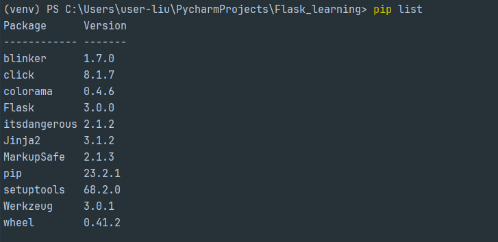
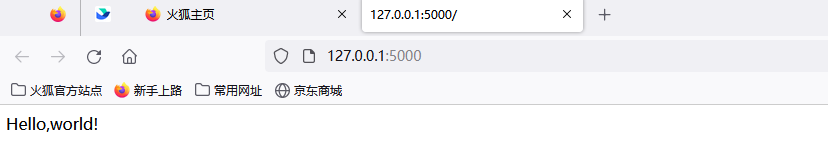

## 1. 认识微框架Flask

### 1. 虚拟环境

*虚拟环境*：同一个系统解释器，运行不同版本的包，实现项目之间的隔离

使用 *virtualenv* 工具

```python
#安装virtualenv
pip install virtualenv

#创建虚拟环境
virtualenv 虚拟环境名	使用的是系统变量设置的python解释器
virtualenv -p python解释器安装路径 虚拟环境名	用户显示指定的python解释器

#使用虚拟环境
项目目录/Scripts/activate

#退出虚拟环境
deactivate
```


requirement.txt 文件
```sql
记录每一个项目的依赖包和版本

#将虚拟环境依赖的包和版本号记录到requirement.txt文件
pip freeze >requirement.txt

#读取requirement.txt文件，安装依赖包
pip install -r requirement.txt
```


### 2. 安装Flask

```python
#安装最新
pip install flask

#安装指定版本
pip install flask==2.0.2
```

查看当前虚拟环境下安装的包以及版本
```python
pip list
```




### 3. 开发第一个*flask* 程序

#### 3.1 编写hello word程序

```python
from flask import Flask

# 实例化flask类
app = Flask(__name__)


# 定义视图函数，并为函数注册路由
@app.route('/')
def hello_flask():
    return '<p>Hello,world!</p>'


if __name__ == '__main':
    # 启动开发服务器
    app.run()
```

启动成功



#### 3.2 