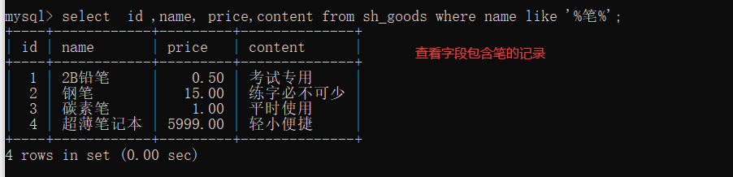
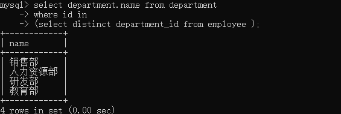

## 1. 数据库基本操作

### 1. 数据库操作

#### 1.1.1 创建数据库

基本语法 create dababase 数据库名称 [库选项] 	[]表示的是可选参数
创建数据库


如果数据库已经存在，程序就会报错，可以添加 if not exists


#### 1.1.2 查看数据库

1. 查看mysql服务器所有数据库
   
2. 查看指定数据库的创建信息
   

#### 1.1.3 选择数据库


可以在登录数选择数据库 mysql -u 用户名 -p 密码  数据库名称

#### 1.1.4 删除数据库


### 1.2 数据表操作

#### 1.2.1 创建数据表

create table [if not exists] 表名(字段名 字段类型 [字段属性]...) [表选项]


#### 1.2.2 查看数据表

1. show tables [like 匹配模式]
   匹配模式有俩种 % 表示匹配任意长度的字符串 _  表示匹配一个字符


2. 查看数据表的相关信息
    show table status [from 数据库名] [like 匹配模式]

   
   数据表相关信息

   

#### 1.2.3 修改数据表

1. 修改数据库表名

   单表修改 	alter table 旧表名 rename [to|as] 新表名;
   多表修改	 rename table 旧表名1 to 新表名1 [, 旧表名2 to 新表名2]

   
   
2. 修改表选项
   alter table 表名 表选项[=]值

   

#### 1.2.4 查看表结构

1. 查看数据表的字段信息
   查看所有字段信息  [describe|desc] 数据表名;
   查看指定字段信息  [describe|desc] 数据表名 字段名；
   

2. 查看数据表的创建语句

   show create table 表名
   

3. 查看数据表结构
   show [full] columns from 数据库名.数据表名;
   

#### 1.2.5 修改表结构

1. 修改表字段名
   alter table 数据表名 change 旧字段 新字段 字段类型[字段属性];

   

2. 修改字段类型

   alter table 数据表名 modify 字段名 新类型[字段属性]
   

3. 修改字段位置
   alter table 数据表名 modify 字段名1 数据类型 [字段属性]  [first|after 字段名2]
   

4. 新增字段
   新增一个字段，可以指定其位置 alter table 数据库表名 add 新字段名 新字段类型 [first|after 字段名]
   同时新增多个字段 alter table 数据表名 add (新字段名1 新字段类型1,新字段名2 新字段类型2,新字段名3 新字段类型3,...)
   
5. 删除字段 
   alter table 数据表名 drop 字段名
   

#### 1.2.6 删除数据表

drop table if exists 数据表1 [,数据表2]...;


### 1.3  数据操作

#### 1.3.1 添加数据

1. 为所有字段添加数据
   insert [into] 数据表名 values (值1[,值2]...)
   

2. 为部分字段添加数据
   insert 数据表名 (字段名1[,字段名2]...) values (值1,[,值2]...)

   insert 数据表名 set 字段名1=值1  [, 字段名2=值2]...
   

3. 一次添加多行数据
   insert 数据表名 [(字段列表)] values (值列表)  [,(值列表)]...
   

#### 1.3.2 查询数据

1. 查询表中全部数据
   

2. 查看表中部分字段
   

3. 简单条件查询
   select * from 数据库 where 字段名=值
   

#### 1.3.3 修改数据

update 数据表名 set 字段1=值1 [,字段2=值2,...]  [where 条件表达式]


#### 1.3.4 删除数据

delete from 数据表名 [where 条件表达式]


## 2. 数据类型和约束

### 2.1 数据类型

#### 2.1.1 数字类型

1. 整数类型
   

   

   

2. 浮点类型
   float 的精度为6位或7位，double 的精度大约为15位
   

3. 定点数

   decimal(M,D) M表示数字总位数，D表示小数点后面位数
   

#### 2.1.2 时间和日期类型

1. year 表示年份
   

2. date 表示日期
   

3. timestamp 表示日期时间
   

#### 2.1.3 字符串类型

| 数据类型 | 说明           |
| -------- | -------------- |
| char     | 固定长度字符串 |
| varchar  | 可变长度字符串 |
| text     | 大文本数据     |
| enum     | 枚举类型       |
| set      | 字符串对象     |

1. char 和 varchar  保存字符串数据
   区别

   | 插入值 | char(4) | varchar(4) |
   | ------ | ------- | ---------- |
   | ''     | 4字节   | 1字节      |
   | 'a'    | 4字节   | 2字节      |
   | 'ab'   | 4字节   | 3字节      |
   | 'abc'  | 4字节   | 4字节      |
   | 'abcd' | 4字节   | 5字节      |

   

2. text  保存大文本数据

   

3. enum 枚举类型  
   enum('值1','值2','值3',.....,'值n',)
   只能从枚举列表中选取一个
   

4. set  可以选择一个值或多个值保存
   


### 2.2 表的约束

#### 2.2.1 默认约束

字段名 数据类型 default 默认值;


删除默认值 alter table my_default modify age int unsigned ;
添加默认值 alter table my_default modify age int unsigned default 18;

#### 2.2.2 非空约束

非空指的是字段的值不能为NUll
字段名 数据类型 not null


#### 2.2.3 唯一约束

保证数据表中字段的唯一性，即表中字段不能重复出现

- 列级约束 定义在一个列上，只对该列起约束作用
- 表级约束 独立于列的定义，可以应用在一个表的多列上


复合唯一约束
表级创建唯一约束时，可以添加多个字段，组成复合唯一约束，特点是多个字段值相同才视为重复记录。


#### 2.2.4 主键约束

主键可以唯一标识表中的记录，由primary key 定义，相当于唯一约束和非空约束的组合，要求字段不能重复，也不能出现null值，每张表中包含一个主键，复合主键需要多个字段确定一条记录的唯一性

- 列级约束 字段名 数据类型 primary key
- 表级约束 primary key (字段1，字段2，...)


### 2.3 自动增长

字段名 数据类型 auto_increment

1. 一个表中只能有一个自增字段，数据类型必须是整数，且定义为键，如unique,primary
2. 插入null、0、default或插入时省略该字段，都会自增，如插入的是个具体的值，则不会使用自动增长值
3. 从1开始每次加1，插入值大于自增值，下次使用最大值加1，插入值小于自增值，则不会产生影响
4. 使用delete删除记录时，自增值不会减少或填补空缺


查看自动增长值


修改自动增长值


### 2.4 字符集和校对集

#### 2.4.1 简介

1. 字符集
   字符指计算机保存的各种文字和符号，计算机采用的是二进制保存数据，用户输入的字符按照一定规则转化为二进制保存（字符编码），将编码规则组合起来形成字符集
   


2. 校对集
   为不同字符集指定排序和比较规则。

   - ci 表示不区分大小写
   - cs 表示区分大写
   - bin 表示以二进制方式比较

   

#### 2.4.2 字符集与校对集设置

1. 数据库
   - charset set [=] charset_name
   - collation [=] collation_name

```sql
# 创建数据库，指定字符集 utf8 使用默认校对集 utf8_general_ci
create database mydb charset set utf8;
# 创建数据库，指定字符集 utf8 校对集 utf8_bin
create database mydb charset set utf8 collation utf8_bin;
```


2. 数据表

   ​	没有指定 使用数据库字符集

   - charset set [=] charset_name
   - collation [=] collation_name

```sql
create table my_charset(username varchar(20))charset utf8 collation utf8_bin;
```


3. 字段 

   没有指定 使用数据表字符集

   在字段属性设置字符集和校对集

   ```sql
   create table my_charset(username varchar(20) charset set utf8 collation utf_bin);
   ```


## 3. 数据库设计

#### 3.1 设计范式

为了避免不规范的数据库出现数据冗余，造成插入、删除、更新操作异常的情况，就要满足一定的规范化要求

1. 第一范式
   指的是数据表中每一列都是不可分割的基本数据项，同一列不能有多个值，即实体的某个的属性不能有多个值，或者不能有重复的值

   

2. 第二范式
   实体的属性完全依附于主键，不能仅依赖于主键的一部分（对于复合主键而言），非主键字段完全依附于主键字段

   

3. 第三范式
   数据表中每一列数据都和主键直接相关，不能间接相关，非主键字段不能相互依赖


创建一个商品表并插入数据
```sql
use mydb;
-- 创建表
create table sh_goods(
id int unsigned primary key auto_increment,
category_id int unsigned not null default 0,
name varchar(120) not null default '',
keyword varchar(225) not null default '',
content text not null,
price decimal(10,2) unsigned not null default 0,
stock int unsigned not null default 0,
score decimal(3,2) unsigned not null default 0,
comment_count int unsigned not null default 0
);
-- 插入数据
INSERT INTO sh_goods (id, category_id, name, keyword, content, price, stock, score, comment_count) VALUES
  (1, 3, '2B铅笔', '文具', '考试专用', 0.5, 500, 4.9, 40000),
  (2, 3, '钢笔', '文具', '练字必不可少', 15, 300, 3.9, 500),
  (3, 3, '碳素笔', '文具', '平时使用', 1, 500, 5, 98000),
  (4, 12, '超薄笔记本', '电子产品', '轻小便捷', 5999, 0, 2.5, 200),
  (5, 6, '智能手机', '电子产品', '人人必备', 1999, 0, 5, 98000),
  (6, 8, '桌面音箱', '电子产品', '扩音装备', 69, 750, 4.5, 1000),
  (7, 9, '头戴耳机', '电子产品', '独享个人世界', 109, 0, 3.9, 500),
  (8, 10, '办公电脑', '电子产品', '适合办公', 2000, 0, 4.8, 6000),
  (9, 15, '收腰风衣', '服装', '春节潮流单品', 299, 0, 4.9, 40000),
  (10, 16, '薄毛衣', '服装', '居家旅行必备', 48, 0, 4.8, 98000);
```


## 4. 单表操作

### 4.1 数据操作

#### 4.1.1 复制表结构和数据

1. 复制已有的表结构
   创建一个与已用数据表相同结构的数据表时  

   ```sql
   create table [if not exists] 表名 like 旧表名
   ```

   
   
2. 复制已有的表数据
   ```sql
   insert 数据表名1 [(字段列表)] select [(字段列表)] from 数据表名2
   ```

   
   解决主键冲突问题
   


#### 4.1.2 解决主键冲突

1. 主键冲突更新
   当插入数据的过程中发生主键冲突，则插入数据操作利用更新的方式实现

   ```sql
   insert 数据表名 [(字段列表)] values (值列表) on duplicate key set name='橡皮',content='修正错误',keyword='文具'
   
   insert my_goods(id,name,content,keyword) values(20,'橡皮','修正错误','文具');
   insert my_goods(id,name,content,keyword) values(20,'橡皮','修正错误','文具') on duplicate key update name='橡皮',content='修正错误',keyword='文具';
   ```

   


2. 主键冲突替换
   当插入数据的过程中发生主键冲突，则删除此条记录，并重新插入

   ```sql
   replace 数据表名 [(字段列表)] values (值列表)
   ```

   

   

#### 4.1.3 清空数据

清空指定表中的全部数据
```sql
truncate table [表名];
```

truncate 和delete的区别：

- 实现方式不同 truncate 本质执行删除数据表的操作，然后根据表文件创建数据表的方式来实现数据清空操作。而delete语句则是逐条删除数据表中保存的记录。
- 执行效率不同 针对大型数据表时，truncate方式效率更高
- 对auto_increment 的字段影响不同，truncate 清空数据之后，自动增长值从默认初始值开始，delete删除表中记录，不影响自动增长值
- 返回值含义不同，truncate返回值无意义，而delete返回的是被删除的记录

向my_goods 插入十条记录，truncate删除后重新插入一条值


向my_goods 插入十条记录，delete删除后重新插入一条值


#### 4.1.4 去除重复记录

```sql
select distinct [字段列表] from 数据表
```


### 4.2 排序与限量

#### 4.2.1 排序

1. 单字段排序
   ```sql
   按照一个指定的字段进行升序或降序
   select * |[字段列表] from order by 字段名 [desc|asc]
   ```

   
   
2. 多字段排序
   多字段排序首先根据字段1排序，当字段1的值相同时，在按照字段2排序，依次类推

   ```sql
   select *|[字段列表] from 数据表名 order by 字段名1 [asc|desc] [,字段名2 [asc|desc]] ...
   ```

   


#### 4.2.2 限量

limit 可以限定记录的数量，也可以指定查询从那条记录开始
```sql
select *|[字段列表] from 数据表名  limit [offset,] 记录数;
offset 用于设置从那条记录开始
```


### 4.3  分组和聚合函数

#### 4.3.1 分组

查询数据时，在where条件后面添加group by 即可根据指定的字段进行分组，select 获取的字段列表只能是group by 分组字段或者是其他字段的聚合形式。
```sql
select 字段列表 from 数据表 [where 条件判断] group by 字段名;
```

1. 分组统计
   

2. 分组排序
   默认给分组操作的字段提供了升序排序的功能，在分组时可以为指定的字段进行升序或者降序

   ```sql
   select 字段列表 from 数据表名 [where 条件判断] group by 字段名 order by 字段名 [desc|asc]
   GROUP_CONCAT() 的作用是将分组后的多行数据合并为一个字符串
   ```

   
   
3. 统计筛选
   having 和 where 都是根据条件进行数据筛选，但也有一定的区别

   - where 操作是从数据表中获取数据，将数据从磁盘存储到内存中，而having是对已存放到内存中的数据进行操作
   - having 位于group by之后，where位于group by之前
   - having之后可以使用聚合函数，而where不可以，having和group by 一起使用，对分组后的结果进行过滤

   where之后的语句都是对内存进行操作

   ```sql
   select * from 数据表 group by 字段名 having 条件判断
   ```

   

4. 使用别名 
   ```sql
   select 字段1 [as] 别名1，字段2 [as] 别名2[,...] from 表名
   ```

   
   

   ```sql
   select 字段1 [as] 别名1，字段2 [as] 别名2[,...] from 表名 [as] 表别名
   ```

   

   
   

#### 4.3.2 聚合函数

| 函数名           | 描述                                       |
| ---------------- | ------------------------------------------ |
| count()          | 返回参数字段的数量，不统计为null的记录     |
| sun()            | 返回参数字段之和                           |
| avg()            | 返回参数字段的平均值                       |
| max()            | 返回参数字段的最大值                       |
| min()            | 返回参数字段的最小值                       |
| group_concat()   | 返回符合条件的参数字段值的链接字符串       |
| json_arrayagg()  | 将符合条件的参数字段值作为单个json数组返回 |
| json_objectagg() | 将符合条件的参数字段值作为单个json对象返回 |

**count()**参数设置为*，表示统计符合条件的所有记录(包括null)


### 4.4 运算符

*运算符俩端的数据可以是真实的数据（5），也可以是表中的字段（price），参与运算的数据称为操作数，操作数和运算符组合到一起称为表达式*

#### 4.4.1 算术运算符

*通常应用在select 查询结果的字段中，在where条件表达式中应用的较少*

1. 无符号的加减乘法运算
   '+'、'-'、'*'的操作数都是无符号整型，运算结果也是无符号整型
   

2. 有符号的减法运算结果
   操作数的差值为负数，那么系统就会报错
   

3. 含有精度的运算

   - 对浮点数进行加减运算，运算的结果精度等于参与运算操作数的最大精度
   - 对浮点数进行乘法运算，运算的结果精度等于参数运算操作数精度的和

   

4. '\\'运算
   浮点数的精度等于被除数的精度加上系统变量 *div_precision_increment* 设置的除法精度增长值

   

   

5. null 参与算术运算
   null参与的算术运算的结果均为null
   

6. div与mod运算符
   div除法，去掉小数部分，保留整数部分

   
   mod取模运算，运算结果的正负号与左边操作数相关
   


#### 4.4.2 比较运算符

*通常应用在条件表达式，运算结果有3种，1(true 表示为真），0（false 表示为假）或null*


1. 数据类型自动转化
   

2. 比较结果为null
   运算符 *= 、>、 <、 >=、 <=、<>、！=*  与null进行比较时，结果均为null 
   

3. = 与<=>的区别
   俩者均可以用于比较数据是否相同，而<=>可以对null值进行比较

   
   
4. between ... and ...
   ```sql
   betwwen 条件1 and 条件2 
   表示条件1到条件2之间的范围（包含俩端）
   ```

   
   not between ... and ... 表达的意思和上述相反
   

5.  is null 和 is not null
   

6. like not like
   模糊匹配
   
7. 其他
   正则匹配
   

​		


#### 4.4.3 逻辑运算符


*仅有not ！ 是一元运算符，其余均是二元运算符，在一个表达式出现时，先运算！ 后运算not*

1. 逻辑与
   

2. 逻辑或
   

3. 逻辑非
   

4. 逻辑异或
   

#### 4.4.4 赋值运算符

赋值 := 避免混淆


#### 4.4.6 运算符优先级

*使用() 改变运算符优先级*


## 5. 多表操作

### 5.1 多表查询

#### 5.1.1 联合查询

*保证多个select 语句的查询字段数相同的情况下，合并多个查询结果*

```sql
select ...
union [all|distinct] select...
[union [all|distinct] select ];

union 是联合查询的关键字，all表示保留所有查询结果，distinct表示去除重复记录，是默认值
```


要对联合记录进行排序，需要使用（）包裹每一个select语句，若要排序生效，必须添加limit限定联合查询排序的数量，通常使用大于表记录的任意值。


#### 5.1.2 连接查询

创建一个员工表和一个部门表

```sql
-- 创建部门表
CREATE TABLE department (
  id INT PRIMARY KEY,
  name VARCHAR(100)
);

-- 创建员工表
CREATE TABLE employee (
  id INT PRIMARY KEY,
  name VARCHAR(100),
  department_id INT,
  FOREIGN KEY (department_id) REFERENCES department(id)
);

-- 插入部门数据
INSERT INTO department (id, name) VALUES
(1, '销售部'),
(2, '人力资源部'),
(3, '研发部'),
	新增
(4,'教育部')


-- 插入员工数据
INSERT INTO employee (id, name, department_id) VALUES
(1, '张三', 1),
(2, '李四', 1),
(3, '王五', 2),
(4, '赵六', 3)，
	新增
(5,'giao哥',null)，
(6, '陈七', 2),
(7, '刘八', 3),
(8, '朱九', 4),
(9, '钱十', 1),
(10, '孙十一', 2);
```


1. 交叉连接
   *返回的是俩个表所有数据行的笛卡尔积，例如 A表 3个字段 4条记录，B表 5个字段 10个记录，交叉连接后字段等于3+5，记录等于4*10。*

   ```sql
   select 查询字段 from 表1 cross join 表2；
   ```

   
   与多表查询语法等价

   ```sql
   select d.id,d.name,e.id,e.name from department d ,employee e;
   ```

   
   
2. 内连接 
   *根据匹配条件返回匹配成功的记录*

   ```sql
   select 查询字段 from 表1 [inner] join 表2 on 匹配条件
   不设置on，与交叉连接等价 
   ```

   ```sql
   select e.id,e.name,d.id as depar_id,d.name as depart_name 
   from employee as e 
   inner join
   department d 
   on e.department_id=d.id;
   ```

   
   
   
   
   *自连接查询是内连接中的一种特殊查询，它指的是相互连接的表物理上为同一表，但是逻辑上分为俩个表*
   
   ```sql
   SELECT  distinct e1.id, e1.name
   FROM employee e1
   INNER JOIN employee e2 ON e1.department_id = 1 AND e1.department_id = e2.department_id;
   ```
   
   
   


3. 左外连接
   返回左表中所有记录以及右表中符合连接条件的记录。当左表的某行记录在右表中没有匹配的记录时，将右表中相关的记录设置为null。

   ```sql
   select 查询字段
   from 表1 left join 表2 on 匹配条件
   ```

   ```sql
   select e.id,e.name,d.id as depar_id,d.name as depart_name 
   from employee as e 
   left join
   department d 
   on e.department_id=d.id;
   ```

   
   
4. 右外连接
   返回右表中所有记录以及左表中符合连接条件的记录。当右表的某行记录在左表中没有匹配的记录时，将左表中相关的记录设置为null

   ```sql
   select 查询字段
   from 表1 left join 表2 on 匹配条件
   ```

   ```sql
   select e.id,e.name,d.id as depar_id,d.name as depart_name 
   from employee as e 
   right join
   department d 
   on e.department_id=d.id;
   ```

   
   


### 5.2 子查询


#### 5.2.1 什么是字查询

*在一个sql语句A中嵌入一个查询语句B，作为执行条件或者查询的数据源，那么B就是一个子查询。在含有子查询的语句中，子查询必须书写在圆括号内，当一个sql语句中含有多层子查询时，执行顺序是从内向外执行*


#### 5.2.2 子查询分类

- 按功能分为：标量子查询、列子查询、行子查询和表字查询
- 按位置分为：where子查询 和 from 子查询

*只有表子查询属于from子查询*


1. 标量子查询
   指的是子查询返回的结果是一个数据，即一行一列。

   ```sql
   where 条件判断 {=|<>}
   (select 字段名 from 数据源 [where] [group by] [having] [order by] [limit])
   ```

   ```sql
   select e.id,e.name from employee as e
   where department_id=
   (select id from department where name='教育部' );
   ```

   
   
2. 列子查询
   指的是子查询返回的结果是一个字段符合条件的所有数据，即一列多行。

   ```sql
   where 条件判断 {in|not in}
   (select 字段名 from 数据源 [where] [group by] [having] [order by] [limit])
   ```

   ```sql
   select department.name from department
   where id in 
   (select distinct department_id from employee );
   ```

   
   
3. 行子查询
   指的是子查询是一条包含一行多个字段的记录。

   ```sql
   where (指定字段名1,指定字段名2,...)=
   (select 字段名1,字段2,.. from 数据源 [where] [group by] [having] [order by] [limit])
   ```

   ```sql
   select id,name from employee 
   where department_id =
   (select max(department_id) from employee);
   ```

   
   
4. 表子查询
   返回的结果用于from数据源，它是一个符合二维表结构的数据，可以有一行一列，一行多列，一列多行或多行多列
   
   ```sql
   select 字段列表 from （select 语句) [as] 别名
   [where] [group by] [having] [order by] [limit];
   ```
   
   ```sql
   select e.id,e.name,d.name as depart_name from employee as e,
   (select id ,name from department) as d
   where e.department_id=d.id;
   ```
   
   
   

#### 5.2.3 子查询关键字


1. 代exists关键字的子查询
   查询的返回值只有0和1俩个值，1代表成立，0代表不成立

   ```sql
   where exists(子查询);
   ```

   ```sql
   update employee set department_id=
   (select id from department where name='研发部' )
   where (select id from department where name='研发部' )
   and name='李四';
   ```

   
   
2. any 关键字查询
   表示给定的判断条件，只要符合any子查询结果的任意一个就返回1，否则0。

   ```sql
   where 表达式 比较运算符 any (子查询);
   ```

   ```sql
   select id,name from employee 
   where department_id =
   any(select id from department where name='销售部' or name='研发部');
   ```

   
   

   ```sql
   select id,name from employee 
   where department_id <>
   any(select id from department where name='销售部' or name='研发部');
   ```

   
   
3. 代all关键字的子查询
   表示给定的判断条件只有全部符合all子查询结果时，才返回1，否则返回0

   ```sql
   where 表达式 运算符 all(子查询)
   ```

   

   

### 5.3 外键约束

*外键指的是一个表中引用了另一个表中的一列或多列，被引用的列应该具有主键约束或者唯一约束，被引用的表称为主键，引用外键的表称为从表*

#### 5.3.1 添加外键约束

1. 添加外键约束
   ```sql
   [constraint symbol] foreign key [index_name] (index_col_name,...)
   references 主表 (index_col_name,...)
   [on delete  { restrict | cascade | set null | no action | set default}]
   [on update  { restrict | cascade | set null | no action | set default}]
   
   constraint 定义外键约束的名称symbol 省略的话，会自动生成一个名字
   index_name 表示外键索引名称  省略的话，建立外键的时候自动创建一个外键索引，加快查询速度
   ```

   外键约束参数说明

   | 参数名称    | 功能描述                                                     |
   | ----------- | ------------------------------------------------------------ |
   | restrict    | 拒绝主表修改或删除外键关联字段                               |
   | cascade     | 主表更新或删除记录时，自动删除或更新从表中的相关记录         |
   | set null    | 主表更新或删除时，使用null替换从表中的对应记录（不适用于not null 字段） |
   | no action   | 与restrict相同，表示拒绝主表删除或更新外键关联字段           |
   | set default | 设置默认值  innoDB不支持                                     |

   *innoDB存储引擎支持外键约束，且外键约束关系的俩个数据表**相关字段的类型必须相似*** 

   - create table时添加外键约束
     ```sql
     1.创建主表
     create table department(
     id int unsigned primary key auto_increment,
     name varchar(50) not null
     );
     
     2.保证主表存在，创建从表，添加外键约束
     create table employee(
     id int unsigned primary key auto_increment
     name varchar(20),
     department_id int unsigned not null,
     constraint fk_id foregin key(department_id) reference department(id)
     on delete restrict  on update cascade
     );
     fk_id 外键约束名称
     拒绝主表department外键外键关联字段
     主表更新，自动更新从表中相关字段
     ```

   - alter table时添加外键
     ```sql
     alter table employee add
     constraint fk_id foregin key(department_id) reference department(id)
     on delete restrict  on update cascade;
     ```

     

2. 查看外键约束
   ```sql
   desc 数据库 数据表.字段名;
   ```

   
   

   ```sql
   show create table employee;
   创建外键约束，会自动为没有索引的外键关联字段创建索引
   ```

   -


#### 5.3.2 关联表的操作

1. 添加数据
   *一个具有外键约束的从表在插入数据时，外键字段的值会受主表数据的约束，保证从表插入的数据必须符合规范要求*

   ```sql
   insert employee values(11,'王刚',5);
   主表中没有相关联的数据
   ```

   


2. 更新数据
   *对主表进行更新操作时，从表将按照建立外键约束时设置的on update参数执行相应的操作*

   例如：参数为 cascade，主表进行更新，从表的相应记录字段自动更新

   

3. 删除数据
   *对主表进行删除操作，从表将按照建立外键设置的on delete 参数执行相应操作*
   例如 参数为restrict，主表进行删除时，同时从表中的外键字段有关联记录，就会阻止主表的删除操作

   *开发时，外键约束的on delete 一般使用set null 参数，即删除主表记录时，将从表对应的记录设置为null，同时保证从表中对应的**外键字段允许为空***


#### 5.3.3 删除外键约束

```sql
alter table 表名 drop foreign key 外键名
```

查看表结构


删除外键


查看表结构


手动删除索引


## 6. 用户与权限


