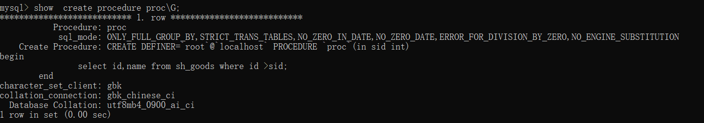
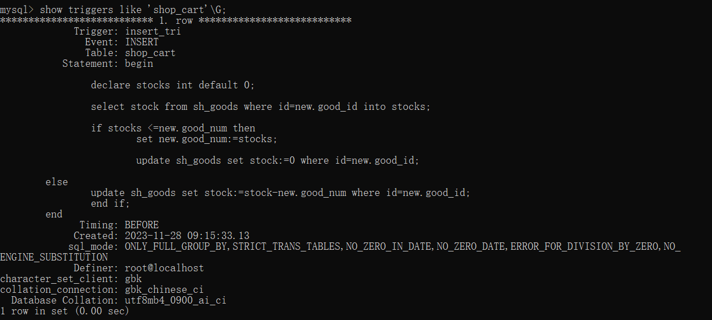

## 1. 数据库基本操作

### 1. 数据库操作

#### 1.1.1 创建数据库

基本语法 create dababase 数据库名称 [库选项] 	[]表示的是可选参数
创建数据库


如果数据库已经存在，程序就会报错，可以添加 if not exists


#### 1.1.2 查看数据库

1. 查看mysql服务器所有数据库
   
2. 查看指定数据库的创建信息
   

#### 1.1.3 选择数据库


可以在登录数选择数据库 mysql -u 用户名 -p 密码  数据库名称

#### 1.1.4 删除数据库


### 1.2 数据表操作

#### 1.2.1 创建数据表

create table [if not exists] 表名(字段名 字段类型 [字段属性]...) [表选项]


#### 1.2.2 查看数据表

1. show tables [like 匹配模式]
   匹配模式有俩种 % 表示匹配任意长度的字符串 _  表示匹配一个字符


2. 查看数据表的相关信息
    show table status [from 数据库名] [like 匹配模式]

   
   数据表相关信息

   

#### 1.2.3 修改数据表

1. 修改数据库表名

   单表修改 	alter table 旧表名 rename [to|as] 新表名;
   多表修改	 rename table 旧表名1 to 新表名1 [, 旧表名2 to 新表名2]

   
   
2. 修改表选项
   alter table 表名 表选项[=]值

   

#### 1.2.4 查看表结构

1. 查看数据表的字段信息
   查看所有字段信息  [describe|desc] 数据表名;
   查看指定字段信息  [describe|desc] 数据表名 字段名；
   

2. 查看数据表的创建语句

   show create table 表名
   

3. 查看数据表结构
   show [full] columns from 数据库名.数据表名;
   

#### 1.2.5 修改表结构

1. 修改表字段名
   alter table 数据表名 change 旧字段 新字段 字段类型[字段属性];

   

2. 修改字段类型

   alter table 数据表名 modify 字段名 新类型[字段属性]
   

3. 修改字段位置
   alter table 数据表名 modify 字段名1 数据类型 [字段属性]  [first|after 字段名2]
   

4. 新增字段
   新增一个字段，可以指定其位置 alter table 数据库表名 add 新字段名 新字段类型 [first|after 字段名]
   同时新增多个字段 alter table 数据表名 add (新字段名1 新字段类型1,新字段名2 新字段类型2,新字段名3 新字段类型3,...)
   
5. 删除字段 
   alter table 数据表名 drop 字段名
   

#### 1.2.6 删除数据表

drop table if exists 数据表1 [,数据表2]...;


### 1.3  数据操作

#### 1.3.1 添加数据

1. 为所有字段添加数据
   insert [into] 数据表名 values (值1[,值2]...)
   

2. 为部分字段添加数据
   insert 数据表名 (字段名1[,字段名2]...) values (值1,[,值2]...)

   insert 数据表名 set 字段名1=值1  [, 字段名2=值2]...
   

3. 一次添加多行数据
   insert 数据表名 [(字段列表)] values (值列表)  [,(值列表)]...
   

#### 1.3.2 查询数据

1. 查询表中全部数据
   

2. 查看表中部分字段
   

3. 简单条件查询
   select * from 数据库 where 字段名=值
   

#### 1.3.3 修改数据

update 数据表名 set 字段1=值1 [,字段2=值2,...]  [where 条件表达式]


#### 1.3.4 删除数据

delete from 数据表名 [where 条件表达式]


## 2. 数据类型和约束

### 2.1 数据类型

#### 2.1.1 数字类型

1. 整数类型
   

   

   

2. 浮点类型
   float 的精度为6位或7位，double 的精度大约为15位
   

3. 定点数

   decimal(M,D) M表示数字总位数，D表示小数点后面位数
   

#### 2.1.2 时间和日期类型

1. year 表示年份
   

2. date 表示日期
   

3. timestamp 表示日期时间
   

#### 2.1.3 字符串类型

| 数据类型 | 说明           |
| -------- | -------------- |
| char     | 固定长度字符串 |
| varchar  | 可变长度字符串 |
| text     | 大文本数据     |
| enum     | 枚举类型       |
| set      | 字符串对象     |

1. char 和 varchar  保存字符串数据
   区别

   | 插入值 | char(4) | varchar(4) |
   | ------ | ------- | ---------- |
   | ''     | 4字节   | 1字节      |
   | 'a'    | 4字节   | 2字节      |
   | 'ab'   | 4字节   | 3字节      |
   | 'abc'  | 4字节   | 4字节      |
   | 'abcd' | 4字节   | 5字节      |

   

2. text  保存大文本数据

   

3. enum 枚举类型  
   enum('值1','值2','值3',.....,'值n',)
   只能从枚举列表中选取一个
   

4. set  可以选择一个值或多个值保存
   


### 2.2 表的约束

#### 2.2.1 默认约束

字段名 数据类型 default 默认值;


删除默认值 alter table my_default modify age int unsigned ;
添加默认值 alter table my_default modify age int unsigned default 18;

#### 2.2.2 非空约束

非空指的是字段的值不能为NUll
字段名 数据类型 not null


#### 2.2.3 唯一约束

保证数据表中字段的唯一性，即表中字段不能重复出现

- 列级约束 定义在一个列上，只对该列起约束作用
- 表级约束 独立于列的定义，可以应用在一个表的多列上


复合唯一约束
表级创建唯一约束时，可以添加多个字段，组成复合唯一约束，特点是多个字段值相同才视为重复记录。


#### 2.2.4 主键约束

主键可以唯一标识表中的记录，由primary key 定义，相当于唯一约束和非空约束的组合，要求字段不能重复，也不能出现null值，每张表中包含一个主键，复合主键需要多个字段确定一条记录的唯一性

- 列级约束 字段名 数据类型 primary key
- 表级约束 primary key (字段1，字段2，...)


### 2.3 自动增长

字段名 数据类型 auto_increment

1. 一个表中只能有一个自增字段，数据类型必须是整数，且定义为键，如unique,primary
2. 插入null、0、default或插入时省略该字段，都会自增，如插入的是个具体的值，则不会使用自动增长值
3. 从1开始每次加1，插入值大于自增值，下次使用最大值加1，插入值小于自增值，则不会产生影响
4. 使用delete删除记录时，自增值不会减少或填补空缺


查看自动增长值


修改自动增长值


### 2.4 字符集和校对集

#### 2.4.1 简介

1. 字符集
   字符指计算机保存的各种文字和符号，计算机采用的是二进制保存数据，用户输入的字符按照一定规则转化为二进制保存（字符编码），将编码规则组合起来形成字符集
   


2. 校对集
   为不同字符集指定排序和比较规则。

   - ci 表示不区分大小写
   - cs 表示区分大写
   - bin 表示以二进制方式比较

   

#### 2.4.2 字符集与校对集设置

1. 数据库
   - charset set [=] charset_name
   - collation [=] collation_name

```sql
# 创建数据库，指定字符集 utf8 使用默认校对集 utf8_general_ci
create database mydb charset set utf8;
# 创建数据库，指定字符集 utf8 校对集 utf8_bin
create database mydb charset set utf8 collation utf8_bin;
```


2. 数据表

   ​	没有指定 使用数据库字符集

   - charset set [=] charset_name
   - collation [=] collation_name

```sql
create table my_charset(username varchar(20))charset utf8 collation utf8_bin;
```


3. 字段 

   没有指定 使用数据表字符集

   在字段属性设置字符集和校对集

   ```sql
   create table my_charset(username varchar(20) charset set utf8 collation utf_bin);
   ```


## 3. 数据库设计

#### 3.1 设计范式

为了避免不规范的数据库出现数据冗余，造成插入、删除、更新操作异常的情况，就要满足一定的规范化要求

1. 第一范式
   指的是数据表中每一列都是不可分割的基本数据项，同一列不能有多个值，即实体的某个的属性不能有多个值，或者不能有重复的值

   

2. 第二范式
   实体的属性完全依附于主键，不能仅依赖于主键的一部分（对于复合主键而言），非主键字段完全依附于主键字段

   

3. 第三范式
   数据表中每一列数据都和主键直接相关，不能间接相关，非主键字段不能相互依赖


创建一个商品表并插入数据
```sql
use mydb;
-- 创建表
create table sh_goods(
id int unsigned primary key auto_increment,
category_id int unsigned not null default 0,
name varchar(120) not null default '',
keyword varchar(225) not null default '',
content text not null,
price decimal(10,2) unsigned not null default 0,
stock int unsigned not null default 0,
score decimal(3,2) unsigned not null default 0,
comment_count int unsigned not null default 0
);
-- 插入数据
INSERT INTO sh_goods (id, category_id, name, keyword, content, price, stock, score, comment_count) VALUES
  (1, 3, '2B铅笔', '文具', '考试专用', 0.5, 500, 4.9, 40000),
  (2, 3, '钢笔', '文具', '练字必不可少', 15, 300, 3.9, 500),
  (3, 3, '碳素笔', '文具', '平时使用', 1, 500, 5, 98000),
  (4, 12, '超薄笔记本', '电子产品', '轻小便捷', 5999, 0, 2.5, 200),
  (5, 6, '智能手机', '电子产品', '人人必备', 1999, 0, 5, 98000),
  (6, 8, '桌面音箱', '电子产品', '扩音装备', 69, 750, 4.5, 1000),
  (7, 9, '头戴耳机', '电子产品', '独享个人世界', 109, 0, 3.9, 500),
  (8, 10, '办公电脑', '电子产品', '适合办公', 2000, 0, 4.8, 6000),
  (9, 15, '收腰风衣', '服装', '春节潮流单品', 299, 0, 4.9, 40000),
  (10, 16, '薄毛衣', '服装', '居家旅行必备', 48, 0, 4.8, 98000);
```


## 4. 单表操作

### 4.1 数据操作

#### 4.1.1 复制表结构和数据

1. 复制已有的表结构
   创建一个与已用数据表相同结构的数据表时  

   ```sql
   create table [if not exists] 表名 like 旧表名
   ```

   
   
2. 复制已有的表数据
   ```sql
   insert 数据表名1 [(字段列表)] select [(字段列表)] from 数据表名2
   ```

   
   解决主键冲突问题
   


#### 4.1.2 解决主键冲突

1. 主键冲突更新
   当插入数据的过程中发生主键冲突，则插入数据操作利用更新的方式实现

   ```sql
   insert 数据表名 [(字段列表)] values (值列表) on duplicate key set name='橡皮',content='修正错误',keyword='文具'
   
   insert my_goods(id,name,content,keyword) values(20,'橡皮','修正错误','文具');
   insert my_goods(id,name,content,keyword) values(20,'橡皮','修正错误','文具') on duplicate key update name='橡皮',content='修正错误',keyword='文具';
   ```

   


2. 主键冲突替换
   当插入数据的过程中发生主键冲突，则删除此条记录，并重新插入

   ```sql
   replace 数据表名 [(字段列表)] values (值列表)
   ```

   

   

#### 4.1.3 清空数据

清空指定表中的全部数据
```sql
truncate table [表名];
```

truncate 和delete的区别：

- 实现方式不同 truncate 本质执行删除数据表的操作，然后根据表文件创建数据表的方式来实现数据清空操作。而delete语句则是逐条删除数据表中保存的记录。
- 执行效率不同 针对大型数据表时，truncate方式效率更高
- 对auto_increment 的字段影响不同，truncate 清空数据之后，自动增长值从默认初始值开始，delete删除表中记录，不影响自动增长值
- 返回值含义不同，truncate返回值无意义，而delete返回的是被删除的记录

向my_goods 插入十条记录，truncate删除后重新插入一条值


向my_goods 插入十条记录，delete删除后重新插入一条值


#### 4.1.4 去除重复记录

```sql
select distinct [字段列表] from 数据表
```


### 4.2 排序与限量

#### 4.2.1 排序

1. 单字段排序
   ```sql
   按照一个指定的字段进行升序或降序
   select * |[字段列表] from order by 字段名 [desc|asc]
   ```

   
   
2. 多字段排序
   多字段排序首先根据字段1排序，当字段1的值相同时，在按照字段2排序，依次类推

   ```sql
   select *|[字段列表] from 数据表名 order by 字段名1 [asc|desc] [,字段名2 [asc|desc]] ...
   ```

   


#### 4.2.2 限量

limit 可以限定记录的数量，也可以指定查询从那条记录开始
```sql
select *|[字段列表] from 数据表名  limit [offset,] 记录数;
offset 用于设置从那条记录开始
```


### 4.3  分组和聚合函数

#### 4.3.1 分组

查询数据时，在where条件后面添加group by 即可根据指定的字段进行分组，select 获取的字段列表只能是group by 分组字段或者是其他字段的聚合形式。
```sql
select 字段列表 from 数据表 [where 条件判断] group by 字段名;
```

1. 分组统计
   

2. 分组排序
   默认给分组操作的字段提供了升序排序的功能，在分组时可以为指定的字段进行升序或者降序

   ```sql
   select 字段列表 from 数据表名 [where 条件判断] group by 字段名 order by 字段名 [desc|asc]
   GROUP_CONCAT() 的作用是将分组后的多行数据合并为一个字符串
   ```

   
   
3. 统计筛选
   having 和 where 都是根据条件进行数据筛选，但也有一定的区别

   - where 操作是从数据表中获取数据，将数据从磁盘存储到内存中，而having是对已存放到内存中的数据进行操作
   - having 位于group by之后，where位于group by之前
   - having之后可以使用聚合函数，而where不可以，having和group by 一起使用，对分组后的结果进行过滤

   where之后的语句都是对内存进行操作

   ```sql
   select * from 数据表 group by 字段名 having 条件判断
   ```

   

4. 使用别名 
   ```sql
   select 字段1 [as] 别名1，字段2 [as] 别名2[,...] from 表名
   ```

   
   
   
   
   ```sql
   select 字段1 [as] 别名1，字段2 [as] 别名2[,...] from 表名 [as] 表别名
   ```
   
   
   
   
   

#### 4.3.2 聚合函数

| 函数名           | 描述                                       |
| ---------------- | ------------------------------------------ |
| count()          | 返回参数字段的数量，不统计为null的记录     |
| sun()            | 返回参数字段之和                           |
| avg()            | 返回参数字段的平均值                       |
| max()            | 返回参数字段的最大值                       |
| min()            | 返回参数字段的最小值                       |
| group_concat()   | 返回符合条件的参数字段值的链接字符串       |
| json_arrayagg()  | 将符合条件的参数字段值作为单个json数组返回 |
| json_objectagg() | 将符合条件的参数字段值作为单个json对象返回 |

**count()**参数设置为*，表示统计符合条件的所有记录(包括null)


### 4.4 运算符

*运算符俩端的数据可以是真实的数据（5），也可以是表中的字段（price），参与运算的数据称为操作数，操作数和运算符组合到一起称为表达式*

#### 4.4.1 算术运算符

*通常应用在select 查询结果的字段中，在where条件表达式中应用的较少*

1. 无符号的加减乘法运算
   '+'、'-'、'*'的操作数都是无符号整型，运算结果也是无符号整型
   

2. 有符号的减法运算结果
   操作数的差值为负数，那么系统就会报错
   

3. 含有精度的运算

   - 对浮点数进行加减运算，运算的结果精度等于参与运算操作数的最大精度
   - 对浮点数进行乘法运算，运算的结果精度等于参数运算操作数精度的和

   

4. '\\'运算
   浮点数的精度等于被除数的精度加上系统变量 *div_precision_increment* 设置的除法精度增长值

   

   

5. null 参与算术运算
   null参与的算术运算的结果均为null
   

6. div与mod运算符
   div除法，去掉小数部分，保留整数部分

   
   mod取模运算，运算结果的正负号与左边操作数相关
   


#### 4.4.2 比较运算符

*通常应用在条件表达式，运算结果有3种，1(true 表示为真），0（false 表示为假）或null*


1. 数据类型自动转化
   

2. 比较结果为null
   运算符 *= 、>、 <、 >=、 <=、<>、！=*  与null进行比较时，结果均为null 
   

3. = 与<=>的区别
   俩者均可以用于比较数据是否相同，而<=>可以对null值进行比较

   
   
4. between ... and ...
   ```sql
   betwwen 条件1 and 条件2 
   表示条件1到条件2之间的范围（包含俩端）
   ```

   
   not between ... and ... 表达的意思和上述相反
   

5.  is null 和 is not null
   

6. like not like
   模糊匹配
   
7. 其他
   正则匹配
   

​		


#### 4.4.3 逻辑运算符


*仅有not ！ 是一元运算符，其余均是二元运算符，在一个表达式出现时，先运算！ 后运算not*

1. 逻辑与
   

2. 逻辑或
   

3. 逻辑非
   

4. 逻辑异或
   

#### 4.4.4 赋值运算符

赋值 := 避免混淆


#### 4.4.6 运算符优先级

*使用() 改变运算符优先级*


## 5. 多表操作

### 5.1 多表查询

#### 5.1.1 联合查询

*保证多个select 语句的查询字段数相同的情况下，合并多个查询结果*

```sql
select ...
union [all|distinct] select...
[union [all|distinct] select ];

union 是联合查询的关键字，all表示保留所有查询结果，distinct表示去除重复记录，是默认值
```


要对联合记录进行排序，需要使用（）包裹每一个select语句，若要排序生效，必须添加limit限定联合查询排序的数量，通常使用大于表记录的任意值。


#### 5.1.2 连接查询

创建一个员工表和一个部门表

```sql
-- 创建部门表
CREATE TABLE department (
  id INT PRIMARY KEY,
  name VARCHAR(100)
);

-- 创建员工表
CREATE TABLE employee (
  id INT PRIMARY KEY,
  name VARCHAR(100),
  department_id INT,
  FOREIGN KEY (department_id) REFERENCES department(id)
);

-- 插入部门数据
INSERT INTO department (id, name) VALUES
(1, '销售部'),
(2, '人力资源部'),
(3, '研发部'),
	新增
(4,'教育部')


-- 插入员工数据
INSERT INTO employee (id, name, department_id) VALUES
(1, '张三', 1),
(2, '李四', 1),
(3, '王五', 2),
(4, '赵六', 3)，
	新增
(5,'giao哥',null)，
(6, '陈七', 2),
(7, '刘八', 3),
(8, '朱九', 4),
(9, '钱十', 1),
(10, '孙十一', 2);
```


1. 交叉连接
   *返回的是俩个表所有数据行的笛卡尔积，例如 A表 3个字段 4条记录，B表 5个字段 10个记录，交叉连接后字段等于3+5，记录等于4*10。*

   ```sql
   select 查询字段 from 表1 cross join 表2；
   ```

   
   与多表查询语法等价

   ```sql
   select d.id,d.name,e.id,e.name from department d ,employee e;
   ```

   
   
2. 内连接 
   *根据匹配条件返回匹配成功的记录*

   ```sql
   select 查询字段 from 表1 [inner] join 表2 on 匹配条件
   不设置on，与交叉连接等价 
   ```

   ```sql
   select e.id,e.name,d.id as depar_id,d.name as depart_name 
   from employee as e 
   inner join
   department d 
   on e.department_id=d.id;
   ```

   
   
   
   
   
   *自连接查询是内连接中的一种特殊查询，它指的是相互连接的表物理上为同一表，但是逻辑上分为俩个表*
   
   ```sql
   SELECT  distinct e1.id, e1.name
   FROM employee e1
   INNER JOIN employee e2 ON e1.department_id = 1 AND e1.department_id = e2.department_id;
   ```
   
   
   


3. 左外连接
   返回左表中所有记录以及右表中符合连接条件的记录。当左表的某行记录在右表中没有匹配的记录时，将右表中相关的记录设置为null。

   ```sql
   select 查询字段
   from 表1 left join 表2 on 匹配条件
   ```

   ```sql
   select e.id,e.name,d.id as depar_id,d.name as depart_name 
   from employee as e 
   left join
   department d 
   on e.department_id=d.id;
   ```

   
   
4. 右外连接
   返回右表中所有记录以及左表中符合连接条件的记录。当右表的某行记录在左表中没有匹配的记录时，将左表中相关的记录设置为null

   ```sql
   select 查询字段
   from 表1 left join 表2 on 匹配条件
   ```

   ```sql
   select e.id,e.name,d.id as depar_id,d.name as depart_name 
   from employee as e 
   right join
   department d 
   on e.department_id=d.id;
   ```

   
   


### 5.2 子查询


#### 5.2.1 什么是字查询

*在一个sql语句A中嵌入一个查询语句B，作为执行条件或者查询的数据源，那么B就是一个子查询。在含有子查询的语句中，子查询必须书写在圆括号内，当一个sql语句中含有多层子查询时，执行顺序是从内向外执行*


#### 5.2.2 子查询分类

- 按功能分为：标量子查询、列子查询、行子查询和表字查询
- 按位置分为：where子查询 和 from 子查询

*只有表子查询属于from子查询*


1. 标量子查询
   指的是子查询返回的结果是一个数据，即一行一列。

   ```sql
   where 条件判断 {=|<>}
   (select 字段名 from 数据源 [where] [group by] [having] [order by] [limit])
   ```

   ```sql
   select e.id,e.name from employee as e
   where department_id=
   (select id from department where name='教育部' );
   ```

   
   
2. 列子查询
   指的是子查询返回的结果是一个字段符合条件的所有数据，即一列多行。

   ```sql
   where 条件判断 {in|not in}
   (select 字段名 from 数据源 [where] [group by] [having] [order by] [limit])
   ```

   ```sql
   select department.name from department
   where id in 
   (select distinct department_id from employee );
   ```

   
   
3. 行子查询
   指的是子查询是一条包含一行多个字段的记录。

   ```sql
   where (指定字段名1,指定字段名2,...)=
   (select 字段名1,字段2,.. from 数据源 [where] [group by] [having] [order by] [limit])
   ```

   ```sql
   select id,name from employee 
   where department_id =
   (select max(department_id) from employee);
   ```

   
   
4. 表子查询
   返回的结果用于from数据源，它是一个符合二维表结构的数据，可以有一行一列，一行多列，一列多行或多行多列
   
   ```sql
   select 字段列表 from （select 语句) [as] 别名
   [where] [group by] [having] [order by] [limit];
   ```
   
   ```sql
   select e.id,e.name,d.name as depart_name from employee as e,
   (select id ,name from department) as d
   where e.department_id=d.id;
   ```
   
   
   

#### 5.2.3 子查询关键字


1. 代exists关键字的子查询
   查询的返回值只有0和1俩个值，1代表成立，0代表不成立

   ```sql
   where exists(子查询);
   ```

   ```sql
   update employee set department_id=
   (select id from department where name='研发部' )
   where (select id from department where name='研发部' )
   and name='李四';
   ```

   
   
2. any 关键字查询
   表示给定的判断条件，只要符合any子查询结果的任意一个就返回1，否则0。

   ```sql
   where 表达式 比较运算符 any (子查询);
   ```

   ```sql
   select id,name from employee 
   where department_id =
   any(select id from department where name='销售部' or name='研发部');
   ```

   
   

   ```sql
   select id,name from employee 
   where department_id <>
   any(select id from department where name='销售部' or name='研发部');
   ```

   
   
3. 代all关键字的子查询
   表示给定的判断条件只有全部符合all子查询结果时，才返回1，否则返回0

   ```sql
   where 表达式 运算符 all(子查询)
   ```

   

   

### 5.3 外键约束

*外键指的是一个表中引用了另一个表中的一列或多列，被引用的列应该具有主键约束或者唯一约束，被引用的表称为主键，引用外键的表称为从表*

#### 5.3.1 添加外键约束

1. 添加外键约束
   ```sql
   [constraint symbol] foreign key [index_name] (index_col_name,...)
   references 主表 (index_col_name,...)
   [on delete  { restrict | cascade | set null | no action | set default}]
   [on update  { restrict | cascade | set null | no action | set default}]
   
   constraint 定义外键约束的名称symbol 省略的话，会自动生成一个名字
   index_name 表示外键索引名称  省略的话，建立外键的时候自动创建一个外键索引，加快查询速度
   ```

   外键约束参数说明

   | 参数名称    | 功能描述                                                     |
   | ----------- | ------------------------------------------------------------ |
   | restrict    | 拒绝主表修改或删除外键关联字段                               |
   | cascade     | 主表更新或删除记录时，自动删除或更新从表中的相关记录         |
   | set null    | 主表更新或删除时，使用null替换从表中的对应记录（不适用于not null 字段） |
   | no action   | 与restrict相同，表示拒绝主表删除或更新外键关联字段           |
   | set default | 设置默认值  innoDB不支持                                     |

   *innoDB存储引擎支持外键约束，且外键约束关系的俩个数据表**相关字段的类型必须相似*** 

   - create table时添加外键约束
     ```sql
     1.创建主表
     create table department(
     id int unsigned primary key auto_increment,
     name varchar(50) not null
     );
     
     2.保证主表存在，创建从表，添加外键约束
     create table employee(
     id int unsigned primary key auto_increment
     name varchar(20),
     department_id int unsigned not null,
     constraint fk_id foregin key(department_id) reference department(id)
     on delete restrict  on update cascade
     );
     fk_id 外键约束名称
     拒绝主表department外键外键关联字段
     主表更新，自动更新从表中相关字段
     ```

   - alter table时添加外键
     ```sql
     alter table employee add
     constraint fk_id foregin key(department_id) reference department(id)
     on delete restrict  on update cascade;
     ```

     

2. 查看外键约束
   ```sql
   desc 数据库 数据表.字段名;
   ```

   
   

   ```sql
   show create table employee;
   创建外键约束，会自动为没有索引的外键关联字段创建索引
   ```

   -


#### 5.3.2 关联表的操作

1. 添加数据
   *一个具有外键约束的从表在插入数据时，外键字段的值会受主表数据的约束，保证从表插入的数据必须符合规范要求*

   ```sql
   insert employee values(11,'王刚',5);
   主表中没有相关联的数据
   ```

   


2. 更新数据
   *对主表进行更新操作时，从表将按照建立外键约束时设置的on update参数执行相应的操作*

   例如：参数为 cascade，主表进行更新，从表的相应记录字段自动更新

   

3. 删除数据
   *对主表进行删除操作，从表将按照建立外键设置的on delete 参数执行相应操作*
   例如 参数为restrict，主表进行删除时，同时从表中的外键字段有关联记录，就会阻止主表的删除操作

   *开发时，外键约束的on delete 一般使用set null 参数，即删除主表记录时，将从表对应的记录设置为null，同时保证从表中对应的**外键字段允许为空***


#### 5.3.3 删除外键约束

```sql
alter table 表名 drop foreign key 外键名
```

查看表结构


删除外键


查看表结构


手动删除索引


## 6. 用户与权限

### 6.1 用户与权限概述

*安装mysql时，系统会自动安装一个名为mysql的数据库，主要用于维护数据库的用户以及权限的控制和管理，其中**mysql.user**表中存储的是所有用户的信息*

```sql
查看user表
desc mysql.user;
```


可以根据***字段的功能***将其分为6类，客户端访问服务器的账号字段、验证用户身份字段、安全连接字段、资源限制字段、权限字段、账户锁定字段。

1. 账号字段
   host和user字段共同组成的符合主键用于区别mysql中的账户，user字段代表用户的名称。host代表允许访问客户端的ip地址或者主机地址，当host为‘*’表示所有客户端的用户都可以访问到。
   

2. 身份验证字段

   - plugin 指定用户验证插件名称
   - authenticate_string 根据plugin指定的插件算法对账户明文密码加密后的字符串
   - password_expired 密码是否过期
   - password_last_change 密码最后一次修改
   - password_lifetime 密码有效期

   

3. 安全连接字段
   mysql默认启动*SSL*加密连接

   
   
4. 资源限制字段
   以**max_**开头，保存用户可使用服务器资源的限制

   - max_questions: 每小时允许用户查询操作的最多次数
   - max_updates: 每小时允许用户更新操作的最多次数
   - max_connections: 每小时允许用户建立连接的最多次数
   - max_user_connections: 单个用户同时建立连接的最多次数

   默认值为0，表示对此用户没有任何资源限制

5. 权限字段
   以**_priv** 结尾的字段，数据类型都是enum枚举类型，取值只有Y和N，N表示用户没有对应权限，Y表示用户有对应权限。


6. 账户锁定字段
   account_locked字段用于保存当前用户是锁定还是解锁状态，是一个枚举类型

   N 表示解锁，用户可以连接到服务器

   Y 表示已经被锁定，不能用于连接服务器


### 6.2 用户管理

#### 6.2.1 创建用户

- 直接利用root用户登录mysql服务器，向mysql.user 表中插入记录，不推荐
- mysql 提供的create user创建用户，每创建一个新用户，都会向mysql.user表中添加一条记录，同时服务器会自动修改相应的授权表。但是该语句创建新用户默认没有任何权限，使用grant 进行授权

```sql
create user [if not exists]
账户名 [用户身份验证选项]   [,账户名[用户身份验证选项]]
[with 资源控制选项] [密码管理选项] [账户锁定选项]
```

create user 语句的选项

| 选项             | 默认值                         |
| ---------------- | ------------------------------ |
| 账户名           | 用户名@主机地址                |
| 用户身份验证选项 | 系统变量定义的插件进行身份验证 |
| 加密连接协议选项 | None                           |
| 资源控制选项     | N 表示无限制                   |
| 密码管理选项     | password expire default        |
| 用户锁定选项     | account unlock                 |

1. 创建最简单的用户
   *创建用户时，若不指定主机地址、密码、以及相关的用户选项，则表示此用户访问mysql服务器时，不限定客户端、不需要密码并且没有任何限制。*
   

2. 创建含有密码的用户
   创建用户设置密码，可以使用身份验证选项的***identified by*** 关键字

   ```sql
   create user 'test2'@'localhost' identified by '123456';
   ```

   
   
3. 同时创建多个用户
   ```sql
   create user
   'test3'@'localhost' identified by '333333',
   'test4'@'localhost' identified by '444444';
   ```

   
   
4. 设置用户可操作资源范围
   
   
   ```sql
   --创建用户，限制每小时最多跟新10次
   create user
   'test5'@'localhost' identified by '555555'
   with MAX_UPDATES_PER_HOUR 10;
   
   --查看字段max_updates
   select max_updates from mysql.user
   where user='test5';
   ```
   
   


5. 设置密码期限的用户
   

   *password expire 表示用户登录之后，执行sql 语句之前，需要重置密码，否则就会报错*

   ```sql
   创建一个密码为180天更改一次的用户
   create user 'test6'@'localhost' identified by '666666'
   password expire interval 180 day;
   ```

   
   
6. 设置用户是否锁定
   ```sql
   create user 'test7'@'localhost' 
   identified by '777777'
   password expire account lock;
   
   查看对应的字段。
   select account_locked from mysql.user where user='test7';
   ```

   
   已锁定的账户不能连接到mysql服务器
   


#### 6.2.2 设置密码

*创建用户时可设置密码，也可以为没有密码的用户，密码过期的用户或指定用户修改密码*

```sql
alter user 账户名 identified by '明文密码';
```

1. 为指定用户设置密码
   ```sql
   alter user 'test1'@'%' identified by '123456';
   ```

   
   
2. 为登录用户设置密码
   ```sql
   alter user user() identified by '000000';
   alter user current_user() identified by '678846';
   ```

   
   
3. mysqladmin 修改密码
   ```sql
   mysqladmin -u 用户名 [-h 主机地址] -p password 新密码
   
   主机地址省略时，默认使用localhost
   password是关键字，不是旧密码。
   ```

   

root密码丢失找回：在mysql配置文件my.ini中添加***skip-grant-tables***，重启mysql服务，利用root用户登录可以跳过密码直接登录，然后为root用户设置密码


#### 6.2.3 修改用户

```sql
alter user [if not exists]
账户名 [用户身份验证选项] [,账户名 [用户身份验证选项]]...
[with 资源控制选项] [密码管理选项] [账户锁定选项]
```

1. 修改验证插件
   ```sql
   alter user test1
   identified with sha256_password by '111111'
   password expire;
   ```

   
   
2. 解锁用户
   ```sql
   alter user 'test7'@'localhost' account unlock;
   ```

   
   test7 @ localhost 登录成功

   
   
3. 修改用户资源限定
   ```sql
   限定单个用户同时最多建立俩个连接
   alter user 'test2'@'localhost' identified by '222222'
   with max_user_connections 2;
   ```

   


4. 为用户重命名
   ```sql
   rename user
   旧用户名1 to 新用户名1,旧用户名2 to 新用户名2,旧用户名3 to 新用户名3...
   ```

   
   

#### 6.2.4 删除用户

```sql
drop user [if exists] 账户名 [,账户名]
```

```sql
drop user if exists test7;

如果省略主机地址，默认为’%‘
```

*如果删除当前用户，该用户的会话不会被自动关闭，只有在用户关闭会话后，删除操作才会生效，再次登录的话就会失败，另外已删除的用户创建的数据库或对象不会因此而失效*


### 6.3 权限管理

#### 6.3.1 授予权限

权限信息根据其***作用范围***，分别存储在mysql数据库不同的数据表中，mysql启动时自动加载权限信息，并读取到内存中。


```sql
grant 
权限类型 [字段列表]   [,权限类型 [字段列表] ]...
on [目标类型] 权限级别
to 账户名 [身份验证选项]  [,账户名 [身份验证选项]]
[with {grant option | 资源控制选项}]

目标类型 默认是table
grant option 表示当前用户可以为其他用户授权
```

查看用户授权情况
```sql
show grants [for 账户]

all privileges： 表示除了 grant option (授权权限)和 proxy(代理权限)外的所有权限
usage ：表示没有任何权限
```


为用户授权

```sql
grant select , insert (name,price) 
on my_db.sh_goods
to 'test1'@'%';

select 是表级权限
insert 是列级权限
```


到对应表中查看权限

```sql
表权限
select db,table_name,table_priv,column_priv 
from mysql.tables_priv where user='test1';

列权限
select db,table_name,column_name,column_priv 
from mysql.columns_priv where user='test1';
```


#### 6.3.2 回收权限

```sql
revoke 权限类型 [(字段列表)]   [,权限类型 [(字段列表)] ]...
on [目标类型] 权限级别 
from 账户名 [,账户名]...
```

回收权限
```sql
revoke insert(name,price)
on my_db.sh_goods
from 'test1'@'%';

回收用户的name,price字段插入权限
```


一次回收所有权限

```sql
回收所有权限以及可为其他用户授权的权限
revoke all [privileges],grant option from 账户名 [,账户名]...
```


#### 6.3.3 刷新权限

*刷新权限指的是从系统数据库mysql中的权限表重新加载用户的权限，原因在于grant、create user操作会将服务器的缓存信息保存到内存中，而revoke、drop操作并不会同步到内存中。*

```sql
flush privileges;
```


## 7. 视图

### 7.1 初识视图

#### 7.1.1 视图的概念和使用

*视图是从一个表或多个表导出来的表，是一种虚拟存在的表，表的**结构和数据**都依赖于基本表*

```sql
查询数据
select id,name,price,price*0.8 from sh_goods limit 3;

创建view_goods视图
create view view_goods as 
select id,name,price,price*0.8 from sh_goods limit 3;

查看视图
select * from view_goods;

删除视图
drop view view_goods;
```


**查询视图的注意点**: select 字段列表和 where 等子句中的字段，只能使用创建视图时select指定的字段


使用视图与直接操作基本表相比，优点：

1. 简化查询语句。
2. 安全性。使特定的用户只能查询或修改他们所能见到的数据
3. 逻辑数据独立性。视图可以屏蔽真实表结构变化带来的影响 


#### 7.1.2 创建视图的语法格式

```sql
create [or replace] 
[definer={user|current_user}]
[sql security {definer|invoker}]
view view_name [(column_list)]
as select_statement
[with [cascade|local] check option ]

or replace :表示替换已有的视图
definer ：定义视图的用户，和安全控制有关，默认为当前用户
sql security ：视图的安全控制
	- defner 默认 定义者指定的用户的权限来执行
	- invoker 调用视图的用户的权限来执行
	
view_name :创建的视图名称
column_list:指定视图中的各个列名称
with check option ：视图数据操作时的检查条件
	- cascade ：操作数据时满足所有相关视图和表定义的条件
	- local： 操作数据时满足视图本身定义的条件
```

注意点：

1. 默认情况下，新建的视图保存在当前选择的数据库中，若要明确指定某个数据库创建视图，可以把视图名称写为‘*数据库名.视图名*’
2. show tables; 语句包含创建的视图。
3. 在同一个数据库中，视图名称不能和已存在的表名相同。


### 7.2 视图管理

#### 7.2.1 创建视图

1. 在多表上创建视图
   *除了在单表上创建视图，还可以在俩个或俩个以上的基本表上创建视图*

   ```sql
   create view view_e_p as 
   select e.id,e.name as e_name,d.name as depart_name from employee as e 
   inner join department as d
   on e.department_id = d.id;
   ```

   


2. 自定义列名称

   ```sql
   create view view_goods_p (sn,title,pro_price)
   as select id,name,price*0.8 from sh_goods;
   
   查看视图
   select * from view_goods_p;
   ```

   自定义列名称的数量必须与as select字段列表的数量一致，顺序与as select 字段列表顺序一致

   
   
3. 视图安全控制
   ```sql
   创建测试用户，创建的用户没有任何权限
   create user shop_test;
   
   创建第一个视图，权限控制使用默认值，definer为当前用户root，sql security为definer
   create view view_goods_t1 as
   select id,name from sh_goods limit 1;
   
   创建第二个视图，definer设置为shop_test，sql security为definer
   create definer='shop_test' view  view_goods_t2 as
   select id,name from sh_goods limit 1;
   
   创建第三个视图，definer为 root用户 设置 sql security 为invoker
   create sql security invoker view  view_goods_t3 as 
   select id,name from sh_goods limit 1;
   
   为shop_test 用户赋予前面创建的3个视图的select权限
   grant select on view_goods_t1 to 'shop_test';
   grant select on view_goods_t2 to 'shop_test';
   grant select on view_goods_t3 to 'shop_test';
   ```

   用*shop_test*用户登录，该用户的权限
   

   *root* 用户有表sh_goods的select权限，而*shop_test* 没有表sh_goods的select权限

   


#### 7.2.2 查看视图

1. 查看视图字段信息
   ```sql
   desc view_goods;
   ```

   
   
2. 查看视图状态信息
   ```sql
   show table status like 'view_goods'\G;
   ```

   
   
3. 查看视图的创建语句
   ```sql
   show create view view_goods \G;
   ```

   
   

#### 7.2.3 修改视图

*当基本表中的某些字段发生变化时，视图必须修改才能使用*

1. 替换已有的视图
   ```sql
   create or replace view view_goods 
   as select id,name from sh_goods;
   
   查看结果
   desc view_goods;
   ```

   
   
2. 使用alter view修改视图
   ```sql
   alter [or replace] 
   [definer={user|current_user}]
   [sql security {definer|invoker}]
   view view_name [(column_list)]
   as select_statement
   [with [cascade|local] check option ]
   ```

   修改视图view_goods
   ```sql
   alter view view_goods 
   as select id from sh_goods;
   查看修改结果
   desc view_goods;
   ```

   
   

#### 7.2.4 删除视图

**删除视图时，不会删除基本表中的数据**

```sql
drop view [if exists] view_name [,view_name]...
```


### 7.3 视图数据操作

*因为视图是一个虚拟的表，不保存数据，当通过视图操作数据时，实际上操作的是基本表中的数据*


#### 7.3.1 添加数据

```sql
create view view_employee as
select id,name,department_id from employee;

insert into view_employee values(12,'刘华强',3);
```


*注意一下情况，操作可能失败：*

- 操作的视图定义在多个表上
- 没有满足视图的基本表对字段的约束条件
- 在定义视图的select语句后的字段使用了数学表达式或聚合函数、distinct、union、group by、having等子句


#### 7.3.2 修改数据

通过视图修改基本表中的数据

```sql
update view_employee set name='张大炮' where id=12;
```


#### 7.3.3 删除数据

通过视图删除基本表中的数据
```sql
delete from view_employee where id=12;
```


#### 7.3.4 视图检查条件

***with check option*** 用于在视图数据操作时进行的条件检查

```sql
创建第一个视图
create view view_e_t1 as 
select id,name from employee where id >15;

创建第二个视图,使用级联检查 with check option 相当于 with cascade check option
create view view_e_t2 as 
select id,name from view_e_t1 where id<20
with check option;

插入数据
insert view_e_t2 values(14,'张飞');
insert view_e_t2 values(21,'赵云');
insert view_e_t2 values(19,'王大锤');

创建第三个视图，使用local非级联检查
create view view_e_t3 as
select id,name from employee
with local check option;

插入数据
insert view_e_t3 values(16,'张三丰');
insert view_e_t3 values(21,'赵云');
```


*默认情况下使用**cascade**，表示级联检查，若设为**local**，则检查定义视图本身的条件*


## 8. 事务

### 8.1 事务处理

*事务处理在数据开发过程中非常资源，可以保证在同一个事务中的操作具有同步性*

#### 8.1.1 事务的概念

*事务*：就是针对数据库的一组操作，它可以由一条或多条sql语句组成，且每个sql语句是相互依赖；事务的执行要么成功要么返回到事务开始前的状态，保证同一事务的同步性和数据的完整性。

**事务的特点**：

1. 原子性：指的是一个事务被视为一个不可分割的最小工作单元，只有事务中所有的数据库操作都执行成功，整个事务才算成功
2. 一致性：处理事务时，无论执行成功还是失败，都要保证数据库系统的一致性
3. 隔离性：一个事务执行时，不受其他事务的影响。
4. 持久性：事务一旦提交，对数据库的修改就是永久性的


#### 8.1.2 事务的基本操作

默认情况下，用户执行每一条sql语句都会*被当做单独的事务自动提交*

```sql
开启事务
start transaction

手动提交事务
commit

回滚，即取消事务
rollback
只能回滚未提交的事务，已提交的事务无法回滚
```

开启事务并提交

```sql
查看用户数据
select name,price from user; 

开启事务
start transaction;

alex 减少100元
update user set price=price-100 where name='alex';

bill增加100元
update user set price=price+100 where name='bill';

提交事务
commit;
```


回滚

```sql
查看用户数据
select name,price from user; 

开启事务
start transaction;

alex 减少100元
update user set price=price-100 where name='alex';

bill增加100元
update user set price=price+100 where name='bill';

查看用户数据
select name,price from user; 

回滚，取消事务
rollback;
```


*注意*：

- mysql事务不允许嵌套，若执行start transaction语句上一个事务还未提交，会隐式执行提交操作。
- 事务主要针对的是*数据表中数据的处理*，删除数据库、数据表、修改表结构等操作会隐式提交事务。


#### 8.1.3 事务的保存点

*在回滚事务时，事务内所有操作都将被撤销。若只希望撤销一部分，可以使用保存点来实现*

```sql
设置保存点
savepoint 保存点名;

将事务回滚到指定的保存点
rollback to savepoint 保存点名;

删除保存点
release savepoint 保存点名;
```

***注意***: 一个事务中可以创建多个保存点，在提交事务之后，*事务中的保存点就会被删除*；另外，回滚到某个保存点后，*该保存点之后创建的保存点都会消失。*

```sql
查看数据
select name,price from user where name='alex';

开启事务
start transaction;

将alex扣除100元
update user set price=price-100 where name='alex';

创建保存点
savepoint t1;

在扣除alex 50元
update user set price=price-50 where name='alex';

查看数据
select name,price from user where name='alex';

回滚到保存点t1
rollback to savepoint t1;

查看数据
select name,price from user where name='alex';

回滚事务
rollback;
```


### 8.2 事务的隔离级别

***数据库是一个多用户的共享资源**，mysql允许多线程并发访问，因此用户可以通过不同的线程执行不同的事务，为了保证事务之间不受影响，对事务设置隔离级是十分重要的*

#### 8.2.1 查看隔离级别

```sql
查看全局隔离级别,影响的是所有连接mysql的用户
select @@global.transaction_isolation;

查看当前会话隔离级别，只影响当前登录mysql的用户
select @@session.transaction_isolation;

查看下一个事务的隔离级别，对当前用户下一个事务操作有影响
select @@transaction_isolation;
```


#### 8.2.2 修改隔离级别

```sql
set [session|global] transaction isolation level 参数值

session 表示的是当前会话
global 表示全局
省略表示设置下一个事务的隔离级别


修改当前会话事务的隔离级别
set session transaction isolation level read uncommitted ;

查看是否修改成功
select @@session.transaction_isolation;
```


#### 8.2.3 *mysql* 四种隔离级别

1. read uncommitted(读取未提交)
   *是事务中最低的级别，在该级别下的事务可以读取到其他事务中未提交的数据，这种读取方式就是脏读。*
   *脏读*就是一个事务中读取了另外一个事务未提交的数据

   ```sql
   将客户端B隔离级别设置为 read uncommitted
   set session transaction isolation level read uncommitted;
   
   
   在客户端B查看bill当前金额
   select name,price from user where name='bill';
   ```

   
   

   ```sql
   在客户端A中开启事务，并执行转账操作
   start transaction;
   
   update user set price=price-100 where name='alex';
   update user set price=price+100 where name='bill';
   
   客户端A未提交事务，客户端B查询余额，会查看到金额已经增加了
   select name,price from user where name='bill';
   ```

   


   ```sql
   避免脏读，可以将客户端B隔离级别设置为read committed(或更高级别)
   set session transaction isolation level read committed;
   
   客户端B查看余额
   select name,price from user where name='bill';
   ```

   


2. read committed (读取提交)
   *在该隔离级别下只能读取其他事务已经提交的数据，避免脏读数据的现象，但是会出现不可重复读的问题*
   *不可重复读*：指的是一个事务中多次查询的结果不一致 ，原因是查询过程中数据发生了改变。

   ```sql
   客户端B
   set session transaction isolation level read committed;
   开启事务
   start transaction;
   查看alex
   select name,price from user where name='alex';
   
   客户端A
   update user set price=price-100 where name='alex';
   
   客户端B
   select name,price from user where name='alex';
   ```

   


   避免不可重复读
   ```sql
   将客户端B的隔离级别设置为 repeatable read
   set session transaction isolation level repeatable read;
   
   开启事务
   start transaction;
   查看alex
   select name,price from user where name='alex';
   
   客户端A
   update user set price=price+100 where name='alex';
   
   客户端B
   select name,price from user where name='alex';
   ```

   

​	

3. repeatable read (可重复读取)
   *解决了脏读和不可重复读的问题，也可以解决幻读(虚读),是指在一个事务内俩次查询中数据条数不一致，与不可重复读有些类似。*
   *幻读是由于其他事务做了插入记录的操作，导致记录数有所增加*

   演示幻读
   ```sql
   将客户端B隔离级别设置为read committed
   set session transaction isolation level read committed;
   开启事务
   start transaction;
   查看总额
   select sum(price) from user;
   
   客户端A 插入一条记录
   insert user (name,price) values('tom',1000);
   
   客户端B
   select sum(price) from user ;
   
   提交事务
   commit;
   ```

   

   避免幻读
   ```sql
   将客户端B隔离级别设置为repeatable read
   set session transaction isolation level repeatable read;
   
   开启事务
   start transaction;
   查看总额
   select sum(price) from user;
   
   客户端A 插入一条记录
   insert user (name,price) values('d',1000);
   
   客户端B
   select sum(price) from user ;
   
   提交事务
   commit;
   ```

   


4. serializable (可串行化)
   *可串行化是最高级别的隔离级，他在每个读的数据行上加锁，使之不会发生冲突，解决了脏读、不可重复读和幻读的问题。但是可能出现超时和锁竞争的现象，因此是性能最低的隔离级别*

   演示可串行化
   ```sql
   将客户端B隔离级别设置为可串行化
   set session transaction isolation level serializable;
   
   开启事务
   start transaction;
   
   客户端B
   select name,price from user;
   
   
   客户端A
   将alex加100元
   update user set price=price+100 where name='alex';
   ```

   若客户端B一直未提交事务，客户端A操作一直等待，直至出现超时现象
   ```sql
   查看锁等待时间
   select @@innodb_lock_wait_timeout;
   ```

   

   

   **总结**：当一个事务使用了**可串行化隔离级别**，在这个事务没有提交之前，其他会话只能等到当前操作完成后，才能进行操作。


## 9.数据库编程


### 9.1 函数

#### 9.1.1 自定义函数

**函数**: 一段用于完成特定功能的代码
*mysql 一旦遇到语句结束符就会自动执行，但函数是一个整体，只有在被调用时才会被执行，在定义函数时就需要临时修改语句结束符*

```sql
修改语句结束符

delimiter $$
	自定义函数
$$

修改回来
delimiter ;
```


1. 自定义函数语法
   ```sql
   create function 函数名 ([参数名 数据类型,...]) returns 返回值类型
   [begin]
   	函数体
   	return 返回值数据
   [end]
   
   begin ... end
   关键字中间可以包含零条或多条sql语句，常应用在自定义函数、存储过程、触发器或事件中
   ```

   自定义say_hello函数
   ```sql
   delimiter $$
   
   create function say_hello(name varchar(30)) returns varchar(50)
   	begin
   		return concat('hello',name,'!');
   	end
   	$$
   	
   delimiter ;
   ```

   
   
2. 查看函数
   ```sql
   查看函数创建语句
   show create function say_hello\G;
   ```

   

   查看函数状态
   ```sql
   show function status like 'say_hello'\G;
   ```

   


3. 调用函数
   ```sql
   select 函数名1(实参列表),函数名2(实参列表),...
   ```

   
   
4. 删除函数
   ```sql
   drop function [if exists] 函数名;
   ```

   
   


### 9.2 存储过程

**存储过程**是一组完成特定功能的sql语句集，在第一次使用经过编译后，再次调用就不需要重复编译，因此执行效率高

#### 9.2.1 存储过程的创建与执行

1. 创建存储过程
   ```sql
   delimiter 新结束符号
   
   create procedure 过程名字 ( [{in|out|inout} 参数名称 参数类型] )
   	begin
   	过程体
   	end
   新结束符号
   
   delimiter ;
   
   in: 默认值，表示输入参数，传入的数据可以是直接数据或者保存数据的变变量
   out：输出参数，初始值为null
   inout：输入输出参数
   ```

   ```sql
   delimiter $$
   
   create procedure proc(in sid int)
   	begin 
   	 	select id,name from sh_goods where id >sid;
   	end
   	$$
   
   delimiter ;
   ```

   
   
2. 查看存储过程

   查看存储过程创建语句

   ```sql
   show  create procedure proc\G;
   ```

   
   查看存储过程状态

   ```sql
   show procedure status like 'proc'\G;
   ```

   
   
3. 调用存储过程
   ```sql
   call 存储名称([参数列表])
   ```

   
   

#### 9.2.2 存储过程的修改与删除

```sql
alter procedure 存储名称 [特征];
```


存储过程修改

```sql
alter procedure proc
sql security invoker 
comment '从商品表中获取大于指定ID值的数据';
```


存储过程删除
```sql
drop procedure [if exists] 存储过程名称;
```


#### 9.2.3 存储过程的错误处理

1. 自定义错误名称
   ```sql
   declare 错误名称 condition for 错误类型
   ```

   sqlstate '4200'服务器错误

   ```sql
   delimiter $$
   
   create procedure proc()
   	begin
   		declare command_not_allow condition for sqlstate '42000';
   	end
   	$$
   	
   delimiter ;
   ```

   


2. 错误处理程序
   ```sql
   declare 错误处理方式 handle 
   for 错误类型[,错误类型]
   程序语句段
   
   
   错误类型：可以是 declare ... condition for语句声明的错误名称
   
   错误处理方式
   continue ：遇到错误不处理，继续执行
   exit	：遇到错误马上退出
   
   程序语句段：遇到定义的错误时，需要执行的存储过程代码段
   ```

   主键冲突示例
   ```sql
   delimiter $$
   
   create procedure proc_demo()
    begin 
    	declare continue handler for sqlstate '23000'
    	set @num=1;
    	insert employee values(11,'李世民',3);
    	select @num;
    	set @num=2;
    	select @num;
    	insert employee values(11,'李世民',3);
    	select @num;
    	set @num=3;
    	select @num;
    end
    $$
    
   delimiter ;
   ```

   


### 9.3 变量

**根据变量的作用范围可以划分为系统变量、会话变量、局部变量。**

#### 9.3.1 系统变量

*系统变量也可称为全局变量，指的就是mysql系统内部设置的变量，对所有mysql客户端都有效。*

1. 查看系统所有变量
   ```sql
   show [ global | session ] variables
   [like '匹配模式' | where 表达式]
   
   global 显示全局系统变量值
   session 默认值，显示当前连接中有效的系统变量值
   
   没有条件时，显示的是当前连接中系统所有有效的变量
   ```

   查看变量名以"auto_inc"

   ```sql
   show variables like 'auto_inc%';
   ```

   
   select 查看指定名称的当前系统变量值

   ```sql
   select @@auto_increment_increment ,@@auto_increment_offset;
   ```

   

   *带@@的变量，mysql会将其判断为系统变量。*


2. 修改系统变量的值

   - 局部修改

     *修改的系统变量只需在本次连接中生效，并不影响其他连接mysql服务器的客户端*

     ```sql
     set 变量名=新值;
     ```

     ```sql
     客户端1
     set auto_increment_offset=5;
     show variables like 'auto_increment_offset';
     
     
     
     客户端2查看auto_increment_offset;
     show variables like 'auto_increment_offset';
     ```

     

     

   - 全局修改
     *对所有正在连接的客户端无效，它只对新连接的客户端生效*

     ```sql
     set global 变量名=值;
     
     set @@global.变量名=值;
     ```

     ```sql
     在客户端1中全局修改auto_increment_offset的值
     set global auto_increment_offset=5;
     
     客户端1查看auto_increment_offset的值
     select @@auto_increment_offset;
     
     客户端2查看auto_increment_offset的值
     select @@auto_increment_offset;
     ```
     
     


#### 9.3.2 会话变量

*会话变量*： 也可以称为用户变量，指的是用户自定义的变量，根当前客户端是绑定，仅对当前用户使用的客户端生效。

会话变量赋值的方式
```sql
定义会话变量时必须为其赋值

1. set @name='Tom';

2.select @price:=price from sh_goods where id=1;

3.select id,name,price from sh_goods limit 1 
into @ids, @names,@prices;
```


mysql变量只能保存一个数据，要保存一组数据时，可以转化为json数据类型保存一组数据
```sql
select json_array(id,name),json_object(id,name)
from sh_goods limit 1
into @arrinfo,@objinfo;

select @arrinfo,@objinfo;
```


#### 9.3.3 局部变量

作用范围在begin 和 end语句之间
局部变量的定义

```sql
declare 变量名1 [,变量名2]... 数据类型 [default 默认值]

同时定义多个局部变量时，只能共用同一种数据类型
default 设置默认值，省略时初始值为null
```

```sql
delimiter $$

create function func() returns int
 begin 
 	declare age int default 10;
 	return age;
 end
 $$
 
 delimiter ;
 
 select age;
 select func();
```


### 9.4 流程控制

#### 9.4.1 判断语句

1. if 语句

   - sql语句的if语法

     ```sql
     if (条件表达式,表达式1,表达式2)
     
     条件表达式为true时，返回表达式1的值，否则返回表达式2的值
     ```

     ```sql
     select id,name from sh_goods where if(score=5,score,0);
     
     where 条件为真，获取对应信息
     ```

     
     
   - sql程序的if语法
     ```sql
     if 条件表达式1 then 语句列表
     [elseif 条件表达式2 then 语句列表] ... [else 语句列表]
     end if
     
     每个语句列表必须由一个或多个sql语句组成，且不允许为空
     ```
   
     ```sql
     delimiter $$
     
     create procedure isnull(in val int)
     	begin 
     		if val is NUll
     			then select 'the param is null';
     		else 
     			select 'the param is not null';
     		end if ;
     	end
     	$$
     	
     delimiter ;
     ```
   
     
     
   
2. case 语句

   - 适用于sql语句的case语法

     ```sql
     语法1
     case 条件表达式 when 表达式1 then 结果1
     [when 表达式2 then 结果2]...[else 结果] 
     end
     
     
     语法2
     case when 条件表达式1 then 结果1
     [when 条件表达式2 then 结果2]... [else 结果] 
     end
     ```

     ```sql
     select id,name,
     (case when price<50 then '小额商品'
     when price<100 then '低价商品'
     when price<200 then '平价商品'
     else '大额商品' end) as desc_price
     from sh_goods;
     ```

     
     
   - 适用于sql程序的case语法
     ```sql
     语法1
     case 条件表达式 when 表达式1 then 语句列表
     [when 表达式2 then 语句列表]...[else 语句列表] 
     end case
     
     
     语法2
     case when 条件表达式1 then 语句列表
     [when 条件表达式2 then 语句列表]... [else 语句列表] 
     end case
     
     
     语句列表必须由一个或多个sql语句组成，不可以为空，后结果只能是一个表达式，不可以是sql语句。
     ```
   
     ```sql
     delimiter $$
     
     create procedure pro_level(in score decimal(5,2))
     	begin
     		case
     		when score>89 then select ('优秀')as level;
     		when score>79 then select ('良好')as level;
     		when score>69 then select ('中等')as level;
     		when score>59 then select ('及格')as level;
     		else select ('不及格')as level;
     		end case;
     	end
     	$$
     	
     delimiter ;
     ```
   
     
     

#### 9.4.2 循环语句

1. loop
   ```sql
   [标签:]loop
   	语句列表
   end loop [标签];
   ```

   计算1-9之间数子的和

   ```sql
   delimiter $$
   
   create procedure pro_sum()
   	begin 
   		declare i,sum int default 0;
   		sign:loop
   			if i>=10 then
   				select i,sum;
   				leave sign;
   			else
   				set sum=sum+i;
   				set i=i+1;
   			end if;
   		end loop sign;
   	end
   	$$
   	
   delimiter ;
   ```

   
   
2. repeat语句
   ```sql
   [标签:] repeat
   	语句列表
   until 条件表达式 end repeat [标签]
   
   程序会无条件的执行一次语句列表，然后在进行判断
   ```

   计算10以内的奇数和
   ```sql
   delimiter $$
   
   create procedure pro_odd()
   	begin
   		declare i,sum int default 0;
   		repeat
   			if i%2!=0 then
   				set sum=sum+i;
   			end if;
   			set i=i+1;
   		until i>=10 end repeat;
   		select i,sum;
   	end
   	$$
   	
   delimiter ;
   ```

   
   
3. while 语句
   ```sql
   [标签:] while 条件表达式 do
   	语句列表
   end while [标签]
   ```

   计算1-10内的偶数和
   ```sql
   DELIMITER $$
   CREATE PROCEDURE sum_even()
   BEGIN
       DECLARE i INT DEFAULT 0;
       DECLARE sum INT DEFAULT 0;
       
       WHILE i < 10 DO
           IF i % 2 = 0 THEN
               SET sum = sum + i;
           END IF;
           SET i = i + 1;
       END WHILE;
       SELECT i, sum;
   END $$
   
   DELIMITER ;
   ```

   
   

#### 9.4.3 跳转语句

```sql
{iterate | leave} 标签;

iterate 用于结束本次循环，开始下一次循环
leave：终止当前循环
```

```sql
delimiter $$
create procedure pro_jump()
	begin
		declare num int default 0;
		my_loop:loop
			set num=num+2;
			if num<5 then
				iterate my_loop;
			else
				select num;
				leave my_loop;
			end if;
		end loop my_loop;
	end
	$$
	
delimiter ;
```


### 9.5 游标

*select 语句仅能返回指定条件的结果集，但没有办法对结果集进行下一行的检索或一条记录的单独处理，而游标机制可以解决这个问题*

#### 9.5.1 游标的操作流程

1. 定义游标
   ```sql
   declare 游标名称 cursor for select 语句;
   
   游标定义时必须在错误处理程序的语句之前，局部声明变量之后。
   
   与指定的select语句相关联，确定游标要操作的select结果对象集
   游标名称必须唯一，因为存储过程或者函数可以存在多个游标，而游标名称是区分不同游标的唯一标识
   
   注意：与游标相关联的select语句并没有执行
   ```

   

2. 打开游标
   ```sql
   open 游标名称
   
   打开游标，使select查询的数据存储到mysql服务器的内存中
   ```

   

3. 利用游标检索数据
   *fetch语句检索select结果集中的数据，每访问一次，fetch就获取到一行记录*

   ```sql
   fetch [[next] from] 游标名称 into 变量名 [,变量名]...
   
   检索所有数据，常搭配的循环repeat语句
   ```

   

4. 关闭游标
   ```sql
   close 游标名称
   ```

   

#### 9.5.2 使用游标检索数据

在sh_goods 表中，将库存不足400的5星评分商品的库存增加到1500
```sql
delimiter $$
create procedure sh_goods_pro_cursor()
	begin
		declare mark, cur_id, cur_num int default 0;
		
		-- 定义游标
		declare cur cursor for 
		select id, stock from sh_goods where score = 5;
		
		-- 自动错误处理，结束游标遍历
		declare continue handler for sqlstate '02000' set mark = 1;
		
		-- 打开游标
		open cur;
		
		repeat
			fetch cur into cur_id, cur_num;
			if cur_num < 400 then 
				set cur_num = 1500;
				update sh_goods set stock = cur_num where id = cur_id;
			end if;
		until mark end repeat;
		
		-- 关闭游标
		close cur;	
	end
	$$
	
delimiter ;
```


### 9.6 触发器

*可以看作一种特殊类型的存储过程，它与存储过程的区别是，存储过程需要时调用，而触发器是在预定事件发生时，自动调用*


#### 9.6.1 触发器的基本操作

1. #### 创建触发器

   ```sql
   create trigger 触发器名字 触发时机 触发事件 on 表 for each row 触发顺序
   begin
   	操作内容
   end
   ```

   ​																		**创建触发器的选项**

   | 选项     | 可选值                  | 描述                           |
   | -------- | ----------------------- | ------------------------------ |
   | 触发时机 | before                  | 数据发生改变之前               |
   |          | after                   | 数据发生改变之后               |
   | 触发事件 | insert                  | 插入操作                       |
   |          | delete                  | 删除操作                       |
   |          | update                  | 更新操作                       |
   | 触发顺序 | follows 其他触发器名称  | 新有触发器在现有触发器之后激活 |
   |          | precedes 其他触发器名称 | 新有触发器在现有触发器之前激活 |

   创建一个购物车表

   ```sql
   create table shop_cart(
   id int unsigned primary key auto_increment,
   good_id int unsigned not null default 0,
   good_num int unsigned not null default 0
   );
   ```

   示例：用户添加商品到购物车自动减少库存

   ```sql
   delimiter $$
   
   #创建触发器
   create trigger insert_tri before insert on 
   shop_cart for each row 
   	begin 
   		#声明一个局部变量stocks
   		declare stocks int default 0;
   		#获取到购买商品的id
   		select stock from sh_goods where id=new.good_id into stocks;
   		#购买的商品大于等于库存时
   		if stocks <=new.good_num then
   			set new.good_num:=stocks;
   			# 将库存设置为0
   			update sh_goods set stock:=0 where id=new.good_id;
   		#购买的商品小于库存时
           else 
           	update sh_goods set stock:=stock-new.good_num where id=new.good_id;
   		end if;
   	end
   	$$
   	
   delimiter ;
   
   
   
   关键字new获取插入或更新时产生的新值，使用关键字old获取删除或更新以前的值！
   ```

   

   


2. 查看触发器
   ```sql
   show triggers [{ from | in } 数据库名称] [like '匹配模式'| where 条件表达式];
   
   like比较特殊，用于匹配触发器的数据表，并非触发器名称
   ```

   
   

3. 触发器的触发
   ```sq
   #查看sh_goods表中商品编号为5号的存储量stock
   select id,stock from sh_goods where id=5;
   
   #向shop_cart表中插入数据，触发设置的触发器
   insert shop_cart values(1,5,2000);
   
   查看俩表的相关数据
   select id,stock from sh_goods where id=5;
   
   select * from shop_cart;
   
   ```

   
   

4. 删除触发器
   ```sql
   drop trigger [if exists] 触发器名称;
   ```

   
   


### 9.7 事件

*在某个特定的时间根据计划让其完成指定的任务或者每个一段时间执行一次指定的任务·*
触发器和事件的区别：触发器仅针对某个表产生的事件执行特定的任务，而事件根据时间的推移触发设定的任务，且操作对象可以是多个数据表。

1. 开启事件调度器
   ```sql
   #查看事件调度器
   show variables like 'event_scheduler';
   
   #修改事件调度器
   set @@event_scheduler=on;
   ```

   
   

2. 创建事件
   ```sql
   create event [if not exists] 事件名称
   on schedule 时间与频率
   [on completion [not] preserve]
   [enable|disable]
   [commit '事件的注释']
   do 事件执行的主体
   
   on schedule 定义事件开始与结束的时间，执行的频率以及持续的时间
   on completion 定义事件过期是否立即删除 默认是not preserve 表示删除
   commit 为事件设置注释
   do 事件发生后执行的sql语句
   ```

   时间和频率的设置

   

   1. 执行一次
      ```sql
      at 时间戳 [+ interval 时间间隔 时间单位]...
      ```


      示例

      ```sql
      create event insert_data_event
      on schedule at current_timestamp +interval 1 minute +interval 20 second
      do insert employee values('22','王小波',3);
      
      #1分20秒后自动执行do后面的语句
      ```

      
      

   2.  定期重复操作
      ```sql
      every 时间间隔 时间单位
      [starts 时间戳 [interval 时间间隔 时间单位]...]
      [ends 时间戳 [interval 时间间隔 时间单位]...]
      ```

      

      示例

      ```sql
      #定义函数
      delimiter $$
      create function say_hello_func(name varchar(20)) returns varchar(50)
      begin 
      	return concat('hello,',name);
      end
      $$
      delimiter ;
      
      
      #定义一个存储过程
      delimiter $$
      create procedure say_hello_pro()
      begin
      	declare name varchar(20) ;
      	set name='刘栋';
      	select say_hello_func(name);
      end
      $$
      delimiter ;
      
      #创建事件
      create event if not exists say_hello_event
      on schedule every 20 second
      starts current_timestamp
      ends current_timestamp +interval 2 minute
      on completion preserve
      enable
      do call say_hello_pro();
      ```


3. 查看事件

   ```sql
   show events\G;
   ```

   
   

4. 修改事件
   ```sql
   alter event [if not exists] 事件名称
   on schedule 时间与频率
   [on completion [not] preserve]
   [rename to 新事件名称]
   [enable|disable]
   [commit '事件的注释']
   do 事件执行的主体
   ```

   ```sql
   alter event say_hello_event
   rename to s_h_e;
   ```

   
   

5. 删除事件

   ```sql
   drop event if exists s_h_e;
   ```

   
   


## 10. 数据库优化
