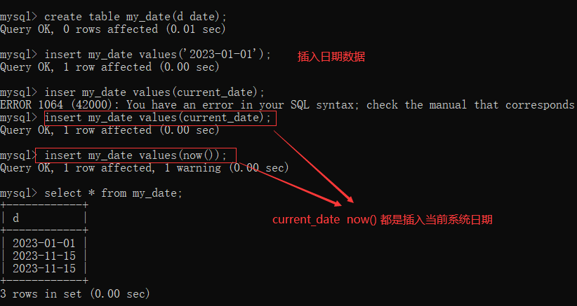

## 1.数据库基本操作

### 1. 数据库操作

#### 1.1.1 创建数据库

基本语法 create dababase 数据库名称 [库选项] 	[]表示的是可选参数
创建数据库


如果数据库已经存在，程序就会报错，可以添加 if not exists


#### 1.1.2 查看数据库

1. 查看mysql服务器所有数据库
   
2. 查看指定数据库的创建信息
   

#### 1.1.3 选择数据库


可以在登录数选择数据库 mysql -u 用户名 -p 密码  数据库名称

#### 1.1.4 删除数据库


### 1.2 数据表操作

#### 1.2.1 创建数据表

create table [if not exists] 表名(字段名 字段类型 [字段属性]...) [表选项]


#### 1.2.2 查看数据表

1. show tables [like 匹配模式]
   匹配模式有俩种 % 表示匹配任意长度的字符串 _  表示匹配一个字符


2. 查看数据表的相关信息
    show table status [from 数据库名] [like 匹配模式]

   
   数据表相关信息

   

#### 1.2.3 修改数据表

1. 修改数据库表名

   单表修改 	alter table 旧表名 rename [to|as] 新表名;
   多表修改	 rename table 旧表名1 to 新表名1 [, 旧表名2 to 新表名2]

   
   
2. 修改表选项
   alter table 表名 表选项[=]值

   

#### 1.2.4 查看表结构

1. 查看数据表的字段信息
   查看所有字段信息  [describe|desc] 数据表名;
   查看指定字段信息  [describe|desc] 数据表名 字段名；
   

2. 查看数据表的创建语句

   show create table 表名
   

3. 查看数据表结构
   show [full] columns from 数据库名.数据表名;
   

#### 1.2.5 修改表结构

1. 修改表字段名
   alter table 数据表名 change 旧字段 新字段 字段类型[字段属性];

   

2. 修改字段类型

   alter table 数据表名 modify 字段名 新类型[字段属性]
   

3. 修改字段位置
   alter table 数据表名 modify 字段名1 数据类型 [字段属性]  [first|after 字段名2]
   

4. 新增字段
   新增一个字段，可以指定其位置 alter table 数据库表名 add 新字段名 新字段类型 [first|after 字段名]
   同时新增多个字段 alter table 数据表名 add (新字段名1 新字段类型1,新字段名2 新字段类型2,新字段名3 新字段类型3,...)
   
5. 删除字段 
   alter table 数据表名 drop 字段名
   

#### 1.2.6 删除数据表

drop table if exists 数据表1 [,数据表2]...;


### 1.3  数据操作

#### 1.3.1 添加数据

1. 为所有字段添加数据
   insert [into] 数据表名 values (值1[,值2]...)
   

2. 为部分字段添加数据
   insert 数据表名 (字段名1[,字段名2]...) values (值1,[,值2]...)

   insert 数据表名 set 字段名1=值1  [, 字段名2=值2]...
   

3. 一次添加多行数据
   insert 数据表名 [(字段列表)] values (值列表)  [,(值列表)]...
   

#### 1.3.2 查询数据

1. 查询表中全部数据
   

2. 查看表中部分字段
   

3. 简单条件查询
   select * from 数据库 where 字段名=值
   

#### 1.3.3 修改数据

update 数据表名 set 字段1=值1 [,字段2=值2,...]  [where 条件表达式]


#### 1.3.4 删除数据

delete from 数据表名 [where 条件表达式]


## 2. 数据类型和约束

### 2.1 数据类型

#### 2.1.1 数字类型

1. 整数类型
   

   

   

2. 浮点类型
   float 的精度为6位或7位，double 的精度大约为15位
   

3. 定点数

   decimal(M,D) M表示数字总位数，D表示小数点后面位数
   

#### 2.1.2 时间和日期类型

1. year 表示年份
   

2. date 表示日期
   

3. timestamp 表示日期时间
   

#### 2.1.3 字符串类型

| 数据类型 | 说明           |
| -------- | -------------- |
| char     | 固定长度字符串 |
| varchar  | 可变长度字符串 |
| text     | 大文本数据     |
| enum     | 枚举类型       |
| set      | 字符串对象     |

1. char 和 varchar  保存字符串数据
   区别

   | 插入值 | char(4) | varchar(4) |
   | ------ | ------- | ---------- |
   | ''     | 4字节   | 1字节      |
   | 'a'    | 4字节   | 2字节      |
   | 'ab'   | 4字节   | 3字节      |
   | 'abc'  | 4字节   | 4字节      |
   | 'abcd' | 4字节   | 5字节      |

   

2. text  保存大文本数据

   

3. enum 枚举类型  
   enum('值1','值2','值3',.....,'值n',)
   只能从枚举列表中选取一个
   

4. set  可以选择一个值或多个值保存
   


### 2.2 表的约束

#### 2.2.1 默认约束

字段名 数据类型 default 默认值;


删除默认值 alter table my_default modify age int unsigned ;
添加默认值 alter table my_default modify age int unsigned default 18;

#### 2.2.2 非空约束

非空指的是字段的值不能为NUll
字段名 数据类型 not null


#### 2.2.3 唯一约束

保证数据表中字段的唯一性，即表中字段不能重复出现

- 列级约束 定义在一个列上，只对该列起约束作用
- 表级约束 独立于列的定义，可以应用在一个表的多列上


复合唯一约束
表级创建唯一约束时，可以添加多个字段，组成复合唯一约束，特点是多个字段值相同才视为重复记录。


#### 2.2.4 主键约束

主键可以唯一标识表中的记录，由primary key 定义，相当于唯一约束和非空约束的组合，要求字段不能重复，也不能出现null值，每张表中包含一个主键，复合主键需要多个字段确定一条记录的唯一性

- 列级约束 字段名 数据类型 primary key
- 表级约束 primary key (字段1，字段2，...)


### 2.3 自动增长

字段名 数据类型 auto_increment

1. 一个表中只能有一个自增字段，数据类型必须是整数，且定义为键，如unique,primary
2. 插入null、0、default或插入时省略该字段，都会自增，如插入的是个具体的值，则不会使用自动增长值
3. 从1开始每次加1，插入值大于自增值，下次使用最大值加1，插入值小于自增值，则不会产生影响
4. 使用delete删除记录时，自增值不会减少或填补空缺


查看自动增长值


修改自动增长值


### 2.4 字符集和校对集

#### 2.4.1 简介

1. 字符集
   字符指计算机保存的各种文字和符号，计算机采用的是二进制保存数据，用户输入的字符按照一定规则转化为二进制保存（字符编码），将编码规则组合起来形成字符集
   


2. 校对集
   为不同字符集指定排序和比较规则。

   - ci 表示不区分大小写
   - cs 表示区分大写
   - bin 表示以二进制方式比较

   

#### 2.4.2 字符集与校对集设置

1. 数据库
   - charset set [=] charset_name
   - collation [=] collation_name

```sql
# 创建数据库，指定字符集 utf8 使用默认校对集 utf8_general_ci
create database mydb charset set utf8;
# 创建数据库，指定字符集 utf8 校对集 utf8_bin
create database mydb charset set utf8 collation utf8_bin;
```


2. 数据表

   ​	没有指定 使用数据库字符集

   - charset set [=] charset_name
   - collation [=] collation_name

```sql
create table my_charset(username varchar(20))charset utf8 collation utf8_bin;
```


3. 字段 

   没有指定 使用数据表字符集

   在字段属性设置字符集和校对集

   ```sql
   create table my_charset(username varchar(20) charset set utf8 collation utf_bin);
   ```


