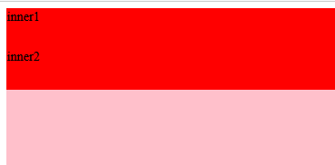

# Vue


## 1. Vue初识

### 1.1 什么是Vue

是一套构建用户界面的渐进式框架，采用MVVM设计模式，支持数据驱动和组件化开发
渐进式：框架的出现主要是为了解决单页应用程序（SPA）中的一些问题，例如在首次加载时加载过多的代码和资源，导致应用程序加载时间过长。渐进式框架通过将应用程序拆分成更小的块，可以更快地将应用程序呈现给用户。
单页面应用：在切换页面时，不会刷新整个页面，而是通过Ajax异步加载获取数据，改变页面内容

### 1.2MVVM设计模式

View：指的是视图部分，即DOM元素，负责视图的处理。
Model：指的是数据部分，负责业务数据
ViewModel：连接视图和数据的视图模型，负责监听Model和View的修改

在MVVM中，视图和数据不能直接通信，视图模型就相当于一个观察者，监控着双方的动作，并及时通知进行响应的操作

### 1.3 Vue的优势

1. 响应式系统：Vue可以自动追踪依赖关系并在依赖项改变时自动更新DOM，开发者只需要关注核心业务逻辑，而不需要手动操作DOM。
2. 组件化开发：Vue采用组件化开发方式，使得代码更加模块化、复用性更好，易于维护和测试。
3. 轻量级框架：Vue是一个轻量级的框架，体积小、速度快，可以与其他库或已有项目无缝连接。
4. 强大的指令系统：Vue拥有强大的指令系统，通过简单的标记语法，将模板渲染为DOM。
5. 模板语法简单易懂：Vue的模板语法简洁明了，易于学习，即使是前端新手也能快速上手。
6. 插件化扩展：Vue是一个非常灵活的框架，开发者可以根据自己的需求选择相应的插件进行扩展，从而加强Vue的功能。

## 2. Vue开发基础

### 2.1 Vue实例

#### 2.1.1 创建实例对象

```js
    var vm = new Vue({
        //选项
    })
```

| 选项       | 说明            |
| :--------- | --------------- |
| data       | Vue实例数据对象 |
| methods    | Vue实例的方法   |
| components | 定义子组件      |
| computed   | 计算属性        |
| filters    | 过滤器          |
| el         | 唯一根标签      |
| watch      | 监听数据变化    |


#### 2.1.2 el唯一根标签

```js
<body>
<div id="app">
    {{ name }}
</div>
</body>
<script>
    var vm = new Vue({
        //设置当前vue对象控制标签范围
        el:'#app',
        data: {
            name: 'vue实例创建成功！'
        }
    })
</script>
```


#### 2.1.3 data初始数据

```js
<body>
<div id="app">
    {{ name }}
</div>
</body>
<script>
    var vm = new Vue({
        //设置当前vue对象控制标签范围
        el:'#app',
        data: {
            name: '定义初始数据！'
        }
    })
    console.log(vm.$data.name)
    console.log(vm.name)
</script>
```


#### 2.1.4 mothods 定义方法

*methods定义的方法，this指向当前vue对象*

```js
<body>
<div id="app">
<!--    绑定click事件-->
    <button @click="show_info">点击</button>
    <p>{{ msg }}</p>
</div>
</body>
<script>
    var vm = new Vue({
        el:'#app',
        data: {
            msg: ''
        },
         methods:{
            //设置事件处理方法
             show_info(){
                 this.msg='触发点击事件'
             }
    }
    })
</script>
```


#### 2.1.5 computed 计算属性

```js
<body>
<div id="app">
    <p>总价格：{{total_price}}</p>
    <p>单价：{{price}}</p>
    <p>数量：{{num}}</p>
    <button @click="num==0?0:num--">减少数量</button>
    <button @click="num++">增加数量</button>
</div>
</body>
<script>
    var vm = new Vue({
        el:'#app',
        data: {
            price:20,
            num:0
        },
        computed:{
            //总价格 totall_price
            total_price(){
                return this.num*this.price
            }
        }
    })
</script>
```


#### 2.1.6 watch监听状态

*监听当前vue实例中的数据变化，就会调用当前数据所绑定的事件处理方法*

```js
<body>
<div id="app">
    <p>{{num}}</p>
</div>
</body>
<script>
    var vm = new Vue({
        el:'#app',
        data: {
            num:20
        },
        //使用watch监听num数据变化
        watch:{
     		//接受num
            num(res){
                console.log('num改变了',res);
            }
        }
    })
</script>
```


#### 2.1.7 filters过滤器

```js
<body>
<div id="app">
    <p>{{msg|upper}}</p>
</div>
</body>
<script>
    var vm = new Vue({
        el:'#app',
        data: {
            msg:'hello,world!'
        },
        filters:{
            //将hello,world 变为大写
            upper(value){
                return value.toUpperCase()
            }
        }
    })
</script>
```


### 2.2 Vue数据绑定

#### 2.2.1 绑定样式

1. 绑定内联样式
   ```js
   <body>
   <div id="app">
       <div v-bind:style="{backgroundColor:pink,width:width,height:height}">
           <div v-bind:style="my_div"></div>
       </div>
   </div>
   </body>
   <script>
       var vm = new Vue({
           el: '#app',
           data: {
               my_div: {backgroundColor: 'red', width: '100px', height: '100px'},
               pink: 'pink',
               width: '100%',
               height: '200px',
           },
       })
   </script>
   ```

   
   
2. 绑定样式类
   ```js
   <style>
       .box{
           background-color: pink;
           width: 100%;
           height:200px;
       }
       .inner{
           background-color: red;
           width: 100%;
           height: 50px;
           border:2px solid solid white
       }
   </style>
   
   <body>
   <div id="app">
       <div v-bind:class="box">
           <div v-bind:class="inner">inner1</div>
           <div v-bind:class="inner">inner2</div>
       </div>
   </div>
   </body>
   <script>
       var vm = new Vue({
           el: '#app',
           data: {
               box:'box',
               inner:'inner',
           },
       })
   </script>
   ```

   
   

#### 2.2.2内置指令

1. v-model 双向数据绑定
   ```js
   <body>
   <div id="app">
      <input type="text" v-model="msg">
   </div>
   </body>
   <script>
       var vm = new Vue({
           el: '#app',
           data: {
               msg:'v-model指令',
           },
       })
   </script>
   ```

   
   

   
   
2. v-text 元素内部插入文本内容
   ```js
   <body>
   <div id="app">
       <p v-text="msg"></p>
   </div>
   </body>
   <script>
       var vm = new Vue({
           el: '#app',
           data: {
               msg:'我是v-text插入的内容',
           },
       })
   </script>
   ```

   
   
3. v-html 元素内部插入html标签内容
   ```js
   <body>
   <div id="app">
       <div v-html="msg"></div>
   </div>
   </body>
   <script>
       var vm = new Vue({
           el: '#app',
           data: {
               msg:'<p>我是v-html</p>',
           },
       })
   </script>
   ```

   
   
4. v-for 列表渲染
   ```js
   <body>
   <div id="app">
       <ul  v-for="(value,index) in list">
           <li>{{value}}--{{index}}</li>
       </ul>
   </div>
   </body>
   <script>
       var vm = new Vue({
           el: '#app',
           data: {
               list:['python','Java','c++'],
           },
       })
   </script>
   ```

   
   
5. v-bind 单向数据绑定
   ```js
   <body>
   <div id="app">
       <input v-bind:value="msg1">
   <!--    简写-->
       <input :value="msg2">
   </div>
   </body>
   <script>
       var vm = new Vue({
           el: '#app',
           data:{
               msg1: '我是v-bind',
               msg2: '我是v-bind',
           }
       })
   </script>
   ```

   
   
6. v-on 事件监听指令，与事件类型配合
   ```js
   <body>
   <div id="app">
       <P>{{msg}}</P>
       <button @click="show">点击看看</button>
   </div>
   </body>
   <script>
       var vm = new Vue({
           el: '#app',
           data:{
               msg: '请单击查看内容',
           },
           methods:{
               //methods 中定义的方法this都指向当前vue对象
               show(){
                   this.msg='哈哈，我是v-on指令'
               }
           }
       })
   </script>
   ```

   
   
7. v-if 和 v-show 控制元素的显示和隐藏

   *v-if 会对元素进行删除和重新创建*
   *v-show 是操作元素的display属性*

   ```js
   <body>
   <div id="app">
       <div v-if="isshow" style="background-color:tan">我是v-if</div>
   <!--    每次点击isshow属性都会取反值-->
       <button @click="isshow=!isshow">显示或隐藏</button>
   </div>
   </body>
   <script>
       var vm = new Vue({
           el: '#app',
           data: {
               isshow: true,
           },
       })
   </script>
   ```

   
   *v-if 点击之后会删除标签*

   把v-if 改成v-show 点击之后只是修改了标签的display属性

   
   

#### 2.2.3 学生列表案例

```js
<body>
<div id="app">
    <button @click="add_student">添加学生</button>
    <button @click="delete_student">删除学生</button>
    <table border="1" width="50%" style="border-collapse: collapse">
        <thead>
        <tr>
            <th>班级</th>
            <th>姓名</th>
            <th>性别</th>
            <th>年龄</th>
        </tr>
        </thead>
        <tbody>
        <tr align="center" v-for="item in student_list">
            <td>{{item.grade}}</td>
            <td>{{item.name}}</td>
            <td>{{item.gender}}</td>
            <td>{{item.age}}</td>
        </tr>
        </tbody>
    </table>
</div>
</body>
<script>
    var vm = new Vue({
        el: '#app',
        data: {
            student_list: [
                {grade: '1', name: '张三', gender: '男', age: '18'},
                {grade: '2', name: '李四', gender: '女', age: '20'},
                {grade: '3', name: '王五', gender: '男', age: '22'}
            ],
        },
        methods: {
            //添加学生
            add_student() {
                var student = {grade: '3', name: '土豆', gender: '男', age: '12'}
                //将变量添加到列表
                this.student_list.push(student)
            },
            //删除学生
            delete_student() {
                this.student_list.pop()
            }
        }
    })
</script>
```


### 2.3 Vue事件

**常用事件修饰符**

| 修饰符   | 说明                         |
| -------- | ---------------------------- |
| .stop    | 阻止冒泡事件                 |
| .prevent | 阻止默认事件                 |
| .capture | 事件捕获                     |
| .self    | 绑定到自身，只有自身才能触发 |
| .once    | 事件只触发一次               |

1. stop阻止事件冒泡
   ```js
   <body>
   <div id="app">
       <div @click="do_parent">
           <button @click="do_this">事件冒泡</button>
           <button @click.stop="do_this">阻止事件冒泡</button>
       </div>
   </div>
   </body>
   <script>
       var vm = new Vue({
           el: '#app',
           methods: {
               do_parent() {
                   console.log('我是父元素的单击事件')
               },
               do_this() {
                   console.log('我是被点击的元素事件')
               }
           }
       })
   </script>
   ```

   点击冒泡事件
   
   点击阻止事件冒泡
   

  2. prevent阻止默认事件行为
     *阻止<a>默认行为*

     ```js
     <body>
     <div id="app">
         <a href="https://www.baidu.com">百度</a>
         <!--    阻止默认行为-->
         <a href="https://www.baidu.com" @click.prevent>百度</a>
     </div>
     </body>
     <script>
         var vm = new Vue({
             el: '#app',
         })
     ```

3. capture 事件捕获
   *事件捕获的执行顺序是由外部结构向内部结构执行，与事件冒泡的顺序相反*

   ```js
   <body>
   <div id="app">
       <div @click.capture="do_parent">
           <button @click="do_this">事件捕获</button>
       </div>
   </div>
   </body>
   <script>
       var vm = new Vue({
           el: '#app',
           methods: {
               do_parent() {
                   console.log('我是父元素的单击事件')
               },
               do_this() {
                   console.log('我是当前的点击事件')
               }
           }
       })
   </script>
   ```

   点击捕获后先执行外部的do_parent,后执行内部的do_this
   

4. self 自身触发
   *实现只有DOM元素本身会触发的事件*

   ```js
    <style>
           .odiv1 {
               width: 80px;
               height: 80px;
               background: red;
               margin: 5px
           }
   
           .odiv2 {
               width: 50px;
               height: 50px;
               background: tan
           }
       </style>
   <body>
   <div id="app">
       <div class="odiv1" @click.self="do_parent">a
           <div class="odiv2" @click="do_this">b</div>
       </div>
       <div class="odiv1" @click="do_parent">c
           <div class="odiv2" @click.self="do_this">d</div>
       </div>
   </div>
   
   <script>
       var vm = new Vue({
           el: '#app',
           methods: {
               do_parent() {
                   console.log('我是父元素的单击事件')
               },
               do_this() {
                   console.log('我是当前的点击事件')
               }
           }
       })
   </script>
   ```

   点击b时，只有do_this方法执行，点击d时，do_this和do_parent会依次执行

   
   

5. once只触发一次
   阻止事件的多次触发

   ```js
   <body>
   <div id="app">
       <button @click="do_this">多点几次试试</button>
   </div>
   <script>
       var vm = new Vue({
           el: '#app',
           methods: {
               do_this() {
                   console.log('我只能执行一次哦！')
               }
           }
       })
   </script>
   </body>
   ```

   无论怎么点击只能输出一句

   
   

### 2.4 Vue组件

*组件是构成页面中独立结构单元，能够减少重复代码的编写，提高开发效率，使项目易维护，和管理*

#### 2.4.1 全局组件

```js
<body>
<div id="app">
    //使用
    <my_component></my_component>
    <my_component></my_component>
    <my_component></my_component>
</div>
</body>
<script>
    //全局注册组件,my_component就是组件名称
    Vue.component('my_component', {
        //必须是一个函数，是组件的初始数据
        data() {
            return {
                count: 0
            }
        }
        ,
        //表示组件的模版
        template: '<button @click="count++">被单击{{count}}次</button>'
    })
    var vm = new Vue({
        el: '#app',
    })
</script>
```


#### 2.4.2 局部组件

局部注册组件，Vue实例的component属性实现

```js
<body>
<div id="app">
    <my_component></my_component>
    <my_component></my_component>
    <my_component></my_component>
</div>
</body>
<script>
    var com={template:'<p>嘿嘿，我是局部组件</p>'}

    var vm = new Vue({
        el: '#app',
        //注册局部组件
        components:{
            my_component:com
        }
    })
</script>
```


#### 2.4.3 template模版

*template标签来定义结构的模版，在该标签内写html代码，然后通过id值绑定到组件的template属性上*

**组件模版中只有一个根元素**

```js
<body>
<div id="app">
    <p>{{title}}</p>
    <!--    使用组件-->
    <my_component></my_component>
</div>
<template id="aa">
    <p>{{title}}</p>
</template>
</body>
<script>
    Vue.component('my_component', {
        //将template标签定位到template属性
        template:'#aa',
        //组件初始数据
        data() {
            return {title:'我是组件内的title'}
        }
    })
    var vm = new Vue({
        el: '#app',
        data() {
            return {title:'Vue实例的title'}
        }

    })
</script>
```


#### 2.4.4 组件之间的数据传递

*组件实例具有局部作用域，组件之间的数据传递需要借助一些工具*

1. 父组件向子组件传递数据，单向数据流传输，父级的数据更新到子级，反过来就不行
   ```js
   <body>
   <div id="app">
       <p>{{num}}</p>
       <!--    向子组件传递数据-->
       <my_component :num="num"></my_component>
   </div>
   </body>
   <script>
       Vue.component('my_component', {
           //props接受父组件的数据，同时num和data绑定，当data数据发生改变时，组件num值夜会发生改变
           props: ['num'],
           template: `<div>
       子组件修改数据<input type="text" v-model="num">
       <p>子组件{{num}}</p>
           </div>
   `})
       var vm = new Vue({
           el: '#app',
           data() {
               return {num: '200'}
           }
       })
   </script>
   ```

   子组件数据的变动影响不到父级
   

​		修改父级数据，单向数据流传递影响到子级
​		

2. 子组件向父组件传值

   $emit 能够将子组件的值传递到父组件，可以触发父组件中定义的事件，数据通过传递参数完成

   ```js
   <body>
   <div id="app">
       <parent></parent>
   </div>
   <template id="child">
       <div>
           <button @click="send">send 传递数据</button>
           <input type='text' v-model="msg">
       </div>
   </template>
   </body>
   <script>
       //注册父组件
       Vue.component('parent', {
           data() {
               return {msg: ''};
           },
           template: `
       <!-- 定义父组件绑定的事件-->
           <div >父组件接受到的数据:{{msg}}
   <!--        使用子组件-->
           <child @child_send="recv"></child>
           </div>`,
           methods: {
               recv(val) {
                   console.log(111);
                   this.msg = val
               }
           }
       })
       //注册子组件
       Vue.component('child', {
           template: '#child',
           data() {
               return {msg: '子组件的数据'}
           },
           methods: {
               send() {
                   //触发父组件定义的事件
                   this.$emit('child_send', this.msg);
               }
           }
       })
   
   
       var vm = new Vue({
           el: '#app',
       })
   </script>
   ```

   
   

  3. 兄弟组件传值
     定义一个公交车vue对象，$emit 放值 $on 取值

     ```js
     <body>
     <div id="app">
         <div><bro1></bro1>
         <bro2></bro2></div>
     </div>
     </body>
     <script>
         //定义一个Vue实例
         var bus=new Vue();
     
         //注册bro1
         Vue.component('bro1', {
             data() {
                 return {msg: ''};
             },
             template: `
             <div >接受bro2的数据:{{msg}}</div>`,
             //created 页面挂载之前执行
             created() {
                 //this.msg=bus.$on('hh') 会出先循环引用的问题，使用bus.$on('hh')监听事件时，Vue会返回一个取消监听的函数
                 //取值
                 bus.$on('hh', (val) => this.msg = val)
             }
         })
     
         //注册bro2
         Vue.component('bro2', {
             template: '<button @click="send">send to bro1</button>',
             data() {
                 return {msg: '嘿嘿来自bro2的数据'}
             },
             methods: {
                 send() {
                     //放值
                     bus.$emit('hh', this.msg);
                 }
             }
         })
         
         var vm = new Vue({
             el: '#app',
         })
     </script>
     ```

     
     

### 2.5 Vue的生命周期

*vue实例为生命周期提供了回调函数，在特定情况下触发，贯穿vue实例化的整个过程，这给用户在不同阶段添加自己的代码提供了机会，创建实例、页面挂载、数据更新、销毁实例*

#### 2.5.1 钩子函数

| 钩子          | 说明                 |
| ------------- | -------------------- |
| beforeCreate  | 创建实例对象之前执行 |
| created       | 创建实例对象之后执行 |
| beforeMount   | 页面挂载成功之前执行 |
| mounted       | 页面挂载成功后执行   |
| beforeUpdate  | 组件更新之前执行     |
| updated       | 组件更新之后执行     |
| beforeDestroy | 实例销毁之前执行     |
| destroyed     | 实例销毁之后执行     |

#### 2.5.2 实例创建

```js
<body>
<div id="app"></div>
</body>
<script>
    var vm = new Vue({
        el: '#app',
        data: {
            msg:'张三'
        },
        beforeCreate(){
            console.log('实例创建之前');
            console.log(this.$data.msg);
        },
        created(){
            console.log('实例创建之后');
            console.log(this.$data.msg);
        }
    })
</script>
```


#### 2.5.3 页面挂载

*vue实例创建之后，如果挂载点el存在，就会进行页面挂载*

```js
<body>
<div id="app">{{msg}}</div>
</body>
<script>
    var vm = new Vue({
        el: '#app',
        data: {
            msg:'张三'
        },
        beforeMount(){
            console.log('页面挂载之前');
            //获取el的DOM元素
            console.log(this.$el.innerHTML);
        },
        mounted(){
            console.log('页面挂载之后');
            //获取el的DOM元素
            console.log(this.$el.innerHTML);
        }
    })
</script>
```


#### 2.5.4 数据更新

*vue实例挂载后，数据发生变化*

```js
<body>
<div id="app">
    <!-- ref给标签指定一个引用标识-->
    <div v-if="is_show" ref="div">test</div>
    <!-- 每次点击都会修改is_show的值-->
    <button @click="is_show=!is_show">更新一下</button>
</div>
</body>
<script>
    var vm = new Vue({
        el: '#app',
        data: {
            is_show: true
        },
        beforeUpdate(){
            console.log('更新之前');
            //获取div标签
            console.log(this.$refs.div);
        },
        updated(){
            console.log('更新之后');
            //获取div标签
            console.log(this.$refs.div);
        }
    })
</script>
```

点击俩下输出的结果


#### 2.5.5 实例销毁

```JS
<body>
<div id="app">
    {{msg}}
</div>
</body>
<script>
    var vm = new Vue({
        el: '#app',
        data: {
            msg:'张三'
        },
        beforeDestroy(){
            console.log('实例销毁之前');
            console.log(vm);
        },
        destroyed(){
            console.log('实例销毁之后');
            console.log(vm);
        }
    })
</script>
```


