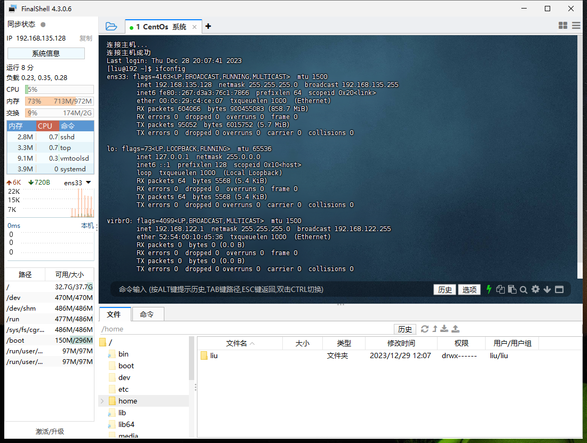
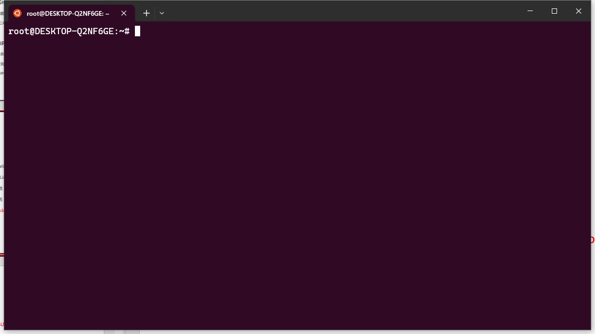
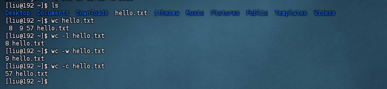

# linux


## 1. 远程连接linux

- 下载FinalShell

  Windows: 

  http://www.hostbuf.com/downloads/finalshell_install.exe

  Mac: 

  http://www.hostbuf.com/downloads/finalshell_install.pkg

- 查看linux的IP地址 
  

- 使用 FinalShell 连接 linux
  


## 2. windows 10 自带的 WSL

- 启动应用
  

- 应用商店下载ubuntu
  

- 下载Windows Terminal
  

- 成功安装ubuntu系统
  


## 3. linux 基础命令


### 3.1 linux的目录结构

- Linux的目录结构是一个树型结构

  Windows 系统可以拥有多个盘符, 如 C盘、D盘、E盘

  Linux没有盘符这个概念, 只有一个根目录 /, 所有文件都在它下面

  示图：
  

- / 在linux系统中的表示
  1. 出现在开头：表示根目录
  2. 出现在后面：表示层级关系


### 3.2 linux命令基础格式

无论是什么命令，用于什么用途，在Linux中，命令有其通用的格式：

```shell
command [-options] parameter

command： 命令本身
-options：[可选，非必填]命令的一些选项，可以通过选项控制命令的行为细节
parameter：[可选，非必填]命令的参数，多数用于命令的指向目标等
```


### 3.3 ls 命令

- ls命令的作用是列出目录下的内容，语法细节如下：
  ```shell
  -ls [-a -l -h] [linux 路径]
  
  -a -l -h 是可选的选项
  Linux路径是此命令可选的参数
  当不使用选项和参数，直接使用ls命令本体，表示：以平铺形式，列出当前工作目录下的内容- 
  ```

  

- Home 目录和工作目录

  Linux系统的命令行终端，在启动的时候，默认会加载:

  当前登录用户的HOME目录作为当前工作目录，所以ls命令列出的是HOME目录的内容

  HOME目录：每个Linux操作用户在Linux系统的个人账户目录，路径在：/home/用户名

   

- ls 的命令参数
  1. 当ls不使用参数，表示列出：当前工作目录的内容，即用户的HOME目录
     
  2. 当使用参数，ls命令的参数表示：指定一个Linux路径，列出指定路径的内容
     


- ls 的选项
  1. -a选项：all的意思，即列出全部文件（包含隐藏的文件/文件夹）
     
  2. -l选项，表示：以列表（竖向排列）的形式展示内容，并展示更多信息
     
  3. -h选项：表示以易于阅读的形式，列出文件大小，如K、M、G-h选项必须要搭配 -l 一起使用
     


### 3.4 目录切换相关命令（cd pwd）

- cd 切换工作目录
  1. cd命令无需选项，只有参数，表示要切换到哪个目录下
  2. cd命令直接执行，不写参数，表示回到用户的HOME目录
     


- pwd 查看当前工作目录
  


### 3.5 相对路径、绝对路径、特殊路径符

- 绝对路径：以根目录为起点，描述路径的一种写法，路径描述以/开头

  绝对路径切换到Desktop
  

- 相对路径：以当前目录为起点，描述路径的一种写法，路径描述无需以/开头
  切换到Desktop
  

- 特殊路径符：

  1. 表示当前目录，比如 cd ./Desktop 表示切换到当前目录下的Desktop目录内，和cd Desktop效果一致
  2. .. 表示上一级目录，比如：cd ..  即可切换到上一级目录，cd ../.. 切换到上二级的目录
  3. ~ 表示HOME目录，比如：cd ~  即可切换到HOME目录或cd ~/Desktop，切换到HOME内的Desktop目录

  


### 3.6 创建目录命令

- 通过mkdir命令可以创建新的目录（文件夹）mkdir来自英文：Make Directory

  语法：
  ```python
  mkdir [-p] linux 路径
  ```

  1. 参数必填，表示Linux路径，即要创建的文件夹的路径，相对路径或绝对路径均可
  2. -p选项可选，表示自动创建不存在的父目录，适用于创建连续多层级的目录

  

- 创建多层级的目录
  可以通过-p选项，将一整个链条都创建完成
  


### 3.7 文件操作命令

- touch 创建文件
  ```shell
  touch linux文件路径
  
  语法：
  	touch命令无选项，参数必填，表示要创建的文件路径，相对、绝对、特殊路径符均可以使用
  ```

  

- cat 查看文件内容

  ```shell
  cat linux文件路径
  
  语法：
  	cat同样没有选项，只有必填参数，参数表示：被查看的文件路径，相对、绝对、特殊路径符都可以使用
  ```

  

- more 查看文件内容

  more命令同样可以查看文件内容，同cat不同的是：

  1. cat是直接将内容全部显示出来
  2. more支持翻页，如果文件内容过多，可以一页页的展示

  ```shell
  more linux文件路径
  
  语法：
  	同样没有选项，只有必填参数，参数表示：被查看的文件路径，相对、绝对、特殊路径符都可以使用
  	
  more /etc/services
  		空格翻页
  		q退出
  ```

  
  

- cp 复制文件或文件夹

  ```shell
  cp [-r] 参数1 参数2
  
  语法：
  	-r选项，可选，用于复制文件夹使用，表示递归
  	参数1，Linux路径，表示被复制的文件或文件夹
  	参数2，Linux路径，表示要复制去的地方
  ```

  复制文件
  

  复制文件夹

  


- rm 删除文件或文件夹

  ```shell
  rm  [-r -f] 参数1 参数2 ... 参数n
  
  语法：
  	同cp命令一样，-r选项用于删除文件夹
  	-f表示force，强制删除（不会弹出提示确认信息）
  	普通用户删除内容不会弹出提示，只有root管理员用户删除内容会有提示，所以一般普通用户用不到-f选项
  	参数1、参数2、......、参数N 表示要删除的文件或文件夹路径，按照空格隔开
  ```

  删除文件
  
  删除文件夹
  

  **通配符**

  rm命令支持通配符 *，用来做模糊匹配

  符号* 表示通配符，即匹配任意内容（包含空），示例：

    ```shell
    test*，表示匹配任何以test开头的内容
    *test，表示匹配任何以test结尾的内容
    *test*，表示匹配任何包含test的内容
    ```

  

  **管理员用户**

  ```shell
  管理员权限表较大，删除文件或文件夹会有提示
  切换管理员用户 su root   退出 exit
  危险：
      rm -rf /
      rm -rf /*
      ！！！效果等同于在Windows上执行C盘格式化！！！
  ```

  
  

- mv 移动文件或文件夹

  ```shell
  mv 参数1 参数2
  
  语法：
  	参数1，Linux路径，表示被移动的文件或文件夹
  	参数2，Linux路径，表示要移动去的地方，如果目标不存在，则进行改名，确保目标存在
  ```

  移动文件
  

  修改文件名
  


### 3.8 查找命令

- which命令查看所使用的一系列命令的程序文件存放在哪里

  Linux命令，其实它们的本体就是一个个的二进制可执行程序。和Windows系统中的.exe文件，是一个意思。
  

- find 命令

  ```shell
  find 起始路径 -name '被查找的文件名'
  
  
  根据语法：
  	被查找文件名，支持使用通配符 * 来做模糊查询。
  	符号* 表示通配符，即匹配任意内容（包含空），示例：
  	test*，表示匹配任何以test开头的内容
  	*test，表示匹配任何以test结尾的内容
  	*test*，表示匹配任何包含test的内容
  	基于通配符的含义，可以结合find命令做文件的模糊查询。
  ```

  

  ```shell
  find 起始路径 -size +|-n[KMG]
  
  语法：
  	+、- 表示大于和小于
  	n表示大小数字
  	kMG表示大小单位，k(小写字母)表示kb，M表示MB，G表示GB
  ```

  


### 3.9 grep wc 和管道符

- grep 可以通过grep命令，从文件中通过关键字过滤文件行。
  ```shell
  grep [-n] 关键字 文件路径
  
  语法：
  	选项-n，可选，表示在结果中显示匹配的行的行号。
  	参数，关键字，必填，表示过滤的关键字，带有空格或其它特殊符号，建议使用””将关键字包围起来
  	参数，文件路径，必填，表示要过滤内容的文件路径，可作为内容输入端口
  ```

  

- wc 做数据统计
  ```shell
  可以通过wc命令统计文件的行数、单词数量等
  wc [-c -m -l -w] 文件路径
  
  
  语法：
  	选项，-c，统计bytes数量
  	选项，-m，统计字符数量
  	选项，-l，统计行数
  	选项，-w，统计单词数量
  	参数，文件路径，被统计的文件，可作为内容输入端口
  
  ```

  


- 管道符：|

  管道符的含义是：将管道符左边命令的结果，作为右边命令的输入
  


### 3.10 echo、tail和重定向符

- 可以使用echo命令在命令行内输出指定内容
  ```shell
  echo 输出内容
  
  语法：
  
  	无需选项，只有一个参数，表示要输出的内容，复杂内容可以用””包围
  ```

  

- 反引号

  `将其包围被`包围的内容，会被作为命令执行，而非普通字符
  


- 重定向符：>和>>

  •>，将左侧命令的结果，覆盖写入到符号右侧指定的文件中

  •>>，将左侧命令的结果，追加写入到符号右侧指定的文件中
  


- tail 命令
  ```shell
  使用tail命令，可以查看文件尾部内容，跟踪文件的最新更改，语法如下：
  tail -f -num linux文件路径
  
  	参数，Linux路径，表示被跟踪的文件路径
  	选项，-f，表示持续跟踪
  	选项, -num，表示，查看尾部多少行，不填默认10行
  ```

  


### 3.11 vi/vim 编译器

- 什么是vi/vim编辑器
  1. vi\vim编辑器，就是命令行模式下的文本编辑器，用来编辑文件
  2. vim是vi的升级版，一般用vim即可，包含全部vi功能

- 基础命令
  vi/vim 文件路径

- 运行模式
  1. 命令模式，默认的模式，可以通过键盘快捷键控制文件内容
  2. 输入模式，通过命令模式进入，可以输入内容进行编辑，按esc退回命令模式
  3. 底线命令模式，通过命令模式进入，可以对文件进行保存、关闭等操作
- 示图
  


## 4. Linux用户和权限


### 4.1 认识root用户

- root用户
  root用户拥有最大的系统操作权限，而普通用户在许多地方的权限是受限的。
  

  普通用户的权限，一般在其HOME目录内是不受限的

  一旦出了HOME目录，大多数地方，普通用户仅有只读和执行权限，无修改权限


- su命令
  su命令就是用于账户切换的系统命令，其来源英文单词：Switch User

  ```shell
  su - [用户名]
  
  语法：
      - 符号是可选的，表示是否在切换用户后加载环境变量，建议带上
      参数：用户名，表示要切换的用户，用户名也可以省略，省略表示切换到root
      切换用户后，可以通过exit命令退回上一个用户，也可以使用快捷键：ctrl + d
  
      使用普通用户，切换到其它用户需要输入密码，如切换到root用户
      使用root用户切换到其它用户，无需密码，可以直接切换
  ```


- sudo 命令
  我们可以使用sudo命令，为普通的命令授权，临时以root身份执行。

  ```shell
  sudo 其他命令
  
  语法：
  	在其它命令之前，带上sudo，即可为这一条命令临时赋予root授权
  	但是并不是所有的用户，都有权利使用sudo，我们需要为普通用户配置sudo认证
  ```


- 为普通用户配置sudo认证
  ```shell
  1.切换到root用户，执行visudo命令，会自动通过vi编辑器打开：/etc/sudoers
  2.在文件的最后添加：liu (ALL)=ALL	NOPASSWD:ALL
  3.其中最后的NOPASSWD:ALL 表示使用sudo命令，无需输入密码
  4.最后通过 wq 保存
  5.切换回普通用户
  
  执行的命令，均以root运行
  ```

  


### 4.2 用户和用户组管理

- 用户用户组
  1. 配置多个用户
  2. 配置多个用户组
  3. 用户可以加入多个用户组中

- Linux中关于权限的管控级别有2个级别

  1. 针对用户的权限控制
  2. 针对用户组的权限控制

  比如：针对某文件，可以控制用户的权限，也可以控制用户组的权限

- 示图
  

- 用户组管理（root用户）

  1. 创建用户组   groupadd 用户组名
  2. 用户组名删除用户组   groupdel 用户组名

  

- 用户管理 (root用户)

  1. 创建用户 useradd [-g -d] 用户名

     选项：-g指定用户的组，不指定-g，会创建同名组并自动加入，指定-g需要组已经存在，如已存在同名组，必须使用-g

     选项：-d指定用户HOME路径，不指定，HOME目录默认在：/home/用户名

     

  2. 删除用户  userdel [-r] 用户名

     选项：-r，删除用户的HOME目录，不使用-r，删除用户时，HOME目录保留

     

     

  3. 查看用户所属组 id [用户名]

     参数：用户名，被查看的用户，如果不提供则查看自身
     

  

  4. 修改用户所属组   usermod -aG 用户组 用户名，将指定用户加入指定用户组
     

     

- getent
  1. getent passwd 可以查看当前系统中有哪些用户
     
  2. getent group 查看当前系统中有哪些用户组
     


### 4.3 查看权限控制

- 认知权限信息
  通过ls -l 可以以列表形式查看内容，并显示权限细节
  

  权限细节总共分为10个槽位

  

  举例：drwxr-xr-x，表示：

  ​	这是一个文件夹，首字母d表示

  ​	所属用户(右上角图序号2)的权限是：有r有w有x，rwx

  ​	所属用户组(右上角图序号3)的权限是：有r无w有x，r-x （-表示无此权限）

  ​	其它用户的权限是：有r无w有x，r-x

- rwx权限

  r表示读权限

  w表示写权限

  x表示执行权限
  


### 4.4 修改权限控制

- chmod命令，修改文件、文件夹的权限信息 （只有文件、文件夹的所属用户或root用户可以修改）

  ```shell
  chmod -R 权限 文件或文件夹
  
  语法：
  	选项：-R，对文件夹内的全部内容应用同样的操作
  
  示例：
      chmod u=rwx,g=rx,o=x hello.txt ，将文件权限修改为：rwxr-x--x
      其中：u表示user所属用户权限，g表示group组权限，o表示other其它用户权限
      chmod -R u=rwx,g=rx,o=x test，将文件夹test以及文件夹内全部内容权限设置为：rwxr-x--x
  ```

  

  
  **更便捷的方法：**
  	**权限的数字序号**

  ```shell
  数字的细节如下：r记为4，w记为2，x记为1，可以有：
      0：无任何权限，	即 ---
      1：仅有x权限，	即 --x
      2：仅有w权限	即 -w-
      3：有w和x权限	即 -wx
      4：仅有r权限	即 r--
      5：有r和x权限	即 r-x
      6：有r和w权限	即 rw-
      7：有全部权限	即 rwx
  ```

  

- chown命令  修改文件、文件夹的所属用户、组

  ```shell
  chown -R [用户][:][用户组] 文件或文件夹
  
  限制，只可root执行
  语法：
      选项，-R，同chmod，对文件夹内全部内容应用相同规则
      选项，用户，修改所属用户
      选项，用户组，修改所属用户组
      :用于分隔用户和用户组
  
  比如：
  	chown root hello.txt，将hello.txt所属用户修改为root
      chown :root hello.txt，将hello.txt所属用户组修改为root
      chown root:itheima hello.txt，将hello.txt所属用户修改为root，用户组修改为itheima
      chown -R root test，将文件夹test的所属用户修改为root并对文件夹内全部内容应用同样规则
  ```

  
