# Redis基础

## 1. 认识redis

### 1.1 认识nosql 

no only sql  不仅仅是sql  非关系数据库，没有表结构

### 1.2 nosql和sql对比

|          |                    sql                     |     nosql     |
| :------: | :----------------------------------------: | :-----------: |
| 数据结构 |                   结构化                   |   非结构化    |
| 数据关联 |                   关联的                   |   非关联的    |
| 查询方式 |                  sql查询                   |   非sql查询   |
| 事务特性 |                    ACID                    | BASE 基本满足 |
| 存储方式 |                    磁盘                    |     内存      |
|  扩展性  |                    垂直                    |     水平      |
| 应用场景 | 数据结构固定，对数据安全性和一致性要求较高 | 对性能要求高  |

1. ACID 指的是：原子性、一致性、隔离性、持久性
2. 垂直：提高机器硬件设置  水平：提供机器数量

### 1.3 redis

基于内存的键值型NoSQL数据库

1. 键值（key-value）型，value支持多种不同数据结构，功能丰富
2. 单线程，每个命令具备原子性
3. 低延迟，速度快（基于内存、IO多路复用、良好的编码）。
4. 支持数据持久化
5. 支持主从集群、分片集群
6. 支持多语言客户端


## 2. redis常见命令

Redis是一个key-value的数据库，key一般是String类型，不过value的类型多种多样

### 2.1 通用命令

1. KEYS：查看符合模板的所有key，类型模糊查询数据量大时非常缓慢
   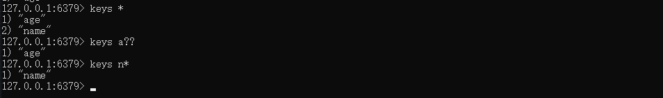
2. DEL：删除一个指定的key
   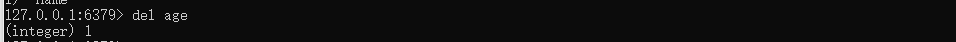
3. EXISTS：判断key是否存在
   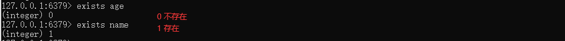
4. EXPIRE：给一个key设置有效期，有效期到期时该key会被自动删除  (已经存在的)
5. TTL：查看一个KEY的剩余有效期
   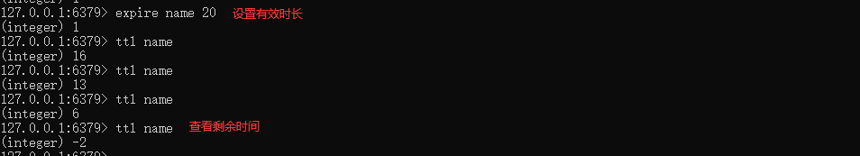

### 2.2 strings 常见命令

reids key的格式  使用：表示层级结构 shop:user:1

1. SET：添加或者修改已经存在的一个String类型的键值对

2. GET：根据key获取String类型的value

   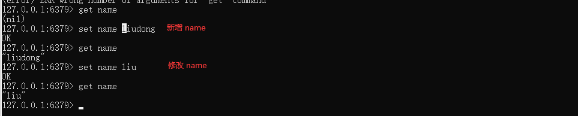
   
   
3. MSET：批量添加多个String类型的键值对

4. MGET：根据多个key获取多个String类型的value
   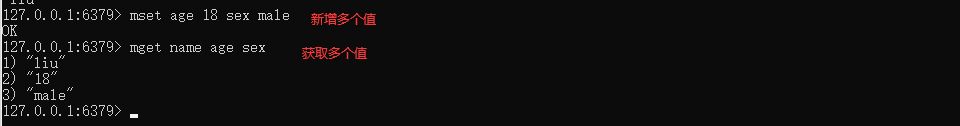

5. INCR：让一个整型的key自增1

6. INCRBY:让一个整型的key自增并指定步长，例如：incrby num 2 让num值自增2
   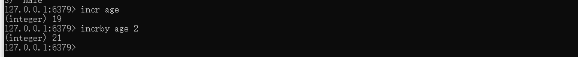

7. INCRBYFLOAT：让一个浮点类型的数字自增并指定步长

8. SETNX：添加一个String类型的键值对，前提是这个key不存在，否则不执行
   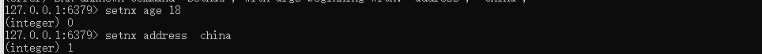

9. SETEX：添加一个String类型的键值对，并且指定有效期
   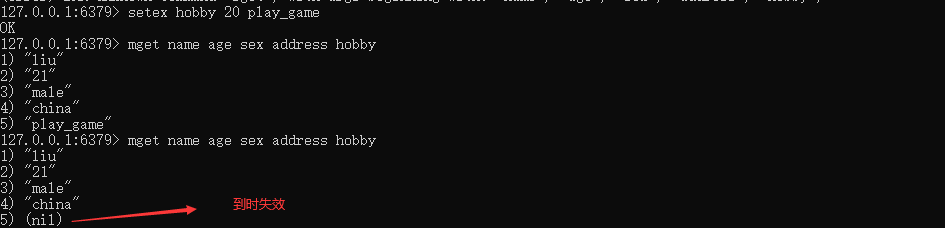

​	

### 2.3 Hash 类型 

**无序字典**

1. HSET key field value：添加或者修改hash类型key的field的值
   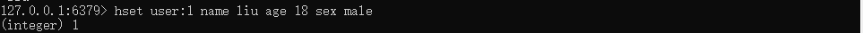
2. HGET key field：获取一个hash类型key的field的值
   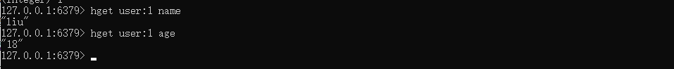
3. HMSET：批量添加多个hash类型key的field的值
   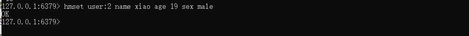
4. HMGET：批量获取多个hash类型key的field的值
   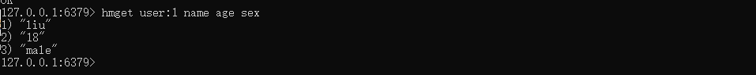
5. HGETALL：获取一个hash类型的key中的所有的field和value
   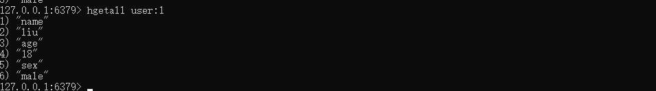
6. HKEYS：获取一个hash类型的key中的所有的field
7. HVALS：获取一个hash类型的key中的所有的value
   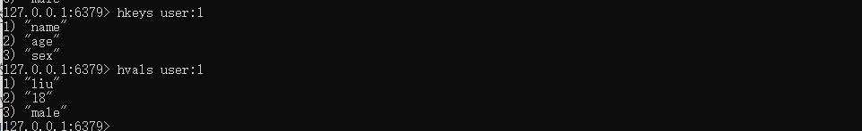
8. HINCRBY:让一个hash类型key的字段值自增并指定步长
   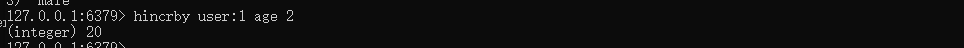
9. HSETNX：添加一个hash类型的key的field值，前提是这个field不存在，否则不执行
   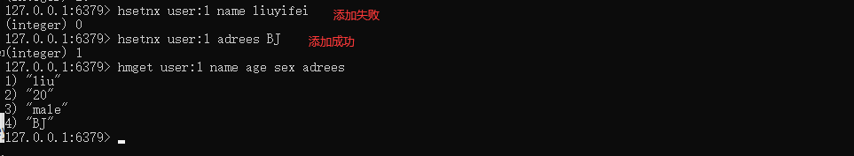


### 2.4 List 类型

**双向链表结构**

1. LPUSH key element ... ：向列表左侧插入一个或多个元素
2. RPUSH key element ... ：向列表右侧插入一个或多个元素
   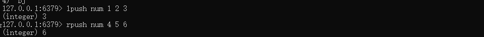
   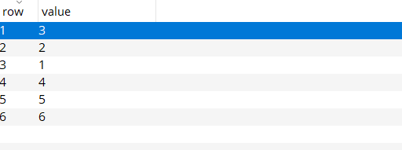
3. LPOP key：移除并返回列表左侧的第一个元素，没有则返回nil
4. RPOP key：移除并返回列表右侧的第一个元素
5. LRANGE key star end：返回一段角标范围内的所有元素
   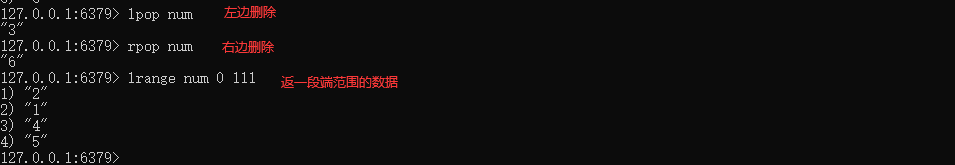
6. BLPOP和BRPOP：与LPOP和RPOP类似，只不过在没有元素时等待指定时间，而不是直接返回nil
   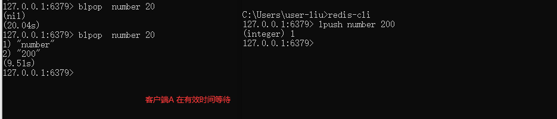


### 2.5 Set 类型

**无序，不重复**

1. SADD key member ... ：向set中添加一个或多个元素
2. SREM key member ... : 移除set中的指定元素
   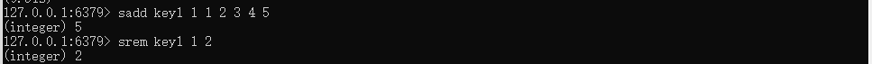
3. SCARD key： 返回set中元素的个数
   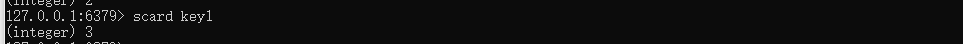
4. SISMEMBER key member：判断一个元素是否存在于set中
   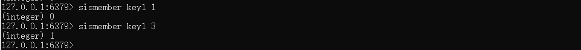
5. SMEMBERS：获取set中的所有元素
   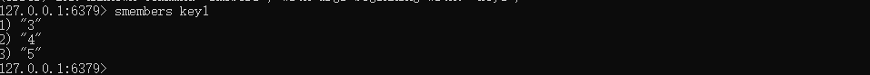
6. SINTER key1 key2 ... ：求key1与key2的交集
7. SDIFF key1 key2 ... ：求key1与key2的差集
8. SUNION key1 key2 ..：求key1和key2的并集

```text
将下列数据用Redis的Set集合来存储：
    张三的好友有：李四、王五、赵六
    李四的好友有：王五、麻子、二狗
利用Set的命令实现下列功能：
    计算张三的好友有几人
    计算张三和李四有哪些共同好友
    查询哪些人是张三的好友却不是李四的好友
    查询张三和李四的好友总共有哪些人
    判断李四是否是张三的好友
    判断张三是否是李四的好友
    将李四从张三的好友列表中移除
```

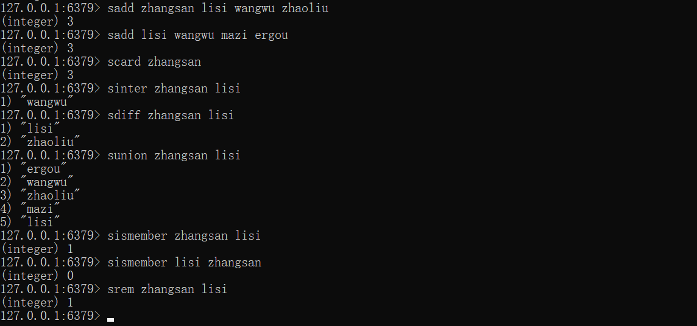


### 2.6 SortedSet 类型

**可排序的set类型**

1. ZADD key score member：添加一个或多个元素到sorted set ，如果已经存在则更新其score值
2. ZREM key member：删除sorted set中的一个指定元素
3. ZSCORE key member : 获取sorted set中的指定元素的score值
4. ZRANK key member：获取sorted set 中的指定元素的排名
5. ZCARD key：获取sorted set中的元素个数
6. ZCOUNT key min max：统计score值在给定范围内的所有元素的个数
7. ZINCRBY key increment member：让sorted set中的指定元素自增，步长为指定的increment值
8. ZRANGE key min max：按照score排序后，获取指定排名范围内的元素
9. ZRANGEBYSCORE key min max：按照score排序后，获取指定score范围内的元素
10. ZDIFF、ZINTER、ZUNION：求差集、交集、并集

注意：所有的排名默认都是升序，如果要降序则在命令的Z后面添加REV即可

```text
将班级的下列学生得分存入Redis的SortedSet中：
	Jack 85, Lucy 89, Rose 82, Tom 95, Jerry 78, Amy 92, Miles 76
并实现下列功能：
    删除Tom同学
    获取Amy同学的分数
    获取Rose同学的排名
    查询80分以下有几个学生
    给Amy同学加2分
    查出成绩前3名的同学
    查出成绩80分以下的所有同学
```

zadd student 85 Jack 89 Lucy 82 Rose 95 Tom 78 Jerry 92 Amy 76 Miles 

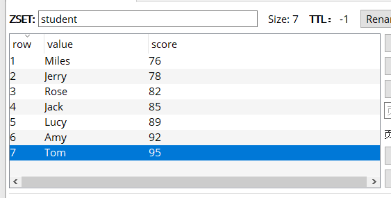
zrem student Tom

zscore student Amy


zrank student Rose
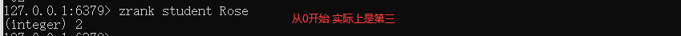

zcount student 0 80
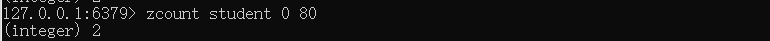

zincby student 2 Amy
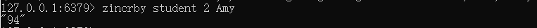

zrevrange student 0 
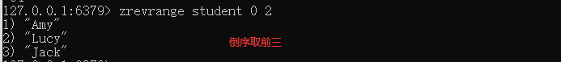

zrangebyscore student 0 80
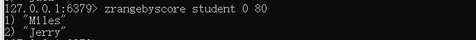


# Redis 高级


## 1. 缓存


### 1.1 什么是缓存

**数据交换的缓冲区，是临时存储数据的地方，读写性能高**

### 1.2 缓存的作用

- 优点
  1. 降低后端负载。
  2. 读写效率高，提高响应时间。
- 缺点
  1. 数据一致性问题
  2. 维护成本
- 缓存作用模型
  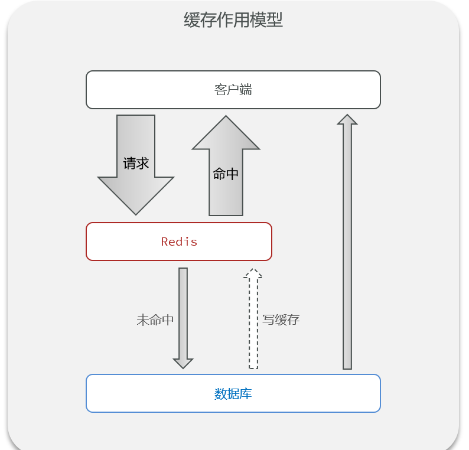

## 2.  缓存更新策略

- 内存淘汰
  不用自己维护，利用Redis的内存淘汰机制，当内存不足时自动淘汰部分数据。下次查询时更新缓存。
  一致性：差 

  维护成本：无

- 超时剔除
  给缓存数据添加TTL时间，到期后自动删除缓存。下次查询时更新缓存。
  一致性：一般
  维护成本：低

- 主动更新
  编写业务逻辑，在修改数据库的同时，更新缓存。

  一致性：好
  维护成本：高

- 缓存更新策略的最佳实践方案：

  1. 低一致性需求：使用Redis自带的内存淘汰机制

  2. 高一致性需求：主动更新，并以超时剔除作为兜底方案

  读操作：

  1. 缓存命中则直接返回

  2. 缓存未命中则查询数据库，并写入缓存，设定超时时间

  写操作：

  1. 先写数据库，然后再删除缓存

  2. 要确保数据库与缓存操作的原子性


## 3. 缓存穿透

**指客户端请求的数据在缓存中和数据库中都不存在，这样缓存永远不会生效，这些请求都会打到数据库。**

解决方法：

1. 缓存空对象

   - 优点
     实现简单，维护方便

   - 缺点：

     额外的内存消耗、可能造成短期的不一致

   - 示意图
     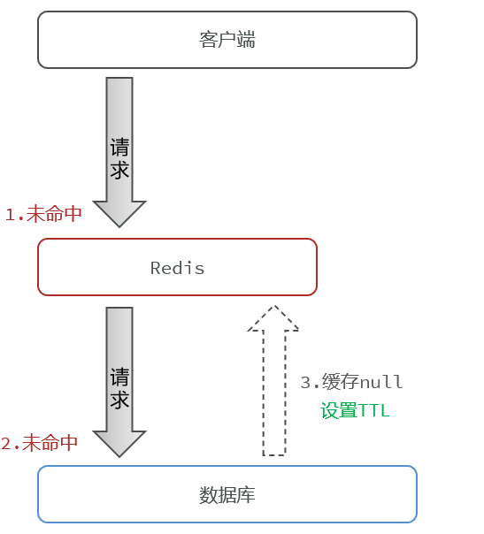

    2. 隆过滤

   - 优点：内存占用较少，没有多余key

   - 缺点   实现复杂、存在误判可能

   - 示意图

     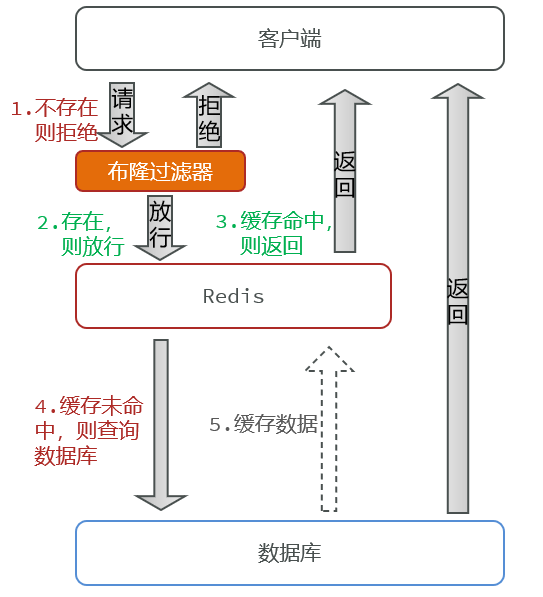
     

     

## 4. 缓存雪崩

**缓存雪崩是指在同一时段大量的缓存key同时失效或者Redis服务宕机，导致大量请求到达数据库，带来巨大压力。**

- 示图
  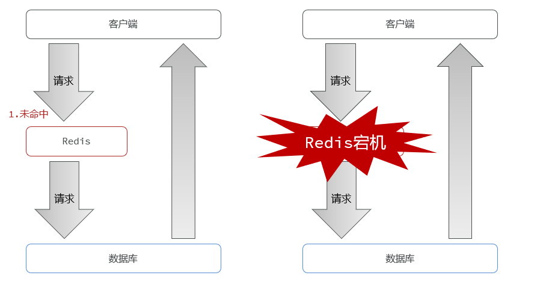

- 解决方法：

  1. 给不同的Key的TTL添加随机值

  1. 利用Redis集群提高服务的可用性

  1. 给缓存业务添加降级限流策略

  1. 给业务添加多级缓存


## 5. 缓存击穿

**缓存击穿问题也叫热点Key问题，就是一个被**高并发访问**并且**缓存重建业务较复杂**的key突然失效了，无数的请求访问会在瞬间给数据库带来巨大的冲击。**

- 示图
  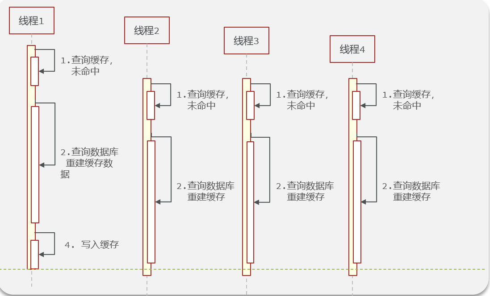

- 解决方案

  1. 互斥锁

     优点 ： 没有额外的内存消耗、保证一致性、实现简单

     缺点：线程需要等待，性能受影响、可能有死锁风险
     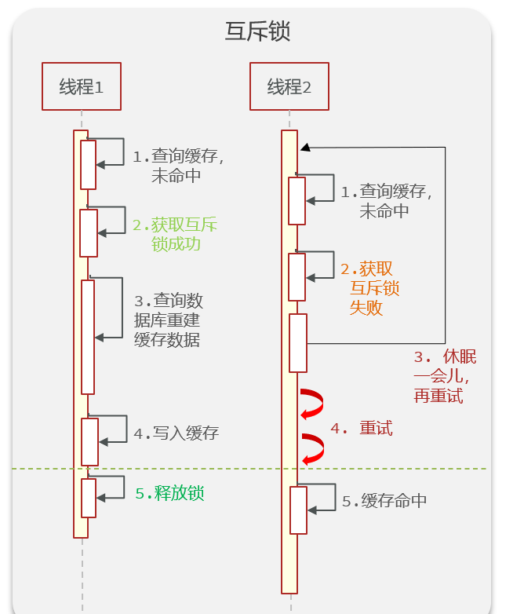

  2. 逻辑过期

     优点：线程无需等待，性能较好

     缺点：不保证一致性、有额外内存消耗、实现复杂

     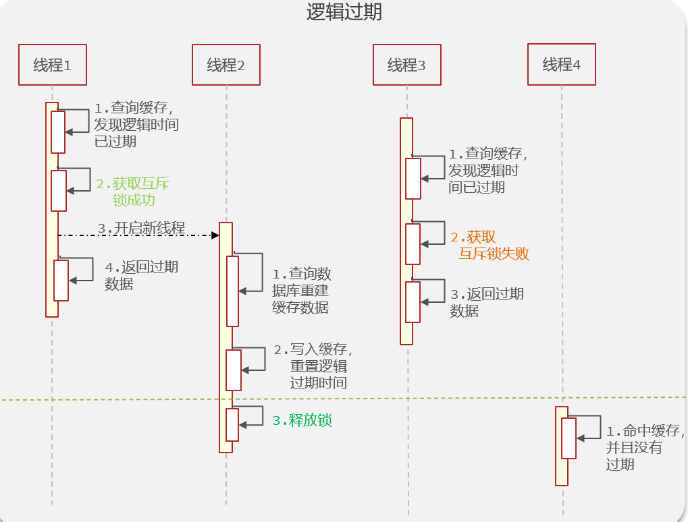
     
