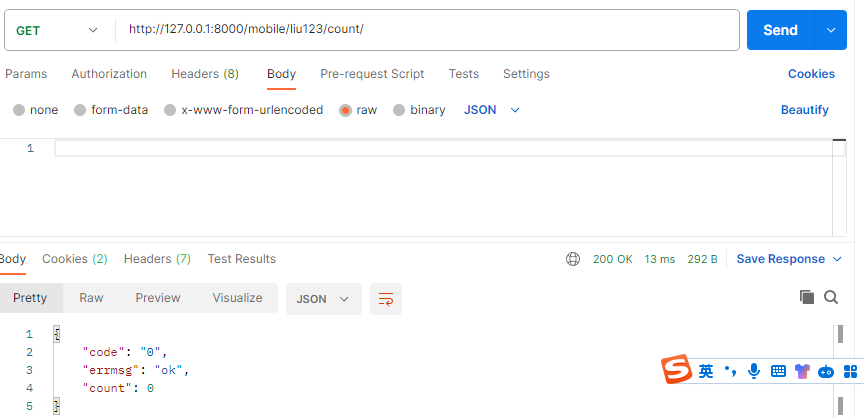
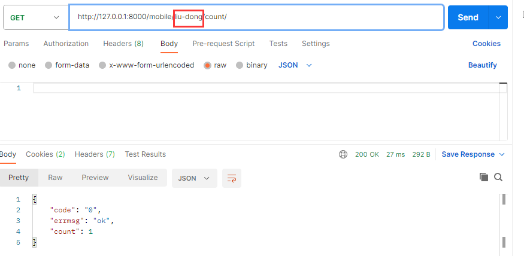

## 项目的准备

### 1. 配置开发环境

- 开发环境：代码开发和调试的环境
- 生产环境：线上部署的环境


manage.py 


```python
import os
import sys

def main():
    """Run administrative tasks."""
    os.environ.setdefault('DJANGO_SETTINGS_MODULE', 'meiduo_mall.settings.dev') #指定配置文件
    try:
        from django.core.management import execute_from_command_line
    except ImportError as exc:
        raise ImportError(
            "Couldn't import Django. Are you sure it's installed and "
            "available on your PYTHONPATH environment variable? Did you "
            "forget to activate a virtual environment?"
        ) from exc
    execute_from_command_line(sys.argv)


if __name__ == '__main__':
    main()
```

**项目启动成功！**


### 2. 配置Jinja2模板引擎

- 安装Jinja2扩展包

```bash
$ pip install Jinja2
```

- 配置Jinja2模板引擎

```python
TEMPLATES = [
    {
        'BACKEND': 'django.template.backends.django.DjangoTemplates',
        'DIRS': [],
        'APP_DIRS': True,
        'OPTIONS': {
            'context_processors': [
                'django.template.context_processors.debug',
                'django.template.context_processors.request',
                'django.contrib.auth.context_processors.auth',
                'django.contrib.messages.context_processors.messages',
            ],
        },
    },
    {
        'BACKEND': 'django.template.backends.jinja2.Jinja2',  # jinja2模板引擎
        'DIRS': [os.path.join(BASE_DIR, '../templates')],  # os.path.dirname(BASE_DIR) 上级目录
        'APP_DIRS': True,
        'OPTIONS': {
        },
    },
]
```

- 补充Jinja2模板引擎环境

> **1.Jinja2创建模板引擎环境配置文件**


> **2.编写Jinja2创建模板引擎环境配置代码**

```python
from django.contrib.staticfiles.storage import staticfiles_storage
from django.urls import reverse
from jinja2 import Environment


def jinja2_environment(**options):
    '''jinja2 环境'''
    # 创建环境对象
    env = Environment(**options)
    # 自定义语法
    env.globals.update({  # 映射关系
        'static': staticfiles_storage.url,  # 静态文件的前缀
        'url': reverse,  # 反向解析
    })
    # 返回环境对象
    return env

"""
确保可以使用Django模板引擎中的 这类的语句 
"""
```

> **3.补充Jinja2模板引擎环境**

```python
TEMPLATES = [
    {
        'BACKEND': 'django.template.backends.django.DjangoTemplates',
        'DIRS': [],
        'APP_DIRS': True,
        'OPTIONS': {
            'context_processors': [
                'django.template.context_processors.debug',
                'django.template.context_processors.request',
                'django.contrib.auth.context_processors.auth',
                'django.contrib.messages.context_processors.messages',
            ],
        },
    },
    {
        'BACKEND': 'django.template.backends.jinja2.Jinja2',  # jinja2模板引擎
        'DIRS': [os.path.join(BASE_DIR, '../templates')],  # os.path.dirname(BASE_DIR) 上级目录
        'APP_DIRS': True,
        'OPTIONS': {
            # 补充Jinja2模板引擎环境
            'environment': 'meiduo_mall.utils.jinja2_env.jinja2_environment',
        },
    },
]
```

> 配置完成后：运行程序，测试结果。


### 3. 配置Mysql数据库

settings.py
```python
DATABASES = {
    'default': {
        'ENGINE': 'django.db.backends.mysql',  # 数据库引擎
        'HOST': '127.0.0.1',  # 数据库主机
        'PORT': 3306,  # 数据库端口
        'USER': 'root',  # 数据库用户名
        'PASSWORD': '678846',  # 数据库用户密码
        'NAME': 'meiduo_shop'  # 数据库名字
    },
}
```

meiduo_mall/ init .py
```python
from pymysql import install_as_MySQLdb

install_as_MySQLdb()
```


### 4. 配置Redis数据库

```python
# Redis 配置
CACHES = {
    "default": {  # 默认
        "BACKEND": "django_redis.cache.RedisCache",
        "LOCATION": "redis://127.0.0.1:6379/0",
        "OPTIONS": {
            "CLIENT_CLASS": "django_redis.client.DefaultClient",
        }
    },
    "session": {  # session
        "BACKEND": "django_redis.cache.RedisCache",
        "LOCATION": "redis://127.0.0.1:6379/1",
        "OPTIONS": {
            "CLIENT_CLASS": "django_redis.client.DefaultClient",
        }
    },
}
# 使用redis存储session
SESSION_ENGINE = "django.contrib.sessions.backends.cache"
# 使用名为"session"的Redis配置项存储session数据
SESSION_CACHE_ALIAS = "session"
```


### 5. 配置工程日志

settings.py

```python
LOGGING = {
    'version': 1,
    'disable_existing_loggers': False,  # 是否禁用已经存在的日志器
    'formatters': {  # 日志信息显示的格式
        'verbose': {
            'format': '%(levelname)s %(asctime)s %(module)s %(lineno)d %(message)s'
        },
        'simple': {
            'format': '%(levelname)s %(module)s %(lineno)d %(message)s'
        },
    },
    'filters': {  # 对日志进行过滤
        'require_debug_true': {  # django在debug模式下才输出日志
            '()': 'django.utils.log.RequireDebugTrue',
        },
    },
    'handlers': {  # 日志处理方法
        'console': {  # 向终端中输出日志
            'level': 'INFO',
            'filters': ['require_debug_true'],
            'class': 'logging.StreamHandler',
            'formatter': 'simple'
        },
        'file': {  # 向文件中输出日志
            'level': 'INFO',
            'class': 'logging.handlers.RotatingFileHandler',
            'filename': os.path.join(os.path.dirname(BASE_DIR), 'logs/meiduo.log'),  # 日志文件的位置
            'maxBytes': 300 * 1024 * 1024,
            'backupCount': 10,
            'formatter': 'verbose'
        },
    },
    'loggers': {  # 日志器
        'django': {  # 定义了一个名为django的日志器
            'handlers': ['console', 'file'],  # 可以同时向终端与文件中输出日志
            'propagate': True,  # 是否继续传递日志信息
            'level': 'INFO',  # 日志器接收的最低日志级别
        },
    }
}
```

- 日志文件目录
  
  
  

### 6. 配置前端静态资源

- settings.py

```python
# 指定静态资源的访问路由
STATIC_URL = 'static/'
# 指定静态文件的加载路径
STATICFILES_DIRS = [os.path.join(os.path.dirname(BASE_DIR), 'static')]
```

- 访问静态资源


## 1. 用户模块

### 1.1 创建应用

- 将创建应用都放在apps目录下方便管理  python manage.py startapp user apps/users


- 追加导包路径

```python
print(sys.path)
sys.path.insert(0, os.path.join(os.path.dirname(BASE_DIR), 'apps'))
print(sys.path)

['...\\meiduo_shop\\apps',...]
```

- settings.py

```python
INSTALLED_APPS = [
    # 用户模块
    'user',
]
```

### 1.2 展示用户注册页面

```python
urls.py
    from django.urls import path
    from . import views

    app_name = 'user'
    urlpatterns = [

        # 注册
        path('register/', views.RegisterView.as_view(), name='register'),
    ]

views.py
	from django.shortcuts import render
    from django.views import View


    # Create your views here.
    class RegisterView(View):
        '''用户注册'''

        def get(self, request):
            return render(request, 'register.html')
```


### 1.3 自定义用户模型类

**使用django自带的用户类 ：认证和授权**

user/modelspy
```python
from django.contrib.auth.models import AbstractUser
from django.db import models


# Create your models here.

class User(AbstractUser):
    '''自定义用户模型类'''

    # 添加格外字段
    mobile = models.CharField(max_length=11, unique=True, verbose_name='手机号')

    class Meta:
        db_table = 'tb_user'
        verbose_name = '用户'
        verbose_name_plural = verbose_name

    def __str__(self):
        return self.username
```

settings.py
```python
# 指定自定义用户模型类 语法：子应用.模型类
AUTH_USER_MODEL = 'user.User'
```


### 1.4 用户注册

**业务逻辑分析---接口设计和定义---后端逻辑实现---前端逻辑实现**

#### 1.4.1 用户注册接口设计

> **1.请求方式**

| 选项         | 方案       |
| ------------ | ---------- |
| **请求方法** | POST       |
| **请求地址** | /register/ |

> **2.请求参数：表单参数**

| 参数名        | 类型   | 是否必传 | 说明             |
| ------------- | ------ | -------- | ---------------- |
| **username**  | string | 是       | 用户名           |
| **password**  | string | 是       | 密码             |
| **password2** | string | 是       | 确认密码         |
| **mobile**    | string | 是       | 手机号           |
| **sms_code**  | string | 是       | 短信验证码       |
| **allow**     | string | 是       | 是否同意用户协议 |

> **3.响应结果：HTML**

| 响应结果     | 响应内容     |
| ------------ | ------------ |
| **注册失败** | 响应错误提示 |
| **注册成功** | 重定向到首页 |


#### 1.4.2 用户注册后端逻辑

views.py

```python
import re
from django.contrib.auth import login
from django.db import DataError
from django.http import HttpResponseForbidden, JsonResponse
from django.shortcuts import render, redirect
from django.urls import reverse
from django.views import View
from .models import User


# Create your views here.

class RegisterView(View):
    '''用户注册'''

    def get(self, request):
        '''提供用户注册页面'''
        return render(request, 'register.html')

    def post(self, request):
        '''实现用户注册业务逻辑'''
        # 1 接受参数
        username = request.POST.get('username')
        password = request.POST.get('password')
        password2 = request.POST.get('password2')
        mobile = request.POST.get('mobile')
        allow = request.POST.get('allow')

        # 2 校验参数 前后段校验分开，避免恶意用户绕过前端逻辑发起请求，要保证后端安全，前后端校验逻辑相同
        # 判断参数是否齐全
        if not all([username, password2, password, mobile, allow]):  # all([]) 检验列表中的元素是否为空，只有有一个为空返回False
            return HttpResponseForbidden('缺少必要参数！')
        # 判断用户名是否符合5-20个字符
        if not re.match('^[a-zA-Z0-9-_]{5,20}$', username):
            return HttpResponseForbidden('请输入5-20位用户名，支持数字、字母、下划线、连字符！')
        # 判断密码是否是8-20个数字
        if not re.match(r'^[0-9A-Za-z]{8,20}$', password):
            return HttpResponseForbidden('请输入8-20位的密码！')
        # 判断两次密码是否一致
        if password != password2:
            return HttpResponseForbidden('两次输入的密码不一致！')
        # 判断手机号是否合法
        if not re.match(r'^1[3-9]\d{9}$', mobile):
            return HttpResponseForbidden('请输入正确的手机号码！')
        # 判断是否勾选用户协议
        if allow != 'on':
            return HttpResponseForbidden('请勾选用户协议！')

        # 3 保存数据
        try:
            user = User.objects.create_user(username=username, password=password, mobile=mobile)  # 密码加密
        except DataError:
            return render(request, 'register.html', {'register_error': '注册失败'})

        # 状态保持
        login(user)  # 将用户添加到会话中

        # 4 响应数据 重定向到首页
        return redirect(reverse('contents:index'))

```


#### 1.4.3 用户名重复

**鼠标失去焦点---前端提取username参数，向后端发起Ajax请求---后端接受请求，查询数据库，判断并响应结果**

**接口设计和定义****1.请求方式**

| 选项         | 方案                                                |
| ------------ | --------------------------------------------------- |
| **请求方法** | GET                                                 |
| **请求地址** | /usernames/(?P<username>[a-zA-Z0-9_-]{5,20})/count/ |

> **2.请求参数：路径参数**

| 参数名       | 类型   | 是否必传 | 说明   |
| ------------ | ------ | -------- | ------ |
| **username** | string | 是       | 用户名 |

> **3.响应结果：JSON**

| 响应结果   | 响应内容           |
| ---------- | ------------------ |
| **code**   | 状态码             |
| **errmsg** | 错误信息           |
| **count**  | 记录该用户名的个数 |

```PYTHON
urls.py
    from django.urls import path,re_path
    from . import views

    app_name = 'users'
    urlpatterns = [
        # 注册
        path('register/', views.RegisterView.as_view(), name='register'),
        #手机号是否注册
        re_path(r'mobile/(?P<username>[a-zA-Z0-9-_]{5,20})/count/',views.MobileView.as_view())
    ]
    
views.py
	from meiduo_mall.utils.response_code import RETCODE
    from django.views import View
    
    
	class MobileView(View):
    '''用户名是否重复登录'''

    def get(self, request, username):
        # 1 接受参数
        username = request.GET.get('username')
        # 2 查询数据库
        count = User.objects.filter(username=username).first().count()  # User.objects.get(username=username).count()
        # 3 响应数据
        return JsonResponse({'code': RETCODE.OK, 'errmsg': 'ok', 'count': count})
```




### 1.5 图形验证码


#### 1.5.1 接口设计

> 知识点1. 请求方式

| 选项         | 方案                          |
| ------------ | ----------------------------- |
| **请求方法** | GET                           |
| **请求地址** | image_codes/(?P<uuid>[\w-]+)/ |

> 知识点2.请求参数：路径参数

| 参数名   | 类型   | 是否必传 | 说明     |
| -------- | ------ | -------- | -------- |
| **uuid** | string | 是       | 唯一编号 |

> 知识点3.响应结果：`image/jpg`


#### 1.5.2 后端逻辑

captcha.py
```python
import os
import random
from io import BytesIO

from PIL import Image, ImageDraw, ImageFont


class Captcha:

    def __get_random_color(self):
        return (
            random.randint(0, 255), random.randint(0, 255), random.randint(0, 255))

    # 动态生成字体文件路径
    def __get_font(self):
        file_path = os.getcwd()
        font_list = ['actionj.ttf', 'Georgia.ttf', 'Arial.ttf']
        font_path = random.choice(font_list)
        file_path += rf'\apps\verifications\libs\fonts\{font_path}'
        return file_path

    def get_valid_code_img(self):
        img = Image.new('RGB', (260, 34), color=self.__get_random_color())
        draw = ImageDraw.Draw(img)
        kumo_font = ImageFont.truetype(
            rf'{self.__get_font()}', size=28) # 相对路径总是报错，动态生成绝对路径

        valid_code_str = ''
        for i in range(5):
            random_num = str(random.randint(0, 9))
            random_low_alpha = chr(random.randint(97, 122))
            random_high_alpha = chr(random.randint(65, 90))
            random_char = random.choice([random_num, random_low_alpha, random_high_alpha])
            draw.text((i * 50 + 20, 5), random_char, self.__get_random_color(), font=kumo_font)

            # 保存验证码字符串
            valid_code_str += random_char

        # 噪点噪线
        width = 260
        height = 34
        for i in range(3):
            x1 = random.randint(0, width)
            x2 = random.randint(0, width)
            y1 = random.randint(0, height)
            y2 = random.randint(0, height)
            draw.line((x1, y1, x2, y2), fill=self.__get_random_color())

        for i in range(3):
            draw.point([random.randint(0, width), random.randint(0, height)], fill=self.__get_random_color())
            x = random.randint(0, width)
            y = random.randint(0, height)
            draw.arc((x, y, x + 4, y + 4), 0, 90, fill=self.__get_random_color())

        file = BytesIO()  # 用完之后，BytesIO会自动清掉
        img.save(file, 'png')
        image = file.getvalue()

        return valid_code_str, image


captcha = Captcha()
```

views.py

```python
from django.http import HttpResponse
from django.views import View
from django_redis import get_redis_connection

from apps.verifications.libs.captcha import captcha


# Create your views here.
class ImageView(View):
    '''图形验证码'''

    def get(self, request, uuid):
        '''
        :param uuid: 通用唯一识别码，标识图形验证码属于的用户
        :return: image/jpg

        1. 接受和校验参数
        2. 主体业务逻辑的实现 ：生成、保存、响应图形验证码
        3. 响应数据
        '''
        # 生成图形验证码

        text, image = captcha.get_valid_code_img()
        # 保存图形验证码
        redis_conn = get_redis_connection('verify_code')
        # redis.setex('key', 'expires','value')
        redis_conn.setex(f'img_{uuid}', 300, text)
        # 响应图形验证码
        return HttpResponse(image, content_type='image/jpg')
```


